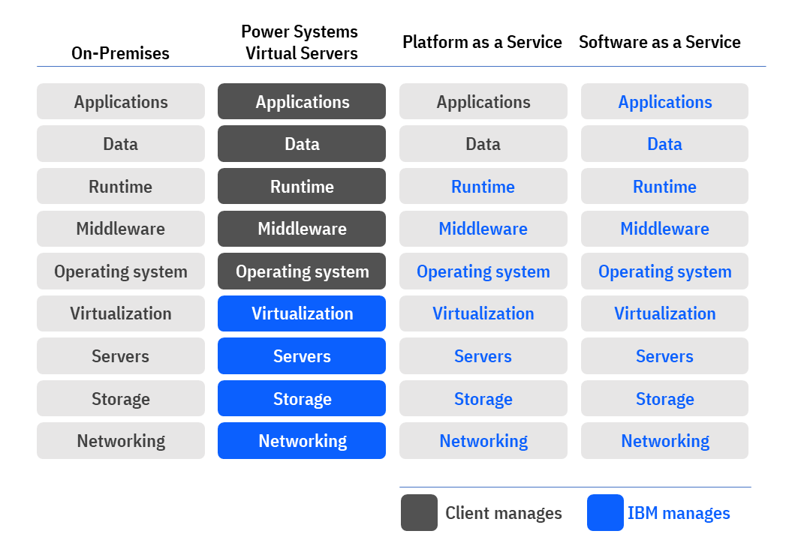

---

copyright:
  years: 2019, 2023

lastupdated: "2023-11-29"

keywords: power systems, infrastructure as a service, multiple virtual servers, hybrid cloud environment, linux, aix, ibm i, what is power VS

subcollection: power-iaas

---

{:external: target="_blank" .external}
{:shortdesc: .shortdesc}
{:codeblock: .codeblock}
{:pre: .pre}
{:screen: .screen}
{:tip: .tip}
{:important: .important}
{:note: .note}
{:term: .term}

# What is a Power Systems Virtual Server?
{: #about-virtual-server}

{{site.data.keyword.powerSysFull}} is a Power Systems offering. The {{site.data.keyword.powerSys_notm}} are located in the IBM data centers, distinct from the IBM Cloud servers with separate networks and direct-attached storage. The environment is in its own pod and the internal networks are fenced but offer connectivity options to meet customer requirements. This infrastructure design enables {{site.data.keyword.powerSys_notm}} to maintain key enterprise software certification and support as the {{site.data.keyword.powerSys_notm}} architecture is identical to certified on-premises infrastructure. The virtual servers, also known as logical partitions (LPAR), run on IBM Power Systems hardware with the PowerVM hypervisor.
{: shortdesc}

With the {{site.data.keyword.powerSys_notm}}, you can quickly create and deploy one or more virtual servers (that are running either the AIX, IBM i, or Linux operating systems). After you provision the {{site.data.keyword.powerSys_notm}}, you get access to infrastructure and physical computing resources without the need to manage or operate them. However, you must manage the operating system and the software applications and data. The following graphic represents a responsibility assignment (RACI) matrix for Power Systems Virtual Servers:

{: caption="Figure 1. Power Systems Virtual Server responsibility assignment matrix" caption-side="bottom"}

## Key features
{: #key-features}

The following are some of the key features for the {{site.data.keyword.powerSys_notm}}.

### Straightforward billing
{: #straightforward-billing}

{{site.data.keyword.powerSys_notm}} uses a monthly billing rate that includes the licenses for the AIX and IBM i operating systems. The monthly billing rate is pro-rated by the hour based on the resources that are deployed to the {{site.data.keyword.powerSys_notm}} instance for the month. When you create the {{site.data.keyword.powerSys_notm}} instance, you can see the total cost for your configuration based on the options that you specify. You can quickly identify what configuration options provide you with the best value for your business needs. For more information, see [Pricing](/docs/power-iaas?topic=power-iaas-pricing-virtual-server#pricing-virtual-server).

{{site.data.keyword.powerSys_notm}} does not provide Linux stock images. You must bring your own Linux image (OVA format) and subscription. SLES and RHEL OVA images are supported. [Learn more](/docs/power-iaas?topic=power-iaas-using-linux)
{: note}

### Infrastructure customization
{: #infra-customization}

You can configure and customize the following options when you create a {{site.data.keyword.powerSys_notm}}:

* Number of virtual server instances
* Number of cores
* Amount of memory
* Data volume size and type
* Network interfaces

### Bring your own image
{: #bring-own-image}

IBM provides you with stock AIX and IBM i images when you create a {{site.data.keyword.powerSys_notm}}. However, you can always [bring your own](/docs/power-iaas?topic=power-iaas-deploy-custom-image) custom AIX, IBM i, or Linux image that you have tested and deployed.

### Support for SAP NetWeaver or SAP HANA applications
{: #support-SAPNetWeaver-or-SAPHANA}

When you provision a {{site.data.keyword.powerSys_notm}} instance to support SAP NetWeaver applications, select a version of the IBM-provided AIX or Linux stock operating system image. When you provision a {{site.data.keyword.powerSys_notm}} instance to support the SAP HANA applications, select a version of the IBM provided Linux&reg; stock image. IBM i operating system and custom AIX and Linux images are not supported for SAP workloads. For information about the supported operating system versions, see [FAQ](/docs/power-iaas?topic=power-iaas-power-iaas-faqs). For more information, see [Deploying your infrastructure](/docs/sap?topic=sap-power-vs-planning-items).

When provisioning a {{site.data.keyword.powerSys_notm}} to support SAP NetWeaver applications, select a version of the IBM-provided AIX operating system stock image. IBM i and operating system custom images are not supported for SAP workloads currently.
{: note}

### Support for deploying a Red Hat OpenShift Cluster
{: #support-redhat-openshift}

When you provision a Red Hat OpenShift Cluster on {{site.data.keyword.powerSys_notm}}, it is easier to use the IBM&trade; provided automation to create the entire cluster of servers and install Red Hat OpenShift rather than individually provisioning {{site.data.keyword.powerSys_notm}} instances. For instructions to deploy a Red Hat OpenShift Cluster on {{site.data.keyword.powerSys_notm}}, including preparation of the required Operation System images for the cluster, see [Deploying Red Hat OpenShift Container Platform 4.x on IBM Power Systems Virtual Servers](https://developer.ibm.com/series/deploy-ocp-cloud-paks-power-virtual-server/){: external}.

## Hardware specifications
{: #hardware-specifications}

The following IBM Power Systems can host a {{site.data.keyword.powerSys_notm}}: 
- IBM Power System S922 (9009-22A)
- IBM Power System S922 (9009-22G)
- IBM Power System E980 (9080-M9S)
- IBM Power System S1022 (9105-22A) For more information about these systems and how they're used inside the {{site.data.keyword.powerSys_notm}}, see their [data sheets](/docs/power-iaas?topic=power-iaas-about-virtual-server#data-sheets) and the hardware overview table.

If you'd like to compare your current environment's performance to what's available through the {{site.data.keyword.powerSys_notm}}, see the [IBM Power Systems performance report](https://www.ibm.com/downloads/cas/K90RQOW8){: external}.
{: tip}

### Data sheets
{: #data-sheets}

<!-- * [IBM Power System E880 (9119-MHE) - Dallas only](https://www.ibm.com/downloads/cas/EE476WAP){: external} -->
* [IBM Power System S922 (9009-22A)](https://www.ibm.com/downloads/cas/KQ4BOJ3N){: external}
* [IBM Power System E980 (9080-M9S)](https://www.ibm.com/downloads/cas/VX0AM0EP){: external}
* [IBM Power System S1022 (9105-22A) (Power10 system)](https://www.ibm.com/downloads/cas/MQR4B1RP){: external}
<!-- * [IBM Power System E1080 (9080-HEX)](https://www.ibm.com/downloads/cas/MMOYB4YL){: external}  -->

| Compute     | Storage      | Network      |
|------------ | ------------ | ------------ |
| * Power S922 (9009-22A) \n * Power S922 (9009-22G) \n * Power E980 (9080-MHE) \n * Power S1022 (9105-22A) (WDC07 only) [^1]| * Flash Storage from IBM FS9000 series devices \n * V7000 SSD (no new VMs) (WDC04 only) \n * 32 GB SAN infrastructure | * Cisco Nexus 9000 93180YC-EX (10G) \n * Cisco Nexus 9000 C9348GC-FXP (1G) \n * Avocent ACS8048 |
{: class="simple-tab-table"}
{: tab-group="hardware"}
{: caption="Table 1. Hardware overview (Washington, D.C.)" caption-side="top"}
{: #hw-spec-1}
{: tab-title="Washington, D.C. (WDC04, WDC06, and WDC07)"}

[^1]: SAP Netweaver is not certified for S1022 systems and hence is limited to non-production workloads.

| Compute  | Storage   | Network   |
|--------- | --------- | --------- |
| * Power S922 (9009-22A) | * Flash Storage from IBM FS9000 series devices \n * V7000 SSD (no new VMs) \n * 32 GB SAN | * Cisco Nexus 9000 C9336PQ  (Spine 10G) \n * Cisco Nexus 9000 C93180YC (10G) \n * Cisco Nexus 9000 C93108TC-EX (1G) \n * Cisco UCS - APIC controller \n * Cisco ASR1001-HX Router \n * Avocent ACS8016 |
{: class="simple-tab-table"}
{: tab-group="hardware"}
{: caption="Table 2. Hardware overview (Dallas, TX)" caption-side="top"}
{: #hw-spec-2}
{: tab-title="Dallas (DAL12, DAL13)"}

| Compute  | Storage   | Network   |
|--------- | --------- | --------- |
| * Power E980 (9080-M9S) \n * Power S922 (9009-22A) | * Flash Storage from IBM FS9000 series devices \n * 32 Gb SAN infrastructure | * Cisco Nexus 9000 N9K-C9364C (Spine 10G) \n * Cisco Nexus 9000 9348GC-FXP (Leaf 1G) \n * Cisco Nexus 9000 93180YC-FX (Leaf 25G) \n * Cisco UCS - APIC controller \n * Cisco ASR1001-HX Router \n * Avocent ACS8032DAC-400 |
{: class="simple-tab-table"}
{: tab-group="hardware"}
{: caption="Table 3. Hardware overview (Non-US)" caption-side="top"}
{: #hw-spec-3}
{: tab-title="Non-US"}

For a complete list of supported data centers, see [Creating a Power Systems Virtual Server workspace](/docs/power-iaas?topic=power-iaas-creating-power-virtual-server#creating-service).
{: note}

## Storage tiers
{: #storage-tiers}

<!-- For each {{site.data.keyword.powerSys_notm}} instance, you must select a storage tier - **Tier 1** or **Tier 3**. The storage tiers in {{site.data.keyword.powerSys_notm}} are based on I/O operations per second (IOPs). It means that the performance of your storage volumes is limited to the maximum number of IOPs based on volume size and storage tier. Although, the exact numbers might change over time, the **Tier 3** storage is currently set to 3 IOPs/GB, and the **Tier 1** storage is currently set to 10 IOPs/GB. For example, a 100 GB Tier 3 storage volume can receive up to 300 IOPs, and a 100 GB Tier 1 storage volume can receive up to 1000 IOPs. After the IOPs limit is reached for the storage volume, the I/O latency increases.

**Tier 3** storage tier is not suitable for production workloads. When you are choosing a storage tier, ensure that you consider not just the average I/O load, but more importantly the peak IOPs of your storage workload.
{: note} -->

{{site.data.keyword.powerSys_notm}} offers you to select a I/O operation per second (IOPs) based storage that suits your needs. Flexible IOPs are a tier-less storage offering that removes the notion of disk type and replace it with storage pool. Each of the storage pools supports multiple storage tiers. 

{{site.data.keyword.powerSys_notm}} offers a flexible tiered storage model. All storage pools will support a set of tiers. Tiers are based on different levels of iops (input/output operations per second).

Following is the set of supported tiers and their iops mapping:
| Tier | IOPs 	| Performance example |
|---------------|---------------|---------------------|
| Tier 0	| 25 IOPs/GB	| A 100-GB volume receives 2,500 IOPs. \n This is 2.5x faster than tier 1 and 8.3x faster than tier 3. |
| Tier 1	| 10 IOPs/GB	| A 100-GB volume receives 1,000 IOPs. \n This is 3.3x faster than tier 3. |
| Tier 3	| 3 IOPs/GB	| A 100-GB volume receives 300 IOPs. |
| Fixed IOPs	| 5,000 regardless of size |	A 100-GB volume receives 5,000 IOPs. |
{: caption="Table 4. tier and IOPs mapping" caption-side="bottom"}

The use of fixed IOPs is limited to volumes with a size of 200 GB or less, which is the break even size with Tier 0 (200 GB @ 25 IOPs/GB = 5000 IOPs).
{: important}

### Working with the APIs
{: iops-api}

Use the [List of all supported storage tiers for this cloud instance](/apidocs/power-cloud#pcloud-cloudinstances-storagetiers-getall) API to see the supported IOPs levels available for your workspace.

The storage tier that you choose is considered along with `volumePool` or `StorageAffinity` parameters that determine the storage pool. For flexible IOPs all storage pools, support any tier level. Additionally, the storage tier is not tied to the storage pool.

The storage tier that you choose does not influence the determination of the storage pool where a volume gets created in. If the storage tier is not specified then the storage tier is set to Tier 3 by default. 

The storage pool selection is based on the use of storage pool or storage affinity. Specifying a storage pool identifies the storage pool directly while storage affinity uses a policy (affinity or anti-affinity) along with an existing volume or virtual server. For flexible IOPs all storage pools, support any tier level. Additionally, the storage tier is not tied to the storage pool.

### Benefits of flexible IOPs 
{: iops-benefits}

Flexible IOPs offers multiple IOPs levels (tiers) of storage to choose from. Each IOPs level has its own pricing, performance, and capability. 

With flexible IOPs you can:
* Create a volume (or multiple volumes) and specify the IOPs level you want.
* Change a volume’s IOPs level for your existing volumes while staying within the same storage pool.
* Clone one or more volumes to your choice of IOPs level. 
* Deploy a virtual server instance’s boot volume in any of the supported IOPs levels. Additional data volumes that will be attached to the new virtual server instance can have different IOPs levels from that of the instance’s boot volume.
* Import an image from IBM Cloud Object Storage to any of the supported IOPs levels.

Best practice for an image import is to use the default IOPs level - Tier 3. While deploying the image (creating a new virtual server instance) the image backing volume(s) get cloned to a new set of volumes that get attached to the new virtual server instance. When you choose the IOPs level for your boot volume during virtual server instance deployment, the boot volume's IOPs level does not need to match the IOPs level of the image.
{: note}

### Selecting a storage tier
{: iops-tier-select}

Flexible IOPs allows you to select your desired tier for:
  - Boot volume
  - Virtual server instance volume

**Boot volume** \n
When you are creating virtual server instance, define the boot volume by:
- Selecting your desired **Operating system**.
- Select or clear the **Configure for Epic workloads** indicator.
- Select your desired **Image**.
- Select from Tier 0, Tier 1, Tier 2, Tier 3, or Fixed IOPs.
- For **Storage pool**, select from **Auto-select pool**, **Affinity**, **Anti-affinity**.

| VM storage pool affinity setting |	Action |
|----------------------------------|---------|
| Auto-select pool |	{{site.data.keyword.powerSys_notm}} determines the best pool available for you. |
| Affinity |	The storage pool is decided to be the same as the storage pool of affinity object that you choose. |
| Anti-affinity|  Storage pool is decided making the storage pool of affinity object that you choose as an exception.|
{: caption="Table 5. Storage pool affinity setting" caption-side="bottom"}

All volumes that are created during VM provisioning are created on the same storage pool as the boot volume irrespective of their tier selection.
{: note}

**Virtual server instance volume** \n
When you are creating virtual server instance, define the following:
- Enter a unique name.
- Enter the desired size of the volume.
- Enter the quantity of volumes that you need.
- Select from Tier 0, Tier 1, Tier 2, Tier 3, or Fixed IOPs.

During VM provisioning, if you create additional data volumes to attach to the new the new virtual server instances then these data volumes can be created on any of the supported storage tiers. All these additional data volumes will reside in the same storage pool where the virtual server instance's boot volume resides.
  
<!-- You can enable or disable the virtual server instance (VM) storage pool affinity. Refer to the following table to learn how storage pool affinity setting behaves:

| VM storage pool affinity setting |	Action |
|----------------------------------|---------|
| Enabled |	Volumes attached to a VM can have a mix of volumes with different storage tiers but still required to be in the same storage pool. |
| Disabled |	VM can have volumes attached from different storage pools. |
{: caption="Table 4. storage pool affinity setting" caption-side="bottom"} -->
### Limitations of flexible IOPs
{: iops-limit}

Some of the limitations of flexible IOPs are as follows:
- Volumes that are enabled for replication cannot be changed to a different IOPs level. If you still want to change the IOPs level for a replicated volume, you should change the replication-enabled property to false, change the IOPs level, and re-enable the replication property.
- Snapshot data cannot be changed from one tier to another. All volumes of a snapshot must reside in the same storage tier and pool.
- Any volume that has a storage type of tier 0, tier 1, or tier 3 and the volume size is greater than 200 GB then the option to change to tier 5k is not allowed.
<!-- - - You cannot change the IOPs level when:
  - A volume is marked 'shareable'
  - A volume is in a state of 'in-use'
  - A volume is part of any snapshot. -->

## Public and private networks
{: #public-private-networks}

When you create a {{site.data.keyword.powerSys_notm}}, you can select a private or public network interface.

### Public network
{: #public-network}

* Easy and quick method to connect to a {{site.data.keyword.powerSys_notm}} instance.
* IBM configures the network environment to enable a secure public network connection from the internet to the {{site.data.keyword.powerSys_notm}} instance.
* Connectivity is implemented by using an IBM Cloud Virtual Router Appliance (VRA) and a Direct Link Connect connection.
* Protected by a firewall and supports the following secure network protocols:
    * SSH
    * HTTPS
    * Ping
    * IBM i 5250 terminal emulation with SSL (port 992)

### Private network
{: #private-network}

* Allows your {{site.data.keyword.powerSys_notm}} instance to access existing {{site.data.keyword.cloud_notm}} resources, such as IBM Cloud Bare Metal Servers, Kubernetes containers, and Cloud Object Storage.
* Uses a Direct Link Connect connection to connect to your IBM Cloud account network and resources.
* Required for communication between different {{site.data.keyword.powerSys_notm}} instances.

For more information about the different options for configuring a private network, see [Configure a private network](/docs/power-iaas?topic=power-iaas-configuring-subnet).
{: note}