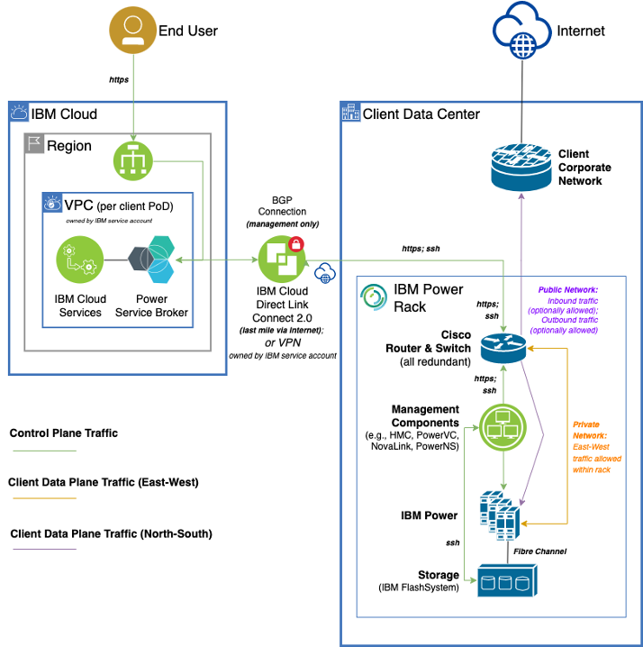

---

copyright:
  years: 2023, 2026 

lastupdated: "2026-07-21"

keywords: power systems, infrastructure as a service, multiple virtual servers, hybrid environment, hybrid platform environment, linux, aix, ibm i,

subcollection: power-iaas

---

{{site.data.keyword.attribute-definition-list}}

# Architecture for {{site.data.keyword.on-prem-fname}} in {{site.data.keyword.on-prem}}
{: #private-cloud-architecture}

---

{{site.data.keyword.on-prem-fname}} in [{{site.data.keyword.on-prem}}]{: tag-red}

---

{{site.data.keyword.powerSysFull}} is an as-a-service offering that includes a prescriptive set of physical infrastructure (compute, network, and storage). The physical infrastructure is deployed in your data center. The site reliability engineers (SREs) from IBM maintain and operates this infrastructure and manage it through the IBM Cloud platform.

To understand the {{site.data.keyword.on-prem}} architecture, key features, and hardware and software requirements, review the following topics:

- [High-level architecture](/docs/power-iaas?topic=power-iaas-private-cloud-architecture#high-level-architecture-private-cloud)
- [Key features](/docs/power-iaas?topic=power-iaas-private-cloud-architecture#key-features)
- [Hardware and software specifications](/docs/power-iaas?topic=power-iaas-private-cloud-architecture#hardware-software-specs-private-cloud)
    - [Pods](#pods)
    - [Small pod configurations](#small-pod-configurations)
    - [Medium pod configurations](#medium-pod-configurations)
    - [Supported Power11 servers](#supported-power11-servers)
    - [Operating systems](#operating-systems)
    - [Storage](#storage)
    - [Storage tiers](#storage-tiers)
  - [Network](#network)
  - [Data center capabilities](#data-center-capabilities)

## High-level architecture
{: #high-level-architecture-private-cloud}

The following diagram provides a high-level architectural view of the {{site.data.keyword.on-prem-fname}}:

{: caption="High-Level {{site.data.keyword.on-prem-fname}} architecture" caption-side="bottom"}

## Key features
{: #key-features}

The key features for the {{site.data.keyword.on-prem}} version of IBM {{site.data.keyword.powerSys_notm}} are as follows:

* **Easy management and automation interfaces**: You can easily manage your {{site.data.keyword.powerSys_notm}} resources by using GUI, CLI, API, or Terraform interfaces.
* **Bring your own image**: You can bring your own custom IBM AIX, Linux&reg;, or IBM i image that is tested and deployed. Currently, the supported images include the following operating system images:
    * IBM AIX 7.2, or later
    * IBM i 7.4, or later and IBM i COR [^1] 
    * Red Hat Enterprise Linux (RHEL)
    * SUSE Linux Enterprise Server (SLES)
    * Red Hat Enterprise Linux CoreOS (RHCOS) for Red Hat OpenShift Container Platform

    [^1]: IBM i Cloud Optical Repository (COR) is a virtual image that can be deployed and used as a Network File Server (NFS) to perform various IBM i tasks that require media. For more information on COR images, see [Cloud Optical Repository](https://cloud.ibm.com/media/docs/downloads/power-iaas/Cloud_Optical_Repository.pdf){: external}.

* **Dynamic resource adjustment**: You can configure and customize the following resources on the virtual server when you work with IBM {{site.data.keyword.powerSys_notm}} in {{site.data.keyword.on-prem}}:
    - Number of cores
    - Amount of memory
    - Storage volume size
* **Shared (capped and uncapped) and dedicated virtual machine**: When you deploy a virtual machine, you can choose one of the following options for the type of core:
    - **Shared capped**: The processor is shared among other virtual machines but the partition cannot use higher number of cores than the assigned numbers unlike shared uncapped processor partitions. This option is used mostly for licensing purposes.
    - **Shared uncapped**: The processor is shared among other virtual machines.
    - **Dedicated**: The processor is allocated for the specific virtual machine.

* **Colocation policies for virtual machines and volumes**: You can apply an affinity or anti-affinity policy to each virtual machine instance to control the server on which a new virtual machine is placed. You can build high availability infrastructure within a data center by using this feature.
* **Volume snapshot and clone operations**: You can capture full, point-in-time copies of the virtual machines or datasets. You can create delta snapshots, volume clones, and restore your disks by using IBM FlashCopy feature on {{site.data.keyword.powerSys_notm}}.
* **Entitled processor-to-virtual-processor ratio**: The core-to-virtual core ratio can be in the range of 1:1 to 1:20. For shared processors, fractional cores are estimated up to the nearest whole number. For example, 1.25 cores is equal to 2 virtual cores.

The create or update operations of a VSI can fail even when the core-to-virtual core ratio of 1:20 is satisfied.
This issue occurs if the configured count of vCPU exceeds the maximum supported per-instance limit that is defined by the system policy.
{: note}

## Hardware and software specifications
{: #hardware-software-specs-private-cloud}

For more information about how IBM Cloud region hosts connections from the pods for IBM {{site.data.keyword.powerSys_notm}} in {{site.data.keyword.on-prem}}, see [IBM Satellite location](/docs/power-iaas?topic=power-iaas-satellite-location-spec-private-cloud).

### Pods
{: #pod-spec-private-cloud}

The following pod sizes are available:
* Small: 1 rack of IBM Power11 (S1122) processor.
* Medium: 2–4 racks of IBM Power11 (S1122, E1150, or E1180) processors.

You can expand the pod by adding more compute nodes up to a specific maximum number. This limit is related to the configuration size of the pod. For example, if you start the pod with 5 nodes, you can later add 3 more nodes. The pods are equipped with a spare compute node per compute type. For example, 1 compute node for each group of IBM Power E1180 processors. The spare nodes are used for maintenance or automatic high availability purposes.

You can use 100% of the core, memory, and storage of the nodes by excluding the spare nodes.

The spare node is used by the IBM site reliability engineering (SRE) team for maintenance and is not available for your use.
{: note}

### Small pod configurations
{: #pod-config-small}

A small pod has a 1x42U rack and S1122 system type is supported in the rack. You can expand the capacity of a small pod by adding servers of the same type that are already installed in the pod. You can add a minimum of one server, up to the maximum capacity of the rack.

[Table 1](#single-rack) illustrates the available configurations for server types and memory types on a small pod that has one rack. [Table 2](#single-rack-storage) illustrates the available configurations for storage types on small pods with flash system storage options.

| Server types               | Min (2 TB option) | Min (4 TB option) | Max |
| -------------------------- | ----------------- | ----------------- | --- |
| Server quantity in a pod   | 5                 | 5                 | 9   |
| Number of cores per server | 60                | 60                | 60  |
| Total number of cores      | 300               | 300               | 540 |
| Usable cores               | 255               | 255               | 459 |
{: class="simple-tab-table"}
{: tab-group="host_selection"}
{: caption="Small pod configuration." caption-side="top"}
{: #S1122}
{: tab-title="S1122"}
{: #single-rack}

For the S1122 server, the following memory configurations are available:

- **2 TB memory option per server**: A minimum 10 TB of memory and a maximum 18 TB of memory.
- **4 TB memory option per server**: A minimum 20 TB of memory and a maximum 36 TB of memory.

The small pod with one rack is available with FS 5300 TB flash system storage.

| Storage types                           | FS 5300 TB |      |
| --------------------------------------- | ---------- | ---- |
| Number of racks                         | 1          | 1    |
| Drives for each flash system            | 12         | 12   |
| Capacity for each drive in TB           | 19.2       | 19.2 |
| Number of flash systems in a pod        | 1          | 2    |
| Total drives in a pod                   | 12         | 24   |
| Total capacity in TB                    | 230        | 460  |
| Usable capacity in TB                   | 219        | 438  |
| Usable capacity in TB at 2x compression | 438        | 876  |
{: caption="Small pod with flash system storage configuration." caption-side="top"}
{: #single-rack-storage}

### Medium pod configurations
{: #pod-config-medium}

An expandable modular architecture is used to design a medium pod that supports the following pod configurations, based on the standard 42U rack specification:

* 1 management rack
* 1 storage rack
* 1 to 18 compute racks

A medium pod supports up to 6 compute racks for S1122 or E1150 system types and up to 18 compute racks for a E1180 (2CEC) system type.

You can expand the capacity of a medium pod by adding compute racks of the same type that are already installed in the pod.
{: note}

S1122 or E1150 pods are configured with a minimum of three base racks that include one compute rack, one storage rack, and one management rack. You can add up to five compute racks to make it a total of six compute racks.

An E1180 pod is configured with a minimum of four base racks that include two compute racks, one storage rack, and one management rack. You can add up to 16 compute racks to make it a total of 18 compute racks.

The following configurations and memory types are available for S1122, E1150, and E1180 (2CEC) pods:

| Compute racks                          | Base configuration | 1 additional rack                                                                            | 5 additional racks                                                                           | Maximum configuration (6 racks)                                                              |
| -------------------------------------- | ------------------ | -------------------------------------------------------------------------------------------- | -------------------------------------------------------------------------------------------- | -------------------------------------------------------------------------------------------- |
|                                        | Base rack          | Min&nbsp;&nbsp;&nbsp;&nbsp;&nbsp;&nbsp;&nbsp;&nbsp;&nbsp;&nbsp;Max                           | Min&nbsp;&nbsp;&nbsp;&nbsp;&nbsp;&nbsp;&nbsp;&nbsp;&nbsp;&nbsp;Max                           | Min&nbsp;&nbsp;&nbsp;&nbsp;&nbsp;&nbsp;&nbsp;&nbsp;&nbsp;&nbsp;Max                           |
| Servers in a pod, excluding LPM server | 11                 | 1&nbsp;&nbsp;&nbsp;&nbsp;&nbsp;&nbsp;&nbsp;&nbsp;&nbsp;&nbsp;&nbsp;&nbsp;&nbsp;&nbsp;12      | 1&nbsp;&nbsp;&nbsp;&nbsp;&nbsp;&nbsp;&nbsp;&nbsp;&nbsp;&nbsp;&nbsp;&nbsp;&nbsp;&nbsp;60      | 11&nbsp;&nbsp;&nbsp;&nbsp;&nbsp;&nbsp;&nbsp;&nbsp;&nbsp;&nbsp;&nbsp;&nbsp;71                 |
| Cores per server                       | 60                 | 60&nbsp;&nbsp;&nbsp;&nbsp;&nbsp;&nbsp;&nbsp;&nbsp;&nbsp;&nbsp;&nbsp;&nbsp;60                 | 60&nbsp;&nbsp;&nbsp;&nbsp;&nbsp;&nbsp;&nbsp;&nbsp;&nbsp;&nbsp;&nbsp;&nbsp;60                 | 60&nbsp;&nbsp;&nbsp;&nbsp;&nbsp;&nbsp;&nbsp;&nbsp;&nbsp;&nbsp;&nbsp;&nbsp;60                 |
| Usable cores per server                | 51                 | 51&nbsp;&nbsp;&nbsp;&nbsp;&nbsp;&nbsp;&nbsp;&nbsp;&nbsp;&nbsp;&nbsp;&nbsp;51                 | 51&nbsp;&nbsp;&nbsp;&nbsp;&nbsp;&nbsp;&nbsp;&nbsp;&nbsp;&nbsp;&nbsp;&nbsp;51                 | 51&nbsp;&nbsp;&nbsp;&nbsp;&nbsp;&nbsp;&nbsp;&nbsp;&nbsp;&nbsp;&nbsp;&nbsp;51                 |
| Total cores                            | 660                | 60&nbsp;&nbsp;&nbsp;&nbsp;&nbsp;&nbsp;&nbsp;&nbsp;&nbsp;&nbsp;&nbsp;&nbsp;720                | 60&nbsp;&nbsp;&nbsp;&nbsp;&nbsp;&nbsp;&nbsp;&nbsp;&nbsp;&nbsp;&nbsp;&nbsp;3600               | 660&nbsp;&nbsp;&nbsp;&nbsp;&nbsp;&nbsp;&nbsp;&nbsp;&nbsp;&nbsp;4260                          |
| Total Usable cores                     | 561                | 51&nbsp;&nbsp;&nbsp;&nbsp;&nbsp;&nbsp;&nbsp;&nbsp;&nbsp;&nbsp;&nbsp;&nbsp;612                | 51&nbsp;&nbsp;&nbsp;&nbsp;&nbsp;&nbsp;&nbsp;&nbsp;&nbsp;&nbsp;&nbsp;&nbsp;3060               | 561&nbsp;&nbsp;&nbsp;&nbsp;&nbsp;&nbsp;&nbsp;&nbsp;&nbsp;&nbsp;3621                          |
| **Memory capacities**                  |                    |                                                                                              |                                                                                              |                                                                                              |
| 2 TB                                   | 24                 | 2&nbsp;&nbsp;&nbsp;&nbsp;&nbsp;&nbsp;&nbsp;&nbsp;&nbsp;&nbsp;&nbsp;&nbsp;&nbsp;&nbsp;24      | 2&nbsp;&nbsp;&nbsp;&nbsp;&nbsp;&nbsp;&nbsp;&nbsp;&nbsp;&nbsp;&nbsp;&nbsp;&nbsp;&nbsp;120     | 22&nbsp;&nbsp;&nbsp;&nbsp;&nbsp;&nbsp;&nbsp;&nbsp;&nbsp;&nbsp;&nbsp;&nbsp;&nbsp;142          |
| 4 TB                                   | 44                 | 4&nbsp;&nbsp;&nbsp;&nbsp;&nbsp;&nbsp;&nbsp;&nbsp;&nbsp;&nbsp;&nbsp;&nbsp;&nbsp;&nbsp;48      | 4&nbsp;&nbsp;&nbsp;&nbsp;&nbsp;&nbsp;&nbsp;&nbsp;&nbsp;&nbsp;&nbsp;&nbsp;&nbsp;&nbsp;240     | 44&nbsp;&nbsp;&nbsp;&nbsp;&nbsp;&nbsp;&nbsp;&nbsp;&nbsp;&nbsp;&nbsp;&nbsp;&nbsp;284          |
| 8 TB                                   | –                  | –&nbsp;&nbsp;&nbsp;&nbsp;&nbsp;&nbsp;&nbsp;&nbsp;&nbsp;&nbsp;&nbsp;&nbsp;&nbsp;&nbsp;&nbsp;– | –&nbsp;&nbsp;&nbsp;&nbsp;&nbsp;&nbsp;&nbsp;&nbsp;&nbsp;&nbsp;&nbsp;&nbsp;&nbsp;&nbsp;&nbsp;– | –&nbsp;&nbsp;&nbsp;&nbsp;&nbsp;&nbsp;&nbsp;&nbsp;&nbsp;&nbsp;&nbsp;&nbsp;&nbsp;&nbsp;&nbsp;– |
| 16 TB                                  | –                  | –&nbsp;&nbsp;&nbsp;&nbsp;&nbsp;&nbsp;&nbsp;&nbsp;&nbsp;&nbsp;&nbsp;&nbsp;&nbsp;&nbsp;&nbsp;– | –&nbsp;&nbsp;&nbsp;&nbsp;&nbsp;&nbsp;&nbsp;&nbsp;&nbsp;&nbsp;&nbsp;&nbsp;&nbsp;&nbsp;&nbsp;– | –&nbsp;&nbsp;&nbsp;&nbsp;&nbsp;&nbsp;&nbsp;&nbsp;&nbsp;&nbsp;&nbsp;&nbsp;&nbsp;&nbsp;&nbsp;– |
| 32 TB                                  | –                  | –&nbsp;&nbsp;&nbsp;&nbsp;&nbsp;&nbsp;&nbsp;&nbsp;&nbsp;&nbsp;&nbsp;&nbsp;&nbsp;&nbsp;&nbsp;– | –&nbsp;&nbsp;&nbsp;&nbsp;&nbsp;&nbsp;&nbsp;&nbsp;&nbsp;&nbsp;&nbsp;&nbsp;&nbsp;&nbsp;&nbsp;– | –&nbsp;&nbsp;&nbsp;&nbsp;&nbsp;&nbsp;&nbsp;&nbsp;&nbsp;&nbsp;&nbsp;&nbsp;&nbsp;&nbsp;&nbsp;– |
{: row-headers}
{: class="simple-tab-table"}
{: tab-group="host_selection_multi_rack"}
{: caption="Medium pod configuration." caption-side="top"}
{: #S1122-multi-rack}
{: tab-title="S1122"}

| Compute racks                          | Base configuration | 1 additional rack                                                                            | 5 additional racks                                                                           | Maximum configuration (6 racks)                                                              |
| -------------------------------------- | ------------------ | -------------------------------------------------------------------------------------------- | -------------------------------------------------------------------------------------------- | -------------------------------------------------------------------------------------------- |
|                                        | Base rack          | Min&nbsp;&nbsp;&nbsp;&nbsp;&nbsp;&nbsp;&nbsp;&nbsp;&nbsp;&nbsp;Max                           | Min&nbsp;&nbsp;&nbsp;&nbsp;&nbsp;&nbsp;&nbsp;&nbsp;&nbsp;&nbsp;Max                           | Min&nbsp;&nbsp;&nbsp;&nbsp;&nbsp;&nbsp;&nbsp;&nbsp;&nbsp;&nbsp;Max                           |
| Servers in a pod, excluding LPM server | 5                  | 1&nbsp;&nbsp;&nbsp;&nbsp;&nbsp;&nbsp;&nbsp;&nbsp;&nbsp;&nbsp;&nbsp;&nbsp;&nbsp;&nbsp;6       | 1&nbsp;&nbsp;&nbsp;&nbsp;&nbsp;&nbsp;&nbsp;&nbsp;&nbsp;&nbsp;&nbsp;&nbsp;&nbsp;&nbsp;30      | 5&nbsp;&nbsp;&nbsp;&nbsp;&nbsp;&nbsp;&nbsp;&nbsp;&nbsp;&nbsp;&nbsp;&nbsp;&nbsp;&nbsp;35      |
| Cores per server                       | 64                 | 64&nbsp;&nbsp;&nbsp;&nbsp;&nbsp;&nbsp;&nbsp;&nbsp;&nbsp;&nbsp;&nbsp;&nbsp;64                 | 64&nbsp;&nbsp;&nbsp;&nbsp;&nbsp;&nbsp;&nbsp;&nbsp;&nbsp;&nbsp;&nbsp;&nbsp;64                 | 64&nbsp;&nbsp;&nbsp;&nbsp;&nbsp;&nbsp;&nbsp;&nbsp;&nbsp;&nbsp;&nbsp;&nbsp;64                 |
| Usable cores per server                | 55                 | 55&nbsp;&nbsp;&nbsp;&nbsp;&nbsp;&nbsp;&nbsp;&nbsp;&nbsp;&nbsp;&nbsp;&nbsp;55                 | 55&nbsp;&nbsp;&nbsp;&nbsp;&nbsp;&nbsp;&nbsp;&nbsp;&nbsp;&nbsp;&nbsp;&nbsp;55                 | 55&nbsp;&nbsp;&nbsp;&nbsp;&nbsp;&nbsp;&nbsp;&nbsp;&nbsp;&nbsp;&nbsp;&nbsp;55                 |
| Total cores                            | 320                | 64&nbsp;&nbsp;&nbsp;&nbsp;&nbsp;&nbsp;&nbsp;&nbsp;&nbsp;&nbsp;&nbsp;&nbsp;384                | 64&nbsp;&nbsp;&nbsp;&nbsp;&nbsp;&nbsp;&nbsp;&nbsp;&nbsp;&nbsp;&nbsp;&nbsp;1920               | 320&nbsp;&nbsp;&nbsp;&nbsp;&nbsp;&nbsp;&nbsp;&nbsp;&nbsp;&nbsp;2240                          |
| Total usable cores                     | 275                | 55&nbsp;&nbsp;&nbsp;&nbsp;&nbsp;&nbsp;&nbsp;&nbsp;&nbsp;&nbsp;&nbsp;&nbsp;330                | 55&nbsp;&nbsp;&nbsp;&nbsp;&nbsp;&nbsp;&nbsp;&nbsp;&nbsp;&nbsp;&nbsp;&nbsp;1650               | 275&nbsp;&nbsp;&nbsp;&nbsp;&nbsp;&nbsp;&nbsp;&nbsp;&nbsp;&nbsp;1925                          |
| **Memory capacities**                  |                    |                                                                                              |                                                                                              |                                                                                              |
| 2 TB                                   | –                  | –&nbsp;&nbsp;&nbsp;&nbsp;&nbsp;&nbsp;&nbsp;&nbsp;&nbsp;&nbsp;&nbsp;&nbsp;&nbsp;&nbsp;&nbsp;– | –&nbsp;&nbsp;&nbsp;&nbsp;&nbsp;&nbsp;&nbsp;&nbsp;&nbsp;&nbsp;&nbsp;&nbsp;&nbsp;&nbsp;&nbsp;– | –&nbsp;&nbsp;&nbsp;&nbsp;&nbsp;&nbsp;&nbsp;&nbsp;&nbsp;&nbsp;&nbsp;&nbsp;&nbsp;&nbsp;&nbsp;– |
| 4 TB                                   | 20                 | 4&nbsp;&nbsp;&nbsp;&nbsp;&nbsp;&nbsp;&nbsp;&nbsp;&nbsp;&nbsp;&nbsp;&nbsp;&nbsp;&nbsp;24      | 4&nbsp;&nbsp;&nbsp;&nbsp;&nbsp;&nbsp;&nbsp;&nbsp;&nbsp;&nbsp;&nbsp;&nbsp;&nbsp;&nbsp;120     | 20&nbsp;&nbsp;&nbsp;&nbsp;&nbsp;&nbsp;&nbsp;&nbsp;&nbsp;&nbsp;&nbsp;&nbsp;140                |
| 8 TB                                   | 40                 | 8&nbsp;&nbsp;&nbsp;&nbsp;&nbsp;&nbsp;&nbsp;&nbsp;&nbsp;&nbsp;&nbsp;&nbsp;&nbsp;&nbsp;48      | 8&nbsp;&nbsp;&nbsp;&nbsp;&nbsp;&nbsp;&nbsp;&nbsp;&nbsp;&nbsp;&nbsp;&nbsp;&nbsp;&nbsp;240     | 40&nbsp;&nbsp;&nbsp;&nbsp;&nbsp;&nbsp;&nbsp;&nbsp;&nbsp;&nbsp;&nbsp;&nbsp;280                |
| 16 TB                                  | –                  | –&nbsp;&nbsp;&nbsp;&nbsp;&nbsp;&nbsp;&nbsp;&nbsp;&nbsp;&nbsp;&nbsp;&nbsp;&nbsp;&nbsp;&nbsp;– | –&nbsp;&nbsp;&nbsp;&nbsp;&nbsp;&nbsp;&nbsp;&nbsp;&nbsp;&nbsp;&nbsp;&nbsp;&nbsp;&nbsp;&nbsp;– | –&nbsp;&nbsp;&nbsp;&nbsp;&nbsp;&nbsp;&nbsp;&nbsp;&nbsp;&nbsp;&nbsp;&nbsp;&nbsp;&nbsp;&nbsp;– |
| 32 TB                                  | –                  | –&nbsp;&nbsp;&nbsp;&nbsp;&nbsp;&nbsp;&nbsp;&nbsp;&nbsp;&nbsp;&nbsp;&nbsp;&nbsp;&nbsp;&nbsp;– | –&nbsp;&nbsp;&nbsp;&nbsp;&nbsp;&nbsp;&nbsp;&nbsp;&nbsp;&nbsp;&nbsp;&nbsp;&nbsp;&nbsp;&nbsp;– | –&nbsp;&nbsp;&nbsp;&nbsp;&nbsp;&nbsp;&nbsp;&nbsp;&nbsp;&nbsp;&nbsp;&nbsp;&nbsp;&nbsp;&nbsp;– |
{: row-headers}
{: class="simple-tab-table"}
{: tab-group="host_selection_multi_rack"}
{: caption="Medium pod configuration." caption-side="top"}
{: #E1150-multi-rack}
{: tab-title="E1150"}

| Compute racks                          | Base configuration | 1 additional rack                                                                            | Set of 3 additional racks                                                                    | 16 additional racks                                                                          | Maximum configuration (18 racks)  total                                                      |
| -------------------------------------- | ------------------ | -------------------------------------------------------------------------------------------- | -------------------------------------------------------------------------------------------- | -------------------------------------------------------------------------------------------- | -------------------------------------------------------------------------------------------- |
|                                        | Base rack          | Min&nbsp;&nbsp;&nbsp;&nbsp;&nbsp;&nbsp;&nbsp;&nbsp;&nbsp;&nbsp;Max                           | Min&nbsp;&nbsp;&nbsp;&nbsp;&nbsp;&nbsp;&nbsp;&nbsp;&nbsp;&nbsp;Max                           | Min&nbsp;&nbsp;&nbsp;&nbsp;&nbsp;&nbsp;&nbsp;&nbsp;&nbsp;&nbsp;Max                           | Min&nbsp;&nbsp;&nbsp;&nbsp;&nbsp;&nbsp;&nbsp;&nbsp;&nbsp;&nbsp;Max                           |
| Servers in a pod, excluding LPM server | 2                  | 1&nbsp;&nbsp;&nbsp;&nbsp;&nbsp;&nbsp;&nbsp;&nbsp;&nbsp;&nbsp;&nbsp;&nbsp;&nbsp;&nbsp;2       | 1&nbsp;&nbsp;&nbsp;&nbsp;&nbsp;&nbsp;&nbsp;&nbsp;&nbsp;&nbsp;&nbsp;&nbsp;&nbsp;&nbsp;6       | 1&nbsp;&nbsp;&nbsp;&nbsp;&nbsp;&nbsp;&nbsp;&nbsp;&nbsp;&nbsp;&nbsp;&nbsp;&nbsp;&nbsp;30      | 2&nbsp;&nbsp;&nbsp;&nbsp;&nbsp;&nbsp;&nbsp;&nbsp;&nbsp;&nbsp;&nbsp;&nbsp;&nbsp;&nbsp;35      |
| Cores per server                       | 128                | 128&nbsp;&nbsp;&nbsp;&nbsp;&nbsp;&nbsp;&nbsp;&nbsp;&nbsp;&nbsp;128                           | 128&nbsp;&nbsp;&nbsp;&nbsp;&nbsp;&nbsp;&nbsp;&nbsp;&nbsp;&nbsp;128                           | 128&nbsp;&nbsp;&nbsp;&nbsp;&nbsp;&nbsp;&nbsp;&nbsp;&nbsp;&nbsp;128                           | 128&nbsp;&nbsp;&nbsp;&nbsp;&nbsp;&nbsp;&nbsp;&nbsp;&nbsp;&nbsp;128                           |
| Usable cores per server                | 107                | 107&nbsp;&nbsp;&nbsp;&nbsp;&nbsp;&nbsp;&nbsp;&nbsp;&nbsp;&nbsp;107                           | 107&nbsp;&nbsp;&nbsp;&nbsp;&nbsp;&nbsp;&nbsp;&nbsp;&nbsp;&nbsp;107                           | 107&nbsp;&nbsp;&nbsp;&nbsp;&nbsp;&nbsp;&nbsp;&nbsp;&nbsp;&nbsp;107                           | 107&nbsp;&nbsp;&nbsp;&nbsp;&nbsp;&nbsp;&nbsp;&nbsp;&nbsp;&nbsp;107                           |
| Total cores                            | 256                | 128&nbsp;&nbsp;&nbsp;&nbsp;&nbsp;&nbsp;&nbsp;&nbsp;&nbsp;&nbsp;&nbsp;256                     | 128&nbsp;&nbsp;&nbsp;&nbsp;&nbsp;&nbsp;&nbsp;&nbsp;&nbsp;&nbsp;&nbsp;768                     | 128&nbsp;&nbsp;&nbsp;&nbsp;&nbsp;&nbsp;&nbsp;&nbsp;&nbsp;&nbsp;3840                          | 256&nbsp;&nbsp;&nbsp;&nbsp;&nbsp;&nbsp;&nbsp;&nbsp;&nbsp;&nbsp;4480                          |
| Total usable cores                     | 214                | 107&nbsp;&nbsp;&nbsp;&nbsp;&nbsp;&nbsp;&nbsp;&nbsp;&nbsp;&nbsp;&nbsp;214                     | 107&nbsp;&nbsp;&nbsp;&nbsp;&nbsp;&nbsp;&nbsp;&nbsp;&nbsp;&nbsp;&nbsp;642                     | 107&nbsp;&nbsp;&nbsp;&nbsp;&nbsp;&nbsp;&nbsp;&nbsp;&nbsp;&nbsp;3210                          | 214&nbsp;&nbsp;&nbsp;&nbsp;&nbsp;&nbsp;&nbsp;&nbsp;&nbsp;&nbsp;3745                          |
| **Memory capacities**                  |                    |                                                                                              |                                                                                              |                                                                                              |                                                                                              |
| 2 TB                                   | –                  | –&nbsp;&nbsp;&nbsp;&nbsp;&nbsp;&nbsp;&nbsp;&nbsp;&nbsp;&nbsp;&nbsp;&nbsp;&nbsp;&nbsp;&nbsp;– | –&nbsp;&nbsp;&nbsp;&nbsp;&nbsp;&nbsp;&nbsp;&nbsp;&nbsp;&nbsp;&nbsp;&nbsp;&nbsp;&nbsp;&nbsp;– | –&nbsp;&nbsp;&nbsp;&nbsp;&nbsp;&nbsp;&nbsp;&nbsp;&nbsp;&nbsp;&nbsp;&nbsp;&nbsp;&nbsp;&nbsp;– | –&nbsp;&nbsp;&nbsp;&nbsp;&nbsp;&nbsp;&nbsp;&nbsp;&nbsp;&nbsp;&nbsp;&nbsp;&nbsp;&nbsp;&nbsp;– |
| 4 TB                                   | –                  | –&nbsp;&nbsp;&nbsp;&nbsp;&nbsp;&nbsp;&nbsp;&nbsp;&nbsp;&nbsp;&nbsp;&nbsp;&nbsp;&nbsp;&nbsp;– | –&nbsp;&nbsp;&nbsp;&nbsp;&nbsp;&nbsp;&nbsp;&nbsp;&nbsp;&nbsp;&nbsp;&nbsp;&nbsp;&nbsp;&nbsp;– | –&nbsp;&nbsp;&nbsp;&nbsp;&nbsp;&nbsp;&nbsp;&nbsp;&nbsp;&nbsp;&nbsp;&nbsp;&nbsp;&nbsp;&nbsp;– | –&nbsp;&nbsp;&nbsp;&nbsp;&nbsp;&nbsp;&nbsp;&nbsp;&nbsp;&nbsp;&nbsp;&nbsp;&nbsp;&nbsp;&nbsp;– |
| 8 TB                                   | 16                 | 8&nbsp;&nbsp;&nbsp;&nbsp;&nbsp;&nbsp;&nbsp;&nbsp;&nbsp;&nbsp;&nbsp;&nbsp;&nbsp;&nbsp;16      | 8&nbsp;&nbsp;&nbsp;&nbsp;&nbsp;&nbsp;&nbsp;&nbsp;&nbsp;&nbsp;&nbsp;&nbsp;&nbsp;&nbsp;48      | 8&nbsp;&nbsp;&nbsp;&nbsp;&nbsp;&nbsp;&nbsp;&nbsp;&nbsp;&nbsp;&nbsp;&nbsp;&nbsp;&nbsp;264     | 16&nbsp;&nbsp;&nbsp;&nbsp;&nbsp;&nbsp;&nbsp;&nbsp;&nbsp;&nbsp;&nbsp;&nbsp;&nbsp;280          |
| 16 TB                                  | 32                 | 16&nbsp;&nbsp;&nbsp;&nbsp;&nbsp;&nbsp;&nbsp;&nbsp;&nbsp;&nbsp;&nbsp;&nbsp;&nbsp;32           | 16&nbsp;&nbsp;&nbsp;&nbsp;&nbsp;&nbsp;&nbsp;&nbsp;&nbsp;&nbsp;&nbsp;&nbsp;&nbsp;96           | 16&nbsp;&nbsp;&nbsp;&nbsp;&nbsp;&nbsp;&nbsp;&nbsp;&nbsp;&nbsp;&nbsp;&nbsp;528                | 32&nbsp;&nbsp;&nbsp;&nbsp;&nbsp;&nbsp;&nbsp;&nbsp;&nbsp;&nbsp;&nbsp;&nbsp;&nbsp;560          |
| 32 TB                                  | 64                 | 32&nbsp;&nbsp;&nbsp;&nbsp;&nbsp;&nbsp;&nbsp;&nbsp;&nbsp;&nbsp;&nbsp;&nbsp;&nbsp;64           | 32&nbsp;&nbsp;&nbsp;&nbsp;&nbsp;&nbsp;&nbsp;&nbsp;&nbsp;&nbsp;&nbsp;&nbsp;&nbsp;192          | 32&nbsp;&nbsp;&nbsp;&nbsp;&nbsp;&nbsp;&nbsp;&nbsp;&nbsp;&nbsp;&nbsp;&nbsp;1056               | 64&nbsp;&nbsp;&nbsp;&nbsp;&nbsp;&nbsp;&nbsp;&nbsp;&nbsp;&nbsp;&nbsp;&nbsp;&nbsp;1120         |
|                                        |                    |                                                                                              |                                                                                              |                                                                                              |                                                                                              |
{: row-headers}
{: class="simple-tab-table"}
{: tab-group="host_selection_multi_rack"}
{: caption="Medium pod configuration." caption-side="top"}
{: #E1180-multi-rack}
{: tab-title="E1180 (2CEC)"}

The medium pod is available with storage capacity of 460 TB or 920 TB FlashSystem (FS) storage for S1122, E1150, and E1180 server types. The following storage configurations are available for medium pods with FS storage options:

| 460 TB FS configurations               | Minimum configuration | Maximum configuration |
| -------------------------------------- | --------------------- | --------------------- |
| Number of FS in pod                    | 1                     | 5                     |
| Drives per FS                          | 24                    | 24                    |
| Capacity per drive (TB)                | 19.2                  | 19.2                  |
| Total drives in pod                    | 24                    | 120                   |
| Total capacity (TB)                    | 460                   | 2300                  |
| Usable capacity (TB)                   | 438                   | 2190                  |
| Usable capacity at 2x compression (TB) | 876                   | 4380                  |
{: class="simple-tab-table"}
{: tab-group="host_selection_storage_multi"}
{: caption="Medium pod with FS storage configuration." caption-side="top"}
{: #2-4-multi-rack-storage}
{: tab-title="460 TB FS"}

| 920 TB FS configurations               | Minimum configuration | Maximum configuration |
| -------------------------------------- | --------------------- | --------------------- |
| Number of FS in pod                    | 1                     | 5                     |
| Drives per FS                          | 48                    | 48                    |
| Capacity per drive (TB)                | 19.2                  | 19.2                  |
| Total drives in pod                    | 48                    | 240                   |
| Total capacity (TB)                    | 920                   | 4600                  |
| Usable capacity (TB)                   | 876                   | 4380                  |
| Usable capacity at 2x compression (TB) | 1752                  | 8760                  |
{: class="simple-tab-table"}
{: tab-group="host_selection_storage_multi"}
{: caption="Medium pod with FS storage configuration." caption-side="top"}
{: #4-multi-rack-storage}
{: tab-title="920 TB FS"}

### Supported Power11 servers
{: #power-system-spec-private-cloud}

The following Power11 servers are supported:

* [IBM Power S1122](https://www.ibm.com/downloads/documents/us-en/13774247783d5fe6){: external}
* [IBM Power E1150](https://www.ibm.com/downloads/documents/us-en/137a1e1e625bad7e){: external}
* [IBM Power E1180](https://www.ibm.com/downloads/documents/us-en/137a1e1e625bad80){: external}

### Operating systems
{: #os-spec-private-cloud}

The Power11 supports Linux, AIX, and IBM i operating system.

IBM {{site.data.keyword.powerSys_notm}} in {{site.data.keyword.on-prem}} provides a complete Red Hat Enterprise Linux (RHEL) offering experience with RHEL stock images. The offering includes support from IBM and access to RHEL bug fixes from Satellite servers that are hosted in IBM Cloud. Currently, you must bring your own licenses for all the other operating system images. For more flexibility, you can always bring your own custom Linux image that is tested and deployed. The AIX stock images are supported on the Power11 with AIX operating system.

### Storage
{: #storage-private-cloud}

For small pods, only the IBM Flash System FS5300 is supported. For more information, see [IBM Flash System FS5300](https://www.ibm.com/products/flashsystem-5300){: external}.

You can extend the storage capacity of the pods, but you cannot add more storage controllers.
{: note}

### Storage tiers
{: #storage-tiers-spec-private-cloud}

The storage tiers are based on I/O operations per second (IOPs). The performance of your storage volumes is limited to the maximum number of IOPs based on the storage volume capacity and storage tier.

Flexible IOPS is a tier-less storage offering that removes the notion of a disk type and replace it with a storage pool. Each of the storage pools supports multiple storage tiers. The storage tiers are based on different IOPS levels.

Table 5 shows the supported storage tiers with corresponding IOPS.

| Tier level | IOPS                         | Performance                                                                                         |
| ---------- | ---------------------------- | --------------------------------------------------------------------------------------------------- |
| Tier 0     | 25 IOPS/GB                   | A 100-GB volume receives 2500 IOPS. \n This is 2.5x faster than tier 1 and 8.3x faster than tier 3. |
| Tier 1     | 10 IOPS/GB                   | A 100-GB volume receives 1000 IOPS. \n This is 3.3x faster than tier 3.                             |
| Tier 3     | 3 IOPS/GB                    | A 100-GB volume receives 300 IOPS.                                                                  |
| Fixed IOPS | 5000 IOPS regardless of size | A 100-GB volume receives 5000 IOPS.                                                                 |
{: caption="Tier and IOPS mapping" caption-side="bottom"}

The use of fixed IOPS is limited to volumes with a size of 200 GB or less, which is the break even size with Tier 0 (200 GB @ 25 IOPS/GB = 5000 IOPS).
{: important}

For example, a 100 GB Tier 3 storage can receive up to 300 IOPs, and a 100 GB Tier 1 storage volume can receive up to 1000 IOPs. After the IOPs limit is reached for the storage volume, the I/O latency increases. Tier 3 storage is not suitable for production workloads. When you are choosing a storage tier, ensure that you consider not just the average I/O load, but more importantly the peak IOPs of your storage workload.

## Network
{: #network-spec-private-cloud}

The entire network subsystem can be divided into the following parts:

* **Control plane network traffic**: The control plane network is the connection between IBM Cloud and client data center. The IBM SREs establish this connection manually by using the Direct Link Connect (secure) or Virtual private network (VPN) between IBM Cloud and your {{site.data.keyword.on-prem}} data center during the initial deployment.
* **Client data plane network traffic**: The client data plane is the connection between the client data center and the {{site.data.keyword.powerSys_notm}} pods. Communication between each virtual machine within a pod is established by using private IP addresses. The IBM SREs configure the communication between virtual machines and the data center corporate network manually by using different network use cases. For more information, see [Network use cases](/docs/power-iaas?topic=power-iaas-network_use_cases). Use your own model for firewall and load balancer services. For any communication between your {{site.data.keyword.on-prem}} data center and other IBM Cloud services, you must manually set up the network configuration.

For more information, see [Network overview](/docs/power-iaas?topic=power-iaas-network-private-cloud).

## Data center capabilities
{: #dc-capabilities-private}

You can check and compare the data center capabilities among three different infrastructure locations on the overview page of the [IBM {{site.data.keyword.powerSys_notm}}](https://cloud.ibm.com/power/overview) in the IBM Cloud console. You can also use the external interfaces such as API, CLI, and Terraform to check your data center capabilities.

For example, you can determine the support for the following capabilities in your infrastructure:
- Machine types (Power11)
- Global Replication Service (GRS)
