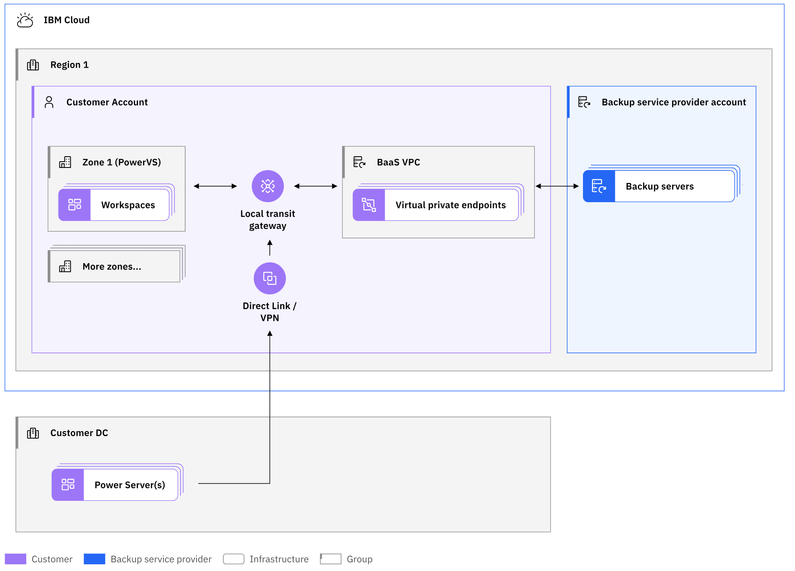
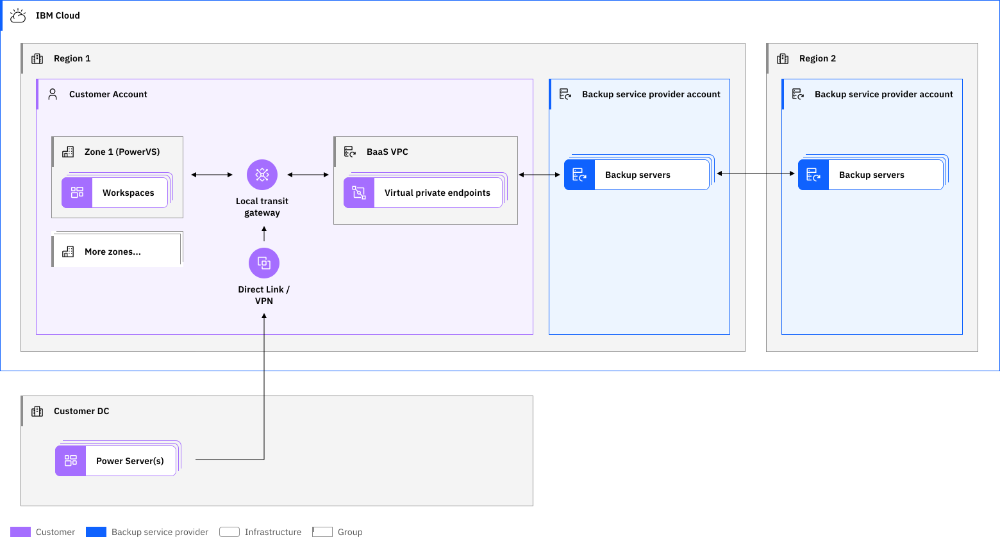

---

copyright:
  years: 2019, 2024

lastupdated: "2025-12-02"

keywords: backup strategies, cos, brms, icc, veeam for aix, ibm spectrum support, cloud setup, direct link, reverse proxy

subcollection: power-iaas

---

{{site.data.keyword.attribute-definition-list}}

# Backup for AIX and Linux instances in {{site.data.keyword.off-prem}}
{: #backup-strategies}

---

{{site.data.keyword.off-prem-fname}} in [{{site.data.keyword.off-prem}}]{: tag-blue}

---

Learn more about different AIX and Linux backup strategies for IBM&reg; Power Systems&trade; Virtual Server.
{: shortdesc}

## Secure automated backup with Compass for AIX and Linux®
{: #baas}

IBM Cloud® Partner Cobalt Iron® provides an automated backup offering for AIX and Linux instances of {{site.data.keyword.powerSysFull}}. The backup offering is called as Secure Automated Backup with Compass® from now on referred as “Backup Offering.”

The Backup Offering is powered by Cobalt Iron Compass and is accessible from the {{site.data.keyword.cloud_notm}} [catalog](https://cloud.ibm.com/catalog){: external}.

## Deploying the backup instance
{: deploy-backup-inst-dc}

To deploy the Backup Offering in {{site.data.keyword.off-prem}}, complete the following steps:

1. Provision the Backup Offering for your account for a region from the {{site.data.keyword.cloud_notm}} catalog.

   To create or edit Virtual Private Cloud (VPC) and Transit Gateway, you must have roles with permissions such as `writer` or `editor` for your IBM Cloud account.
   {: note}

2. Attach the {{site.data.keyword.powerSys_notm}} workspace that you want to enable for the backup zone to the {{site.data.keyword.cloud_notm}} Transit Gateway.

3. Access the Cobalt Iron Commander graphical interface to complete the following steps:
    1. Register new systems that need protection to Compass
    2. To download the software and to install the Compass agent inside the virtual machine systems, complete the following steps:
       1. Log on to [Cobalt Iron Commander graphical interface](https://commander.cobaltiron.com/#login){: external}
       2. Navigate to the **Protected system**
       3. Download the Agent installer

4. Modify the default granular backup policies for your virtual server instances, files, and file systems.

### Network architecture for deploying the backup instance
{: #baas-architechture}

To deploy the backup instance, use one of the following architectures:

- [Single copy Backup Offering](#single-copy-backup)
- [Dual copy Backup Offering](#dual-copy-backup)

#### Single copy Backup Offering
{: #single-copy-backup}

Using a single copy Backup Offering, you can take a backup of your workload in a single data center.

By studying the network architecture diagram of single copy Backup Offering, you can understand the following concepts:
- The architecture of single copy Backup Offering deployed in {{site.data.keyword.off-prem}}
- The requirements for AIX and Linux VMs on Power to access the Compass backup servers through the IBM Cloud network

Compass Accelerator Vaults are backup server instances that are preconfigured in {{site.data.keyword.cloud_notm}} data centers and are replicated across other regions.

Do not deploy any additional resources to the Backup Offering VPC.
{: important}

{: caption="Single copy Backup Offering network architecture" caption-side="bottom"}

The Backup as a Service (BaaS) VPC is created when the Backup Offering is provisioned. The BaaS VPC enables Virtual Private Endpoints (VPEs) for private IP connectivity to the managed backup server instances. When you deploy the backup server instance, an automation process creates the following network segments:

- Local Transit Gateway, if it does not exist
- BaaS VPC for the dedicated use of the backup activity
- VPE for secure connectivity to each of the backup servers
- Security group with inbound rule, address prefix, and subnet

The Backup Offering VPC and the {{site.data.keyword.powerSys_notm}} workspaces must exist in the same region and be connected by using the local Transit Gateway. Connect your on-premises workloads to the Transit Gateway through the Direct Link connection. Use VPN connection in place of the Direct Link connection.

#### Dual copy Backup Offering
{: #dual-copy-backup}

Using a dual copy Backup Offering, you can take a backup of your workload in two different data center regions.

By studying the network architecture diagram of dual copy Backup Offering, you can understand the following concepts:
- The architecture of dual copy Backup Offering that is deployed in {{site.data.keyword.off-prem}}
- The requirements for AIX and Linux VMs on Power to access the Compass backup servers through the IBM Cloud network

Compass backup servers are preconfigured in data centers and are also replicated across the other regions.

Do not deploy any additional resources to the Backup Offering VPC.
{: important}

{: caption="Dual copy Backup Offering network architecture" caption-side="bottom"}

The Backup Offering VPC is a managed backup server instance that is deployed when the Backup Offering is provisioned. When you deploy the backup server instance, an automation process creates the following network segments:

- Local Transit Gateway if it does not exist
- VPC for backup activity only
- VPE for each of the backup servers
- Security group with inbound rule, address prefix, and subnet

The Backup Offering VPC and the {{site.data.keyword.powerSys_notm}} workspaces must exist in the same region and be connected by using the local Transit Gateway. You can connect your on-premises workloads to the Transit Gateway through the Direct Link connection. You can use VPN connection in place of the Direct Link connection.

### Provisioning the backup instance in {{site.data.keyword.off-prem}}
{: #baas-deploy}

To create and deploy a backup server instance from the IBM Cloud catalog, complete the following steps:

1. Log in to the IBM Cloud [catalog](https://cloud.ibm.com/catalog){: external} with your credentials.

   To create or edit VPC and Transit Gateway, you must have roles with permissions such as `writer` or `editor` for your IBM Cloud account.
   {: note}

2. In the search box, type _Compass Backup_ and click **Secure Automated Backup with Compass** tile.
3. Select a deployment location for your backup instance.

It is recommended not to deploy any additional resources to the Backup Offering VPC.
{: important}

4. Define the fields – **Pricing plan**, **Service name**, **Resource group**, your **IBM Cloud API key**, and Compass organization name according to your business needs. Also, specify the VPC subnet IP range that you want to use to access the Compass Vaults.
5. Click **Create**.
6. Compass creates and connects the Backup VPC to the {{site.data.keyword.powerSys_notm}} workspace that you want to back up by using the local Transit Gateway. The Transit Gateway is created if it does not exist.

    For more information, see [Ordering IBM Cloud Transit Gateway](/docs/transit-gateway?topic=transit-gateway-ordering-transit-gateway&interface=ui) and [Using virtual private endpoints for VPC to privately connect to IBM Cloud Transit Gateway](/docs/transit-gateway?topic=transit-gateway-vpe-connection&interface=cli).

7. Click **Launch Compass UI** that will redirect you to the Cobalt Iron Compass Commander page where you need to complete the setup. For more information, see [Cobalt Iron documentation](https://help.cobaltiron.com/getting-started-with-powervs-and-compass-commander/){: external}.

### Pricing in {{site.data.keyword.off-prem}}
{: #baas-pricing}

When you use the Backup Offering, you are billed monthly through IBM Cloud for the amount of data that is backed up for the region. The backup data is the stored data after duplication and compression. For more information about pricing plans, see [Cobalt Iron - Secure Automated Backup](https://cloud.ibm.com/catalog/services/cobalt-iron---secure-automated-backup-){: external}. The page is accessible from the IBM Cloud [catalog](https://cloud.ibm.com/catalog){: external}. You can generate an estimate of the cost based on your expected usage from the **Summary** pane.

In your account, the following deployments are made:

* Establishes the connectivity between {{site.data.keyword.powerSys_notm}} instances and the backup server through the Transit Gateway connection to the backup VPC. The automation when the Backup Offering is provisioned establishes this connection.

* Achieve the name resolution for the backup server connection by using the file on the agent system available at `/etc/hosts` path or by adding `CNAME` entries to the DNS server associated with the agent system.

### Supported data centers
{: #baas-dcs}

The single copy Backup Offering is available in the following data centers:

* DAL10
* DAL12
* FRA04
* FRA05
* MAD02
* MAD04
* OSA21
* SAO01
* SAO04
* SYD04
* SYD05
* TOK04
* WDC07
* WDC06

The dual copy Backup Offering is available in the following data center pairs:

| Data Center 1 | Data Center 2 |
|---------------|---------------|
| DAL10         | WDC07         |
| DAL12         | WDC06         |
| MAD02         | FRA04         |
| MAD04         | FRA05         |
| SAO01         | SAO04         |
| OSA21         | TOK04         |
| SYD04         | SYD05         |
| DAL13         | WDC04         |
| LON04         | LON06         |
{: caption="Data center pair availibility for Backup Offering" caption-side="bottom"}

## Support for Backup Offering
{: #baas-support}

To get the support for Backup Offering, contact Cobalt Iron. You must have the login credentials to Cobalt Iron to access the following pages:

* For more information, see the [Cobalt Iron documentation](https://help.cobaltiron.com/getting-started-with-powervs-and-compass-commander/){: extrnal}.
* For issues related to backup and restore, contact Cobalt Iron by opening a service ticket through `support.cobaltiron.com`.

For more information about the issues that are related to {{site.data.keyword.powerSys_notm}} or IBM Cloud, see [Getting help and support](/docs/power-iaas?topic=power-iaas-getting-help-and-support).
