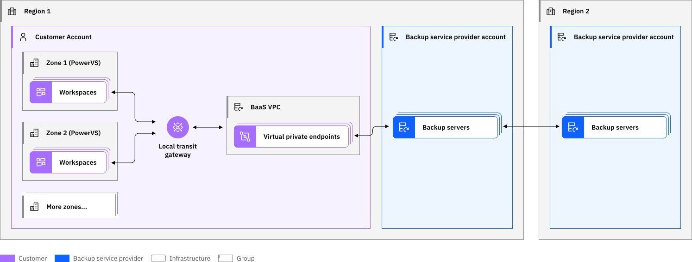

---

copyright:
  years: 2019, 2024

lastupdated: "2024-06-13"

keywords: backup strategies, cos, brms, icc, veeam for aix, ibm spectrum support, cloud setup, direct link, reverse proxy

subcollection: power-iaas

---

{{site.data.keyword.attribute-definition-list}}

# Backup for AIX and Linux instances
{: #backup-strategies}

Learn more about different AIX and Linux backup strategies for IBM&reg; Power Systems&trade; Virtual Server.
{: shortdesc}

## Secure automated backup with Compass for AIX and Linux®
{: #baas}

IBM Cloud® Partner Cobalt Iron® provides an automated backup offering for AIX and Linux instances of {{site.data.keyword.powerSysFull}}. The backup offering is called Secure Automated Backup with Compass® referred hereafter as “Backup Offering.”

The Backup Offering is powered by Cobalt Iron Compass and is accessible from the IBM Cloud [catalog](https://cloud.ibm.com/catalog){: external}. The Backup Offering provides enterprise-class backup and restore features in a cloud-centric SaaS solution. Compass capabilities and security features, along with many other security functions provides protection and self-assessments to protect enterprise data and applications.

Cobalt Iron Compass protects various platforms, applications, and data classes. The Backup Offering includes the following unique features and functions:

1. AIX operating systems

   1. File-level backup and restore

   2. Image-level backup and restore

   3. Policy management down to the directory and file object or type levels

   4. Back up and archive features that include long-term retention of data

2. Linux on Power operating systems

   1. File-level backup and restore

   2. Image-level backup and restore

   3. Policy management down to the directory and file object or type levels

   4. Back up and archive features that include long-term retention of data

3.  Db2 on AIX databases

    1.  Db2-integrated backup and restore of Db2 databases

    2.  Db2-integrated archive logging of Db2 databases

4.  Oracle on AIX databases

    1.  RMAN-integrated backup and restore of Oracle databases

    2.  RMAN-integrated archive logging of Oracle databases

    3.  Support for Oracle Automated Storage Management (Oracle ASM) features

5.  SAP HANA on Linux on Power databases

    1.  HDBackInt-integrated backup and restore of SAP HANA databases

    2.  HDBackInt-integrated backup and restore of SAP HANA redo log files

    3.  Support for the SAP HANA Cockpit for configuration, monitoring, and scheduling of backups

The Backup Offering provides various integrated security and operational features including:

1. Alerting, notifications, and ticketing features and integration
2. Automated auditing and validation of backup server landscape
3. Backup server automation that includes hands-free automation of all backup server tasks
4. Centralized policy management
5. Complete governance
6. Data reduction through compression and deduplication
7. Data replication across regions in IBM Cloud
8. Encryption of data in all phases from in-transit, to-storage, and at-rest
9.  Extensive support for encryption, data immutability, and other security access controls
10. Multitenancy and unlimited sub-organizations
11. Role-based access control management.

The Backup Offering is not currently applicable to the IBM i environment in {{site.data.keyword.powerSys_notm}}.
{: note}

You can use the Backup Offering to back up your AIX and Linux virtual server instances in IBM Cloud {{site.data.keyword.powerSys_notm}}.

To deploy the Backup Offering, complete the following steps:

* From the IBM Cloud catalog, provision the Backup Offering for your account for a region.

* Attach the {{site.data.keyword.powerSys_notm}} workspace that you want to enable for backup zones to the IBM Cloud Transit Gateway.

* Access the Cobalt Iron Commander graphical interface to download the software and install the agent inside the virtual machines.

* Define the fine granular backup policies for your virtual server instances, files, and file systems.

### Architecture diagram
{: #baas-architechture}

The following diagram provides insights about how the Backup Offering is deployed and requirements for AIX and Linux VMs on Power to access the Compass backup servers through IBM Cloud network.

Compass backup servers are preconfigured in data centers and are also replicated across to the other regions.

It is highly recommended that you refrain from deploying any additional resources to Backup Offering VPC.
{: important}

{: caption="Figure 1. Backup Offering network architecture diagram" caption-side="bottom"}

* The Backup Offering VPC is the managed backup server instance that is deployed when the Backup Offering is provisioned.

* Upon deployment of the backup server instance, an automation process creates the following:

    * A local Transit Gateway if it does not exist
    * A VPC for exclusive use of the backup activity
    * A VPE for each of the backup servers

* Security group with inbound rule, address prefix, and subnet.

* The Backup Offering VPC and the {{site.data.keyword.powerSys_notm}} workspaces are required be present in the same region and connected by using the local Transit Gateway.

### Deploying the backup instance
{: #baas-deploy}

To create and deploy a backup server instance from the IBM Cloud catalog, complete the following steps:

1. Log in to the IBM Cloud [catalog](https://cloud.ibm.com/catalog){: external} with your credentials.
2. In the search box, type _Compass Backup_ and click **Secure Automated Backup with Compass** tile.
3. Select a deployment location for your backup instance.
4. Define the fields – **Pricing plan**, **Service name**, **Resource group**, and your **IBM Cloud API key** as per your business needs.
5. Click **Create**.
6. Connect VPC of this deployment and the {{site.data.keyword.powerSys_notm}} workspace that you want to back up by using the local Transit Gateway. You can use you existing Transit Gateway or create a new one.

    For more information, see [Ordering IBM Cloud Transit Gateway](/docs/transit-gateway?topic=transit-gateway-ordering-transit-gateway&interface=ui) and [Using virtual private endpoints for VPC to privately connect to IBM Cloud Transit Gateway](/docs/transit-gateway?topic=transit-gateway-vpe-connection&interface=cli).

6. Click **Launch Compass UI** that will redirect you to the Cobalt Iron Compass page where you need to complete the setup. For more information, see [Cobalt Iron documentation](https://help.cobaltiron.com/getting-started-with-powervs-and-compass-commander/){: external}.

### Pricing
{: #baas-pricing}

When you use the Backup Offering, you are billed monthly through IBM Cloud for amount of data backed up for the region and are billed hourly (at GB/hour basis).

Connectivity between {{site.data.keyword.powerSys_notm}} instances and the backup servers is established via a Transit Gateway connection to the backup VPC. Name resolution is for the backup server connections, which is also required. You can accomplish this using the agent system's /etc/hosts file, or by adding CNAME entries to your agent system's DNS server. These elements need to be deployed in your account (Transit Gateway and VPC provisioning and setup happens through automation when the Backup Offering is provisioned).

### Supported data center pairs
{: #baas-dcs}

The Backup Offering is available in the following data center pairs:

| Data Center 1 | Data Center 2 |
|---------------|---------------|
| DAL10         | WDC07         |
| DAL12         | WDC06         |
| MAD02         | FRA04         |
| MAD04         | FRA05         |
| SAO01         | SAO04         |
| OSA21         | TOK04         |
{: caption="Table 1. Data center pair availibility for backup offering" caption-side="bottom"}

### Additional support
{: #baas-support}

Support for the Backup Offering is provided by Cobalt Iron and you need to have login credentials to Cobalt Iron to access the following:
* For more information about the offering, see the [Cobalt Iron documentation](https://help.cobaltiron.com/getting-started-with-powervs-and-compass-commander/){: extrnal}.
* For issues related to backup and restore, reach out to Cobalt Iron by opening a service ticket via `support.cobaltiron.com`.

If you encounter an issue that is related to {{site.data.keyword.powerSys_notm}} or IBM Cloud, see [Getting help and support](/docs/power-iaas?topic=power-iaas-getting-help-and-support).
