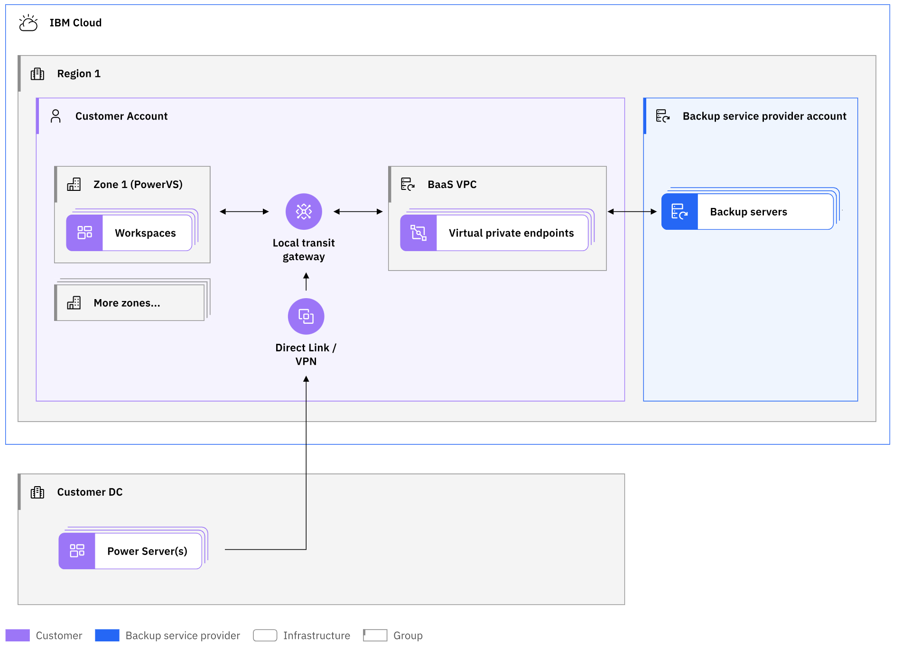
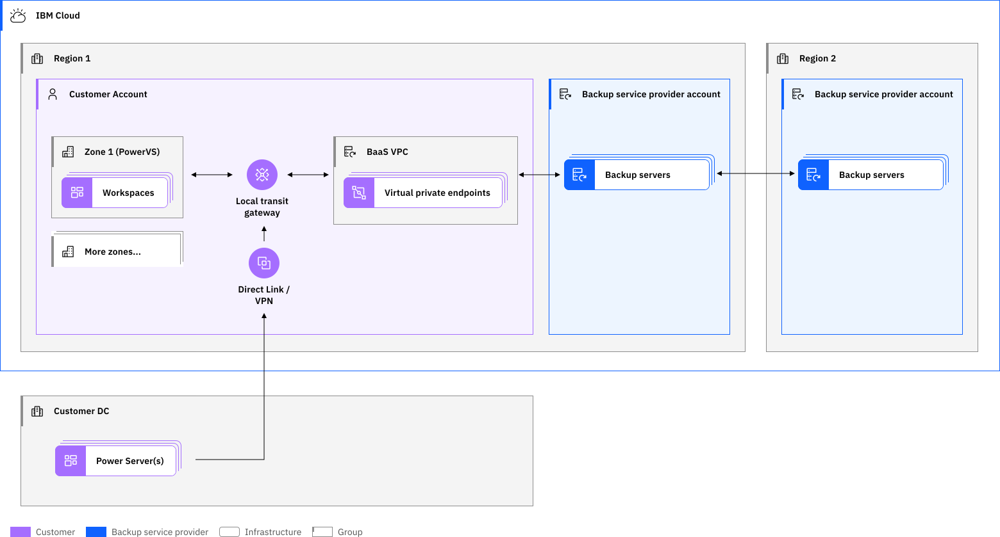

---

copyright:
  years: 2019, 2026 

lastupdated: "2026-05-29"

keywords: backup strategies, cos, brms, icc, veeam for aix, ibm spectrum support, cloud setup, direct link, reverse proxy

subcollection: power-iaas

---

{{site.data.keyword.attribute-definition-list}}

# Backup for {{site.data.keyword.off-prem}} Workloads in IBM data center
{: #backup-strategies}

---

{{site.data.keyword.off-prem-fname}} in [{{site.data.keyword.off-prem}}]{: tag-blue}

---

Learn more about different AIX, Linux, IBM i, and other workload backup strategies for IBM&reg; Power Systems&trade; Virtual Server.
{: shortdesc}

## Secure automated backup with Compass for {{site.data.keyword.powerSys_notm}}
{: #baas}

IBM Cloud® Partner Cobalt Iron® provides an automated backup offering for AIX, Linux, IBM i, and other Power workloads on IBM {{site.data.keyword.powerSysFull}}. The backup offering is called as **Secure Automated Backup with Compass® for PowerVS**. The **Secure Automated Backup with Compass® for PowerVS** is referred as “Backup Offering” throughout the topic.
{: shortdesc}

The Backup Offering is powered by Cobalt Iron Compass and is accessible from the [IBM cloud catalog](https://cloud.ibm.com/catalog){: external}.

## Deploying the Compass backup offering
{: #deploy-backup-inst-dc}

To deploy the Backup Offering in an IBM data center, complete the following steps:

1. Set up the Backup Offering for your account for a region from the [IBM cloud catalog](https://cloud.ibm.com/catalog){: external}.

   For Compass to create or manage VPCs, Transit Gateways, and other cloud networking resources, provide an IBM Cloud API key with the following cloud resource permissions for your IBM Cloud account:

   * Transit Gateway (Resource Group specific) : `transit.gateway.edit`
   * VPC Infrastructure (All Resources): `is.vpc.vpc.list` and `is.vpc.vpc.read`
   * VPC Infrastructure (Resource Group specific): `is.vpc.vpc.create`

2. Attach the {{site.data.keyword.powerSys_notm}} workspace that you want to enable for the backup zone to the IBM Cloud Transit Gateway.

3. Complete the following steps to protect AIX and Linux systems:
   1. Access the Cobalt Iron Commander graphical interface to register new systems that need protection to Compass.
   2. Complete the following steps to download the software and to install the Compass agent inside the virtual server instance (VSI):
       1. Log in to [Cobalt Iron Commander graphical interface](https://commander.cobaltiron.com/#login){: external}
       2. In the Commander interface, go to the **Protected system**.
       3. Download the Agent installer and install the agent on your {{site.data.keyword.powerSysFull}} instance.

4.	Complete the following steps to protect IBM i instance:
   1. Access the Cobalt Iron Commander graphical interface to configure a Compass Virtual Tape Library (VTL).
   2. In the **Admin** tab, select the **Virtual Tape Libraries** tile to open the **Create Virtual Tape Library** wizard.

      When Compass creates the VTL, it also creates Challenge Handshake Authentication Protocol (CHAP) authentication for the Compass VTL.

   3. Configure the Compass VTL on your IBM i instance as an iSCSI target device. Use IBM Navigator for IBM i, as it is the preferred way to configure iSCSI targets.
   4. Use the Compass iSCSI VTL as the target for your Backup, Recovery, and Media Services (BRMS) or Save Object (SAV) backups and restores.

   For more information about protecting IBM i with Compass, see [Compass Quick Start Guide for IBM i Data Protection](https://www.cobaltiron.com/wp-content/uploads/2026/02/CobaltIron-Compass-IBMi-QuickStartGuide-20260107.pdf){: external}.

### Network architecture for deploying the Backup Offering
{: #baas-architecture}

To deploy the Backup Offering, select one of the following architectures:

- [Single copy Backup Offering](#single-copy-backup)
- [Dual copy Backup Offering](#dual-copy-backup)

#### Single copy Backup Offering
{: #single-copy-backup}

You can take a backup of your workload in a single data center by using a single copy Backup Offering,

By studying the network architecture diagram of single copy Backup Offering, you can understand the following concepts:
- The architecture of single copy Backup Offering deployed in IBM data center
- The requirements for AIX, Linux, and IBM i VSIs on Power to access the Compass backup servers through the IBM Cloud network

Compass Vaults are backup server instances that are preconfigured in IBM Cloud data centers.

Do not deploy any additional cloud resources to the Backup Offering VPC.
{: important}

{: caption="Single copy Backup Offering network architecture" caption-side="bottom"}

The Compass Backup as a Service (BaaS) VPC is created when the Backup Offering is provisioned. The BaaS VPC enables Virtual Private Endpoints (VPEs) for private IP connectivity to the managed backup server instances. When you set up the Backup Offering service, an automation process creates the following network segments:

- Local Transit Gateway, if it does not exist
- BaaS VPC for the dedicated use of the backup activity
- VPE for secure connectivity to each of the backup servers
- Security group with inbound rule, address prefix, and subnet

The Backup Offering VPC and the {{site.data.keyword.powerSys_notm}} workspaces must exist in the same region and be connected by using the local Transit Gateway. You can connect your workloads in {{site.data.keyword.on-prem-fname}} in {{site.data.keyword.on-prem}} to the Transit Gateway through the Direct Link connection. You can use VPN connection in place of the Direct Link connection.

#### Dual copy Backup Offering
{: #dual-copy-backup}

You can protect your workload backups across two different data center regions by using the dual copy Backup Offering.

By studying the network architecture diagram of dual copy Backup Offering, you can understand the following concepts:
- The architecture of dual copy Backup Offering that is deployed in IBM data centers
- The requirements for AIX, Linux, and IBM i VSIs on Power to access the Compass backup servers through the IBM Cloud network

Compass Vaults are preconfigured backup servers in IBM Cloud data centers and they replicate data to preconfigured Compass Vaults in other regions.

Do not deploy any additional resources to the Backup Offering VPC.
{: important}

{: caption="Dual copy Backup Offering network architecture" caption-side="bottom"}

The Backup Offering VPC is used by Compass for backup operations and is deployed when the Backup Offering is provisioned. When you set up the Backup Offering service, an automation process creates the following network segments:

- Local Transit Gateway if it does not exist
- VPC for backup activity only
- VPE for each of the backup servers
- Security group with inbound rule, address prefix, and subnet

The Backup Offering VPC and the {{site.data.keyword.powerSys_notm}} workspaces must exist in the same region and be connected by using the local Transit Gateway. You can connect your on-premises workloads to the Transit Gateway through the Direct Link connection. You can use VPN connection in place of the Direct Link connection.

### Provisioning the Backup Offering service in IBM data center
{: #baas-deploy}

Complete the following steps to set up the Backup Offering from the IBM Cloud catalog:

1. For Compass to create or manage VPCs, Transit Gateways, and other cloud networking resources, provide an IBM Cloud API key with the following cloud resource permissions for your IBM Cloud account:

   * Transit Gateway (Resource Group specific) : `transit.gateway.edit`
   * VPC Infrastructure (All Resources): `is.vpc.vpc.list` and `is.vpc.vpc.read`
   * VPC Infrastructure (Resource Group specific): `is.vpc.vpc.create`

2. In the search box, type "Compass Backup" and click **Secure Automated Backup with Compass for PowerVS** tile.
3. Select a deployment location for your backup target.

   Do not to deploy any additional resources to the Backup Offering VPC.
   {: important}

4. Specify the **Pricing plan**, **Service name**, **Resource group**, your **IBM Cloud API key**, and Compass organization name according to your business needs. Also, specify the VPC subnet IP address range that you want to use to access the Compass Vaults.
5. Click **Create**.
6. Compass creates and connects the Backup VPC to the {{site.data.keyword.powerSys_notm}} workspace that you want to back up by using the local Transit Gateway. A local Transit Gateway is created if it does not exist.

    For more information, see [Ordering IBM Cloud Transit Gateway](/docs/transit-gateway?topic=transit-gateway-ordering-transit-gateway&interface=ui) and [Using virtual private endpoints for VPC to privately connect to IBM Cloud Transit Gateway](/docs/transit-gateway?topic=transit-gateway-vpe-connection&interface=cli).

7. Click **Launch Compass UI** that will redirect you to the Cobalt Iron Compass Commander page where you need to complete the setup. For more information, see [Cobalt Iron documentation](https://help.cobaltiron.com/?s=POWERVS){: external}.

### Pricing in {{site.data.keyword.off-prem}}
{: #baas-pricing}

When you use the Backup Offering, you are billed monthly through IBM Cloud for the stored amount of data that is backed up for the region for either single or dual copy. The backup data is the stored data after duplication and compression. For more information about pricing plans, see [Secure Automated Backup with Compass for Power VS](https://cloud.ibm.com/catalog/services/secure-automated-backup-with-compass-for-power-vs){: external}. The page is accessible from the [IBM Cloud catalog](https://cloud.ibm.com/catalog){: external}. You can generate an estimate of the cost based on your expected usage from the **Summary** panel.

In your account, the following deployments are made:

* Connectivity is established between {{site.data.keyword.powerSys_notm}} instances and the backup servers through a local Transit Gateway connection to the backup VPC. The automation when the Backup Offering is provisioned establishes this connection.

* Achieve the name resolution for the backup server connection by using the file on the agent system available at `/etc/hosts` path or by adding `CNAME` entries to the DNS server associated with the agent system.

### Supported data centers
{: #baas-dcs}

The single copy Backup Offering is available in the following data centers:

* DAL10
* DAL12
* DAL13
* FRA04
* FRA05
* LON04
* LON06
* MAD02
* MAD04
* OSA21
* SAO01
* SAO04
* SYD04
* SYD05
* TOK04
* WDC04
* WDC06
* WDC07

The dual copy Backup Offering is available in the following data center pairs:

| Data Center 1 | Data Center 2 |
|---------------|---------------|
| DAL10         | WDC07         |
| DAL12         | WDC06         |
| MAD02         | FRA04         |
| MAD04         | FRA05         |
| SAO01         | SAO04         |
| OSA21         | TOK04         |
| SYD04         | SYD05         |
| DAL13         | WDC04         |
| LON04         | LON06         |
{: caption="Data center pairs that are availibile for Backup Offering" caption-side="bottom"}

## Support for Compass Backup Offering
{: #baas-support}

To get the support for the Backup Offering, contact Cobalt Iron. You must have the login credentials to Cobalt Iron to access the following pages:

* For more information, see the [Cobalt Iron documentation](https://help.cobaltiron.com/?s=POWERVS/){: extrnal}.
* For issues related to backup and restore, contact Cobalt Iron by opening a service ticket through `support.cobaltiron.com`.

For more information about the issues that are related to {{site.data.keyword.powerSys_notm}} or IBM Cloud, see [Getting help and support](/docs/power-iaas?topic=power-iaas-getting-help-and-support).
