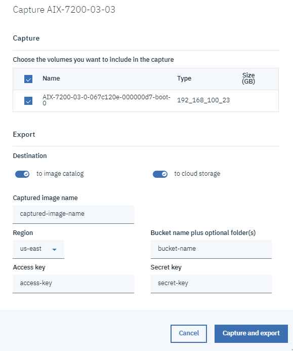
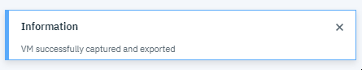
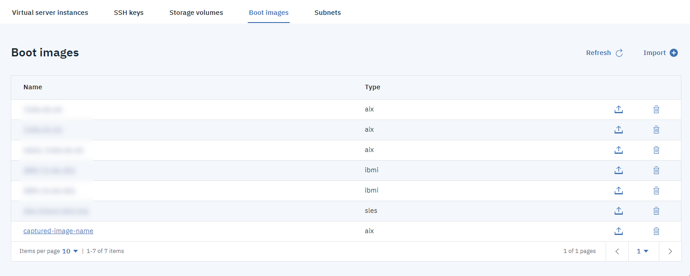
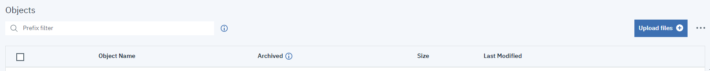
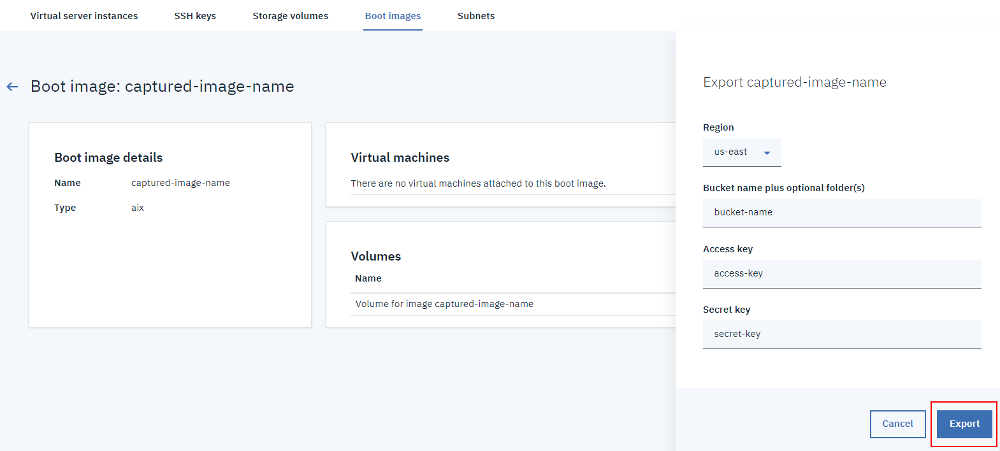

---

copyright:
  years: 2019, 2020

lastupdated: "2020-01-22"

keywords: image catalog, virtual machine capture, cloud object storage bucket, export virtual machine

subcollection: power-iaas

---

{:new_window: target="_blank"}
{:shortdesc: .shortdesc}
{:screen: .screen}
{:codeblock: .codeblock}
{:pre: .pre}
{:tip: .tip}
{:note: .note}
{:important: .important}
{:deprecated: .deprecated}
{:external: target="_blank" .external}

# Capturing and exporting a virtual machine (VM)
{: #capturing-exporting-vm}

You can capture and export an AIX or IBM i VM instance by using the IBM Cloud CLI or the console. A VM is captured as **a volume backed image**. The image is stored in new volumes on the storage providers. For example, if a VM is backed by two volumes (one residing on SSD storage and the other one on a standard HDD storage), the new image will consist of one volume on SSD storage and the other on HDD storage.
{: shortdesc}

An image can be exported to an IBM **Cloud Object Storage** (COS) bucket. When an image is exported, the volumes of the image are copied and packaged in an OVA file. The OVA file is compressed by using _gzip_ before it gets uploaded to the IBM COS bucket.

When you capture and export a VM, you can choose the **image catalog**, **Cloud Object Storage**, or both as destinations. The image catalog resides on the IBM Power SAN. IBM's **Cloud Object Storage** is encrypted and dispersed across multiple geographic locations, and accessed over HTTP by using a REST API. This service uses the distributed storage technologies that are provided by the IBM Cloud Object Storage System (formerly Cleversafe). You can always export your image in your **image catalog** to **Cloud Object Storage** at a later point. You can also deploy the captured image to create a clone of the VM by using a different network configuration.

You are charged different rates based on whether you export to the **image catalog** or **Cloud Object Storage**.
{: important}

## Using the IBM Cloud CLI to capture and export a VM
{: #cli-capture-export}

For more information, see the [IBM Power Systems Virtual Servers CLI Reference](/docs/power-iaas-cli-plugin?topic=power-iaas-cli-plugin-power-iaas-cli-reference#power-iaas-cli-before) and [Using the IBM Cloud CLI for Cloud Object Storage](/docs/services/cloud-object-storage?topic=cloud-object-storage-ic-use-the-ibm-cli#delete-bucket-cors).

1. To capture an AIX or IBM i VM, use the `ibmcloud pi instance-capture` command. You can export it to your **image catalog**, **Cloud Object Storage**, or both.

    ```shell
    ibmcloud pi instance-capture INSTANCE_ID --destination DEST --name NAME [--volumes "VOLUME1 VOLUME2"] [--access-key KEY] [--secret-key KEY] [--region REGION] [--image-path TYPE]
    ```
    {: codeblock}

2. Find your newly exported image by completing either one of the following tasks:

    - To see your newly exported image in the **image catalog**, use the `ibmcloud pi image-list-catalog` command:

        ```shell
        ibmcloud pi image-list-catalog [--long] [--json]
        ```
        {: codeblock}

    - To see your newly exported image in **Cloud Object Storage**, use the `ibmcloud cos list-objects` command:

        ```shell
        ibmcloud cos list-objects --bucket BUCKET_NAME [--delimiter DELIMITER] [--encoding-type METHOD] [--prefix PREFIX] [--starting-token TOKEN] [--page-size SIZE] [--max-items NUMBER] [--region REGION] [--json]
        ```
        {: codeblock}

## Using the IBM Cloud console to capture and export a VM
{: #console-capture-export}

1. Click the **Capture and export** icon in your **Virtual server instance** view. The icon is to the right of the **trash** icon.

2. Choose the volumes that you want to capture and export.

3. Select whether you want to export the volume backed image to the **image catalog**, **Cloud Object Storage**, or both.

4. Give your captured image a **Name**.

5. _(Optional)_ If you decide to export to **Cloud Object Storage**, you are presented with more options:
   1. Select the **Region**.
   2. Provide your [**Access** and **Secret** keys](/docs/infrastructure/power-iaas?topic=power-iaas-deploy-custom-image#access-keys).
   3. Select your **Bucket name** and **optional folders**.

6. Click **Capture and export**.

    {: caption="Figure 2. Capturing and exporting a VM" caption-side="bottom"}

7. If the capture and export is successful, you are presented with a confirmation message.

    The export process can be signficantly longer if the volumes you selected are large.
    {: important}

    {: caption="Figure 3. Capture and export success!" caption-side="bottom"}

8. Find your newly exported image by completing either one of the following tasks:

    - If you chose to capture and export your volume backed image to the **image catalog**, go to your **Boot images** tab.

    {: caption="Figure 4. Finding your newly captured image in your image catalog" caption-side="bottom"}

    - If you chose to capture and export your volume backed image to **Cloud Object Storage**, go to your **Cloud Object Storage** bucket.

    {: caption="Figure 5. Finding your newly captured image in your Cloud Object Storage bucket" caption-side="bottom"}

If you'd like to export your volume backed image from your **image catalog** to **Cloud Object Storage**, select it and click the **Capture and export** icon.

{: caption="Figure 6. Exporting the image in your image catalog to Cloud Object Storage" caption-side="bottom"}
