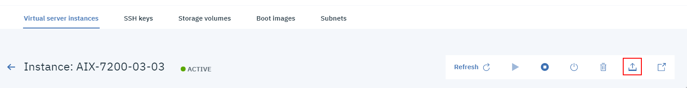

---

copyright:
  years: 2019

lastupdated: "2019-08-15"

---

{:shortdesc: .shortdesc}
{:new_window: target="_blank"}
{:codeblock: .codeblock}
{:pre: .pre}
{:screen: .screen}
{:tip: .tip}
{:important: .important}
{:note: .note}

# Capturing and exporting a virtual machine (VM)
{: #capturing-exporting-vm}

You can capture and export an AIX or IBM i VM instance by using the IBM Cloud CLI or the console.
{: shortdesc}

## Using the IBM Cloud CLI to capture and export a VM
{: #cli-capture-export}

1. To capture an AIX or IBM i VM, use the following command:

    ```shell
    ibmcloud pi instance-capture INSTANCE_ID --destination DEST --name NAME [--volume-ids "VOLUME1 VOLUME2"] [--access-key KEY] [--secret-key KEY] [--region REGION] [--image-path TYPE]
    ```
    {: codeblock}

2. After succesfully capturing your VM, export it to your **iamge catalog** or **cloud storage** by entering:

    ```shell
    ibmcloud pi image-export IMAGE_NAME --bucket BUCKET_NAME --region REGION_NAME --access-key KEY --secret-key KEY [--json]
    ```
    {: codeblock}

3. To see your image catalog, use the `ibmcloud pi image-list-catalog` command:

    ```shell
    ibmcloud pi image-list-catalog [--long] [--json]
    ```
    {: codeblock}

For more information on how to use the IBM Cloud CLI to capture and export an image, see the [IBM Power Systems Virtual Servers CLI Reference](/docs/power-iaas-cli-plugin?topic=power-iaas-cli-plugin-power-iaas-cli-reference#power-iaas-cli-before).

## Using the IBM Cloud console to capture and export a VM
{: #console-capture-export}

1. Click the **Capture and export** icon under your **Virtual server instance** tab.

    {: caption="Figure 1. Capturing and exporting icon" caption-side="bottom"}

2. Choose the volumes you want to include in the capture export operation.
3. Select whether you want to export the volume to the **image catalog**, **cloud storage**, or both.
4. Give your captured image a **Name**.
5. _(Optional)_ If you decide to export **to cloud storage**, you are presented with additional options:
   1. Select the **Region**.
   2. Provide your **Access** and **Secret** keys.
   3. Select your **Bucket name** and **optional folders**.

6. Click **Capture and export**.

    {: caption="Figure 2. Capturing and exporting a VM" caption-side="bottom"}

7. If the VM capture and export is successful, you are presented with a comfirmation message.

    {: caption="Figure 3. VM capture and export success!" caption-side="bottom"}

8. To find your newly exported image, go to your **Boot iamges** tab.

    {: caption="Figure 4. Finding your newly captured image" caption-side="bottom"}
