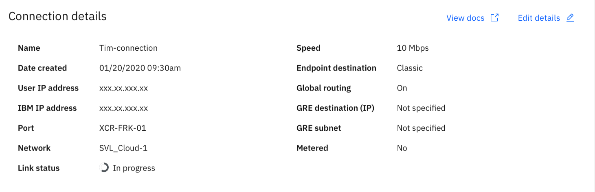
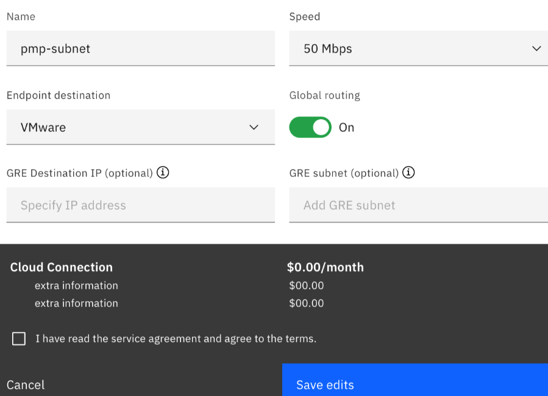
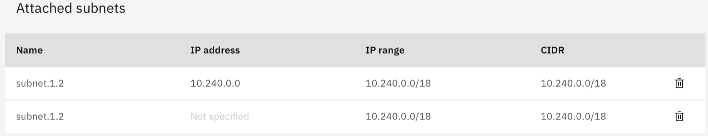
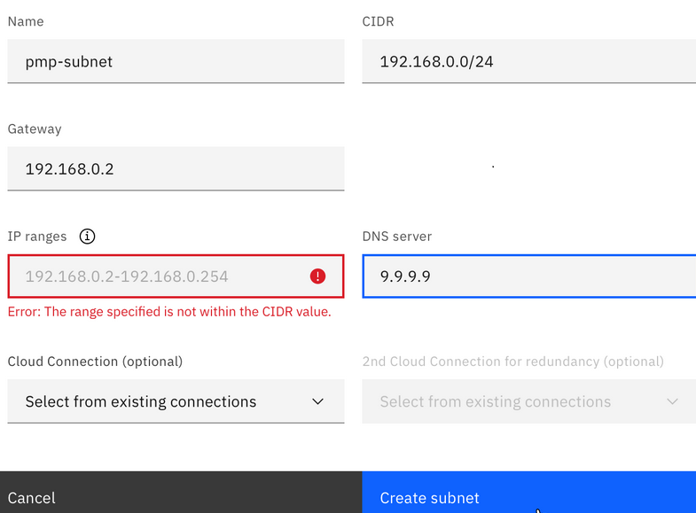

---

copyright:
  years: 2020

lastupdated: "2021-02-02"

keywords: Cloud connections, subnet, VPC, IBM cloud

subcollection: power-iaas

---

{:new_window: target="_blank"}
{:shortdesc: .shortdesc}
{:screen: .screen}
{:codeblock: .codeblock}
{:pre: .pre}
{:tip: .tip}
{:note: .note}
{:preview: .preview}
{:important: .important}
{:deprecated: .deprecated}
{:external: target="_blank" .external}

# Cloud connections
{: cloud-connections}

Cloud connections provide an automated way to connect your {{site.data.keyword.powerSys_notm}} instances to the IBM Cloud resources that include classic and VPC network. Cloud connections create a Direct Link Connect (2.0) offering instance to connect your {{site.data.keyword.powerSys_notm}} instances to the IBM Cloud resources. The speed and reliability of the Direct Link connection extends the network of your organization data center and offers more consistent, higher-throughput connectivity, keeping traffic within the IBM Cloud network.

## Creating Cloud connections
{: create-cloud-connections}

If you are creating a new service, you will automatically receive two 5 Gbps Cloud connections at no cost. After the first two connections, charges apply based on speed and number of connections that you choose to have.
{: note}

To create a new Cloud connection, complete the following steps:

1. Sign in to the **IBM Cloud Portal**.
2. Select the menu icon and select **Resource List**.
3. Click the arrow next to **Services**.
4. Select the Power Systems Virtual Server service you’d like to assign a Cloud connection.
5. Click **Cloud connections** in the left navigation window, and click **Create new connection**.
6. Specify a connection name and select a connection speed. Default connection speed is 5 Gbps.
7. If you need access to other data centers outside your Power Systems Virtual Server region, you must select the global routing option. For example, you might use global routing to share workloads between dispersed IBM Cloud resources, such Dallas to Tokyo, or Dallas to Frankfurt.
8. Select **Endpoint destination** as follows to select the network connection to attach to the Direct Link gateway:
   * **Classic Infrastructure**: Allows you to connect to IBM Cloud classic resources. Only one classic infrastructure connection is allowed per Direct Link gateway. You can also request a Generic Routing Encapsulation (GRE) tunnel configuration by specifying the GRE destination and GRE subnet IP addresses. For more information, see [GRE tunneling](/docs/power-iaas?topic=power-iaas-configuring-power#gre-tunneling).
   * **VPC**: Allows you to connect to your account’s Virtual Private Cloud (VPC) resources. You must select the required VPC connection from the list of available connections.

   Cloud connections provide connectivity to IBM Cloud Classic network in addition to VPC network. You can access all of the Classic network locations irrespective of Direct Link 2.0 gateway in local or global routing attribute. You must use the global routing attribute to reach VPC network outside the local region.
9. Review the summary and click the checkbox to accept the terms and conditions.
10. Click **Create** to create a new Cloud connection.

## Configuring Cloud connections
{: configure-cloud-connections}

If you created a Power Systems Virtual Servers service that contains two default Cloud connections, you also have an initial subnet that is connected to those connections. You can view the attached subnets and add or remove subnets in the Cloud Connection details page. When you create or edit a subnet, you can also attach an existing Cloud connection. For information about adding a private network subnet, see [Configuring and adding a private network subnet](/docs/power-iaas?topic=power-iaas-configuring-subnet).

Any changes to bandwidth might affect pricing.
{: note}

To configure Cloud connections, complete the following steps:

1. In the Power Systems Virtual Services dashboard, click **Cloud connections** in the left navigation window.

2. Click the Cloud connection that you want to configure. The corresponding **Connection details** page appears.

    {: caption="Figure 1. Cloud connection details" caption-side="bottom"}

3. Click **Edit details** icon.

    {: caption="Figure 2. Edit cloud connection details" caption-side="bottom"}

4. Make the required changes, review the pricing changes, and click **Save edits**.

## 
{: attach-subnet}

You must route Power Systems Virtual Server private network subnets over IBM Cloud Direct Link to allow connectivity between Power Systems Virtual Server instances and the IBM Cloud network.

The **Connection details** page contains the list of attached subnets.

{: caption="Figure 3. Attached subnets" caption-side="bottom"}

When you create a subnet or edit details of a subnet, you can attach an existing Cloud connection to the subnet. For steps to create a subnet, see [Configuring and adding a private network subnet](/docs/power-iaas?topic=power-iaas-configuring-subnet).

## Configuring and adding a private network subnet

You can configure a private network subnet when you create an IBM Power Systems Virtual Server instance. You must give your subnet a **Name** and specify a **Classless inter-domain routing (CIDR)**. When you specify a CIDR, the **Gateway**, **IP range**, and **DNS server** are automatically populated. You must use CIDR notation when you choose the IP ranges for your private network subnet. CIDR notation is defined in [RFC 1518](https://tools.ietf.org/html/rfc1518) and [RFC 1519](https://tools.ietf.org/html/rfc1519).

```
<IPv4 address>/<number>
```
{: codeblock}

The first IP address is always reserved for the gateway in all data centers. The second and third IP addresses are reserved for gateway high-availability (HA) in only the *WDC04* Power IaaS locations. The subnet address and subnet broadcast address are reserved in all Power IaaS locations.
{: important}

To create a new subnet, complete the following steps:

1. Sign in to the [IBM Cloud Portal](https://cloud.ibm.com/).
2. Select the menu icon and select **Resource List**.
3. Click the arrow next to **Services**.
4. Select the Power Systems Virtual Server service you'd like to assign a subnet.
5. Click **Subnets** in the left navigation window, then **Add subnet**.

    {: caption="Figure 4. Configuring a subnet" caption-side="bottom"}

6. Optionally, select an existing cloud connection to which you want to attach this subnet. If you have set up another Cloud connection for redundancy purposes, you can select the second Cloud connection as well.
7. Click **Create subnet**.

A DNS server value of 9.9.9.9 might not be reachable if you don't have a public IP. This can cause the LPAR to hang during startup. Go with the default DNS server value of 127.0.0.1 to avoid this issue. As of now, you can add up to 20 DNS servers. The DNS IP addresses must be separated by commas.

You can also create and configure a private network subnet by using the IBM CLI. Use the following command to create a private network subnet:

```
ibmcloud pi network-create-private NETWORK_NAME --cidr-block CIDR --ip-range "startIP-endIP[,startIP-endIP]" [--dns-servers "DNS1 DNS2"] [--gateway GATEWAY] [--json]
```

## Setting up high availability over Cloud Connections
{: ha-availability-cloud-connections}

IBM Cloud Direct Link (2.0) is not a redundant service by default. You must order a separate Direct Link Connect (2.0) instance for redundancy.

To set up highly available connectivity to the IBM Cloud network by using Direct Link Connect, complete the following steps:

1. Create two cloud connections for your Power Systems Virtual Servers.
2. Attach subnets to the primary and redundant cloud connections.

When subnets are attached to cloud connections, PowerNS supports routing the subnets over the Cloud Connections and BGP configuration, which provides the redundant paths.

## Generic Routing Encapsulation (GRE) tunnel
{: gre-tunnel}

A Generic Routing Encapsulation (GRE) tunnel connects two endpoints (a firewall or a router and another network appliance) in a point-to-point logical link. Power Systems Virtual Servers use GRE link to enable connectivity to IBM Cloud VMware Network and other destinations via a router appliance.

GRE tunnel configuration requires tunnel source IP (Power Systems Virtual Server router end) and destination IP. To configure GRE tunnel and associate IPs, destination IP and GRE subnet are required.

GRE tunnel subnet supports addressing for GRE tunnels. It is used for tunnel source IP, local IP and remote IP. First half of the subnet IP range (s1) is used for source IPs and second half for local and remote IPs (s2). GRE tunnel uses first IP from s1 for source IP, local IP is first IP of s2 and remote IP is second IP of s2.

GRE tunnel BGP ASNs are as follows:

- Power ASR side ASN is 64995 in WDC (64999 for Nexus in WDC).
- For other ASRs ASN number is 64999.
- Customer ASN for GRE BGP is 64880.
