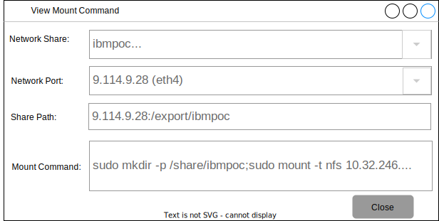

---

copyright:
  years: 2019, 2023

lastupdated: "2023-01-24"

keywords: mdm, storage pool, mount command, powervm

subcollection: power-iaas

---

{{site.data.keyword.attribute-definition-list}}

# Configuring IBM Cloud Mass Data Migration (MDM) on AIX
{: #configuring-mdm}

You can configure MDM on an IBM Power PowerVM AIX LPAR. For more information, see [IBM Cloud Mass Data Migration](https://www.ibm.com/cloud/mass-data-migration){: external}.
{: shortdesc}

1. Begin by connecting to the provided **Management** URL.

2. Select **Unlock & Start Storage Pool...** from the **Common Tasks** pane.

3. Enter your provided **Pool Passphrase** into the **Security Authentication** area in the **Activate/Start Storage Pool** window.

4. Select **OK** to return to the **Common Tasks** pane.

5. Select **View Network Shares** and close the **Common tasks** pane. Your preconfigured share is now listed in the **Normal** state.

6. **Right-click** and select **View Mount Command** to view the mount parameters for the share. You can have multiple mount options depending on your MDM order's supplied network parameters. Make sure that you are using the correct mount for your network environment. In the following example, *eth2* is cabled to the management network, and *eth4* is cabled to a network that the production LPARs have access to.

    {: caption="Figure 4. Viewing the share mount parameters" caption-side="bottom"}

7. On your AIX LPAR, enter the `mount ServerName:/remote/directory /local/directory` command. You must replace *ServerName* with the MDM IP address. Your command should appear similar to the following: `mount 10.32.246.4:/export/ibmpoc /share/ibmpoc`.

    The MDM device does not allow routing on the secondary NIC unless management and data ports are shared. The secondary NIC and the AIX host must be on the same layer 2 VLAN or subnet.
    {: note}

    {: caption="Figure 5. Entering the mount command" caption-side="bottom"}

8. Copy or move your data from the AIX host to the share by using the `cp` or `mv` commands.

9. Power down the system.
