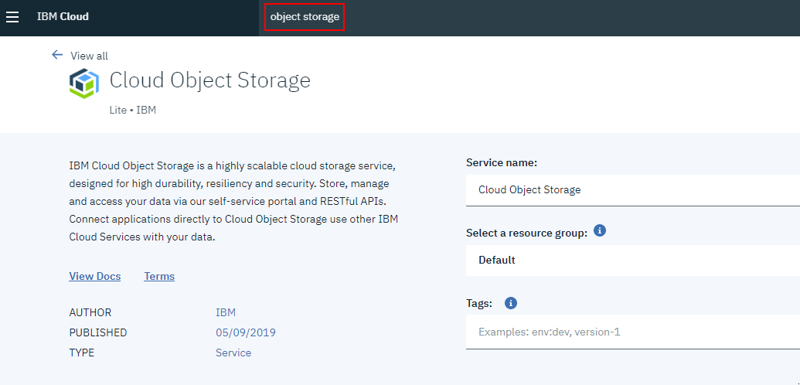
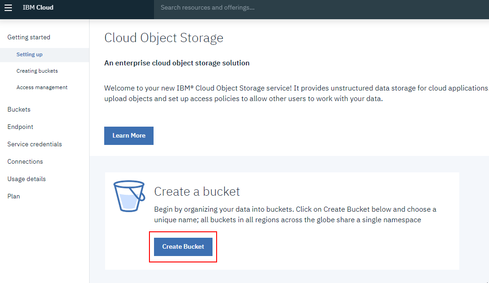
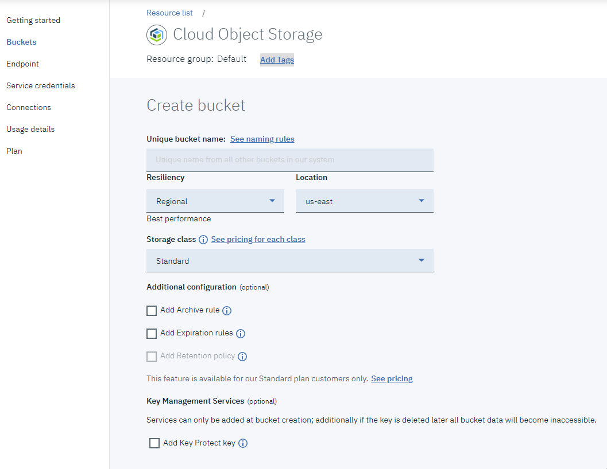
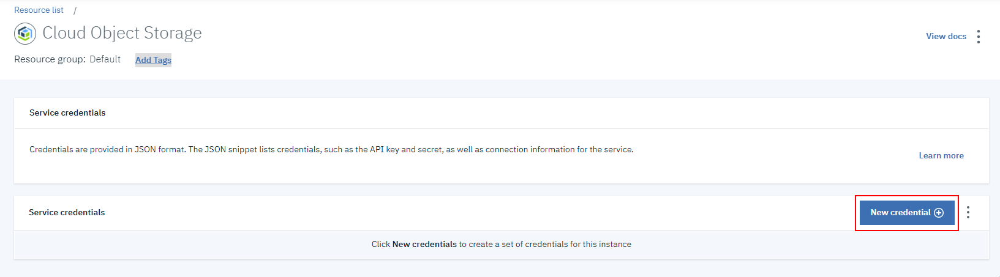
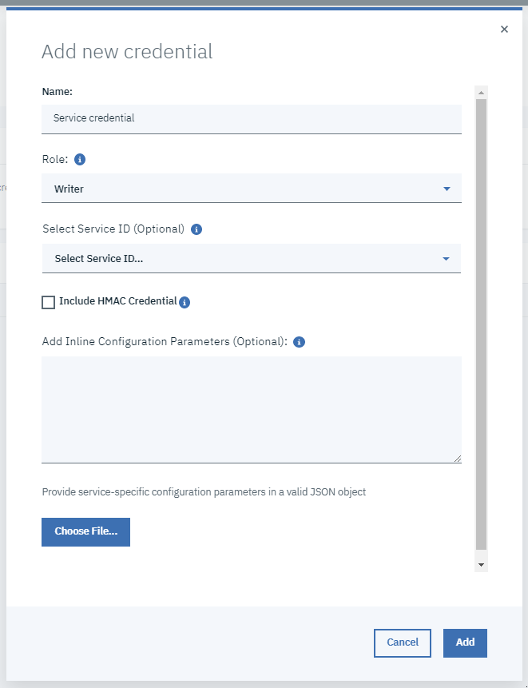
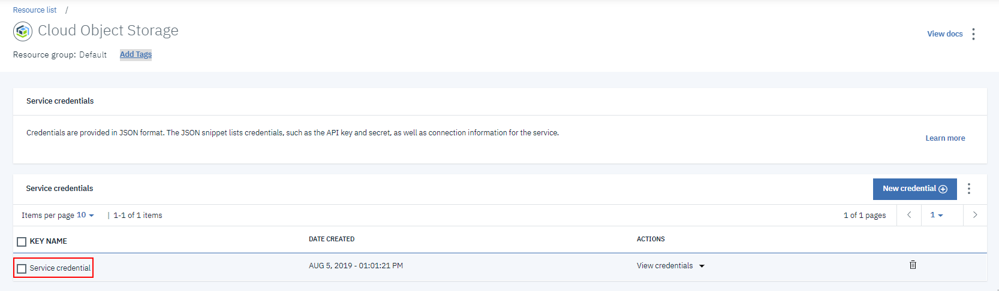
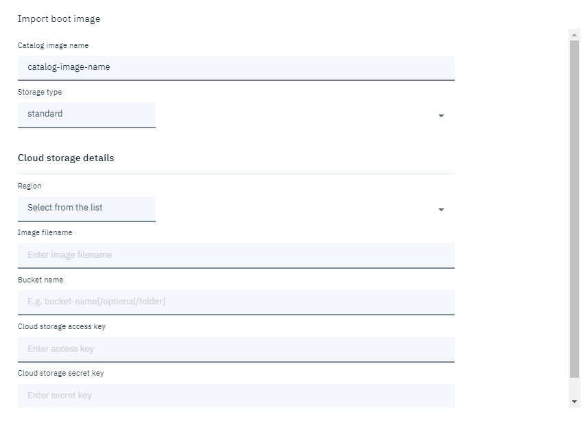

---

copyright:
  years: 2019, 2020

lastupdated: "2020-05-28"

keywords: custom image, boot image, upload image, deploy, boot volume

subcollection: power-iaas

---

{:new_window: target="_blank"}
{:shortdesc: .shortdesc}
{:screen: .screen}
{:codeblock: .codeblock}
{:pre: .pre}
{:tip: .tip}
{:note: .note}
{:important: .important}
{:deprecated: .deprecated}
{:external: target="_blank" .external}
{:help: data-hd-content-type='help'}
{:support: data-reuse='support'}

# Deploying a custom image within a Power Systems Virtual Server
{: #deploy-custom-image}

You can bring your own customized AIX or IBM i operating system (OS) image to deploy within a {{site.data.keyword.powerSysFull}}.
{: shortdesc}

  You cannot transfer an OS license from an on-premises system to a {{site.data.keyword.powerSys_notm}} that is running in the cloud environment. The license cost is factored into the overall hourly billing rate.
  {: note}

The basic steps that are involved in deploying an instance by using a custom image are:

1. Create the custom image.
1. Store the image in your **Cloud Object Storage** account.
1. Point the {{site.data.keyword.powerSys_notm}} console to the image in the **Cloud Object Storage** and deploy the Virtual Server instance.

## Before you begin
{: #before-you-begin-deploy}

Before you can use a custom image as the boot volume, review the following information:

- You must have a basic understanding of [IBM Cloud Object Storage](/docs/services/cloud-object-storage?topic=cloud-object-storage-about-cloud-object-storage) concepts.
- If you do not have an existing AIX or IBM i image, you can use IBM® PowerVC™ to capture and export an image for use with a {{site.data.keyword.powerSys_notm}}. For more information, see [Capturing a virtual machine](https://www.ibm.com/support/knowledgecenter/en/SSXK2N_1.4.2/com.ibm.powervc.standard.help.doc/powervc_capturing_hmc.html){: new_window}{: external} and [Exporting images](https://www.ibm.com/support/knowledgecenter/en/SSXK2N_1.4.2/com.ibm.powervc.standard.help.doc/powervc_export_image_hmc.html){: new_window}{: external}.
- Alternatively, if you have already deployed a virtual server instance, you can capture it and redeploy a new virtual server instance. To accomplish this, you can use the [{{site.data.keyword.cloud}} CLI](https://cloud.ibm.com/docs/cli?topic=cloud-cli-getting-started){: new_window}{: external} to capture a virtual server instance.
- You must verify that your AIX or IBM i OS technology level is supported on the Power Systems hardware that you selected in the **Machine Type** field.

The supported AIX and IBM i operating system versions depend on the IBM Power Systems hardware that you select for the {{site.data.keyword.powerSys_notm}}: S922 (9009-22A), E880 (9119-MHE), or E980 (9080-M9S - Frankfurt only). To view a list of the supported AIX and IBM i operating system technology levels, see the following system software maps:

**AIX**

The {{site.data.keyword.powerSys_notm}} offering supports only AIX 7.1, or later. When viewing the system software maps, refer to the AIX 7.1 and AIX 7.2 information. If you use an unsupported version, it is subject to outages during planned maintenance windows with no advanced notification given.

- [S922 (9009-22A) AIX software map](https://www-01.ibm.com/support/docview.wss?uid=ssm1platformaix9009-22A-vios-only){: new_window}{: external}
- [E880 (9119-MHE) AIX software map](https://www-01.ibm.com/support/docview.wss?uid=ssm1platformaix9119-MHE-vios-only){: new_window}{: external}
- [E980 (9080-M9S) AIX software map](http://www-01.ibm.com/support/docview.wss?uid=ssm1platformaix9080-M9S-vios-only){: new_window}{: external}

**IBM i**

The {{site.data.keyword.powerSys_notm}} offering supports only IBM i 7.2, or later. Clients running IBM i 7.1 with a plan to move to an IBM E880 (9119-MHE) must first upgrade the OS to a current support level before migrating to the Cloud. IBM i 7.2 supports direct upgrades from IBM i 5.4, 6.1 or 7.1. For more information, see [Migrating to i 7.2 from 5.4, 6.1 or 7.1](https://www.ibm.com/support/knowledgecenter/en/ssw_ibm_i_72/rzahy/rzahymig-po.htm){: new_window}{: external}.

- [S922 (9009-22A), E880 (9119-MHE), and E980 (9080-M9S) software maps](https://www-01.ibm.com/support/docview.wss?uid=ssm1platformibmi){: new_window}{: external}
- [IBM i PTF minimum levels](/docs/power-iaas?topic=power-iaas-minimum-levels)
- [IBM i release life cycle](https://www.ibm.com/support/pages/release-life-cycle){: new_window}{: external}

The following supported Linux operating system apply to all of the IBM Power Systems hardware used in the {{site.data.keyword.powerSys_notm}} service:

**Linux**

- Red Hat Enterprise Linux (RHEL): 8.0, and 8.1
- SUSE Linux Enterprise (SLES): 12 and 15

## Creating an IBM Cloud Object Storage bucket
{: #cloud-storage-bucket}

1. Type **object storage** into the catalog's search box and select **Cloud Object Storage**.

    <!-- {: caption="Figure 1. IBM Cloud Object Storage" caption-side="bottom"} -->

2. Give the service a name, add tags (if wanted), select your pricing plan and click **Create**.

3. After you click **Create**, you are taken to the **Cloud Object Storage** landing page. Select **Create Bucket**.

    <!-- {: caption="Figure 1. IBM Cloud Object Storage bucket" caption-side="bottom"} -->

4. From here, you are automatically redirected to the service instance where you can start creating buckets. Your {{site.data.keyword.cos_short}} instances are listed under **Storage** in the **Resource List**. The terms *resource instance* and *service instance* refer to the same concept, and can be used interchangeably.

5. Choose a unique name. All buckets in all regions across the globe share a single namespace. Ensure that you have the correct permissions to create a bucket.

    When you create buckets or add objects, be sure to avoid the use of Personally Identifiable Information (PII). PII is information that can identify any user (natural person) by name, location, or any other means.
    {: note}

6. First, choose a wanted level of *resiliency*, and then a *location* where you would like your data to be physically stored. Resiliency refers to the scope and scale of the geographic area across which your data is distributed. *Cross Region* resiliency spreads your data across several metropolitan areas, while *Regional* resiliency spreads data across a single metropolitan area. A single data center distributes data across devices within a single site only.

7. Choose the bucket's *storage class*, which is a reflection of how often you expect to read the stored data and determines billing details. Follow the **Create** link to create and access your new bucket.

    Buckets are a way to organize your data, but they are not the only way. Object names (often referred to as object keys) can use one or more forward slashes for a directory-like organizational system. You then use the portion of the object name before a delimiter to form an object prefix, which is used to list related objects in a single bucket through the API.
    {: tip}

  {: caption="Figure 1. Creating a Cloud Object Storage bucket" caption-side="bottom"}

Objects are limited to 200 MB when uploaded through the console unless you use the Aspera high-speed transfer plug-in. Larger objects (up to 10 TB) can also be split into parts and uploaded in parallel using the API. Object keys can be up to 1024 characters in length, and it's best to avoid any characters that might be problematic in a web address. These special characters (*?*, *=*, *<*, etc.) might cause unwanted behavior if not URL-encoded. For more information, see the [Cloud Object Storage tutorial](/docs/cloud-object-storage?topic=cloud-object-storage-getting-started).

## Generating secret and access keys with Hash-based Message Authentication Code (HMAC)
{: #access-keys}

1. You can generate secret and access keys when you create the service credentials for the IBM Cloud Storage object. To create the service credentials, you must have `Writer` access for the **Object Storage** bucket.

2. Select **New credential** under **Service credentials** in the **Cloud Object Storage** pane.

    {: caption="Figure 2. Uploading your custom image to the Cloud Object Storage bucket" caption-side="bottom"}

3. Complete all of the wanted fields for adding a credential. Remember to check **Include HMAC Credential** for obtaining a **Hash-based Message Authentication Code (HMAC)** credential.

    <!-- {: caption="Figure 5. Adding a credential" caption-side="bottom"} -->

4. Find your new service credential in the service credentials table.

  {: caption="Figure 3. Your new service credential" caption-side="bottom"}

To view your credential information, such as your secret and access keys, click the arrow to the right of **View credentials**. For more information, see [Service credentials](/docs/services/cloud-object-storage?topic=cloud-object-storage-service-credentials) and [Bucket permissions](/docs/services/cloud-object-storage?topic=cloud-object-storage-iam-bucket-permissions).

## Using a custom boot image to provision a new instance
{: #upload-custom-boot}
{: help}
{: support}

Complete the following steps to provision a new instance by using a custom boot image. For more information about importing a custom boot image by using the IBM Cloud CLI, see [Importing a boot image](/docs/power-iaas?topic=power-iaas-importing-boot-image#cli-import-image). Large boot images take time to successfully import. You might experience a delay before receiving a confirmation message.

1. Before you create a new {{site.data.keyword.powerSys_notm}} instance, go to **Boot images** and click **Import**.

2. After you click **Import**, refer to the following table to complete the **Import boot image** fields:

    The **Image file name** field supports the following formats: *.ova*, *.ova.gz*, *.tar*, *.tar.gz* and *.tgz*.
    {: important}

| Field | Description |
| ------| ------------|
| Catalog image name | Enter the name that you want displayed in your catalog.|
| Storage type | Select whether you want **Tier 1 (NVMe-based flash storage)** or **Tier 3 (SSD flash storage)** for the storage type. A VM cannot have disks from both **Tier 1** and **Tier 3** storage types.|
| Region | Select either **us-east**, **us-south**, **eu-de**, or **eu-gb** for the region.|
| Image file name | Enter the fully qualified path for the image file. The fully qualified path must be in this format, `endpoint/bucket_name/file_name`. You must use the private endpoint domain. For example, `s3.private.us-east.cloud-object-storage.appdomain.cloud/power-iaasprod-images-bucket/Aix_7200-03-02-1846_cldrdy_112018.gz`. You can identify the endpoint domain, bucket name, and file name by selecting **Menu icon  > Resource list > Storage > Cloud Storage Object**.
| Cloud Object Storage bucket name | To identity your bucket name, select **Menu icon  > Resource list > Storage > Cloud Storage Object name > Buckets**. |
| Cloud Object Storage access key | To identify your access key, select **Menu icon  > Resource list > Storage > Cloud Storage Object name > Service credentials > View credentials**. Copy the `access_key_id` value and past it into this field.|
| Cloud Object Storage secret key | To identify your secret key, select **Menu icon  > Resource list > Storage > Cloud Storage Object name > Service credentials > View credentials**. Copy the `secret_access_key` value and paste it into this field.|
{: caption="Table 1. Importing a boot image" caption-side="bottom"}

<!-- {: caption="Figure 7. Configuring your custom boot image" caption-side="bottom"} -->

1. Return to **Virtual server instances** and provision a new {{site.data.keyword.powerSys_notm}} instance. Click the arrow in the appropriate boot image tile to see your custom boot image.

    If you'd like to download your image at a later point, go to the **Resource List** in the IBM Cloud console. Once there, access your **Cloud Object Storage** service instance. In the bucket where your image is stored, select the image file that you want to download and select **Download objects**. See [Download an object](/docs/cloud-object-storage-cli-plugin?topic=cloud-object-storage-cli-plugin-ic-cos-cli#ic-download-object) for the Cloud Object Storage CLI command.
    {: tip}
