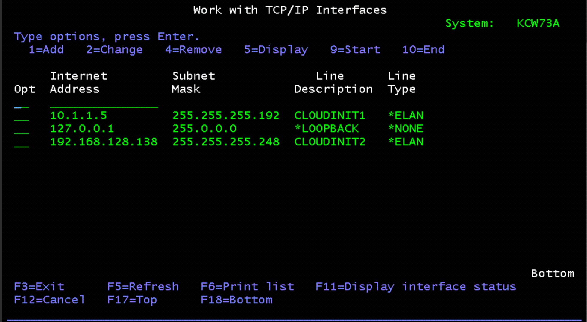
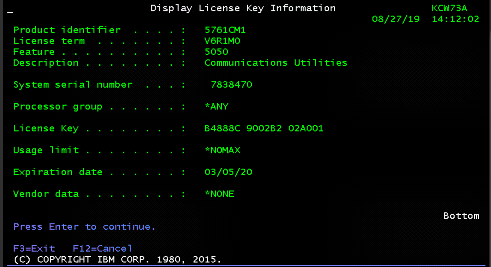
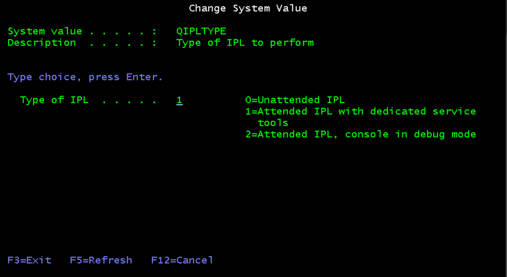

---

copyright:
  years: 2019, 2020

lastupdated: "2020-03-24"

keywords: license keys, system service tools, dedicated service tools, network configuration, ibm i, ssh tunneling

subcollection: power-iaas

---

{:new_window: target="_blank"}
{:shortdesc: .shortdesc}
{:screen: .screen}
{:codeblock: .codeblock}
{:pre: .pre}
{:tip: .tip}
{:note: .note}
{:important: .important}
{:deprecated: .deprecated}
{:external: target="_blank" .external}

# Configuring your IBM i virtual machine (VM)
{: #configuring-ibmi}

Complete the following instructions to configure your IBM i virtual machine (VM).
{: shortdesc}

You can assign up to 127 storage volumes to an IBM i VM.
{: note}

## Tips for working with the IBM i terminal
{: #tips-ibmi}

- The standard IBM i user is `QSECOFR/QSECOFR`.
- IBM i uses function keys extensively. At the bottom of the terminal, you can see **PF1** through **PF12**. To get to **PF13** to **PF24**, click the **Next...** button.
- If you see a red **X** in the terminal during the configuration process, use your keyboard's **CONTROL** button to exit.
- You can use **CONTROL+W** to end a hung session. If this happens, you must perform a bypass by clicking **PF18** and logging on again.
- It's best to first shut down the system before you restart it.
- **Do not restart the system until the `cloud-init` process is finished and you've configured the local IP address**. If you restart the system during the `cloud-init` process, you must call support or delete and reprovision your IBM i VM instance.
- If you are using a Mac computer, the **Page Down** key is the same as **FN + Down Arrow**.
- Use **PF18** to bypass the **Dedicated Service Tools (DST) Sign On** screen if it appears.

## Licenses and configuring your network
{: #license-network}

You must install the following program temporary fixes (PTFs) on your IBM i VM in order for the {{site.data.keyword.cloud}} to inject licenses:

- IBM i 7.2 - 5770SS1 SI71091 (prereqs SLIC PTFs: MF66395, MF66394, MF66391)
- IBM i 7.3 - MF99207 (TR7) and SI69686
- IBM i 7.4 - MF99301 (TR1) and SI70544

If you are bringing your own IBM i custom image, you must install the PTFs previously mentioned and the software that is required for `cloud-init`. For more information, see [Cloud-Init Support for IBM i](https://www.ibm.com/support/pages/node/1166194){: new_window}{: external}.

After you deploy an IBM i VM and install the proper PTFs, you need to accept the license agreements. To accept the license agreements from the console, you must press **5** to display each license agreement. Click **Next...** and **PF15** to show more items. After you accept the license agreements, press **PF3** and wait until `cloud-init` configures your network and injects your license keys.

The `cloud-init` configuration process can take up to 5 minutes. **Do not restart your system** while `cloud-init` is running. If you restart your system during this time, you must call IBM support to manually configure your network and license keys.
{: important}

To verify that `cloud-init` configured your IP addresses correctly, type the `cgftcp` command in the IBM i console window and choose `1`. If the two IP addresses match the internal IP addresses of your VM, the `cloud-init` configuration ran successfully.

{: caption="Figure 1. Verifying the cloud-init configuration" caption-side="bottom"}

If you do not see the external IP address in the **Work with TCP/IP Interfaces** window, wait approximately 10 minutes, open another terminal and ping the external IP address. The external address must match what is shown in the IBM Cloud console within your instance's **Server details** pane. Contact support or delete and reprovision your IBM i VM if the ping doesn't return anything.

Lastly, enter the `DSPLICKEY` command to verify that the `cloud-init` injected the license keys correctly. After you verify your network and license key configuration, you can initial program load (IPL) the LPAR.

{: caption="Figure 2. Using the DSPLICKEY command" caption-side="bottom"}

## Changing the System Service Tools (SST) and Dedicated Service Tools (DST) passwords
{: #sst-dst}

By default, the SST, and DST passwords are expired. Complete the following tasks to get into SST, change your passwords, and configure the newly attached disk. Configuring a newly attached disk is required and be done if other disks are attached.

{: caption="Figure 3. Changing the system value" caption-side="bottom"}

For more information on user ID types, see [Managing service tools user IDs](https://www.ibm.com/support/knowledgecenter/en/ssw_ibm_i_74/rzamh/rzamhmanageuserids.htm){: new_window}{: external}.
{: note}

1. Enter the  `wrksysval qipltype` command and change the value to **1**. The `wrksysval qipltype` command changes the `sysval QIPLTYPE` value.

2. Enter the `pwrdwnsys` command with the `RESTART` parameter to restart the IBM i operating system (OS).

3. At the DST console on restart, enter `QSECOFR/QSECOFR` and change the password.

4. Enter the `wrksysval qipltype` command and change the value to **0**.

5. Reenter the `pwrdwnsys` command with the `RESTART` parameter to restart the IBM i OS again. You can now log in, run `STRSST`, and manage the newly attached disk as the password is manageable.

6. Proceed to [Connecting to an IBM i Cloud virtual machine (VM)](/docs/power-iaas?topic=power-iaas-connect-ibmi) to connect to your IBM i Cloud VM.
