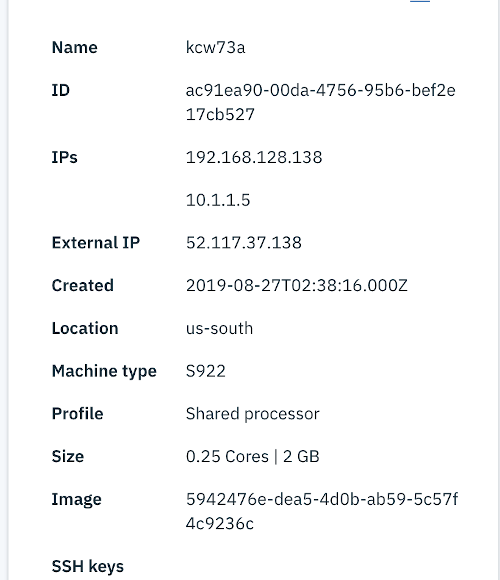
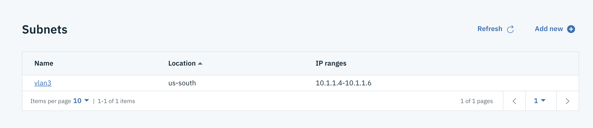

---

copyright:
  years: 2019

lastupdated: "2019-09-06"

keywords: license keys, system service tools, dedicated service tools, network configuration, ibm i, ssh tunneling

subcollection: power-iaas

---

{:shortdesc: .shortdesc}
{:new_window: target="_blank"}
{:codeblock: .codeblock}
{:pre: .pre}
{:screen: .screen}
{:tip: .tip}

# Configuring your IBM i virtual machine (VM)
{: #configuring-ibmi}

## Accepting license keys and configuring your network
{: license-network}

After you deploy an IBM i VM, you need to accept the license agreements. After you accept the license agreements, `cloud-init` configures your network and injects your license keys. The `cloud-init` configuration process can take up to 5 minutes. Do not restart your system while `cloud-init` is running. If you restart your system during this time, you must call IBM support to manually configure your network and license keys.

To verify that `cloud-init` configured your IP addresses correctly, check your VM's attributes. In the following example, you can see three IP addresses. Two of IP addresses are internal and one is external.

{: caption="Figure 1. Verifying your VM IP addresses" caption-side="bottom"}

Under the **Subnet** tab in your dashboard, you can see a single subnet. There is an additional internal IP address that represents the external IP address. Configuration information for the external IP address does not exist when you check the VM. The network forwards traffic from the internal IP address to the external IP address.

{: caption="Figure 2. Checking your VM subnet" caption-side="bottom"}

Next, check to see whether the two internal IP addresses are configured correctly. To do this, enter the `CFGTCP` command and choose option `1`.

{: caption="Figure 3. Using the CFGTCP command]" caption-side="bottom"}

If the two IP addresses match the internal IP addresses of your VM, the `cloud-init` configuration ran successfully.

Lastly, enter the `DSPLICKEY` command to verify that the `cloud-init` injected the license keys correctly. After you verify your network and license key configuration, you can initial program load (IPL) the _lpar_.

{: caption="Figure 4. Using the DSPLICKEY command" caption-side="bottom"}

## Changing the System Service Tools (SST) and Dedicated Service Tools (DST) passwords
{: #sst-dst}

By default, the SST and DST passwords are expired. To change the password, you need to boot into DST by changing the `SYSVAL QIPLTYPE` to **1** and redoing an IPL.

{: caption="Figure 5. Changing the system value" caption-side="bottom"}

When you IPL back up to the operating system (OS), change the `QIPLTYPE` back to **0**.

## Using SSH tunneling to allow ACS to connect over the public IP
{: #ssh-tunneling}

The public IP address blocks most ports. As a result, you need to use SSH tunneling or configure your certificates and use SSL.

1. Start the **SSHD** server on the VM:

    ```shell
    strtcpsvr server(*SSHD)
    ```
    {: pre}

    On a Linux or Mac system, you would run a command similar to the following example:

    ```shell
    ssh -L 50000:localhost:23 -L 2001:localhost:2001 -L 2005:localhost:2005 -L 449:localhost:449 -L 8470:localhost:8470 -L 8471:localhost:8471 -L 8472:localhost:8472 -L 8473:localhost:8473 -L 8474:localhost:8474 -L 8475:localhost:8475 -L 8476:localhost:8476 -o ExitOnForwardFailure=yes -o ServerAliveInterval=15 -o ServerAliveCountMax=3 <myuser>@<myIPaddress>
    ```
    {: pre}

    If the system is denying you permission, you might have to use `sudo` in front of the `ssh` command.
    {: note}

2. To get a 5250 session on your IBM i VM from ACS, you need either to configure your virtual devices or enable _autoconfig_. To enable _autoconfig_, complete the following steps by using the IBM i VM:
    1. Enter the `cfgtcp` command.
    2. Select option **20** (Configure TCP/IP applications).
    3. Select option **11** (configure TELNET).
    4. Select option **10** (autoconfigure virtual devices).
    5. Select `QAUTOVRT` with option **2** (change).
    6. Change the value from **0** to the number of auto-configured consoles you want to be able to connect concurrently.

3. Go to the IBM i VM and start the telnet server for the console:

```shell
strtcpsvr server(*TELNET)
```
{: pre}

For ACS, you need to configure a server for _localhost_. In this example, **port 50000** is forwarding to **port 23**. Go into the 5250 session configuration and change the port from **23** to **50000**.

{: caption="Figure 6. Changing the port number" caption-side="bottom"}

## Configuring a newly attached disk
{: #accessing-volume}

Complete the following tasks to get into **System Service Tools** (SST) and configure the newly attached disk. Configuring a newly attached disk is required.

1. Enter the `wkrsysval qipltype` command and change the value to **1**.
2. Enter the `pwrdwnsys` command to restart the IBM i operating system (OS).
3. At the DST console on restart, enter `QSECOFR/QSECOFR` and change the password.
4. Enter the `wrksysval qipltype` command and change the value to **0**.
5. Reenter the `pwrdwnsys` command to restart the IBM i OS again.

You can now log in, run `STRSST`, and manage the newly attached disk as the password is manageable.
