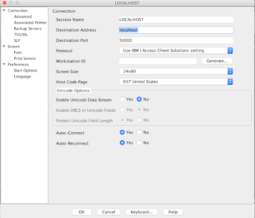

---

copyright:
  years: 2019,2020

lastupdated: "2020-04-13"

keywords: port forwarding, ibm i virtual machine, putty session, tcp servers

subcollection: power-iaas

---

{:new_window: target="_blank"}
{:shortdesc: .shortdesc}
{:screen: .screen}
{:codeblock: .codeblock}
{:pre: .pre}
{:tip: .tip}
{:note: .note}
{:important: .important}
{:deprecated: .deprecated}
{:external: target="_blank" .external}

# Connecting to an IBM i virtual machine (VM)
{: #connect-ibmi}

Learn how to connect to an IBM i VM after configuring your system. Make sure to review [Configuring your IBM i virtual machine (VM)](/docs/power-iaas?topic=power-iaas-configuring-ibmi) before connecting to an IBM i VM.
{: shortdesc}

For a complete list of firewall ports that are available for IBM i VMs, see [Network security](/docs/power-iaas?topic=power-iaas-network-security). If you plan on ordering [Direct Link Connect on Classic](/docs/power-iaas?topic=power-iaas-ordering-direct-link-connect) or already have it, port forwarding is not needed.
{: important}

## Installing and configuring IBM i Access Client Solutions (ACS)
{: installing-acs}

Before you begin, see [Install IBM i Access Client Solutions](https://www.ibm.com/support/pages/ibm-i-access-client-solutions){: new_window}{: external}.

## Using SSH tunneling to allow ACS to connect over the public IP
{: #ssh-tunneling}

The public IP address blocks most ports. As a result, you need to use SSH tunneling or configure your certificates and use SSL to allow ACS to connect over public IP.

Before you use an SSH tunnel, you must create a user profile with `USRCLS(*SECOFR)` specified or enable the `QSECOFR` user profile. To enable the `QSECOFR` user profile, edit the `/QOpenSys/QIBM/ProdData/SC1/OpenSSH/etc/sshd_config` configuration file, and uncomment `PermitRootLogin yes`.
 
After the `QSECOFR` user profile is enabled, start the SSHD server on the VM:

```
strtcpsvr server(*SSHD)
```
{: pre}

On a Linux&reg; or Mac system, you would run a command similar to the following example:

```
ssh -L 50000:localhost:23 -L 2001:localhost:2001 -L 2005:localhost:2005 -L 449:localhost:449 -L 8470:localhost:8470 -L 8471:localhost:8471 -L 8472:localhost:8472 -L 8473:localhost:8473 -L 8474:localhost:8474 -L 8475:localhost:8475 -L 8476:localhost:8476 -o ExitOnForwardFailure=yes -o ServerAliveInterval=15 -o ServerAliveCountMax=3 <myuser>@<myIPaddress>
```
{: pre}

You might have to type  `sudo` in front of the `ssh` command if the system denies you permission.
{: note}

If you are on a Windows&reg; system, continue with [Setting up and configuring PuTTY on a Windows system](#configure-putty), otherwise see [Starting TCP servers](#start-tcp-servers).

## Setting up and configuring PuTTY on a Windows system
{: #configure-putty}

1. Install [PuTTY](https://www.putty.org/){: new_window}{: external} onto your system. PuTTY is used for the SSH tunnel on a Windows system.

2. Enter your system's **IP address** and select **SSH** as the **Connection type**.

3. Enter **22** as the port number.

    {: caption="Figure 1. Creating a PuTTY session" caption-side="bottom"}

4. Select **Tunnels** under the **Connection** category.

5. Add your **Source port** number and **Destination**. In this example, the user chose 50000 as the source port number.

    Do not change the source port numbers. When telnetting, avoid making the source port the same as the destination.
    {: tip}

    {: caption="Figure 2. Basic options for your PuTTY session" caption-side="bottom"}

6. Click **Add** to add your source port to the forwarded port list.

    You need to add all of the following ports: 23, 449, 8470, 8471, 8472, 8473, 8474, 8475 and 8476.
    {: important}

    {: caption="Figure 3. Options controlling SSH port forwarding" caption-side="bottom"}

7. After you add all of the necessary port numbers, check your populated list.

    {: caption="Figure 2. Forwarded port list" caption-side="bottom"}

8. Click back on the **Session** category and give your session a name under **Saved Sessions**. Click **Save**.

    {: caption="Figure 3. Saving your session" caption-side="bottom"}

9. Your saved session appears after you click **Save**. Load your session and click **Open** to start a PuTTY session to your system.

    {: caption="Figure 4. Seeing your list of saved sessions" caption-side="bottom"}

10. You are prompted to accept a key on first use, and then presented with a log-in prompt. Use your IBM i session profile and password.

11. Configure you ACS client or **IBM i Access for Windows Client** to use the SSH tunnel. In both clients, you must select **Configure** from the **Communications** menu.

    {: caption="Figure 5. ACS communications menu" caption-side="bottom"}

    {: caption="Figure 6. PC5250 communications menu" caption-side="bottom"}

12. Change the IP address to *127.0.0.1* on **port 23**.

    {: caption="Figure 7. ACS connections" caption-side="bottom"}

    {: caption="Figure 8. Configuring PC5250" caption-side="bottom"}

13. Press **OK** to save the changes. The client restarts and connects.

## Starting the TCP servers
{: #start-tcp-servers}

Start the required TCP servers on your IBM i operating system by performing the following tasks:

1. To allow SSH connections, enter the following command:

    ```
    strtcpsvr server(*SSHD)
    ```
    {: pre}

2. To start the IBM Navigator for i (iNav) and Digital Certificate Manager (DCM) GUIs, enter the following command:

    ```
    strtcpsvr server(*HTTP) httpsvr(*ADMIN)

    ```
    {: pre}

3. To get a 5250 console from ACS, start Telnet:

    ```
    strtcpsvr server(*TELNET)
    ```
    {: pre}

## Starting a 5250 session on your IBM i VM from ACS
{: #starting-session}

To get a 5250 session on your IBM i VM from ACS, you need to either configure
your virtual devices or enable _autoconfig_. To enable _autoconfig_, complete the following steps by using the IBM i VM:

 1. Enter the `cfgtcp` command.

 2. Select option **20** (Configure TCP/IP applications).

 3. Select option **11** (Configure TELNET).

 4. Select option **10** (Autoconfigure virtual devices).

 5. Select `QAUTOVRT` with option **2** (Change).

 6. Change the value from **0** to the number of auto-configured consoles you want to be able to connect concurrently.

 7. Go to the IBM i VM and start the telnet server for the console:

    ```
    strtcpsvr server(*TELNET)
    ```
    {: pre}

After you complete these steps, you can get to a console from ACS. Additionally, you can get to _iNav/DM_ by pointing your browser to the following address:

```
https://127.0.0.1:2005/ibm/console/login.do?action=secure
```
{: pre}

To enable ICC to use an SSL connection to IBM Cloud Object Storage (COS), which IBM COS requires, see [Configuring Cloud Storage Solutions file transfer encryption](https://www.ibm.com/support/knowledgecenter/en/ssw_ibm_i_72/icc/topics/iccutsk_config_ssl.htm){: new_window}{: external}.

### Configuring ACS
{: #configuring-acs}

After starting ACS, create a system configuration (*sysconfig*).

1. Configure a server for *localhost*. In this example, **port 50000** is forwarding to **port 23**. Go into the 5250 session configuration and change the port from **23** to **50000**.

    {: caption="Figure 9. Changing the port number" caption-side="bottom"}

2. Return to the IBM i terminal and enter your credentials, including *System*, *User*, and *Password*.
