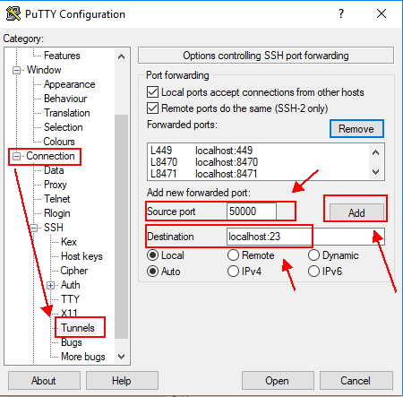
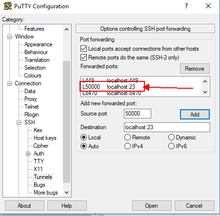
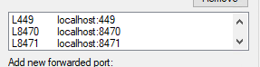
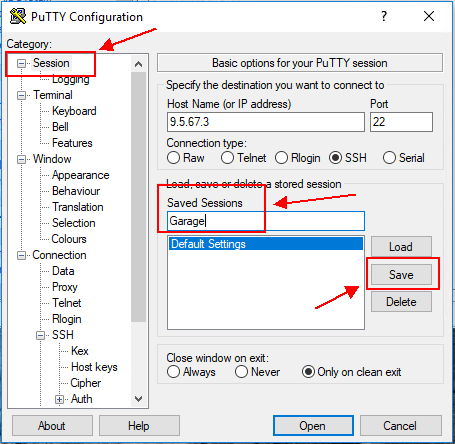
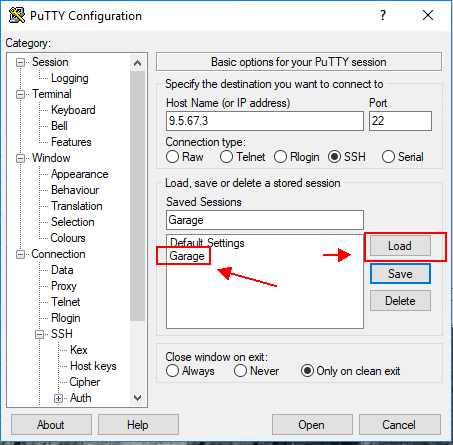
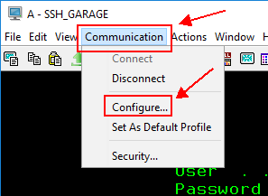
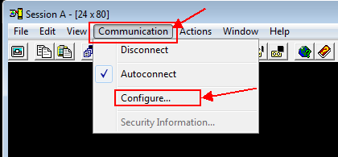
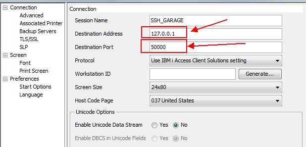
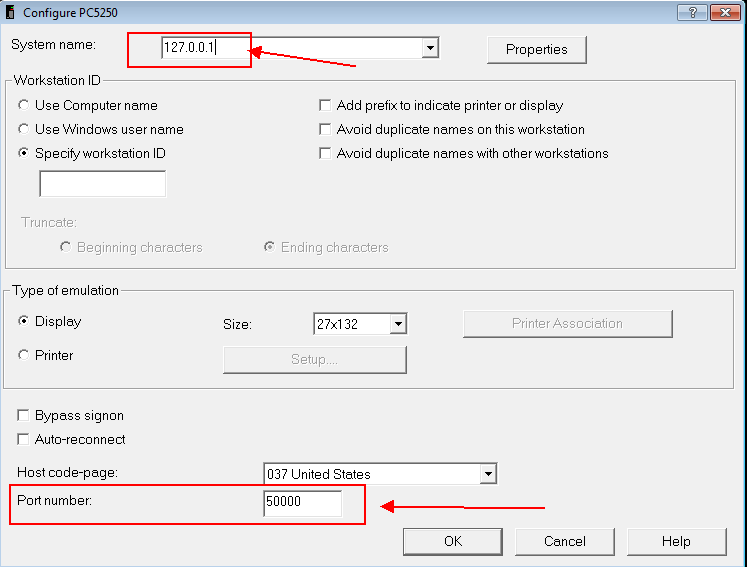

---

copyright:
  years: 2019

lastupdated: "2019-09-26"

keywords: port forwarding, IBM i virtual machine, PuTTY session, TCP servers

subcollection: power-iaas

---

{:shortdesc: .shortdesc}
{:new_window: target="_blank"}
{:codeblock: .codeblock}
{:pre: .pre}
{:screen: .screen}
{:tip: .tip}
{:important: .important}

# Connecting to an IBM i Cloud virtual machine (VM) by using port forwarding
{: #connect-ibmi}

Review all of the following information to connect to your IBM i Cloud VM by using the ACS client. To forward the various IBM i ports, enter the following command on a Linux-based system as a `root` user:
{: shortdesc}

```shell
sudo ssh -L 50000:localhost:23 -L 2001:localhost:2001 -L 2005:localhost:2005 -L 449:localhost:449 -L 8470:localhost:8470 -L 8471:loaclhost:8471 -L 8472:localhost:8472 -L 8473:localhost:8473 -L "8474:localhost :8474" -L 8475:localhost:8475 -L 8476:localhost:8476 -o ExitOnForwardFailure=yes -o ServerAliveInterval=15 -o ServerAliveCountMax=3 @
```
{: pre}

## Setting up and configuring PuTTY on a Windows system
{: #configure-putty}

1. Install [PuTTY ](https://www.putty.org/){: new_window} onto your system. PuTTY is used for the SSH tunnel on a Windows&reg; system.
2. Enter your system's **IP address** and select **SSH** as the **Connection type**.
3. Enter **22** as the port number.

    {: caption="Figure 1. Creating a PuTTY session" caption-side="bottom}

4. Select **Tunnels** under the **Connection** category.
5. Add your **Source port** number and **Destination**. In this example, the user chose 50000 as the source port number.

    Do not change the source port numbers. It is good practice for Telnet not to make the source port the same as the destination.
    {: tip}

    {: caption="Figure 2. Basic options for your PuTTY session" caption-side="bottom"}

6. Click **Add** to add your source port to the forwarded port list.

    You need to add all of the following ports: 23, 449, 8470, 8471, 8472, 8473, 8474, 8475 and 8476.
    {: important}

    {: caption="Figure 3. Options controlling SSH port forwarding" caption-side="bottom"}

7. After you add all of the necessary port numbers, check your populated list.

    {: caption="Figure 2. Forwarded port list" caption-side="bottom"}

8. Click back on the **Session** category and give your session a name under **Saved Sessions**. Click **Save**.

    {: caption="Figure 3. Saving your session" caption-side="bottom"}

9. Your saved session appears after you click **Save**. Load your session and click **Open** to start a PuTTY session to your system.

    {: caption="Figure 4. Seeing your list of saved sessions" caption-side="bottom"}

10. You are prompted to accept a key on first use, and then presented with a log-in prompt. Use your IBM i session profile and password.
11. Configure you ACS client or **IBM i Access for Windows Client** to use the SSH tunnel. In both clients, you must select **Configure** from the **Communications** menu.

    {: caption="Figure 5. ACS communications menu" caption-side="bottom"}

    {: caption="Figure 6. PC5250 communications menu" caption-side="bottom"}

12. Change the IP address to 127.0.0.1 on port 23.

    {: caption="Figure 7. ACS connections" caption-side="bottom"}

    {: caption="Figure 8. Configuring PC5250" caption-side="bottom"}

13. Press **OK** to save the changes. The client restarts and connects.

## Starting the TCP servers
{: #start-tcp-servers}

Start the required TCP servers on your IBM i operating system by performing the following tasks:

1. To allow SSH connections, enter the following command:

    ```shell
    strtcpsvr server(*SSHD)
    ```
    {: pre}

2. To start the IBM i Navigator for i (iNav) and Digital Certificate Manager (DCM) GUIs, enter the following command:

    ```shell
    strtcpsvr server(HTTP) HTTPSVR(ADMIN)

    ```
    {: pre}

3. To get a 5250 console from ACS, start Telnet:

    ```shell
    strtcpsvr server(*TELNET)
    ```
    {: pre}

## Starting a 5250 session on your IBM i VM from ACS
{: #starting-session}

To get a 5250 session on your IBM i VM from ACS, you need to either configure
your virtual devices or enable _autoconfig_. To enable _autoconfig_, complete the following steps by using the IBM i VM:

 1. Enter the `cfgtcp` command.
 2. Select option **20** (Configure TCP/IP applications).
 3. Select option **11** (configure TELNET).
 4. Select option **10** (autoconfigure virtual devices).
 5. Select `QAUTOVRT` with option **2** (change).
 6. Change the value from **0** to the number of auto-configured consoles you want to be able to connect concurrently.

After you complete these steps, you can get to a console from ACS. Additionally, you can get to _iNav/DM_ by pointing your browser to the following address:

```shell
https://127.0.0.1:2005/ibm/console/login.do?action=secure
```
{: pre}

To enable ICC to use an SSL connection to IBM Cloud Object Storage (which IBM COS requires), see [Configuring Cloud Storage Solutions file transfer encryption ](https://www.ibm.com/support/knowledgecenter/en/ssw_ibm_i_72/icc/topics/iccutsk_config_ssl.htm){: new_window}.
