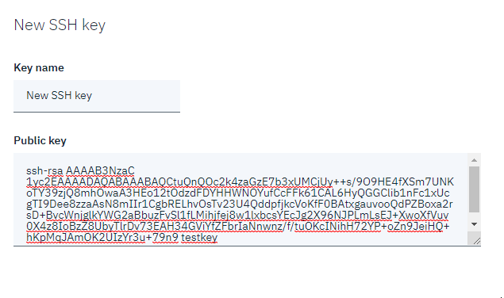
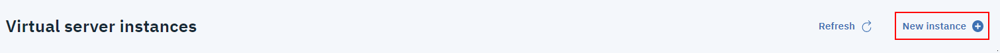
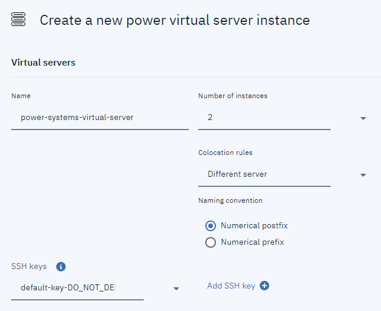

---

copyright:
  years: 2019

lastupdated: "2019-08-13"

---

{:shortdesc: .shortdesc}
{:new_window: target="_blank"}
{:codeblock: .codeblock}
{:pre: .pre}
{:screen: .screen}
{:tip: .tip}
{:important: .important}

# Creating a new AIX VM with SSH keys for root login
{: #create-vm}

You can set up one or more SSH keys for root login when you create new AIX virtual machines (VM) on an IBM Cloud instance. The keys are loaded into the root's **authorized_keys** file. SSH keys allow you to securely log in to a VM. You must use the available operating system options to create SSH keys. To generate SSH keys on a Linux&reg; or Mac OS system, for example, you can use the standard `ssh-keygen` tool.
{: shortdesc}

## Generating an SSH key
{: #ssh-setup}

In this example, the user created a public key on a Linux-based IBM Cloud compute instance by using the `ssh-keygen` tool:

```bash
cat .ssh/id_rsa.pub
ssh-rsa AAAAB3NzaC1yc2EAAAADAQABAAABAQCtuQnQOc2k4zaGzE7b3xUMCjUy++s/9O9HE4fXSm7UNKoTY39zjQ8mhOwaA3HEo12tOdzdFDYHHWNOYufCcFFk61CAL6HyQGGClib1nFc1xUcgTI9Dee8zzaAsN8mIIr1CgbRELhvOsTv23U4QddpfjkcVoKfF0BAtxgauvooQdPZBoxa2rsD+BvcWnjglkYWG2aBbuzFvSl1fLMihjfej8w1lxbcsYEcJg2X96NJPLmLsEJ+XwoXfVuv0X4z8IoBzZ8UbyTlrDv73EAH34GViYfZFbrIaNnwnz/f/tuOKcINihH72YP+oZn9JeiHQ+hKpMqJAmOK2UIzYr3u+79n9 testkey

```

To use an SSH key with a VM-create operation, you must first add the public key to the cloud instance by using the [`ibmcloud pi key-create`](/docs/power-iaas-cli-plugin?topic=power-iaas-cli-plugin-power-iaas-cli-reference#ibmcloud-pi-key-create) command. To add the `ssh-keygen`-generated public key, enter the following command (replacing the public key value with your own):

```bash
ibmcloud pi key-create testkey --key ssh-rsa AAAAB3NzaC
1yc2EAAAADAQABAAABAQCtuQnQOc2k4zaGzE7b3xUMCjUy++s/9O9HE4fXSm7UNKoTY39zjQ8mhOwaA3HEo12tOdzdFDYHHWNOYufCcFFk61CAL6HyQGGClib1nFc1xUcgTI9Dee8zzaAsN8mIIr1CgbRELhvOsTv23U4QddpfjkcVoKfF0BAtxgauvooQdPZBoxa2rsD+BvcWnjglkYWG2aBbuzFvSl1fLMihjfej8w1lxbcsYEcJg2X96NJPLmLsEJ+XwoXfVuv0X4z8IoBzZ8UbyTlrDv73EAH34GViYfZFbrIaNnwnz/f/tuOKcINihH72YP+oZn9JeiHQ+hKpMqJAmOK2UIzYr3u+79n9 testkey
SSHKey created: testkey
```

To confirm that the key was successfully added, use the [ibmcloud pi key](/docs/power-iaas-cli-plugin?topic=power-iaas-cli-plugin-power-iaas-cli-reference#ibmcloud-pi-keys) command.

```bash
ibmcloud pi key testkey
Name      Key                                          CreationDate
testkey   ssh-rsa AAAAB3NzaC1y...UIzYr3u+79n9 testkey  2019-07-26T18:21:56.030Z
```

## Creating an AIX VM instance
{: #create-ssh-key}

You can create an AIX VM instance with a configured SSH key by using the IBM Cloud CLI or the console. When using an AIX stock image as your boot volume, the root password is not set. You must connect to the AIX VM and set the root password for the system. Without completing this step, SSH login as 'root' appears as being _disabled_. If you have public network access to the AIX VM, you can use telnet from an on-premises system and set the root password. For more information on working with the AIX operating system, see [IBM AIX V7.2 documentation](https://www.ibm.com/support/knowledgecenter/en/ssw_aix_72/navigation/welcome.html).

### Using the IBM Cloud CLI to create an AIX VM with a configured SSH key
{: #create-vm-cli}

You can create a new VM with the public key by using the following command (replacing the options with your own):

```bash
ibmcloud pi instance-create keytest-vm --image AIX-7200-03-03 --memory 5 --networks "cloud.ibm.com" --processors 1 --processor-type shared --key-name testkey
```

In this example, the `ibmcloud pi instance-create` command created a new AIX VM with an IP address of _172.16.7.16_. You can now SSH to the AIX VM from a connected system, which is configured with the private key for `testkey`.

  ```shell
  ssh root@172.16.7.16
  Enter passphrase for key '/home/keytest/.ssh/id_rsa':
  Last login: Fri Jul 26 16:53:22 CDT 2019 on ssh from 10.150.0.11
  *******************************************************************************
  *                                                                             *
  *                                                                             *
  *  Welcome to AIX Version 7.2!                                                *
  *                                                                             *
  *                                                                             *
  *  Please see the README file in /usr/lpp/bos for information pertinent to    *
  *  this release of the AIX Operating System.                                  *
  *                                                                             *
  *                                                                             *
  *******************************************************************************
  # oslevel -s
  7200-03-03-1914
  #
  ```
  {: screen}

You can find the `testkey` value in the **authorized_keys** file:

```shell
cat .ssh/authorized_keys
ssh-rsa AAAAB3NzaC1yc2EAAAADAQABAAABAQCtuQnQOc2k4zaGzE7b3xUMCjUy++s/9O9HE4fXSm7UNKoTY39zjQ8mhOwaA3HEo12tOdzdFDYHHWNOYufCcFFk61CAL6HyQGGClib1nFc1xUcgTI9Dee8zzaAsN8mIIr1CgbRELhvOsTv23U4QddpfjkcVoKfF0BAtxgauvooQdPZBoxa2rsD+BvcWnjglkYWG2aBbuzFvSl1fLMihjfej8w1lxbcsYEcJg2X96NJPLmLsEJ+XwoXfVuv0X4z8IoBzZ8UbyTlrDv73EAH34GViYfZFbrIaNnwnz/f/tuOKcINihH72YP+oZn9JeiHQ+hKpMqJAmOK2UIzYr3u+79n9 testkey
```
### Using the IBM Cloud console to create an AIX VM with a configured SSH key
{: #console-add-ssh}

You must [generate a public SSH key](#ssh-setup) before you can create an AIX VM with a configured SSH key.

1. Navigate to your console's device menu. For more information, see [Navigating to devices](/docs/infrastructure/ssh-keys?topic=virtual-servers-navigating-devices).
2. Ensure that you have the proper account permissions and device access. Only the account owner, or a user with the **Manage Users** classic infrastructure permission, can adjust the permissions. For more information, see [Classic infrastructure permissions](/docs/iam?topic=iam-infrapermission#infrapermission) and [Managing device access](/docs/vsi?topic=virtual-servers-managing-device-access).

3. Click **{{site.data.keyword.powerSys_notm}}** under the **Resource List**.
4. Select the **SSH keys** tab and click **New key**.

  {: caption="Figure 1. SSH key navigation" caption-side="bottom"}

1. Enter a **Key name** and your previously generated **Public key**.

  {: caption="Figure 2. Adding your SSH Key" caption-side="bottom"}

1. Click **Create** to add the SSH key.

1. From the **Resource List**, select your service under **Services** to go to the **Manage** pane.

    {: caption="Figure 3. IBM Cloud Resource List" caption-side="bottom"}

1. From here, click **Provision new**.

    {: caption="Figure 4. Provisioning a new virtual server" caption-side="bottom"}

1. Under the **Virtual servers** section, select your generated SSH key. Complete the rest of the fields to successfully create a new instance with a configured SSH key.

      {: caption="Figure 5. Creating a new power virtual server instance" caption-side="bottom"}
