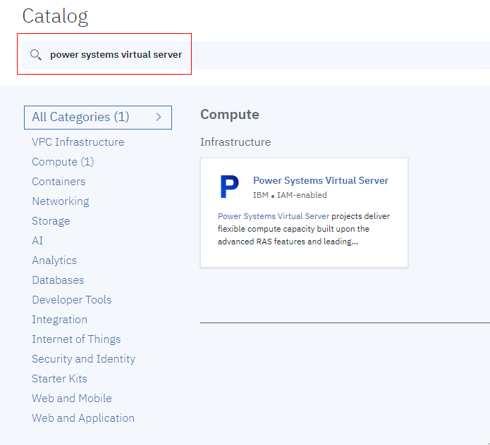
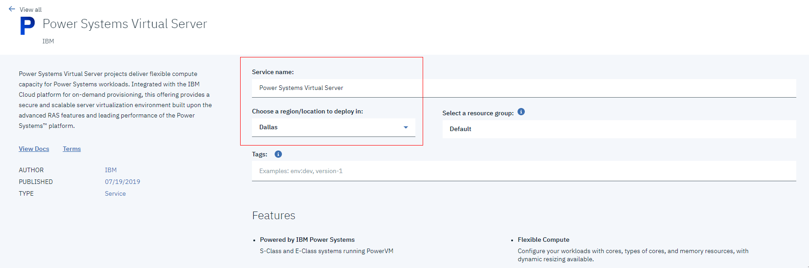
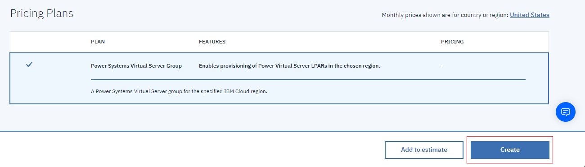

---

copyright:
  years: 2019, 2020

lastupdated: "2020-02-06"

keywords: getting started, power systems virtual server, configure instance
subcollection: power-iaas

---

{:new_window: target="_blank"}
{:shortdesc: .shortdesc}
{:screen: .screen}
{:codeblock: .codeblock}
{:pre: .pre}
{:tip: .tip}
{:note: .note}
{:important: .important}
{:deprecated: .deprecated}
{:external: target="_blank" .external}
{:help: data-hd-content-type='help'}
{:support: data-reuse='support'}

# Creating a Power Systems Virtual Server
{: #creating-power-virtual-server}
{: help}
{: support}

To create and configure a {{site.data.keyword.powerSysFull}}, complete the following steps:
{: shortdesc}

## Creating a Power Systems Virtual Server service
{: #creating-service}

1. Log in to the [IBM Cloud catalog ](https://cloud.ibm.com/catalog){: new_window} with your IBM Cloud account credentials.

2. In the catalog's search box, type **Power Systems Virtual Server** and click the {{site.data.keyword.powerSys_notm}} tile.

    {: caption="Figure 1. The IBM Cloud catalog" caption-side="bottom"}

3. Give your service a name and choose where you'd like to deploy your {{site.data.keyword.powerSys_notm}} instance.

    {: caption="Figure 2. Selecting a service and region" caption-side="bottom"}

    When you select a region for your service, **Dallas, Texas** uses the *DAL13* data center, **Washington, D.C.** uses the *WDC04* data center, and **Frankfurt, Germany** uses the *FRA04* data center.
    {: note}

4. Click **Create**.

    {: caption="Figure 3. Creating a Power Systems Virtual Server service" caption-side="bottom"}

5. After you click **Create**, you are redirected to your **Resource List**.

6. From the **Resource List**, select your service under **Services**.

    {: caption="Figure 4. The IBM Cloud Resource List" caption-side="bottom"}

7. Click **New instance** under the **Virtual server instances** tab.

## Configuring a Power Systems Virtual Server instance
{: #configuring-instance}

To begin, complete all of the fields under the **Virtual servers** section. If you select more than one instance, you are presented with additional options.

  The total due per month is dynamically updated in the **Order Summary** based on your selections. You can easily create a cost-effective {{site.data.keyword.powerSys_notm}} instance that satisfies your business needs.
  {: tip}

  {: caption="Figure 6. Creating a Power Systems Virtual Server instance" caption-side="bottom"}

1. Select your **Machine type**, the number of **Cores**, the amount of **Memory (GB)** and whether you'd like a **Dedicated processor** or a **Shared processor**.

    {: caption="Figure 7. Selecting your processor and system" caption-side="bottom"}

2. Complete the **Boot volume** and **Attached volumes** fields as instructed by your organization. When you select **Boot image**, the IBM Cloud console allows you to select from a group of stock images or the list of images in your catalog. You must select a storage type for stock images. Currently, you cannot mix **Tier 1** and **Tier 3** storage types in the **eu-de (FRA04)** region. To see your boot images, go to **Boot images** after you provision the instance.

    When using an AIX stock image as the boot volume, a console session is required for the initial setting of the root user password. Without completing this step, SSH login appears as being _disabled_. For more information, see [How to create a new AIX VM with SSH keys for root login](/docs/infrastructure/power-iaas?topic=power-iaas-create-vm).
    {: important}

    {: caption="Figure 8. Defining your volumes" caption-side="bottom"}

3. Finally, define your **Network interfaces** by adding a public network, private network, or both. When adding an existing private network, you can choose a specific IP address or have one auto-assigned.

    For an AIX VM, network interface controllers (NICs) are assigned based on the order in which you specify them during creation. To display information about all of the network interfaces after provisioning, open the AIX console and type `ifconfig -a`.
    {: important}

    {: caption="Figure 8. Defining your network interfaces" caption-side="bottom"}

4. Accept the **Terms of Use** and click **Create** to provision a new {{site.data.keyword.powerSys_notm}}.

For more information on what each {site.data.keyword.powerSys_notm}} instance field means, refer to the following table:

<table>
<caption>Table 1. Power Virtual Server instance fields</caption>
<tr>
<th>Field</th>
<th>Description</th>
</tr>
<tr>
<td>Number of Instances</td>
<td>Specify the number of instances that you want to create for the {{site.data.keyword.powerSys_notm}}. If you specify more than one instance, you can select the following naming conventions and colocation rules:
  <dl>
    <dt><strong>No preference</strong></dt>
  <dd>Select this option if you do not have a hosting preference.</dd>
    <dt><strong>Different  Server</strong></dt>
  <dd>Select this option to host each instance on a different server. You can use this option if you are concerned about a single-server outage that might affect all {{site.data.keyword.powerSys_notm}} instances.</dd>
  <dt><strong>Numerical Prefix</strong></dt>
  <dd>Select this option to add numbers before the name of the virtual server. If, for example, the first {{site.data.keyword.powerSys_notm}} name is <i>Austin</i> the next name for the virtual instance is <i>1Austin</i>.</dd>
  <dt><strong>Numerical Postfix</strong></dt>
  <dd>Select this option to add numbers after the name of the virtual server. If, for example, the first {{site.data.keyword.powerSys_notm}} name is <i>Rochester</i> the next name for the virtual instance is <i>Rochester1</i>.</dd>
  </dl>
  

  <strong>Note:</strong> When you create multiple instances of the virtual server, you must select <strong>On</strong> from the <strong>Shareable</strong> field for each data volume that you add. If you do not want the data volume to be shareable, you can add the data volume after you create the virtual server.
  

   </td>
</tr>
<tr>
<!-- <td>PIN virtual server</td>
<td>Select <strong>On</strong> to lock the {{site.data.keyword.powerSys_notm}} onto a host system. If you select <strong>On</strong>, the virtual server cannot be moved to a different host. For example, by selecting <strong>On</strong> you would experience an outage during host maintenance.</td>
</tr> -->
<tr>
<td>Machine type</td>
<td>Specify the machine type. The machine type that you select determines the number of cores and memory that is available. For more information about hardware specifications, see <a href="https://www.ibm.com/downloads/cas/KQ4BOJ3N" target="_blank">S922</a>, <a href="https://www.ibm.com/downloads/cas/EE476WAP" target="_blank">E880</a>, and <a href="http://www-01.ibm.com/support/docview.wss?uid=ssm1platformaix9080-M9S-vios-only" target="_blank">E980 (Frankfurt only).</td>
</tr>
<tr>
<td>Cores</td>
<td>Select the number of cores for the {{site.data.keyword.powerSys_notm}}. If you select <strong>Shared processor</strong>, you can specify the number of cores by 0.25 increments. For example, valid core values are 0.5, 1.25, and 2.75. A virtual CPU (vCPU) is allocated for every 0.25 entitlement.
</td>
</tr>
<tr>
<td>Memory</td>
<td>Select the amount of memory for the {{site.data.keyword.powerSys_notm}}. The amount of memory that you can select depends on the number of cores you selected. You can allocate up to 64 GB for each core that you select. For example, selecting four cores allows you to select up to 256 GB of memory.</td>
</tr>
<tr>
<td>Boot image</td>
<td>Select a version of the IBM-provided AIX or IBM i operating system stock image. If you want to use your own AIX or IBM i custom image, it must be at a supported technology level. For more information, see <a href="/docs/infrastructure/power-iaas?topic=power-iaas-deploy-custom-image">Deploying a custom image within a Power Systems Virtual Server</a>.

<strong>Important</strong>: When you use an AIX stock image as the boot volume, a console session is required for the initial setting of the root user password. Without completing this step, SSH login as 'root' appears as being <i>disabled</i>.

For IBM i system licensing information, see <a href="/docs/infrastructure/power-iaas?topic=power-iaas-ibmi-lpps">IBM i License Program Products (LPP) and Operating System (OS) feature bundles</a>.

</td>
</tr>
<tr>
<td>Attached volumes</td>
<td>You can either create a new data volume or attach an existing one that you've defined in your IBM Cloud account.
<dl>
  <dt><strong>Creating a new data volume</strong></dt>
  <dd>Click <strong>Add</strong> to create a new data volume for your {{site.data.keyword.powerSys_notm}} instance. If you want to allow multiple virtual instances to write data to the same data volume, you must click <strong>On</strong> under <strong>Shareable</strong>. </dd>
  <dt><strong>Attaching an existing data Volume</strong></dt>
  <dd>You can select an existing data volume from the <b>Attached volumes</b> list. If a previously used data volume does not appear, it might exist under a different IBM Cloud account.</dd>
</dl>
</td>
</tr>
<tr>
<td>Public Networks</td>
<td>Select this option to use an IBM-provided public network. There is a cost that is associated with selecting this option. For more information, see <a href="/docs/infrastructure/power-iaas?topic=power-iaas-about-virtual-server#public-private-networks" target="_blank">Public and private networks</a>.
</td>
</tr>
<tr>
<td>Private Networks</td>
<td>Click <strong>Add</strong> to identify a new private network for the virtual server. If you already added a private network, you can select it from the list. For more information, see <a href="/docs/infrastructure/power-iaas?topic=power-iaas-configuring-subnet" target="_blank">Configure private network</a>.</td>
</tr></table>
