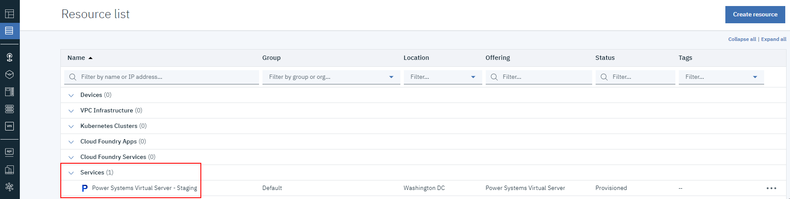
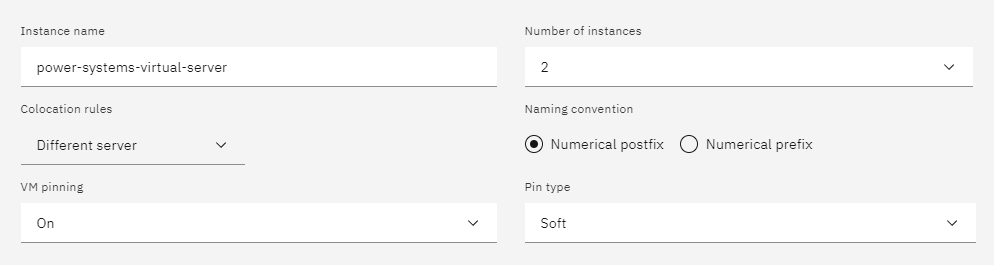
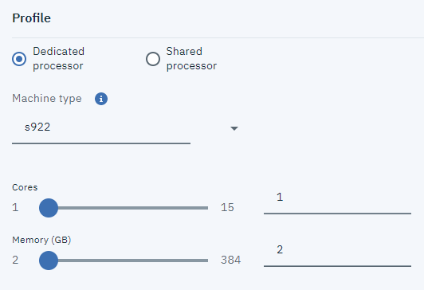
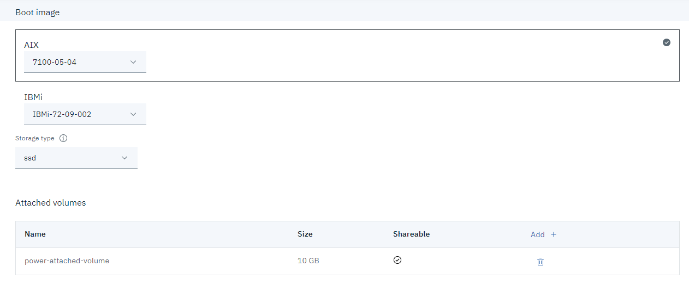
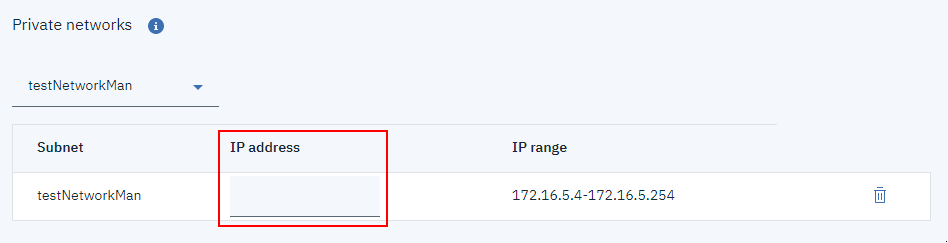

---

copyright:
  years: 2019, 2020

lastupdated: "2020-11-02"

keywords: getting started, power systems virtual server, configure instance, processor, profile, networking

subcollection: power-iaas

---

{:new_window: target="_blank"}
{:shortdesc: .shortdesc}
{:screen: .screen}
{:codeblock: .codeblock}
{:pre: .pre}
{:tip: .tip}
{:note: .note}
{:important: .important}
{:deprecated: .deprecated}
{:external: target="_blank" .external}
{:help: data-hd-content-type='help'}
{:support: data-reuse='support'}

# Creating a Power Systems Virtual Server
{: #creating-power-virtual-server}
{: help}
{: support}

To create and configure an IBM&reg; Power Systems&trade; Virtual Server, complete the following steps.
{: shortdesc}

<!-- If you're creating and configuring a {{site.data.keyword.powerSys_notm}} to support a SAP NetWeaver workload, see [Setting up your Power System Virtual Server and Instances](/docs/sap-netweaver-power?topic=sap-netweaver-power-set-up-power-infrastructure). -->

## Creating a Power Systems Virtual Server service
{: #creating-service}

1. Log in to the [IBM Cloud catalog](https://cloud.ibm.com/catalog){: new_window}{: external} with your IBM Cloud account credentials.

2. In the catalog's search box, type **Power Systems Virtual Server** and click the {{site.data.keyword.powerSys_notm}} tile.

3. Specify a name for your service and choose where you'd like to deploy your {{site.data.keyword.powerSys_notm}} instance. See the following table to select the appropriate location for your service.

    <table>
      <caption>
        Table 1. Power Systems Virtual Server data centers
      </caption>
      <tr>
        <th>Location</th>
        <th>Region</th>
        <th>Data center</th>
      </tr>
      <tr>
        <td>Dallas, United States</td>
        <td>us-south</td>
        <td>DAL13</td>
      </tr>
      <tr>
        <td>Dallas 12, United States</td>
        <td>us-south</td>
        <td>DAL12</td>
      </tr>
      <tr>
        <td>Washington, D.C., United States</td>
        <td>us-east</td>
        <td>WDC04</td>
      </tr>
      <tr>
        <td>Toronto 01, Canada</td>
        <td>eu-east</td>
        <td>TOR01</td>
      </tr>
      <tr>
        <td>Frankfurt 01, Germany</td>
        <td>eu-de</td>
        <td>FRA04</td>
      </tr>
      <tr>
        <td>Frankfurt 02, Germany</td>
        <td>eu-de</td>
        <td>FRA05</td>
      </tr>
      <tr>
        <td>London 04, United Kingdom</td>
        <td>eu-gb</td>
        <td>LON04</td>
      </tr>
      <tr>
        <td>London 06, United Kingdom</td>
        <td>eu-gb</td>
        <td>LON06</td>
      </tr>
      <tr>
        <td>Sydney 04, Australia</td>
        <td>au-syd</td>
        <td>SYD04</td>
      </tr>
      <tr>
        <td>Tokyo 04, Japan</td>
        <td>ap-north</td>
        <td>TOK04</td>
      </tr>
    </table>

4. Click **Create**. You are redirected to the **Resource List**.

5. From the **Resource List**, select your {{site.data.keyword.powerSys_notm}} service under **Services**.

    {: caption="Figure 1. The IBM Cloud Resource List" caption-side="bottom"}

6. Click **Create instance** under **Virtual server instances**.

## Configuring a Power Systems Virtual Server instance
{: #configuring-instance}

To begin, complete all of the fields under the **Virtual servers** section. If you select more than one instance, you are presented with additional options.

  The total due per month is dynamically updated in the **Order Summary** based on your selections. You can easily create a cost-effective Power Systems Virtual Server instance that satisfies your business needs.
  {: tip}

  {: caption="Figure 2. Creating a Power Systems Virtual Server instance" caption-side="bottom"}

1. Choose an existing SSH key or create one to securely connect to your {{site.data.keyword.powerSys_notm}}.

2. Complete the **Boot image** fields as instructed by your organization. When you select **Boot image**, the {{site.data.keyword.powerSys_notm}} user interface allows you to select boot images from a group of stock images or the list of stock images in your catalog. You must select a storage type for stock images. Currently, you cannot mix **Tier 1** and **Tier 3** storage types. For more information, see [Storage tiers](/docs/power-iaas?topic=power-iaas-power-iaas-faqs#storage-tiers).

    If you select IBM i as the boot image, the {{site.data.keyword.powerSys_notm}} user interface provides you an option to include the following licenses to your VM instance: *IBM i Cloud Storage Solution*, *IBM i Power HA*, *IBM Db2 Web Query for i*, and *Rational Dev Studio for IBM i*. Adding a license increases the service cost. The selected licenses are injected to your VM instance. You can install specific solutions on your VM instance, and the licenses will be automatically set. If you want to use these licensed programs on your IBM i VM instance, you must order these licenses through {{site.data.keyword.powerSys_notm}}. You cannot use existing licenses in your VM instance.

3. Select your **Machine type**, the number of **Cores**, the amount of **Memory (GB)** and whether you'd like a **Dedicated processor**, **Uncapped shared processor**, or **Capped shared processor**.

    There is a core-to-vCPU ratio of 1:1. For shared processors, fractional cores round up to the nearest whole number. For example, 1.25 cores equals 2 vCPUs. For more information on processor types, see [What's the difference between capped and uncapped shared processor performance? How does they compare to dedicated processor performance?](/docs/power-iaas?topic=power-iaas-power-iaas-faqs#processor).
    {: important}

    {: caption="Figure 3. Selecting your processor and system" caption-side="bottom"}

    When using an AIX stock image as the boot volume, a console session is required for the initial setting of the root user password. Without completing this step, SSH login appears as being *disabled*. For more information, see [How to create a new AIX VM with SSH keys for root login](/docs/power-iaas?topic=power-iaas-create-vm).

      <!-- {: caption="Figure 8. Defining your volumes" caption-side="bottom"} -->

4. Finally, define your **Network interfaces** by adding a public network, private network, or both. When adding an existing private network, you can choose a specific IP address or have one auto-assigned.

    For an AIX VM, network interface controllers (NICs) are assigned based on the order in which you specify them during creation. To display information about all of the network interfaces after provisioning, open the AIX console and type `ifconfig -a`.
    {: note}

    <!-- {: caption="Figure 8. Defining your network interfaces" caption-side="bottom"} -->

5. Accept the **Terms of Use** and click **Create instance** to provision a new {{site.data.keyword.powerSys_notm}}. To view your boot images, go to **Boot images** after you provision the instance.

Refer to the following table for more information on each {{site.data.keyword.powerSys_notm}} instance field.

<table>
  <caption>
    Table 2. Power Systems Virtual Server instance fields
  </caption>
  <tr>
    <th>Field</th>
    <th>Description</th>
  </tr>
  <tr>
    <td>Number of Instances</td>
    <td>
      Specify the number of instances that you want to create for the
      {{site.data.keyword.powerSys_notm}}. If you choose the Machine type as E880 or E980, you can choose [anti-affinity policy](/docs/power-iaas?topic=power-iaas-power-iaas-faqs#affinity) with maximum of 2 VM instances. 
       If you specify more than one instance, you can select the following naming conventions and colo rules:
      <dl>
        <dt><strong>No preference</strong></dt>
        <dd>Select this option if you do not have a hosting preference.</dd>
        <dt><strong>Different Server</strong></dt>
        <dd>
          Select this option to host each instance on a different server. You
          can use this option if you are concerned about a single-server outage
          that might affect all {{site.data.keyword.powerSys_notm}} instances.
        </dd>
        <dt><strong>Numerical prefix</strong></dt>
        <dd>
          Select this option to add numbers before the name of the virtual
          server. If, for example, the first {{site.data.keyword.powerSys_notm}}
          name is <em>Austin</em> the next name for the virtual instance is
          <em>1Austin</em>.
        </dd>
        <dt><strong>Numerical postfix</strong></dt>
        <dd>
          Select this option to add numbers after the name of the virtual
          server. If, for example, the first {{site.data.keyword.powerSys_notm}}
          name is <i>Austin</i> the next name for the virtual instance is
          <em>Austin1</em>.
        <dt><strong>VM pinning</strong></dt>
        <dd>
          Select this option to pin your virtual machine. You can choose either a <em>soft</em> or <em>hard</em> pinning policy. <a href="https://cloud.ibm.com/docs/power-iaas?topic=power-iaas-power-iaas-faqs#pinning" target="_blank">Learn more</a>
        </dd>
      </dl>
      

        <strong>Note:</strong> When you create multiple instances of the virtual
        server, you must select <strong>On</strong> from the
        <strong>Shareable</strong> field for each data volume that you add. If
        you do not want the data volume to be shareable, you can add the data
        volume after you create the virtual server.
      

    </td>
  </tr>
  <tr>
  </tr>
  <tr>
    <td>Machine type</td>
    <td>
      Specify the machine type. The machine type that you select determines the
      number of cores and memory that is available. For more information about
      hardware specifications, see <a href="https://www-01.ibm.com/common/ssi/ShowDoc.wss?docURL=/common/ssi/rep_sm/5/872/ENUS9119-_h05/index.html&lang=en" target="_blank">E880 (Dallas and Washington only)</a>,
      <a href="https://www.ibm.com/downloads/cas/KQ4BOJ3N" target="_blank">S922</a>, and
      <a href="http://www-01.ibm.com/support/docview.wss?uid=ssm1platformaix9080-M9S-vios-only" target="_blank">E980 (Data centers other than Dallas and Washington)</a>.
    </td>
  </tr>
  <tr>
    <td>Cores</td>
    <td>
      There is a core-to-vCPU ratio of 1:1. For shared processors, fractional cores round up to the nearest whole number. For example, 1.25 cores equals 2 vCPUs.
    </td>
  </tr>
  <tr>
    <td>Memory</td>
    <td>
      Select the amount of memory for the {{site.data.keyword.powerSys_notm}}.
      If you choose to use more than 64 GBs of memory per core, you are charged
      a higher price. For example, when you choose one core with 128 GBs of
      memory, you are charged the regular price for the first 64 GBs. After the
      first 64 GBs (64 - 128 GBs), you are charged a higher price.
    </td>
  </tr>
  <tr>
    <td>Boot image</td>
    <td>
      Select a version of the IBM-provided AIX or IBM i operating system stock
      image. 
      <a href="/docs/power-iaas?topic=power-iaas-deploy-custom-image"
        >Learn more</a>

        <strong>Important</strong>: When you use an AIX stock image as the boot
        volume, a console session is required for the initial setting of the
        root user password. Without completing this step, SSH login as root
        appears as being <i>disabled</i>.
      

        For IBM i operating system licensing information, see
        <a href="/docs/power-iaas?topic=power-iaas-ibmi-lpps">IBM i License Program Products (LPP) and Operating System (OS) feature bundles</a>.
        

        <!-- You must deploy a maximum of 10 Power Systems Virtual Server VM instances from a single boot image. If you are planning to deploy more than 10 VM instances from the same boot image, you must make multiple copies of a boot image and deploy the VM instances in batches of 10. -->
      

    </td>
  </tr>
  <tr>
    <td>Attached volumes</td>
    <td>
      You can either create a new data volume or attach an existing one that you
      defined in your IBM Cloud account.
      <dl>
        <dt><strong>Creating a new data volume</strong></dt>
        <dd>
          Click <strong>Add</strong> to create a new data volume for your
          {{site.data.keyword.powerSys_notm}} instance. If you want to allow
          multiple virtual instances to write data to the same data volume, you
          must click <strong>On</strong> under <strong>Shareable</strong>.
        </dd>
        <dt><strong>Attaching an existing data Volume</strong></dt>
        <dd>
          You can select an existing data volume from the
          <b>Attached volumes</b> list. If a previously used data volume does
          not appear, it might exist under a different IBM Cloud account.
        </dd>
      </dl>
    </td>
  </tr>
  <tr>
    <td>Public Networks</td>
    <td>
      Select this option to use an IBM-provided public network. There is a cost
      that is associated with selecting this option. 
      <a href="/docs/power-iaas?topic=power-iaas-about-virtual-server#public-private-networks" target="_blank">Learn more</a>
    </td>
  </tr>
  <tr>
    <td>Private Networks</td>
    <td>
      Click <strong>Add</strong> to identify a new private network for the
      virtual server. If you already added a private network, you can select it
      from the list. For more information, see
      <a href="/docs/power-iaas?topic=power-iaas-configuring-subnet" target="_blank">Configure private network</a>.
    </td>
  </tr>
</table>

## Implementing SAP NetWeaver and SAP HANA in the Power Systems Virtual Server environment

If you are creating or configuring a {{site.data.keyword.powerSys_notm}} instance to support an SAP NetWeaver or SAP HANA workload, see [Planning your deployment](https://cloud.ibm.com/docs/sap?topic=sap-power-vs-planning-items) and [Deploying your infrastructure](https://cloud.ibm.com/docs/sap?topic=sap-power-vs-set-up-infrastructure).