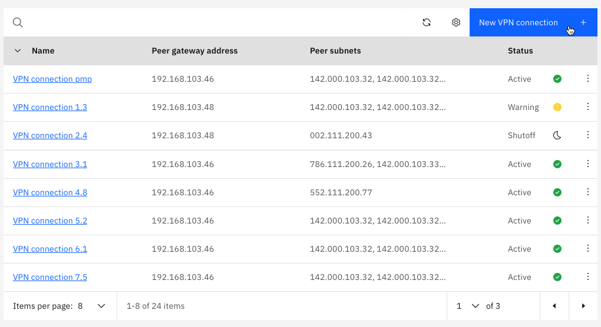
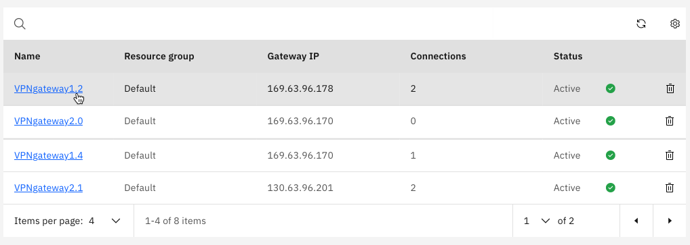

---

copyright:
  years: 2020

lastupdated: "2020-12-11"

keywords: vpn, connections ike, ipsec, internet key exchange, vpn, peer subnet, local subnet, gateway address

subcollection: power-iaas

---

{:new_window: target="_blank"}
{:shortdesc: .shortdesc}
{:screen: .screen}
{:codeblock: .codeblock}
{:pre: .pre}
{:tip: .tip}
{:note: .note}
{:preview: .preview}
{:important: .important}
{:deprecated: .deprecated}
{:external: target="_blank" .external}

# Creating VPN connections
{: #creating-vpn-connections}

VPN connections is a separate service from the Power Systems Virtual Server service. You can use VPN connetions to configure your private network with IBM® Power Systems™ Virtual Server. The VPN coneections creates a seamless connection that allows access to {{site.data.keyword.cloud}} resources from your {{site.data.keyword.powerSys_notm}} instance. {: shortdesc}

Create a VPN connection within the {{site.data.keyword.powerSysShort}} service by following the step-by-stpe procedure described below.

1. Go to **VPN connections** and click **Create connection**.

    {: caption="Figure 1. Creating a new VPN connection" caption-side="bottom"}

2. Under **Create new VPN connection**, complete the following fields:

    To attach a local subnet, you must first go to **Subnet** and create one.
    {: note}

   - **Connection name**: Enter a name for the connection, such as `vpn-connection`.
   - **Peer gateway address**: Specify the IP address of the VPN gateway for the external network.
   - **Preshared key**: Specify the authentication key of the VPN gateway for the external network.

3. Specify the Internet Key Exchange (IKE) and Internet Protocol Security (IPsec) parameters to use for the **phase 1** and **phase 2** negotiation of the connection.

   - Select **Auto** if you want the cloud gateway to try to automatically establish the connection.
   - Select or create custom policies if you need to enforce particular security requirements. Also, select this option if the VPN gateway for the external network doesn't support the security proposals that are tried by auto-negotiation.

    The IKE and IPsec security parameters that you specify for the connection must be the same parameters that are set on the gateway for the network outside your VPC.
    {: important}

4. To configure how the cloud gateway sends messages to check that the peer gateway is active, specify the following information in the **Dead peer detection** section:

   - **Dead peer detection action**: The action to take if a peer gateway stops responding. For example, select **Restart** if you want the gateway to immediately renegotiate the connection.
   - **Timeout**: How long to wait for a response from the peer gateway. By default, a peer gateway is no longer considered active if a response isn't received within 10 seconds.
   - **Interval**: How often to check that the peer gateway is active. By default, messages are sent every 2 seconds. Interval value must be less than the specified timeout value. 

5. Specify one or more **Local subnets** that you want to connect through the VPN tunnel. If you do not have local subnets attached, click **Attach subnet** under **Local subnets** and choose local subnet from the list to attach a subnet.

6. Specify one or more **Peer subnets** in the external network that you want to connect through the VPN tunnel. If you do not have peer subnets attached, click **Attach subnet** under **Peer subnets**  and specify peer subnet IP address.

7. Verify the values that you specified and agree the **Terms and Conditions**.

8. Click **Create** to create new VPN connection.

9. After you create a VPN connection, you can view your VPN connection in the **VPN connections** table. 

10. Click the VPN connection name followed by **Edit details** to edit your existing VPN configuration.

    {: caption="Figure 2. VPN connection details" caption-side="bottom"}

11. Click **delete** icon to delete the VPN connection.

## VPN gateways
{: #vpn-gateways}

To see a list of your VPN gateways, see **VPN gateways**. Here, you can see your VPN gateway's **Resource group**, **Gateway IP**, **Connections**, and **Status**.

{: caption="Figure 3. VPN gateways" caption-side="bottom"}

If you click your VPN gateway, you are taken to its details. The VPN gateway details pane contains more specific information, including its ID, creation date, and location.

{: caption="Figure 4. VPN gateway details" caption-side="bottom"}

## IKE policies
{: #ike-policies}

You can see a list of your IKE policies by going to **IKE policies**. Here, you can add a policy if needed.

{: caption="Figure 5. IKE policies" caption-side="bottom"}

To modify an existing IKE policy, click the policy name followed by **Edit details**. Each IKE policy consists of the following configuration parameters:

- **Name**: IKE policy name
- **IKE version**: *IKEv1* and *IKEv2*
- **Authentication**: `md5`, `sha1`, `sha256`
- **Encryption**: `3des`, `aes128`, `aes256`
- **Diffie-Hellman (DH) group**: 2, 5, 14
- **Key lifetime**: The amount of time your key lasts

{: caption="Figure 6. IKE policy details" caption-side="bottom"}

## IPsec policies
{: #ipsec-gateways}

You can see a list of your IPsec policies by going to **IPsec policies**. Here, you can add a new policy if needed.

    {: caption="Figure 7. IPsec policies" caption-side="bottom"}

To modify an existing IPsec policy, click the policy name followed by **Edit policy**. Each IPsec policy consists of the following configuration parameters:

- **Name**: IPsec policy name
- **PFS**: `On` or `Off`
- **Authentication**: `md5`, `sha1`, `sha256`
- **Encryption**: `3des`, `aes128`, `aes256`
- **Diffie-Hellman (DH) group**: 2, 5, 14
- **Key lifetime**: The amount of time your key lasts

    {: caption="Figure 8. IPsec details" caption-side="bottom"}
