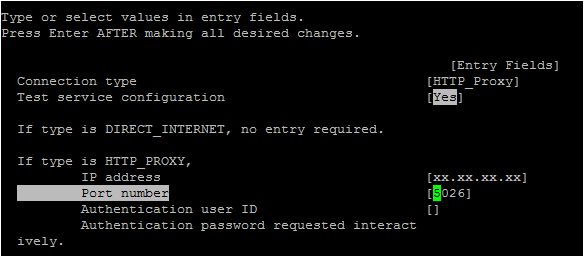
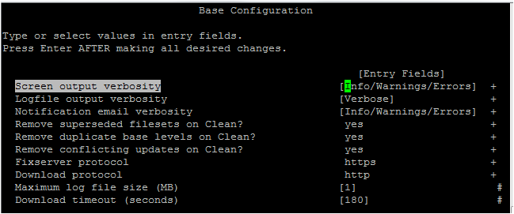

---

copyright:
  years: 2019, 2020

lastupdated: "2020-03-09"

keywords: suma, fixes, updates, PTF, TL, SNDPTFORD, fix central, network intsall server

subcollection: power-iaas

---

{:new_window: target="_blank"}
{:shortdesc: .shortdesc}
{:screen: .screen}
{:codeblock: .codeblock}
{:pre: .pre}
{:tip: .tip}
{:note: .note}
{:important: .important}
{:deprecated: .deprecated}
{:external: target="_blank" .external}
{:help: data-hd-content-type='help'}
{:support: data-reuse='support'}

# Downloading fixes and updates
{: #downloading-fixes-updates}

You must use the AIX service update management assistant (SUMA) or the IBM i `Send PTF Order (SNDPTFORD)` command to download fixes and updates from the IBM Fix Central website.
{: shortdesc}

If you'd like to download fixes and updates, you must perform one of the following:

- Put your virtual machine (VM) on the public network. You can add a public network [during](/docs/power-iaas?topic=power-iaas-creating-power-virtual-server#configuring-instance) or [after](/docs/power-iaas?topic=power-iaas-modifying-server#adding-removing-network) the provisioning stage. Depending on your VM, see the [SUMA tasks and the command line](#suma-tasks-cli) section for information on the `suma` command or the [Using the SNDPTFORD command](#sndptford-command).
- Set up another VM as an AIX [NIM server](/docs/power-iaas?topic=power-iaas-provisioning-nim) or an IBM i [Network installation Server](#ibmi-network-server).
- Set up another public-facing VM with an [HTTP/HTTPS proxy](#configuring-suma).

## Ordering fixes and updates for AIX VMs
{: #downloading-fixes-aix}

Learn more about ordering fixes and updates for AIX VMs using SUMA.

### Understanding SUMA
{: #understanding-suma}
{: help}
{: support}

SUMA sets up an automated interface to download fixes and updates from a fix distribution website to your system. You can configure SUMA to periodically check the availability of specific new fixes and technology levels. With SUMA, you do not have to manually retrieve maintenance updates.

When you configure SUMA in an AIX logical partition (LPAR) or as the NIM master, SUMA establishes a connection to the fix distribution website and downloads the available service update.

To verify that SUMA can get through to the IBM fix servers, run the following command (from the AIX system where you want to download the fixes), `/usr/esa/bin/verifyConnectivity -tw`. If the tests fail, work with your network security team to determine why you are unable to access the servers.

You can access the SUMA configuration by running the [suma command](https://www.ibm.com/support/knowledgecenter/ssw_aix_72/s_commands/suma.html){: new_window}{: external} or by using the `SMIT suma` fast path. When you create a SUMA policy, you must specify a request type that specifies the type of download.

**PTF**<br>
Specifies a request to download a program temporary fix (PTF), such as U813941. Only certain PTFs can be downloaded as an individual file set. This limitation applies to PTFs that contain either the *bos.rte.install* or *bos.alt_disk_install.rte* file sets as well as those that are released in between Service Packs (SP). Otherwise, you must download the technology level (TL) or service pack (SP).

**TL**<br>
Specifies a request to download a specific TL (such as 7200-02).

**SP**<br>
Specifies a request to download a specific SP (such as 7200-02-00).

**Latest**<br>
Specifies a request to download the latest fixes. This value returns the latest service pack or the TL as specified in the **FilterML** attribute.

### Configuring SUMA to use the proxy settings
{: #configuring-aix-proxy}

Before you run the `suma` command to download any updates, ensure that the AIX LPAR is authenticated to access the internet. To verify that the LPAR is connected to the internet, enter the following command:

```
suma -x -a Action=Preview -a RqType=LatestCopy
```
{: codeblock}

The `suma` command allows you to preview only the download operation. When you run this command, files are not downloaded. If the LPAR is not authenticated to access the internet, the command returns the following message:

```
0500-013 Failed to retrieve list from fix server.
```
{: screen}

For information on troubleshooting SUMA error messages, see [Troubleshooting SUMA error messages](https://www.ibm.com/support/knowledgecenter/ssw_aix_72/install/serv_update_mgt.html#serv_update_mgt__section_troubleshoot_suma){: new_window}{: external}.

Complete the following steps to configure SUMA to use the proxy settings:

1. Ensure that the *bos.ecc_client.rte* file set is installed on the AIX LPAR by running the following command, `lslpp -h bos.ecc_client.rte`.

2. Ensure that the `config_conn_path` command is available in the `bos.ecc_client.rte` file set by running the following command, `lslpp -w /usr/ecc/bin/config_conn_path`.

3. Configure your proxy settings by completing the following steps:
   1. Run the `smit srv_conn` command.
   2. Select **Create/Change Service Configuration** and press **Enter**.
   3. Select **Create/Change Primary Service Configuration** and press **Enter**.
   4. Set the following fields in the SMIT interface:

      {: caption="Figure 1. Configuring proxy settings" caption-side="bottom"}

      Where, *xx.xx.xx.xx* is the IP address of the proxy and *5026* is the port number that is used to connect to the proxy settings. When you press **Enter**, a test connection determines whether the AIX LPAR is authenticated to access the internet by using the proxy settings. The common values for proxy port number are *3138* or *8080*.

4. Run the `smit suma_config_base` command to access the SUMA base configuration SMIT interface. Verify the fields that are shown in the **Base Configuration** screen capture.

    {: caption="Figure 2. Base configuration SMIT" caption-side="bottom"}

For the **Fixserver protocol** field, *https* is the only option. For the **Download protocol** field, *http* is the default option. You can change the default option to *https* for a secure connection. If you set the **Download protocol** to *https*, the downloads are slower but more secure because *HTTP* provides multi-threaded performance and *HTTPS* provides single-threaded performance.
{: important}

For more information, see [Service Update Management Assistant (SUMA)](https://www.ibm.com/support/knowledgecenter/ssw_aix_72/install/serv_update_mgt.html){: new_window}{: external}.

### SUMA tasks and the command line
{: #suma-tasks-cli}

The `suma` command can be used to perform various operations on a SUMA task or policy. An **RqType** parameter specifies the type of download that is being requested, such as a TL, SP, or Latest. You can use several flag options with the `suma` command to perform the following tasks:

- Create
- Edit
- List
- Schedule
- Unschedule
- Delete

To create and save a SUMA task by using the command line, run the following command:

```
suma -w -a DisplayName=‘ AIX72TL2SP2‘ -a FilterML=‘7200-00‘
```
{: codeblock}

The command returns a task ID after the successful creation of a SUMA task:

```
Task ID 10 created.
```
{: screen}

To create and schedule a task that downloads the latest fixes and adds a policy label through the **DisplayName** field (useful when you are listing policies through SMIT), run the following command:

```
suma -s "30 2 15 * *" -a RqType=Latest   \
    -a DisplayName="Latest fixes - 15th Monthly"
```
{: codeblock}

## Using the Electronic Service Agent (ESA) to download fixes and updates for IBM i VMs
{: #downloading-fixes-ibmi}
{: help}
{: support}

Learn how to configure a [Universal Connection to IBM services](https://www.ibm.com/support/knowledgecenter/en/ssw_ibm_i_74/rzaji/rzaji_setup.htm){: new_window}{: external). If you don't want to assign a public IP to an IBM i VM, you can use a multi-hop connection (proxy server) to download fixes and updates. You can also use the `SNDPTFORD` command and a network installation server to do the same.

### The SNDPTFORD command
{: #sndptford-command}

You can use the `SNDPTFORD` command to order and receive IBM-supplied fixes (or PTFs) for the IBM i environment and IBM-supplied applications. You can use this command over the electronic customer support configuration that uses TCP/IP connectivity through *Universal Connection*. You can use the `SNDPTFORD` command to order the following types of fixes and related information:

The {{site.data.keyword.powerSys_notm}} development team is currently working to get the `SNDPTFORD` command to work within this offering.
{: important}

- Separate or accompanying cover letters
- Individual fixes
- Multiple fixes
- Cumulative PTF packages
- PTF groups
- PTF summary
- Cross-reference summary list
- Preventive service planning tips

For example, the following command sends a request for PTF numbers SI12345 and SI12346:

```
SNDPTFORD PTFID((SI12345) (SI12346))
```
{: codeblock}

For more information, see [Send PTF Order (SNDPTFORD)](https://www.ibm.com/support/knowledgecenter/en/ssw_ibm_i_74/cl/sndptford.htm){: new_window}{: external} and [Ordering fixes by using the Send PTF Order command](https://www.ibm.com/support/knowledgecenter/en/ssw_ibm_i_74/rzam8/rzam8fixobtainsndptford.htm){: new_window}{: external}. If you can't put your IBM i VM on the network, set up a network install server as instructed in the next section.

### Setting up an IBM i network install server
{: #ibmi-network-server}

Before you can install or upgrade an IBM i system through the network, you must set up a network installation server. The network installation server contains images of the IBM i operating system, its internal code as well as licensed programs and PTFs. For more information, see [Setting up an IBM i network install server](/docs/power-iaas?topic=power-iaas-preparing-install-server)

<!-- The [Create Service Configuration (`CRTSRVCFG`)](https://www.ibm.com/support/knowledgecenter/ssw_ibm_i_74/cl/crtsrvcfg.htm#CRTSRVCFG.PROXY){: new_window}{: external} command creates the service configuration needed for all service and support applications: Electronic Customer Support (ECS) and Electronic Service Agent. Connectivity options are available from either local or remote systems or logical partitions. Primary or backup configurations can be created for the service configuration. To configure an IBM i proxy server by using the `CRTSRVCFG` command, see [Proxy server (PROXY)](https://www.ibm.com/support/knowledgecenter/ssw_ibm_i_74/cl/crtsrvcfg.htm#CRTSRVCFG.PROXY){: new_window}{: external}. -->
