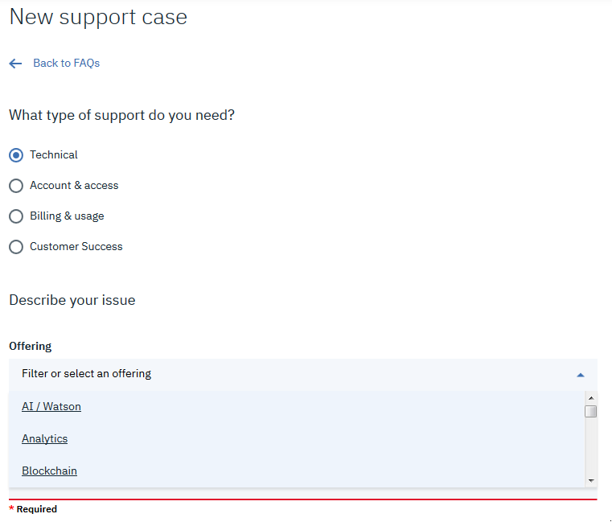
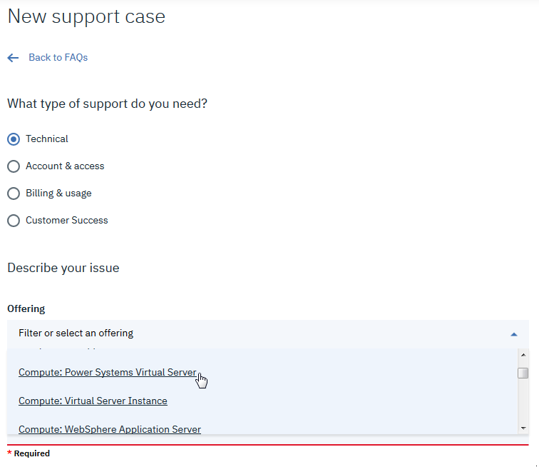
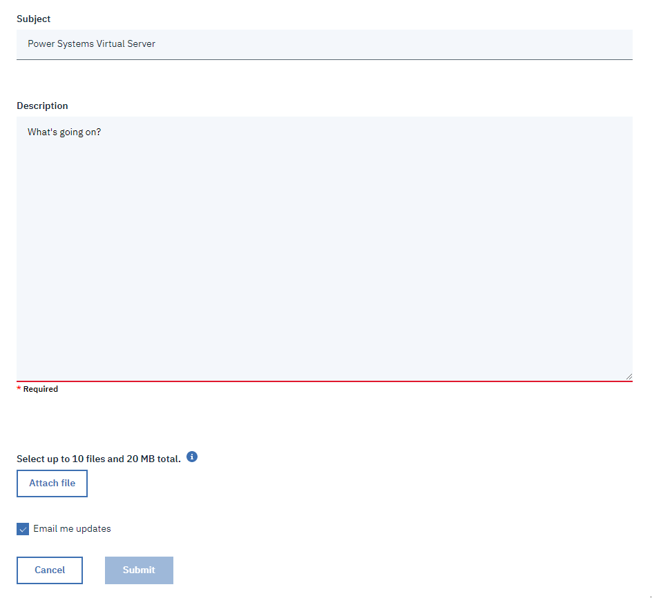

---

copyright:
  years: 2019

lastupdated: "2019-10-04"

keywords: help and support, support ticket, faq, create new case

subcollection: power-iaas

---

{:shortdesc: .shortdesc}
{:new_window: target="_blank"}
{:codeblock: .codeblock}
{:pre: .pre}
{:screen: .screen}
{:tip: .tip}
{:external: .external}
{:important: .important}
{:note: .note}

# Getting help and support
{: #getting-help-and-support}

Before you open a support ticket for a {{site.data.keyword.powerSys_notm}}, review the [FAQ](/docs/get-support?topic=get-support-getting-customer-support).
{: shortdesc}

To open a support ticket for a {{site.data.keyword.powerSys_notm}}, complete the following steps:

1. Log in to the [IBM Cloud ](https://cloud.ibm.com/catalog){: new_window} with your IBM Cloud account credentials.
2. In the menu bar, click **Support**.
3. Select **Manage cases** followed by **Create new case**.
4. From the **New support case** page, complete the following steps:
    1. Select **Technical** in the **What type of support do you need?** field.

          {: caption="Figure 1. Selecting your type of support" caption-side="bottom"}
    2. Choose **Compute: Power Systems Virtual Server** from the **Offering** field.

          {: caption="Figure 2. Selecting the correct offering" caption-side="bottom"}
    3. Enter **Power Systems Virtual Server** in the **Subject** field and enter a detailed description of the problem.

          {: caption="Figure 1. Submitting your support ticket" caption-side="bottom"}
    4. Attach any helpful files, check whether you want email updates, and submit your support ticket.
