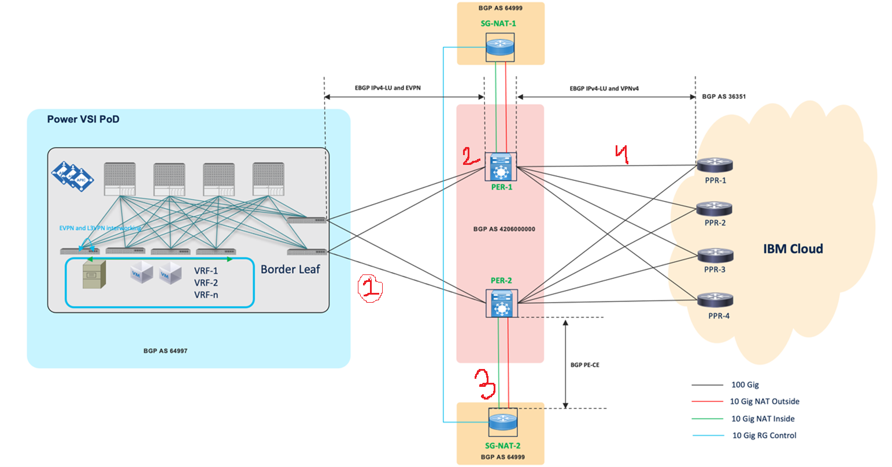

---

copyright:
  years: 2023

lastupdated: "2023-05-02"

keywords: PER, Power Edge Router, PER workspace, PER and Transit gateway, IBM PER

subcollection: power-iaas

---

{:shortdesc: .shortdesc}
{:screen: .screen}
{:codeblock: .codeblock}
{:pre: .pre}
{:tip: .tip}
{:note: .note}
{:important: .important}
{:deprecated: .deprecated}
{:external: target="_blank" .external}
{:help: data-hd-content-type='help'}
{:support: data-reuse='support'}
<!-- {{site.data.keyword.powerSys_notm}} -->

# Getting Started with Power Edge Router
{: #per}

A Power Edge Router (PER) is a high-performance virtual router offered by IBM Cloud&reg; that provides advanced routing capabilities for IBM&reg; Power Systems&trade; Virtual Server users.
{: shortdesc}

The network device PER connects virtual server instances(VM) in the cloud environment to other virtual server instances or on-premises networks. Its purpose is to provide high-performance, reliable, and scalable networking for virtual machines in the cloud environment.

The main objectives of a Power Edge Router are as follows:
1.	The PER connects different groups of computers in {{site.data.keyword.powerSys_notm}}, which are called tenants, to different services in IBM Cloud. It provides fast connections at 100Gb/s and includes backup connections in case of any issues.
2.	The PER also facilitates communication between different parts of the network (such as {{site.data.keyword.powerSys_notm}} and IBM Cloud) by acting as a translator between the different communication protocols they use (such as EVPN and VPNv4), ensuring that everyone can understand each other.
3.	The PER keeps different groups of computers separate from each other, preventing accidental interference in each other's work. It's like creating different rooms in a house for different people to use, so that everyone can work on their own things without getting in each other's way.
4.	The PER assigns unique addresses to different groups of computers to avoid any conflicts that may occur if two groups accidentally use the same address. This ensures that each group has its own address to use, like having your own phone number so that people know how to reach you.
5.	The PER uses a special attribute called an `RD` (Route Distinguisher) to help it communicate with other devices in the network when connecting to an ACI (Application Centric Infrastructure) site. You must ensure that the PER is using a unique `RD` value that is not already being used in the connected ACI sites. This allows the devices to recognize each other and communicate properly.
6.	The ACI border leaf and the PER are connected directly to each other. To make sure that they can communicate properly, they need to set up a special kind of connection called an EVPN session. This session runs between two loopback addresses (which are like special virtual network interfaces). However, because the loopback addresses are not directly connected to each other, they need to use a special feature called eBGP multi-hop to make the connection work. This feature allows the devices to jump across multiple network hops to reach each other.

## Overview of PER
{: #per-overview}

The IBM {{site.data.keyword.powerSys_notm}} network implements PER using the Cisco ASR9902 routers. 

The PER's primary function is to act as a data center provider edge (DC-PE), connecting ACI tenants from local Power VSI pods <!-- need a differnet term for VSI pods, Can we say Power System Virtual server instead? --> to various services across IBM Cloud using SR/MPLS (Segment Routing/Multi Protocol Label Switching) handoff. By using this type of handoff, a single BGP EVPN (Border Gateway Protocol) (Ethernet Virtual Private Network) session can exchange information for all prefixes in all VRFs, resulting in better scale and automation for IBM's {{site.data.keyword.powerSys_notm}} and MPLS cloud networks.

To handle traffic destined to ADN and CSE networks, a pair of Cisco Catalyst 8300 Service Gateway routers are deployed. These routers perform Network Address Translation (NAT) for the traffic.

The automation of ACI, PER, and NAT Services provisioning is carried out by Cisco as per the intent defined by the IBM {{site.data.keyword.powerSys_notm}} team. 

The following network architecture diagrams explains how the PER is integrated in the IBM Cloud environment:

{: caption="Figure 1. Power Edge Router network architechture diagram" caption-side="bottom"}

1.	Traffic from ACI tenants is forwarded to the PER.
2.	PER performs SR/MPLS handoff to exchange information for all prefixes in all VRFs via BGP EVPN session.
3.	Traffic is forwarded to the NAT services provided by Cisco Catalyst 8300 Service Gateway routers for translation of destination addresses to ADN and CSE networks. <!-- ADN is Application Delivery Network, what is CSE? Can ADN and CSE networks be reffered to a differnt/familiar term? -->
4.	The translated traffic is then forwarded to IBM Cloud PPRs for final delivery.
<!-- what is the full form of PPR? -->

## Creating a PER workspace
{:create-per-workspace}

<!-- Q: Does a user gets the option to choose b/w PER or a non-PER workspace? -->
A PER workspace is same as the non-PER workspace except that the PER workspace will have two additional attributes as follows:
1.	Route distinguisher (RD)
2.	Route target (RT)
<!-- Q: How do I check back that my workspace have these 2 attr? -->

These attributes are automatically created when you create a workspace in the data center where PER is deployed.

To create a PER workspace follow the steps mentioned in [Creating a Power Systems Virtual Server workspace](/docs/power-iaas?topic=power-iaas-creating-power-virtual-server#creating-service) and choose DAL10 as the data center.
<!-- Q: Pprovide a list of data centers have PER deployed in them: -->
<!-- Q: Is there any TGW API that lists all the PER supported DCs -->

You can attach, detach, update network using the subnets page in a PER workspace like a non-PER workspace. Workspaces in the PER enabled data center such as DAL10, leverage upgraded networking technology for higher performance and seamless connectivity.
virtual connections must be configured in IBM Transit Gateway, as opposed to using cloud connections.

In a PER workspace you can do the following:
1.	Attach a network without any requirement of creating a separate cloud connection such as Direct Link.
2.	Effortlessly attach a connection to IBM cloud network by attaching the Transit Gateway with your virtual server instance.

### Using IBM cloud services in a PER workpace
{: cloud-services-per}

From your PER workspace, you can create a virtual server instance and attach subnets to it. These server instances can then access the IBM Cloud resources such as Cloud Object Storage(COS), Domain Name System (DNS), and other services that use the allocated IP addresses in the range `161.26.0.0/16`.

However, You will need to attach Transit Gateway if you wish to connect your workspace with the Virtual Private Cloud (VPC) and classic infrastructure.

### Attaching Transit Gateway to a PER workpace
{: tgw-per}

You will need the Transit Gateway to connect with VPC and classic infrastructure. To attach a virtual server instance from PER workspace with Transit Gateway complete the steps mentioned in [Ordering IBM Cloud Transit Gateway](/docs/transit-gateway?topic=transit-gateway-ordering-transit-gateway&interface=ui)

You must select **{{site.data.keyword.powerSys_notm}}** under connection to attach a virtual server instance that was created in a PER enabled workspace. You can also add VPC and Classic infrastructures as connection. 

The connections that you add under Transit Gateway can ping each other. For example, if you add {{site.data.keyword.powerSys_notm}} and VPC under Transit Gateway connection, they both can access each other resources.
<!-- Check correctness -->

Make sure the classic infrastructure is VRF enabled before you attach it to the Transit Gateway.
{: note}
