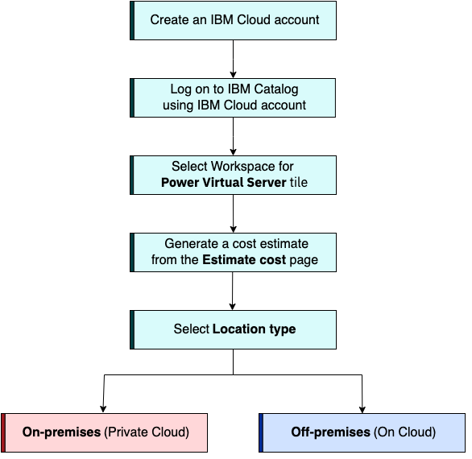
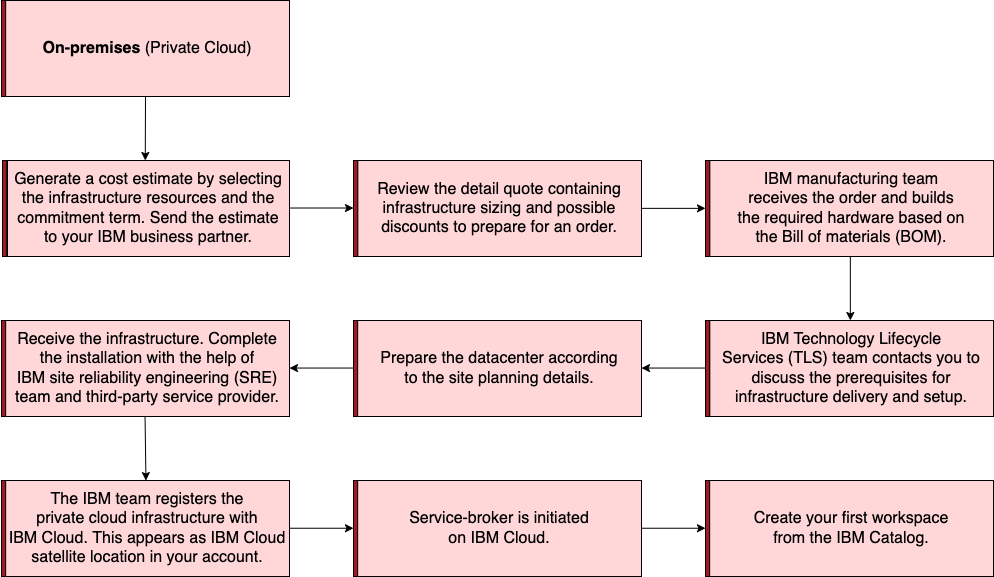
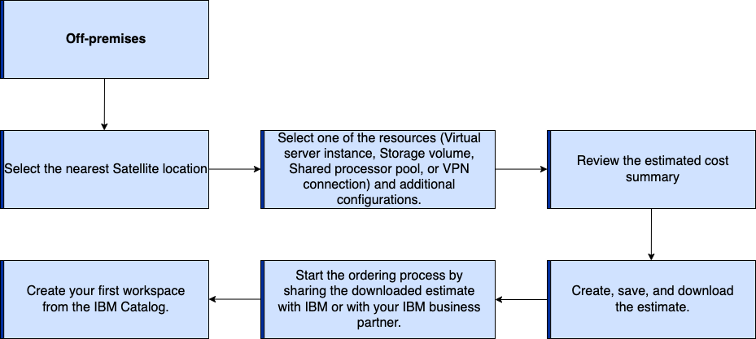

---

copyright:
  years: 2023, 2024

lastupdated: "2024-06-07"

keywords: getting started, {{site.data.keyword.powerSys_notm}} as a service, iaas, private cloud, before you begin, terminology, video, how-to

subcollection: power-iaas

---

{{site.data.keyword.attribute-definition-list}}

# Getting started with IBM {{site.data.keyword.powerSys_notm}}
{: #getting-started}

{{site.data.keyword.powerSysFull}} is an IBM Power server offering. You can use the {{site.data.keyword.powerSys_notm}} to deploy a virtual server, also known as a logical partition (LPAR), in a matter of minutes. You can provision flexible, secure, and scalable compute capacity for Power enterprise workloads both on IBM {{site.data.keyword.powerSys_notm}} Private Cloud and {{site.data.keyword.powerSys_notm}} in your data center.

You get fast and flexible management that can be connected to access a stack of enterprise services from IBM – all with pay-as-you-use billing. Using these services you can easily adjust workloads with flexible compute capacity. {{site.data.keyword.powerSys_notm}} instances can be used across the IBM Cloud platform globally. You can quickly deploy a {{site.data.keyword.powerSys_notm}} to meet your specific business needs and easily control workload demands. Avoid the large capital expenses or added risk when migrating your essential workloads and get started with {{site.data.keyword.powerSys_notm}} today! For frequently asked questions about the {{site.data.keyword.powerSys_notm}}, see [FAQ](/docs/power-iaas?topic=power-iaas-powervs-faqs).

[On-premises]{: tag-red}

IBM {{site.data.keyword.powerSys_notm}} Private Cloud is an as-a-service offering that includes a prescriptive set of physical infrastructure (compute, network, and storage). The physical infrastructure or the pod is deployed in your data center. The pod is maintained and operated by IBM site reliability engineering (SREs) and managed through the IBM Cloud platform. Each pod is associated with an IBM Cloud Satellite Location that is owned by your IBM Cloud account. This architecture helps to scale horizontally to add more pods according to your requirements. To verify that the pre-installation requirements are met, see [Prerequisites for installing the pod](/docs/power-iaas?topic=power-iaas-pre_installation_checklist).

IBM {{site.data.keyword.powerSys_notm}} Private Cloud officially supports Red Hat Enterprise Linux (RHEL) and IBM AIX&reg;. With the support of these operating systems you can deploy several applications, including SAP HANA, SAP S/4HANA, and SAP NetWeaver. You can also run Red Hat OpenShift Container Platform to accelerate your application modernization efforts by using new cloud-native applications.

{{site.data.keyword.powerSys_notm}} does not provide Linux stock images. Bring your own Linux image (OVA format) and subscription. SUSE Linux Enterprise Server (SLES) and RHEL OVA images are supported. [Learn more](/docs/power-iaas?topic=power-iaas-using-linux)
{: note}

<!--; SUSE Linux Enterprise Server will be available in the future with subscription.-->

[Off-premises]{: tag-blue}

{{site.data.keyword.powerSys_notm}} resources reside in IBM data centers with dedicated networking and Storage area network (SAN)-attached Fibre Channel storage. You can choose one of the regions that is listed in the specifications that are nearest to your data center. IBM Power clients who rely on private cloud infrastructure can now quickly and economically extend their Power IT resources on the cloud.

In the data centers, the {{site.data.keyword.powerSys_notm}} are separated from the rest of the IBM Cloud servers with separate networks and direct-attached storage. The internal networks are fenced but offer connectivity options to IBM Cloud infrastructure or private cloud environments. This infrastructure design enables {{site.data.keyword.powerSys_notm}} to maintain key enterprise software certification and support as the {{site.data.keyword.powerSys_notm}} architecture is identical to certified private cloud infrastructure.

If you are creating or configuring a {{site.data.keyword.powerSys_notm}} instance to support an SAP NetWeaver or SAP HANA workload, see [Planning your deployment](https://cloud.ibm.com/docs/sap?topic=sap-power-vs-planning-items){: external} and [Deploying your infrastructure](https://cloud.ibm.com/docs/sap?topic=sap-power-vs-set-up-vpc-infrastructure){: external}.

If you are creating or configuring a Red Hat OpenShift Cluster on {{site.data.keyword.powerSys_notm}}, see [Cloud native development and application modernization by using Red Hat OpenShift on {{site.data.keyword.powerSys_notm}}](/docs/power-iaas?topic=power-iaas-app-modernization-using-RedHat-openshift).

## Terminology
{: #terminology}

* **IBM Cloud account** - You can log on to IBM Cloud dashboard by using IBM Cloud account to access various IBM Cloud solutions, services, and offerings. To create an IBM Cloud account, see [Signing up for the IBM Cloud](https://cloud.ibm.com/registration){: external}.

* **Location and region** - The global network of locations of IBM Cloud provides three tiers of regions: multizone regions (MZR), single-campus multizone regions, and data centers. To achieve low application latency, choose your nearest location and region. For details about the available IBM Cloud regions and data centers, review [Region and data center locations for resource deployment](https://cloud.ibm.com/docs/overview?topic=overview-locations){: external}.

* **Satellite location** - A Satellite location is a representation of an environment in your infrastructure provider, such as a private cloud data center. Each IBM {{site.data.keyword.powerSys_notm}} Private Cloud pod in your data center must be associated with a Satellite location to manage the lifecycle operations of the pod. You must create multiple and unique Satellite locations if you are planning to deploy multiple pods in your data center. For detailed information, see [Understanding Satellite location and hosts](https://cloud.ibm.com/docs/satellite?topic=satellite-location-host){: external}.

* **workspace** - A workspace is a container of all the virtual machines, storage volumes, network configurations, and so on, at a specific geographic region. {{site.data.keyword.powerSys_notm}} workspaces are available from the **Resource list** in the {{site.data.keyword.powerSys_notm}} user interface. Each workspace can contain multiple {{site.data.keyword.powerSys_notm}} instances. Within each Satellite location, you can create multiple workspaces. For example, you can create two workspaces in the Satellite location of the North Data Center: one workspace for production workloads and another workspace for development tests.

* **pod** - a pod consists of IBM Power compute, storage, and network infrastructure that is built, installed, and maintained by IBM in your data center. You can have multiple pods and each pod will be uniquely represented by an IBM Cloud Satellite location.

* **Control plane network and client data plane network** - Control plane network is the connection between IBM Cloud and client data center. The client data plane network is the connection between the client data center and the IBM {{site.data.keyword.powerSys_notm}} Private Cloud pods. For more information, see the [Network overview for private cloud](/docs/power-iaas?topic=power-iaas-network-private-cloud) topic.

## Before you begin
{: #before-you-begin}

Before you create your first {{site.data.keyword.powerSys_notm}} instance, review the following prerequisites:

1. Create an IBM Cloud account if you don’t have an existing account. To create an IBM Cloud account, see [Signing up for the IBM Cloud](https://cloud.ibm.com/registration){: external}.

2. Plan and specify your infrastructure requirements and review the estimated cost by using the [{{site.data.keyword.powerSys_notm}} Estimate pricing](https://cloud.ibm.com/power/estimate){: external} tool. Identify whether you want {{site.data.keyword.powerSys_notm}}, {{site.data.keyword.powerSys_notm}} Private Cloud infrastructure, or both.

3. Review the entire lifecycles of {{site.data.keyword.powerSys_notm}} instances on [IBM Power Virtual Server Private Cloud](/docs/power-iaas?topic=power-iaas-getting-started#lifecycle-private-cloud) and [IBM Power Virtual Server](/docs/power-iaas?topic=power-iaas-getting-started#lifecycle-on-cloud).

{: caption="Figure 1. Getting Started with IBM {{site.data.keyword.powerSys_notm}} Private Cloud service instance" caption-side="bottom"}

## Lifecycle of an IBM {{site.data.keyword.powerSys_notm}} Private Cloud
{: #lifecycle-private-cloud}

[On-premises]{: tag-red}

{: caption="Figure 2. Lifecycle of an IBM {{site.data.keyword.powerSys_notm}} Private Cloud" caption-side="bottom"}

## Lifecycle of a {{site.data.keyword.powerSys_notm}}
{: #lifecycle-on-cloud}

[Off-premises]{: tag-blue}

{: caption="Figure 3. Lifecycle of a {{site.data.keyword.powerSys_notm}}" caption-side="bottom"}
