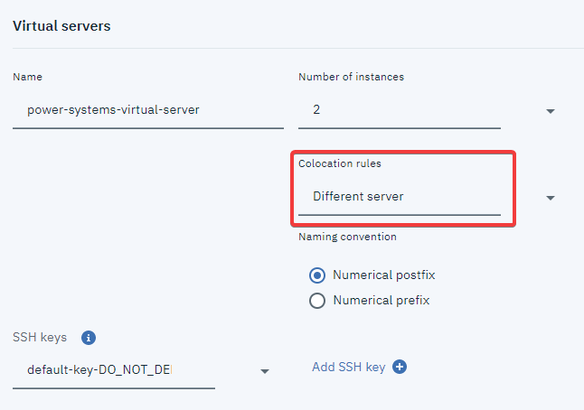
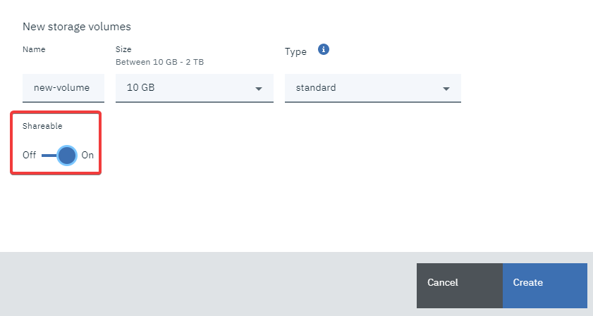

---

copyright:
  years: 2019, 2020

lastupdated: "2020-05-28"

keywords: high availability, disaster recovery, power systems, virtual servers, hardware failure

subcollection: power-iaas

---

{:new_window: target="_blank"}
{:shortdesc: .shortdesc}
{:screen: .screen}
{:codeblock: .codeblock}
{:pre: .pre}
{:tip: .tip}
{:note: .note}
{:important: .important}
{:deprecated: .deprecated}
{:external: target="_blank" .external}

# High Availability and Disaster Recovery options in Power Systems Virtual Servers
{: #ha-dr}

The {{site.data.keyword.powerSys_notm}} instance restarts the virtual servers on a different host system if a hardware failure occurs. This process provides basic High Availability (HA) capabilities for the {{site.data.keyword.powerSys_notm}} service. If you want more advanced HA or Disaster Recover (DR) solutions, you can deploy the following applications in your {{site.data.keyword.powerSys_notm}} environment.
{: shortdesc}

## PowerHA SystemMirror for AIX Standard Edition
{: #ha-dr-ha-standard}

You can use a monthly subscription model when you purchase PowerHA SystemMirror for AIX Standard Edition. For more information, see [Standard Edition monthly pricing options](https://www-01.ibm.com/common/ssi/ShowDoc.wss?docURL=/common/ssi/rep_ca/8/897/ENUS219-288/index.html&request_locale=en){: new_window}{: external}.

After you purchase the software, you can download it from [Entitled Software Support (ESS)](https://www.ibm.com/servers/eserver/ess/index.wss){: new_window}{: external}. You can install PowerHA SystemMirror for AIX on the virtual server that is running in your {{site.data.keyword.powerSys_notm}} environment. For installation instructions, see [Installing PowerHA SystemMirror](https://www.ibm.com/support/knowledgecenter/SSPHQG_7.2/install/ha_install.html){: new_window}{: external}.

Review the following information for implementing PowerHA SystemMirror for AIX in your {{site.data.keyword.powerSys_notm}} environment.

- When you are creating the virtual servers that are part of the PowerHA SystemMirror cluster, you must select **Different Server** from the **Colocation Rules** field. Selecting **Different Server** ensures that the different logical partitions (LPARs) that will be a part of the PowerHA SystemMirror cluster are not deployed on the same host.

{: caption="Figure 1. Displaying the colocation rules field" caption-side="bottom"}

- You must select **On** from the **Shareable** field when you create storage volumes for the virtual severs that are part of the PowerHA SystemMirror cluster.

<!-- {: caption="Figure 2. Creating storage volumes that are shareable" caption-side="bottom"} -->

- By using the {{site.data.keyword.powerSys_notm}} service, you do not have access to the HMC, VIOS, and the host system. Therefore, any PowerHA SystemMirror functions that require access to these capabilities, such as Resource Optimized High Availability (ROHA) and Active Node Halt Policy (ANHP), are not available.

Licenses that are purchased outside a subscription model license are not eligible to be used in the Power Systems Virtual Server.
{: note}

<!--* When you deploy PowerHA SystemMirror, you must verify that the Service IP address is defined as a private IP address. This Service IP address can be accessed by another {{site.data.keyword.powerSys_notm}} instance or from other {{site.data.keyword.cloud}} applications. You cannot use a public IP address because it cannot be moved from one interface to another interface within a virtual server or across different virtual servers. -->

<!--When you deploy PowerHA SystemMirror for AIX Enterprise Edition clusters in the {{site.data.keyword.powerSys_notm}} environment, you can only use the Geographic Logical Volume Manager (GLVM) functions. You cannot use storage mirroring functions that are part of PowerHA SystemMirror for AIX Enterprise Edition because you do not have access to the subsystem storage in the {{site.data.keyword.powerSys_notm}} environment. For more information, see [Geographic Logical Volume Manager ](https://www.ibm.com/support/knowledgecenter/SSPHQG_7.2/glvm/ha_glvm_kick.html).
{:note}
[Enterprise Edition monthly pricing options ](https://www.ibm.com/common/ssi/cgi-bin/ssialias?infotype=AN&subtype=CA&htmlfid=897/ENUS219-286) -->

## Disaster recovery mechanisms
{: #dr-aix-ibmi}

You can implement disaster recovery mechanism between two AIX virtual server instances in separate IBM Cloud data centers by using GLVM replication. For a complete tutorial, see [AIX Disaster Recovery with IBM Power Systems Virtual Servers](https://ibm.seismic.com/Link/Content/DCYQ2FUWnfRUa1uQ7Oihw-aw){: new_window}{: external}.

You can implement disaster recovery mechanisms between two IBM i virtual server instances by using PowerHA geographic mirroring. For a complete tutorial, see [IBM i Disaster Recovery with IBM Power Systems Virtual Servers](https://ibm.seismic.com/Link/Content/DC6h4H-DJXFUKdo5o_gC6u_w){: new_window}{: external}.

## Business Continuity through backup and restore
{: #ha-dr-ha-business}

Your {{site.data.keyword.powerSys_notm}} configuration and data are not backed up automatically. You can back up your virtual server to [Cloud Object Storage](/docs/cloud-object-storage?topic=cloud-object-storage-getting-started-cloud-object-storage) as explained in [Backup strategies for {{site.data.keyword.powerSys_notm}}](/docs/power-iaas?topic=power-iaas-backup-strategies). You can also restore your virtual server in case a critical failure occurs.

Importing and exporting images requires a considerable amount of processing power and network bandwidth. As a result, you can submit only one import or export request before it is queued. Typically, users import or export system disks (AIX rootvg disks) that are smaller in size (**less than 1 TB**) to facilitate the transfer to and from Cloud Object Storage. If your image size is greater than 1 TB, your transfer might a take a long time and is prone to failure. The maximum image size that you can import or export is **10 TB**.
