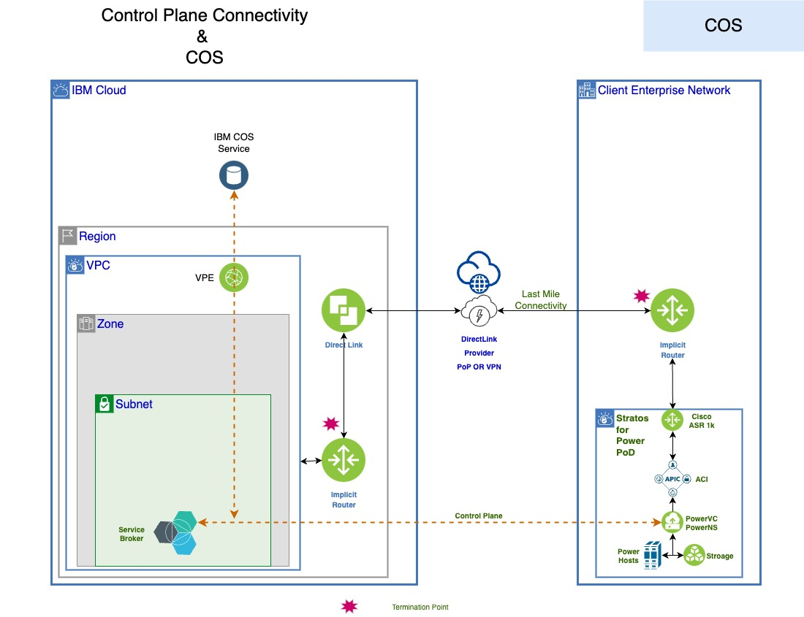

---

copyright:
  years: 2023, 2024

lastupdated: "2024-10-10"

keywords: import custom image, IBM Cloud Object Storage bucket, IBM Cloud Object Storage, import image

subcollection: power-iaas

#  this topic needs more information...
---

{{site.data.keyword.attribute-definition-list}}

# Establishing connectivity to IBM Cloud Object Storage buckets to import custom images
{: #conn-COS-custom-image}

---

IBM {{site.data.keyword.powerSys_notm}} Private Cloud: [On-premises]{: tag-red}

---

You can maintain a set of operating system images in your IBM Cloud Object Storage buckets. These images are referred to as custom images. You can import these custom images into the boot volumes of the logical partitions (LPARs).

To import stored custom images from the **Boot images** page, click **Import image** option. Enter the following information in the **Import boot image** page to complete the following steps:
* Custom image name to be used during virtual machine provisioning
* Storage tier number
* Storage pool preferences
* Region of your Cloud Object Storage instance
* File name of the custom image to be imported as specified in the Cloud Object Storage instance
* Your Cloud Object Storage bucket name
* Hash-based Message Authentication Code (HMAC) secret key and access key

IBM {{site.data.keyword.powerSys_notm}} (On-premises) processes the custom image file as follows:
* Downloads the image file from the Cloud Object Storage instance.
* Imports the image file into the attached storage.
* Converts the image file into an image volume.
* Copies the image volume as a boot volume to deploy the LPAR.

The following diagram shows the architecture for importing custom images that are stored in the IBM Cloud Object Storage buckets:
{: caption="Control plane connectivity with IBM Cloud Object Storage bucket." caption-side="bottom"}
