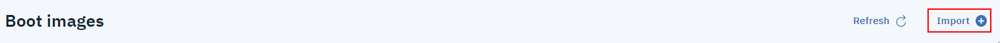
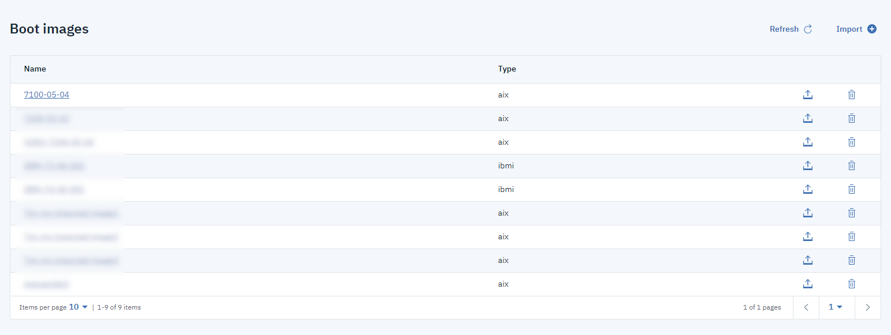

---

copyright:
  years: 2019

lastupdated: "2019-09-26"

keywords: boot image, import boot image, upload boot image

subcollection: power-iaas

---

{:shortdesc: .shortdesc}
{:new_window: target="_blank"}
{:codeblock: .codeblock}
{:pre: .pre}
{:screen: .screen}
{:tip: .tip}
{:important: .important}
{:note: .note}

# Importing a boot image
{: #importing-boot-image}

You can import an AIX or IBM i boot image by using the IBM Cloud CLI or the console.
{: shortdesc}

## Using the IBM Cloud CLI to import a boot image
{: #cli-import-image}

1. To import an AIX or IBM i image from IBM Cloud Storage, use the `ibmcloud pi image-import` command.

    ```shell
    ibmcloud pi image-import IMAGE_NAME --image-path PATH --os-type OSTYPE --access-key KEY --secret-key KEY [--json]
    ```
    {: codeblock}

1. Find your newly imported image by using the `ibmcloud pi images` command.

    ```shell
    ibmcloud pi images [--long] [--json]
    ```
    {: codeblock}

For more information, see the [IBM Power Systems Virtual Servers CLI Reference](/docs/power-iaas-cli-plugin?topic=power-iaas-cli-plugin-power-iaas-cli-reference#ibmcloud-pi-image-import).

## Using the IBM Cloud console to import a boot image
{: #console-import-image}

Complete the following steps to import a boot image by using the IBM Cloud console.

1. Click the **Boot images** tab, then **Import**.

    {: caption="Figure 1. Importing a boot image" caption-side="bottom"}

2. After you click **Import**, enter all of the required information.

    {: caption="Figure 2. Completing the boot image fields" caption-side="bottom"}

Refer to the following table to complete the necessary fields to import a boot image:

| Field | Description |
| ------| ------------|
| Catalog image name | Enter the name you want displayed in your catalog.|
| Storage type | Select whether you want **Standard** or **SSD** for the storage type.|
| Region | Select either **us-east** or **us-south** for the region.|
| Image file name | Enter the fully qualified path for the image file. The fully qualified path must be in this format, `endpoint/bucket_name/file_name`. You must use the private endpoint domain. For example, `s3.private.us-east.cloud-object-storage.appdomain.cloud/power-iaasprod-images-bucket/Aix_7200-03-02-1846_cldrdy_112018.gz`. You can identify the endpoint domain, bucket name, and file name by selecting **Menu icon  > Resource list > Storage > Cloud Storage Object**.
| Cloud Object Storage bucket name | To identity your bucket name, select **Menu icon  > Resource list > Storage > Cloud Storage Object name > Buckets**. |
| Cloud Object Storage access key | To identify your access key, select **Menu icon  > Resource list > Storage > Cloud Storage Object name > Service credentials > View credentials**. Copy the `access_key_id` value and past it into this field.|
| Cloud Object Storage secret key | To identify your secret key, select **Menu icon  > Resource list > Storage > Cloud Storage Object name > Service credentials > View credentials**. Copy the `secret_access_key` value and paste it into this field.|

3. Find your newly uploaded boot image under the **Boot images** tab.

  {: caption="Figure 3. Finding your newly uploaded boot image" caption-side="bottom"}
