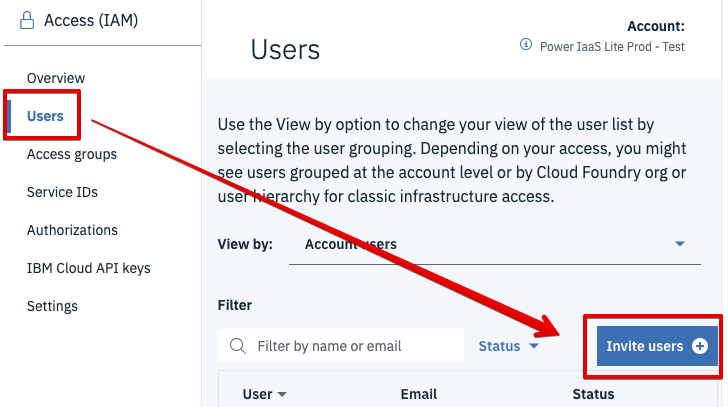

---

copyright:
  years: 2019

lastupdated: "2019-08-07"

---

{:shortdesc: .shortdesc}
{:new_window: target="_blank"}
{:codeblock: .codeblock}
{:pre: .pre}
{:screen: .screen}
{:tip: .tip}
{:download: .download}
{:note: .note}

# Managing {{site.data.keyword.powerSys_notm}} resources and users
{: #managing-resources-and-users}

The {{site.data.keyword.powerSysFull}} authorization and resource management practices coordinate with the IBM Cloud Identity and Access Management (IAM) services. IAM enables you to securely authenticate users, control access to {{site.data.keyword.powerSys_notm}} resources with resource groups, and allow access to specific resources for a set of users with access groups. In other words, IAM is your one-stop shop for all user and resource management in the {{site.data.keyword.cloud_notm}}.
{: shortdesc}

You can assign IAM authorizations based on the follow criteria:

* Individual users
* Access groups (groups of users)
* Specific types of resources
* Resource groups

For more information about IAM, review the following information:

* [Getting started with IAM](https://cloud.ibm.com/docs/iam?topic=iam-getstarted#getstarted)
* [IAM concepts](https://cloud.ibm.com/docs/iam?topic=iam-iamoverview)
* [Managing resource groups](https://cloud.ibm.com/docs/resources?topic=resources-rgs)
* [Setting up access groups](https://cloud.ibm.com/docs/iam?topic=iam-groups)

## Platform access roles
{: #platform-access-roles}

You can use platform access roles to enable users to complete tasks on {{site.data.keyword.cloud_notm}} resources, such as creating users or adding services.

The following table displays the IAM platform access roles and the corresponding type of control allowed by {{site.data.keyword.powerSys_notm}}:

| Platform access role | Type of access allowed |
|-----------|-------------------------|
| Viewer | View instances and list instances. |
| Operator | View instances and list instances. |
| Editor | View instances, list instances, create instances, and delete instances.  |
| Administrator | View instances, list instances, create instances, delete instances, and assign policies to other users. |

## Service access roles
{: #service-access-roles}

You can use the service access roles to define what users can do with {{site.data.keyword.powerSys_notm}} service functions.

The following table displays the IAM service access roles and the corresponding actions a user can complete with {{site.data.keyword.powerSys_notm}}:

| Service access role | Description of actions |
|-----------|-------------------------|
| Reader | View all resources, such as SSH keys, storage volumes, and network settings. You cannot make any changes to the resources. |
| Manager | You can configure all resources. The following are some of the actions you can perform:<ul><li>Create instances</li><li>Increase storage volume sizes</li><li>Create SSH keys</li><li>Modify network settings</li><li>Create boot images</li><li>Delete storage volumes</li>
</ul>

## User access scenarios
{: #user-access-scenarios}

The following access scenarios cover the steps that are required to add a new user and modify the permissions for an existing user.

### Inviting a new user to view {{site.data.keyword.powerSys_notm}} resources
{: #inviting-a-new-user-to-create-or-manage-resources}

You must invite an IBM Cloud user to your account and give them access to view {{site.data.keyword.powerSys_notm}} resources. Remember, the service access role determines the access level that a user has for {{site.data.keyword.powerSys_notm}} resources.

Complete the following steps in IAM to enable a user to view {{site.data.keyword.powerSys_notm}} resources:

1. Navigate to the [IAM Users UI ](https://cloud.ibm.com/iam/users){: new_window} in the IBM Cloud Console, and click **Invite users**.

      {: caption="Figure 1. Inviting users from the IAM UI" caption-side="bottom"}

2. Under the **Users** section, enter the desired user email addresses in the **Email address** field.
3. Next, select **Resource** from the **Assign access to** field and **{{site.data.keyword.powerSys_notm}}** in the **Services** field.

    {: caption="Figure 2. Selecting a Power Systems Virtual Server service for a new user" caption-side="bottom"}

4. Select the platform access role that you want to assign to the users. In this scenario, the user can only view {{site.data.keyword.cloud_notm}} and {{site.data.keyword.powerSys_notm}} resources.

    {: caption="Figure 3. Selecting roles for a new user from the IAM UI]" caption-side="bottom"}

5. Click **Invite users**. The user must accept the invite to be added to the account. If the invitation is sent successfully, a message is displayed.

    {: caption="Figure 4. Successful invitation message" caption-side="bottom"}

### Giving an existing user permission to manage {{site.data.keyword.powerSys_notm}} resources
{: #giving-an-existing-user-permission-to-manage-resources}

Complete the following steps to provide an existing user in your account permission to configure {{site.data.keyword.powerSys_notm}} resources.

1. Navigate to the [IAM Users UI ](https://cloud.ibm.com/iam/users){: new_window} in the IBM Cloud Console.
2. From the list of users, select the user whose authorization you want to change.
3. Click **Access policies** and click the current roles for the users. In this scenario, click **Viewer, Reader**.

    {: caption="Figure 5. Changing the permissions for a user from the IAM UI" caption-side="bottom"}

4. From the **Select Roles** field, click **Manager**. You can leave the **Reader** role selected.

    {: caption="Figure 6. Selecting the manager role from the IAM UI" caption-side="bottom"}

5. Click **Save**.

   The user is now authorized to configure {{site.data.keyword.powerSys_notm}} resources. However, this user cannot manage services and resources that are specific to the {{site.data.keyword.cloud_notm}} platform. For example, they cannot add new users.
   {: note}
