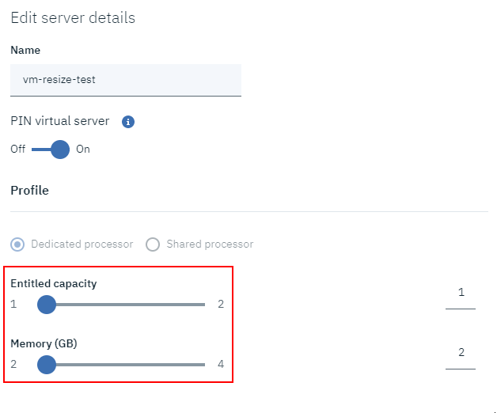
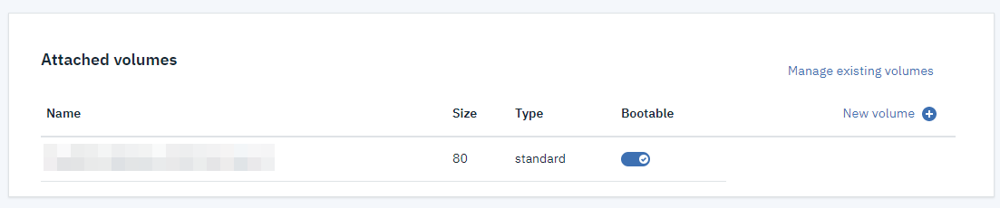
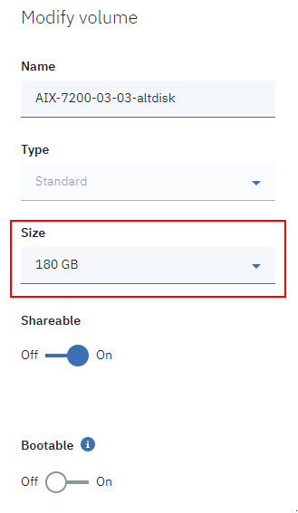
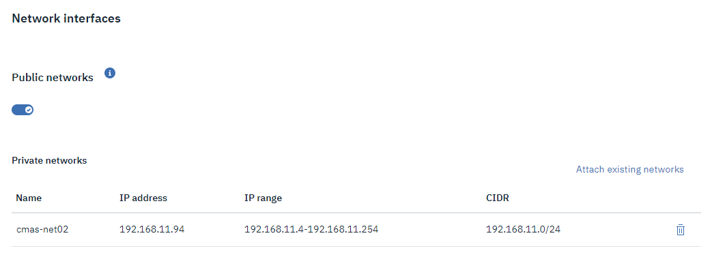

---

copyright:
  years: 2019, 2020

lastupdated: "2020-09-29"

keywords: storage volume, new storage size, modifying server, editing volume, volume modification, DLPAR, modifying instance, scaling vm, public network, nic, affinity

subcollection: power-iaas

---

{:new_window: target="_blank"}
{:shortdesc: .shortdesc}
{:screen: .screen}
{:codeblock: .codeblock}
{:pre: .pre}
{:tip: .tip}
{:note: .note}
{:preview: .preview}
{:important: .important}
{:deprecated: .deprecated}
{:external: target="_blank" .external}

# Modifying a Power Systems Virtual Server instance
{: #modifying-server}

Learn how to modify your {{site.data.keyword.powerSysShort}} to better meet your business needs.
{: shortdesc}

## Resizing an instance by using the Power Systems Virtual Server user interface
{: #resizing-vm}

To resize a {{site.data.keyword.powerSys_notm}} instance after its [initial creation](/docs/power-iaas?topic=power-iaas-creating-power-virtual-server), complete the following steps:

1. Go to **Virtual server instances** in the {{site.data.keyword.powerSys_notm}} user interface and click your instance.

2. Click the **Edit** icon in the **Server details** pane.

    {: caption="Figure 1. Finding your server details" caption-side="bottom"}

3. A menu appears after you click the **Edit** icon. Here, you can change your instance's **Name**, **Entitled capacity**, **Memory (GB)**, and **VM pinning** state.

    If the VM is inactive or shut down, you can change the processor type to Dedicated processor, Uncapped shared processor or Capped shared processor.
    {: tip}

    <!-- {: caption="Figure 2. Modifying your server details" caption-side="bottom"} -->

4. Check the service agreement box and click **Order** to complete the instance modification process and accept the price.

5. View the **Server details** pane to verify your instance modification.

<<<<<<< HEAD
<!--### Resizing the VM core count and memory

* You can also resize the VM's core count and memory to scale up and down as per your workload requirements. The minimum and maximum values for Memory (GB) and Cores (CPUs) are recalculated based on the type of processor. When you resize an active VM, you cannot change the processor type. The calculated minimum and maximum values 8 times of the specified values. However, these values must not exceed the minimum requirement of 0.25 core and 2GB memory and a maximum of available resources in the host. For example, if you provision your VM instance with 4 core and 8 GB memory, you can scale down your VM instance to 1 core and 2 GB when your VM is inactive. You can also scale up your VM instance to 32 cores and 64 GB memory during peak business time for your VM workloads. The 8X ratios change is effective only when You shutdown the VM instance before you resize the core count and memory.-->
=======
<!-- ### Resizing the VM core count and memory
{: #resize-core-mem}

You can resize the VM's core count and memory to scale up and down as per your workload requirements. When the VM is active, you can resize the memory and core counts to a maximum of 8 times of the specified values, and to a minimum of 1/8 times of the specified values when the VM was provisioned. However, you cannot resize the memory and core count to less than 0.25 cores and 2 GB memory. You can resize beyond the 8x and 1/8x boundaries, when the VM is shut down. The following table shows an example of recalculated values:

| Specified value when the VM instance was provisioned | Minimum resize value (must be greater than or equal to 0.25 cores, 2 GB memory) | Maximum resize value |
|---------------------- | ------------------------- | ------------------------- |
|4 core and 8 GB memory | 0.5 cores and 2 GB memory | 32 cores and 64 GB memory |
{: class="simple-tab-table"}
{: tab-group="resize_core_memory"}
{: caption="Table 1. Resizing VM core count and memory when the VM is active" caption-side="top"}
{: #resize_core_memory-1}
{: tab-title="When VM is active"}

| Specified value when the VM instance was provisioned | Minimum resize value (must be greater than or equal to 0.25 cores, 2 GB memory) | Maximum resize value |
|---------------------- | ------------------------- | ------------------------- |
|4 core and 8 GB memory | Any value you specify that is greater than 0.25 cores, 2 GB memory | Any value you specify that is smaller than the available resources in the host |
{: class="simple-tab-table"}
{: tab-group="resize_core_memory"}
{: caption="Table 1. Resizing VM core count and memory when the VM is shut down" caption-side="top"}
{: #resize_core_memory-2}
{: tab-title="When VM is shut down"}-->
>>>>>>> draft

## Managing your storage volumes
{: #modifying-volume-network}

Learn how to add new storage volumes and modify existing ones. Currently, you cannot mix **Tier 1** and **Tier 3** storage types.

### Adding and managing storage volumes
{: #adding-managing-volume}

If you'd like to attach or detach a volume, click **Manage existing volumes** and select the wanted volume. You can also change the boot status of a volume by clicking the **Bootable** toggle. To add a volume, you must complete the following steps:

1. Click **New volume** to add a storage volume.

2. Enter the **Name**, **Type**, and **Size** of the storage volume. You can also select whether to make it **Shareable** and set an **Affinity policy**.

    Volume affinity allows you to control the placement of a new volume in a particular storage provider based on an existing volume. When you set an affinity policy for a new storage volume, the volume is created within the same storage provider as an existing volume. With an anti-affinity policy, the new volume is created in a different storage provider as an existing volume.
    {: note}

3. Click **Next**, agree to the service agreement, and submit your **Order**.

<!-- {: caption="Figure 3. Managing your existing volumes" caption-side="bottom"} -->

### Resizing a storage volume
{: #resizing-volume}
{: help}
{: support}

You can resize a storage volume after its initial creation. To delete a volume, its status must indicate one of the following states: `available`, `error`, `error_restoring`, `error_extending`, or `error_managing`. Additionally, the storage volume cannot be deleted if it is migrating, attached, belongs to a group, has snapshots, or is disassociated from its snapshots after a transfer. Resizing is not immediately available after you deploy a VM. For IBM i 7.3 and 7.4 versions, you can resize volume to increase the volume size, but this requires an IPL to recognize the new volume size. If you can not take the down time you can add additional volumes. You can attach maximum of 127 volumes to the VM.

Any volume that has been included in a snapshot cannot be resized. To resize a volume that has been included in a snapshot, you must first delete all of the snapshots the volume is a part of.
{: important}

1. Go to the {{site.data.keyword.powerSys_notm}} user interface and click **Storage volumes**.

2. Click the **Edit** icon to the right of your storage volume.

3. After you click the **Edit** icon, a menu appears. Select the wanted storage volume size. You can increase only the size of the storage volume.

    {: caption="Figure 2. Modifying your storage volume" caption-side="bottom"}

4. Read the service agreement and agree to the terms. Click **Order** to complete the volume modification process and accept the price.

5. To verify your new storage size, go back to **Storage volumes**.

6. In an AIX VM instance, if you resize your boot storage volume, run the `chvg -g rootvg` command.

## Adding or removing a public network
{: #adding-removing-network}

You can remove or add a public network by clicking the **Public networks** toggle in **Virtual server instances**. When you toggle a public network off and then on, the {{site.data.keyword.powerSys_notm}} user interface regenerates new internal and external IP addresses. You need to check the {{site.data.keyword.powerSys_notm}} user interface for the new internal IP address (that maps to the external IP address). You must add a network interface controller (NIC) and point it to the new internal IP address. For information on how to add or remove an interface, see [How to add or remove a network interface from an AIX virtual machine (VM)](/docs/power-iaas?topic=power-iaas-managing-network-interface) or [How to add or remove a network interface from an IBM i virtual machine (VM)](/docs/power-iaas?topic=power-iaas-managing-network-interface-ibmi).

You cannot toggle a public network off if there are no other defined networks.
{: note}

<!-- {: caption="Figure 4. Toggling a public network on or off" caption-side="bottom"} -->

## Detecting problems by using the System Reference Code (SRC)
{: detect-problems-using-src}

A *system reference code (SRC)* is a set of eight alphanumeric characters that identifies the name of the system component that detects, the error codes, and the reference code that describes the error condition. When the {{site.data.keyword.powerSys_notm}} instance detects a problem, an SRC number is displayed along with a timestamp in the **Server details** page. You can use the SRC to resolve the issue yourself. If you are contacting support to resolve a problem, the SRC number might help the hardware service provider better understand the problem and to provide the solution.

For an IBM i VM, the SRC number can be progress code, operation code, or software code. For more information, see the [System Reference Code list](https://www.ibm.com/support/knowledgecenter/ssw_ibm_i_73/rzahb/rzahbsrclist.htm){: new_window}{: external} in IBM i documentation. For AIX VM instances, the SRC numbers are progress codes that provide information about the stages involved in powering on and performing initial program load (IPL). AIX SRCs refresh once in 2 minutes. For more information, see [AIX IPL progress codes](https://www.ibm.com/support/knowledgecenter/POWER9_REF/p9eai/aixIPL_info.htm){: new_window}{: external}.