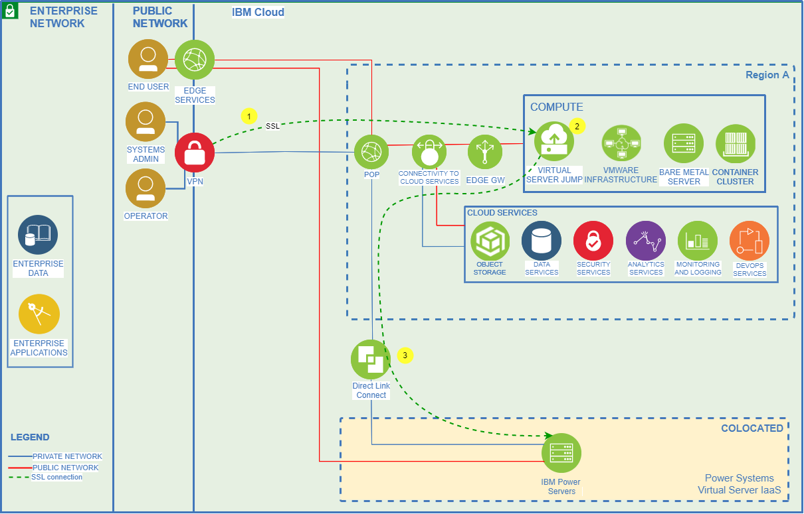
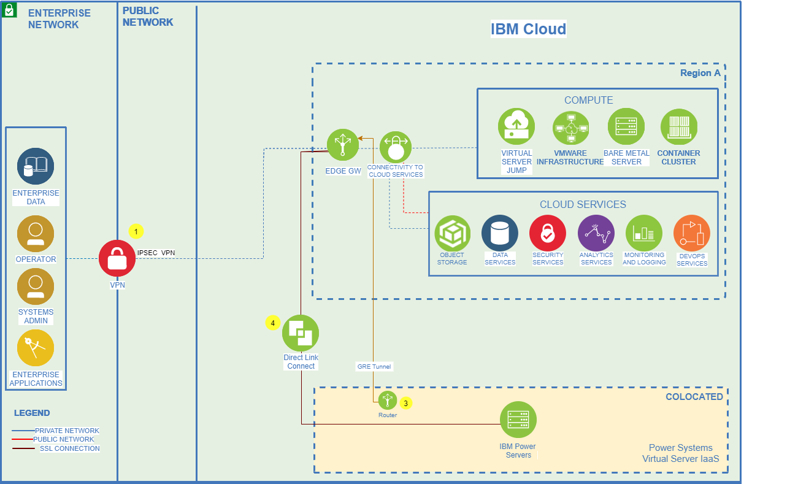
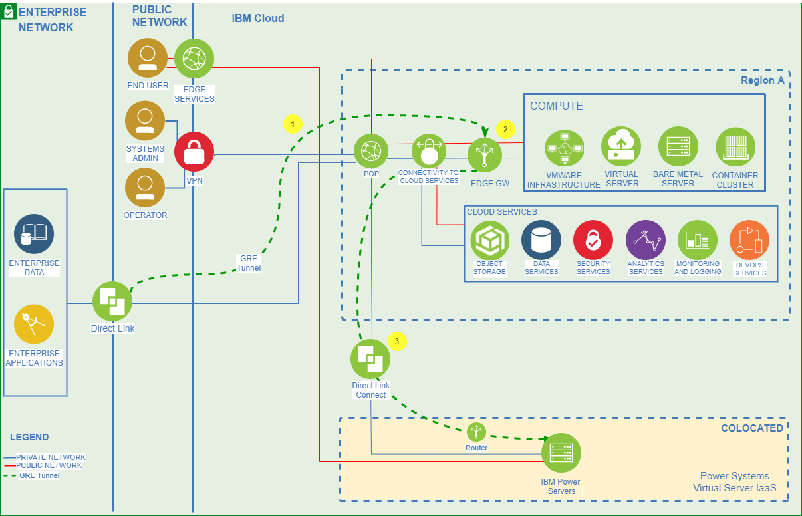
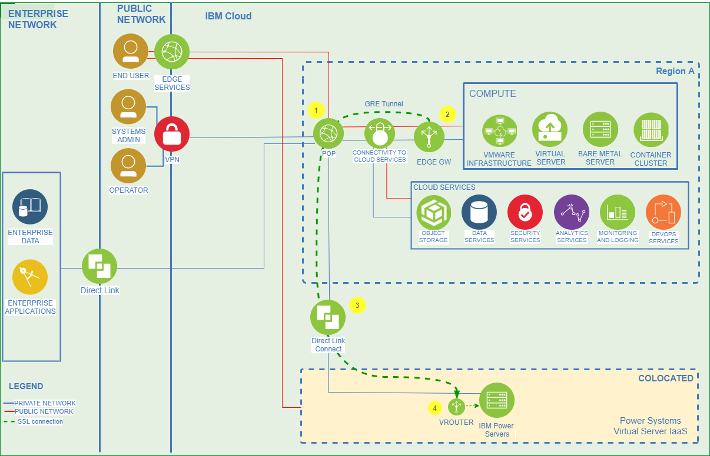
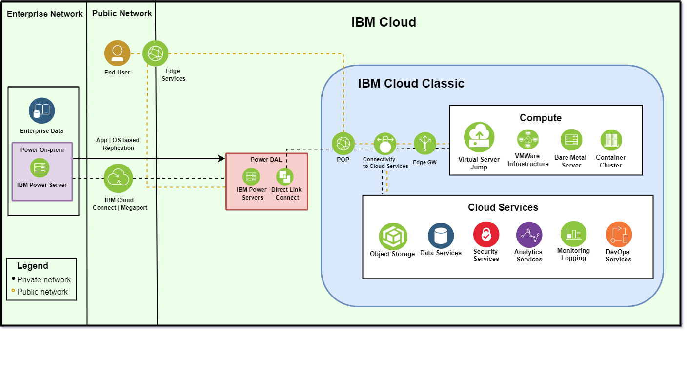
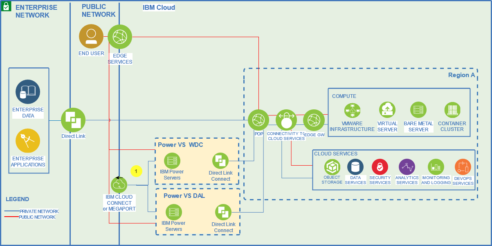
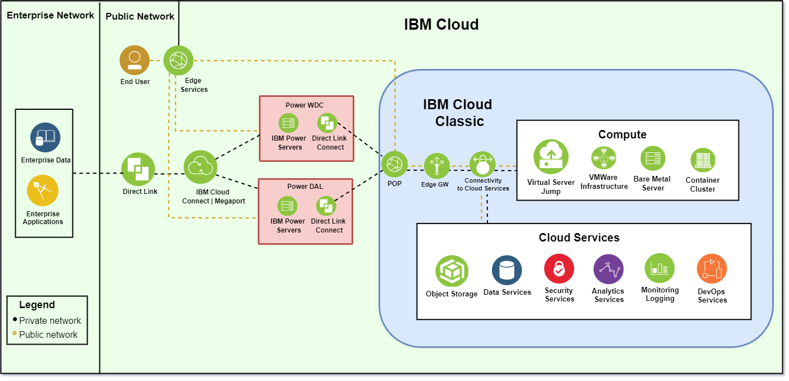
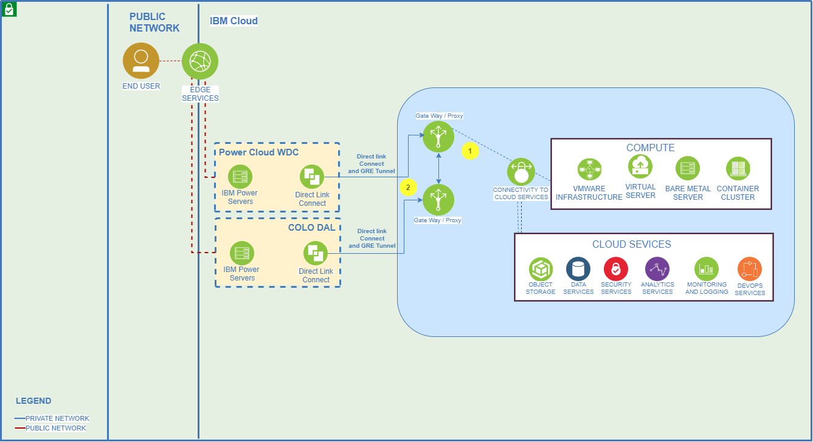

---

copyright:
  years: 2019, 2020

lastupdated: "2020-12-02"

keywords: networking diagrams, network architecture, private ssl, private ipsec, direct link, colocation, data center, cloud connect, megaport

subcollection: power-iaas

---

{:new_window: target="_blank"}
{:shortdesc: .shortdesc}
{:screen: .screen}
{:codeblock: .codeblock}
{:pre: .pre}
{:tip: .tip}
{:note: .note}
{:important: .important}
{:deprecated: .deprecated}
{:external: target="_blank" .external}

# Network architecture diagrams
{: #network-reference-architecture}

Use the following graphics to better understand the {{site.data.keyword.powerSysShort}} network architecture. This is not an exhaustive list of the {{site.data.keyword.powerSys_notm}} connection methods.
{: shortdesc}

IBM Cloud Connect is only available to IBM clients within the US. IBM clients can always contact Megaport directly to procure their services.
{: important}

## Private SSL connection
{: #private-ssl}

You can use the **IBM Cloud SSL VPN** service to connect to your existing IBM Cloud network. View the following network architecture diagram.

  {: caption="Figure 1. Power Systems Virtual Server private SSL connection" caption-side="bottom"}

Use the following network architecture for environment management from the public network. This model is not ideal for production workloads.

  1. Connect to IBM Cloud network via Public network by using secure socket layer(SSL) virtual private network(VPN) service.
  2. In the IBM Cloud network, use an IBM Cloud virtual server instance as a jump server. Jump server can be used as login server or as a proxy server.
  3. Connect the Power Systems Virtual Server instance to the IBM Cloud network by using the Direct Link Connect service.

## Private IPSec connection
{: #private-ipsec}

You can use the **IBM Cloud IPSec VPN** service to connect into your existing IBM Cloud network. Inside the IBM Cloud network, you can use the IBM Cloud VRA to connect to your Power Systems Virtual Server instance. As a part of this networking scenario, there is a GRE tunnel beteween a switch inside the Power colo and the edge gateway inside the IBM Cloud. For a complete tutorial on site-to-site VPN connectivity, see [IBM Power Virtual Server Virtual Private Network Connectivity](https://cloud.ibm.com/media/docs/downloads/power-iaas-tutorials/PowerVS_VPN_Tutorial_v1.pdf){: new_window}{: external}.

  {: caption="Figure 2. Power Systems Virtual Server private IPSec connection" caption-side="bottom"}

Use the following network architecture for environment management from the public network. This model is not ideal for production workloads. You can implement this model for proof-of-concept, development, and test purposes.

  1. Connect your enterprise network to the IBM Cloud network by using the [IBM Cloud IPSec VPN service](https://cloud.ibm.com/docs/iaas-vpn?topic=iaas-vpn-setup-ipsec-vpn).
  2. In the IBM Cloud network, use an Edge Gateway device to connect to the Power Systems Virtual Server location. You must use an Edge Gateway (Vyatta or vSRX) router-based IPSec VPN. IBM Cloud IPSec service is option as well.
  3. Configure the GRE service on the IBM Power Systems Virtual Server network to establish a GRE tunnel and to enable bring-your-own-IP address (BYOIP) to the Power Server environment. A Virtual Router Appliance or equivalent is required in IBM Cloud because you cannot use a VPN connection to directly connect to the Power Systems Virtual Server instance.

    For tutorial on a site-to-site IPSec VPN using a Virtual Router Appliance (VRA), see [VPN into a secure private network](https://cloud.ibm.com/docs/virtual-router-appliance?topic=solution-tutorials-configuring-IPSEC-VPN ).
    {: note}

  4. Connect the Power Systems Virtual Server instance to the IBM Cloud network by using the Direct Link Connect service.

## Private Direct Link connection
{: #private-direct-link}

You can use a **private Direct Link** connection to connect into your existing IBM Cloud network. As a part of this networking scenario, there is a GRE tunnel beteween a switch inside the Power colo and the edge gateway inside the IBM Cloud.

  {: caption="Figure 3. Power Systems Virtual Server private Direct Link connection" caption-side="bottom"}

Use the following network architecture for enterprise connectivity when you don’t require the BYOIP feature.

  1. Connect your enterprise network to the IBM Cloud network by using the Direct Link service. Any [Direct Link](https://cloud.ibm.com/docs/dl?topic=dl-dl-about#overview-of-direct-link-offerings) offerings can be used for this connectivity.
  2. In the IBM Cloud network, use an Edge Gateway device to connect and to control routing between IBM Cloud and the Power Systems Virtual Server location.
  3. Connect the IBM Power Systems Virtual Server to the IBM Cloud network by using the Direct Link Connect service.

## IBM Cloud Connect (or Megaport) to data center connection
{: #cloud-to-colo}

You can connect to the IBM Cloud Power environment by using **IBM Cloud Connect or Megaport**. As stated previously, IBM Cloud Connect is only available to IBM clients within the US.

  {: caption="Figure 4. Power Systems Virtual Server data center connection" caption-side="bottom"}

  1. Connect your enterprise network to the IBM Cloud network by using the Direct Link service. Any [Direct Link](https://cloud.ibm.com/docs/dl?topic=dl-dl-about#overview-of-direct-link-offerings) offerings can be used for this connectivity.
  2. In the IBM Cloud network, use an Edge Gateway device used to connect and to control routing between IBM Cloud and the Power Systems Virtual Server location.
  3. Connect the IBM Power Systems Virtual Server by using Direct Link Connect to the IBM Cloud Network.
  4. Configure the GRE service on the IBM Power Systems Virtual Server network to establish a GRE tunnel and to enable bring-your-own-IP address (BYOIP) to the Power Server environment. A Virtual Router Appliance or equivalent is required in IBM Cloud because you cannot use a VPN connection to directly connect to the Power Systems Virtual Server instance.
    For tutorial on a site-to-site IPSec VPN using a Virtual Router Appliance (VRA), see [VPN into a secure private network](https://cloud.ibm.com/docs/virtual-router-appliance?topic=solution-tutorials-configuring-IPSEC-VPN).

## IBM Power on-premise environment to colo connection
{: #onprem-to-colo}

You can connect your IBM Power on-premise environment to a colo by using **IBM Cloud Connect or Megaport**.

  {: caption="Figure 5. Power Systems Virtual Server private on-premise to Colo connection" caption-side="bottom"}

## IBM Power IaaS location connectivity using IBM Cloud network backbone and proxy routers
{: #colo-to-colo-megaport}

You can connect a colo to a colo by using **Direct Link and IBM Cloud Connect or Megaport**.

When connecting a colo to a colo by using Megaport, you might need a [Megaport Cloud Router (MCR)](https://knowledgebase.megaport.com/megaport-cloud-router/what-is-mcr/){: new_window}{: external}. If you want to route to more than one location from your colo, you must use an MCR (unless your router can perform this function). In some cases, an MCR is not required. For example, you only need one Megaport port open to perform a data replication between *DAL13* and *WDC04*. Please consult an IBM Cloud Connect or Megaport representative for specific network requirements.

  {: caption="Figure 6. Power Systems Virtual Server Colo to Colo connection (Megaport)" caption-side="bottom"}

Use the following architecture diagram for connectivity between multiple Power Systems Virtual Server locations.

  1. When you have your VMs in more than one Power Systems Virtual Server locations that are provisioned for resiliency, PVS-Location1 to PVS-Location2 connectivity can occur outside of IBM cloud network. You can establish connectivity between the Power Systems Virtual Server locations   by using Megaport (client circuit) or IBM Cloud Connect (available only in U.S.).
  IBM Cloud Connect must be used when you want a fully-managed service for connectivity between Power Systems Virtual Server locations. IBM Cloud Connect provides connectivity not just to IBM Cloud or the Power Systems Virtual Server locations, but also provides fully-managed connectivity in multi-cloud scenarios.  Although you are responsible for the final connectivity, IBM Network Services can also provide this as a service with Cloud Connect.

<!-- ## IBM Power colo to colo connection using GRE tunneling
{: #colo-to-colo-gre}

You can connect a colo to a colo by using **Direct Link** and GRE tunnels.

  {: caption="Figure 7. Power Systems Virtual Server Colo to Colo (GRE Tunneling)" caption-side="bottom"} -->

## IBM dual colo connection
{: #dual-colo}

You can connect to two colos from your on-premises environment after creating a **Direct Link connection and by using IBM Cloud Connect or Megaport**.

  {: caption="Figure 8. Power Systems Virtual Server private dual Colo connection" caption-side="bottom"}

Use the following architecture diagram for connectivity between multiple Power Systems Virtual Server locations when high bandwidth is not required and high or variable latency can be tolerated. Client is responsible for deploying the configuration including Direct Link Connects, GRE tunnels, Proxies/Gatways etc. Infrastructure should be sized for the required performance.

  1. When you have your VMs in more than one Power Systems Virtual Server locations that are provisioned for resiliency, PVS-Location1 to PVS-Location2 connectivity can occur  through the IBM Cloud network by using proxy servers. You also need GRE tunnels for the transit.
  2. Configure Direct Link Connect with GRE configuration at both the Power Systems Virtual Server locations for connectivity with the IBM Cloud network. Network bandwidth and latency depends on Direct Link Connect service, proxy gateway, and IBM Cloud network.

    This configuration is under test. Therefore, you must test your configuration before using this architecture for production use.
    {: note}