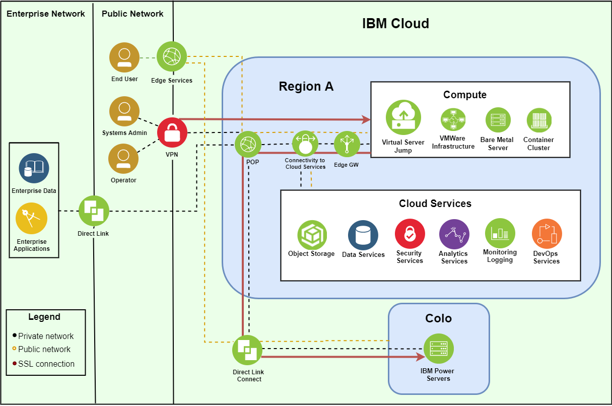
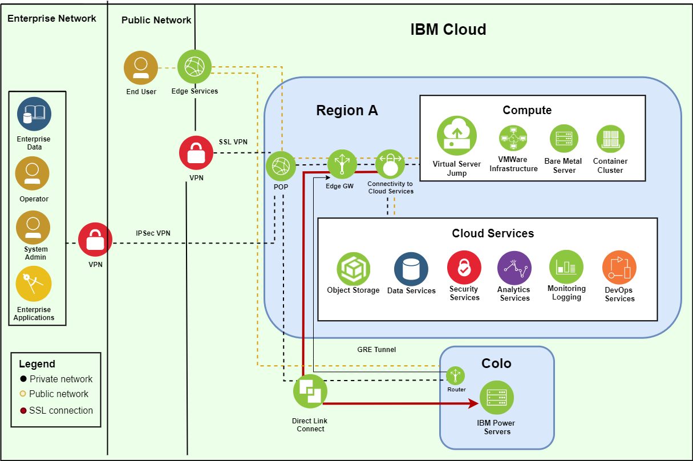
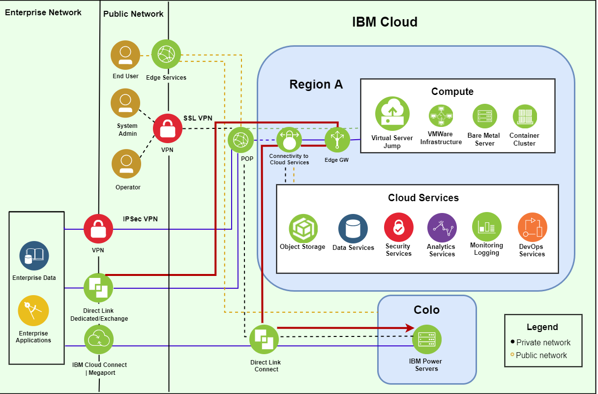
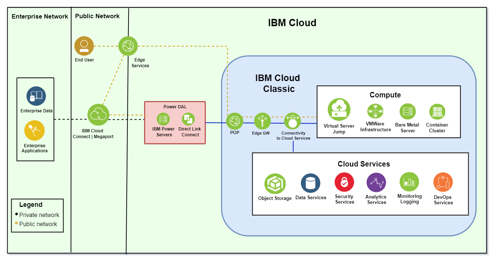
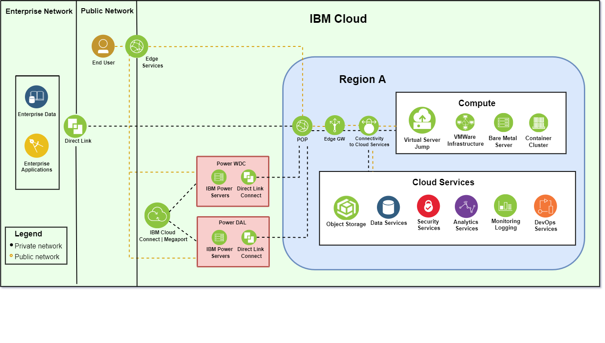

---

copyright:
  years: 2019

lastupdated: "2019-11-07"

keywords: networking graphics, network architecture, private SSL, private IPSec, Direct Link, colocation, colo, IBM Cloud Connection, Megaport, IBM Cloud network

subcollection: power-iaas

---

{:new_window: target="_blank"}
{:shortdesc: .shortdesc}
{:screen: .screen}
{:codeblock: .codeblock}
{:pre: .pre}
{:tip: .tip}
{:note: .note}
{:important: .important}
{:deprecated: .deprecated}
{:external: target="_blank" .external}

# Network architecture
{: #network-reference-architecture}

Use the following graphics to better understand the {{site.data.keyword.powerSysShort}} network architecture. This is currently not an exhaustive list of the {{site.data.keyword.powerSysShort}} connection methods.
{: shortdesc}

## Private SSL connection
{: #private-ssl}

You can use the **IBM Cloud SSL VPN** service to connect to your existing IBM Cloud network. Inside the IBM Cloud network, you can use a IBM Cloud virtual machine (VM) as a jump server to connect to your Power Systems Virtual Server instance.

  {: caption="Figure 1. Power Systems Virtual Server private SSL connection" caption-side="bottom"}

## Private IPSec connection
{: #private-ipsec}

You can use the **IBM Cloud IPSec VPN** service to connect into your existing IBM Cloud network. Inside the IBM Cloud network, you can use the IBM Cloud VRA to connect to your Power Systems Virtual Server instance.

  {: caption="Figure 2. Power Systems Virtual Server private IPSec connection" caption-side="bottom"}

## Private Direct Link connection
{: #private-direct-link}

You can use a private Direct Link connection to connect into your existing IBM Cloud network.

  {: caption="Figure 3. Power Systems Virtual Server private Direct Link connection" caption-side="bottom"}

## IBM Cloud Connect (or Megaport) to colocation (colo) connection
{: #cloud-to-colo}

You can connect to the IBM Cloud Power environment by using IBM Cloud connect or Megaport.

  {: caption="Figure 4. Power Systems Virtual Server Colo connection" caption-side="bottom"}

## IBM Power on-premise environment to colo connection
{: #onprem-to-colo}

You can connect your IBM Power on-premise environment to a colo by using IBM Cloud Connect or Megaport.

  {: caption="Figure 5. Power Systems Virtual Server private on-premise to Colo connection" caption-side="bottom"}

## IBM Power colo to colo connection
{: #colo-to-colo}

You can connect a colo to a colo by using Direct Link and IBM Cloud Connect or Megaport.

  {: caption="Figure 6. Power Systems Virtual Server Colo to Colo connection" caption-side="bottom"}

## IBM dual colo connection
{: #dual-colo}

You can connect two colos after creating a Direct Link connection and by using IBM Cloud Connect or Megaport.

  {: caption="Figure 7. Power Systems Virtual Server private dual Colo connection" caption-side="bottom"}
