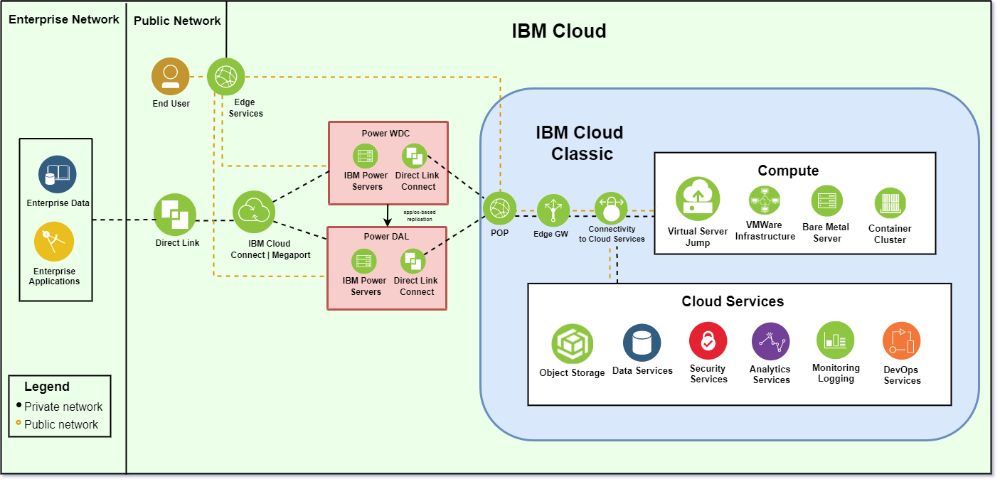

---

copyright:
  years: 2019, 2020

lastupdated: "2020-05-20"

keywords: networking diagrams, network architecture, private ssl, private ipsec, direct link, colocation, data center, cloud connect, megaport

subcollection: power-iaas

---

{:new_window: target="_blank"}
{:shortdesc: .shortdesc}
{:screen: .screen}
{:codeblock: .codeblock}
{:pre: .pre}
{:tip: .tip}
{:note: .note}
{:important: .important}
{:deprecated: .deprecated}
{:external: target="_blank" .external}

# Network architecture diagrams
{: #network-reference-architecture}

Use the following graphics to better understand the {{site.data.keyword.powerSysShort}} network architecture. This is not an exhaustive list of the {{site.data.keyword.powerSys_notm}} connection methods.
{: shortdesc}

IBM Cloud Connect is only available to IBM clients within the US. IBM clients can always contact Megaport directly to procure their services.
{: important}

## Private SSL connection
{: #private-ssl}

You can use the **IBM Cloud SSL VPN** service to connect to your existing IBM Cloud network. Inside the IBM Cloud network, you can use a IBM Cloud virtual machine (VM) as a jump server to connect to your Power Systems Virtual Server instance.

  {: caption="Figure 1. Power Systems Virtual Server private SSL connection" caption-side="bottom"}

## Private IPSec connection
{: #private-ipsec}

You can use the **IBM Cloud IPSec VPN** service to connect into your existing IBM Cloud network. Inside the IBM Cloud network, you can use the IBM Cloud VRA to connect to your Power Systems Virtual Server instance. As a part of this networking scenario, there is a GRE tunnel beteween a switch inside the Power colo and the edge gateway inside the IBM Cloud.For a complete tutorial on site-to-site VPN connectivity, see [IBM Power Virtual Server Virtual Private Network Connectivity](https://ibm.seismic.com/Link/Content/DCcdornqWne0KxP7QGfCZ9Gw){: new_window}{: external}.

  {: caption="Figure 2. Power Systems Virtual Server private IPSec connection" caption-side="bottom"}

## Private Direct Link connection
{: #private-direct-link}

You can use a **private Direct Link** connection to connect into your existing IBM Cloud network. As a part of this networking scenario, there is a GRE tunnel beteween a switch inside the Power colo and the edge gateway inside the IBM Cloud.

  {: caption="Figure 3. Power Systems Virtual Server private Direct Link connection" caption-side="bottom"}

## IBM Cloud Connect (or Megaport) to data center connection
{: #cloud-to-colo}

You can connect to the IBM Cloud Power environment by using **IBM Cloud Connect or Megaport**. As stated previously, IBM Cloud Connect is only available to IBM clients within the US.

  {: caption="Figure 4. Power Systems Virtual Server data center connection" caption-side="bottom"}

## IBM Power on-premise environment to colo connection
{: #onprem-to-colo}

You can connect your IBM Power on-premise environment to a colo by using **IBM Cloud Connect or Megaport**.

  {: caption="Figure 5. Power Systems Virtual Server private on-premise to Colo connection" caption-side="bottom"}

## IBM Power colo to colo connection using Megaport
{: #colo-to-colo-megaport}

You can connect a colo to a colo by using **Direct Link and IBM Cloud Connect or Megaport**.

When connecting a colo to a colo by using Megaport, you might need a [Megaport Cloud Router (MCR)](https://knowledgebase.megaport.com/megaport-cloud-router/what-is-mcr/){: new_window}{: external}. If you want to route to more than one location from your colo, you must use an MCR (unless your router can perform this function). In some cases, an MCR is not required. For example, you only need one Megaport port open to perform a data replication between *DAL13* and *WDC04*. Please consult an IBM Cloud Connect or Megaport representative for specific network requirements.

  {: caption="Figure 6. Power Systems Virtual Server Colo to Colo connection (Megaport)" caption-side="bottom"}

<!-- ## IBM Power colo to colo connection using GRE tunneling
{: #colo-to-colo-gre}

You can connect a colo to a colo by using **Direct Link** and GRE tunnels.

  {: caption="Figure 7. Power Systems Virtual Server Colo to Colo (GRE Tunneling)" caption-side="bottom"} -->

## IBM dual colo connection
{: #dual-colo}

You can connect to two colos from your on-premises environment after creating a **Direct Link connection and by using IBM Cloud Connect or Megaport**.

  {: caption="Figure 8. Power Systems Virtual Server private dual Colo connection" caption-side="bottom"}
