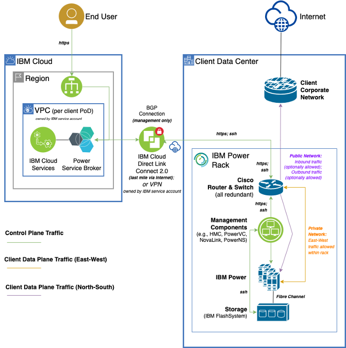

---

copyright:
  years: 2023, 2024

lastupdated: "2024-06-10"

keywords: network overview, {{site.data.keyword.powerSys_notm}} as a service, private cloud, network, network architecture

subcollection: power-iaas

---

{{site.data.keyword.attribute-definition-list}}

# Network overview
{: #network-private-cloud}

[On-premises]{: tag-red}

Establishing a connectivity between the pod in your data center and {{site.data.keyword.powerSysFull}} IBM Cloud requires meticulous planning, site preparation, meeting the prerequisites, understanding the network architecture, and others.


Setting up of a network involves setting up the following two networks:
* [Control plane network](#control-plane-network) - for communication between IBM Cloud and the pod that is located in your data center.
* [Data plane network](#data-plane-network) - for accessing virtual servers.

## Control plane network
{: #control-plane-network}

The IBM {{site.data.keyword.powerSys_notm}} Private Cloud network architecture requires connectivity between IBM Cloud and the pod that is located in your IBM {{site.data.keyword.powerSys_notm}} Private Cloud data center. This connectivity is the main communication channel between the Service Broker, IBM Cloud, and pod. This communication channel is known as a control plane network. Through this channel, the Service Broker can start the APIs on PowerVC for {{site.data.keyword.powerSys_notm}} for the virtual machine lifecycle operations.
{: shortdesc}

The control plane network is set up with redundancy, providing multiple network paths, to ensure that the pods are connected to the IBM Cloud regions reliably. The control plane network can be set up by using an IBM Cloud Direct Link 2.0 or Virtual private network (VPN). For IBM Cloud Direct Link 2.0 connection, IBM orders the device that uses an IPsec over VPN (last-mile connectivity) to connect to the IBM {{site.data.keyword.powerSys_notm}} Private Cloud pod in the IBM Cloud region.

Before the pod installation, provide the required network-specific information so that either the IBM Cloud Direct Link 2.0 connection or VPN connection can be established.

### IBM Cloud Direct Link 2.0 Connect
{: #direct-link}

The IBM Cloud Direct Link 2.0 Connect is an IBM Cloud technology to connect to the remote data centers. This technology connects a Virtual Private Cloud (VPC) on the IBM Cloud and a router connecter to the pod that is located in your data center. The IBM Cloud Direct Link 2.0 Connect uses an IPsec over VPN (also known as last-mile connectivity) to connect to the pod. Thus, the IBM Cloud Direct Link network goes through the data center environment at a minimum level and is connected to the pod's router. The control plane network is set up with redundancy, providing multiple network paths, to ensure that the pods are connected to the IBM Cloud regions reliably. IBM orders an IBM Cloud Direct Link 2.0 Connect for your account by using the third-party network provider details that you might have provided earlier (like Megaport or Equinix). The attributes, such as service keys, are gathered from the ordering process. After the ordering is complete, the corresponding third-party network providers can establish the remote connectivity between the IBM Cloud and the data center.

The IBM Cloud Direct Link 2.0 Connect can be viewed as an alternative to a traditional site-to-site VPN solution. This connectivity can provide security and privacy, consistent, and higher-throughput connectivity between a remote network and IBM Cloud environments. For more information about IBM Cloud Direct Link Connect, see [Getting started with IBM Cloud Direct Link](https://cloud.ibm.com/docs/dl?topic=dl-get-started-with-ibm-cloud-dl){: external}.

The connectivity between IBM Cloud and pod has two parts:
* Shared connectivity between the IBM Cloud network infrastructure and the third-party network provider infrastructure.
* An internet-based connectivity between the third-party network provider infrastructure and the data center. This is called as ‘last mile connectivity’ and might involve an IPsec VPN. Contract with a service provider to provide the last mile connection.

To establish this connectivity, the collaboration between you, IBM, and the third-party network provider is required.

### Virtual Private Network
{: #vpn}

The Virtual Private Network(VPN) between the IBM Cloud and the pod can be established in the following ways:
* **Site-to-Site VPN connectivity** A VPN gateway can be set up on the VPC that houses the service broker. This gateway provides an internet-facing IP address. You can establish a VPN client on your data center that can provide an internet-facing IP address. This connectivity forms an IPsec VPN tunnel between the two end points. Then, the VPN client on your data center can be extended to the IBM {{site.data.keyword.powerSys_notm}} Private Cloud routers.
* **VPN connectivity by using IBM Cloud classic environment**: A Juniper vSRX Virtual Firewall can be deployed in the classic environment on the IBM Cloud. This setup can be connected to the VPC that houses the service broker through a transit-gateway. Alternatively, a similar VPN hardware or software environment can be set up on your data center environment. This setup can be connected through an IPsec VPN tunnel and extended to the IBM {{site.data.keyword.powerSys_notm}} Private Cloud routers. Your data center infrastructure must be connected to the routers on the pod. This connectivity is recommended to be as minimal as possible. You can set up one or more virtual routers in your environment and set up a Border Gateway Protocol (BGP) deployment by using the IBM {{site.data.keyword.powerSys_notm}} Private Cloud routers.

## Data plane network
{: #data-plane-network}

The data plane network is enabled when the pods in your data center are connected to your IBM {{site.data.keyword.powerSys_notm}} Private Cloud network infrastructure. You must be able to access the virtual servers (logical partitions) in the pod through your network instead of IBM Cloud.

The pod contains all the software components that are required to communicate to the IBM Cloud. The components include service software such as HMC and PowerVC, and storage and network devices such as Application Centric Infrastructure (ACI) and router.

When you create a network within a pod, ensure that the network does not overlap with other existing networks in the same workspace within the pod. If you create an overlapping network, an error message is displayed.

If you create an overlapping network through an API, an error message similar to the following example is displayed:

```text
{
  "errors": "Subnet overlap between uni/tn-VPN502/BD-BD_VPN502_V504_PRIV_3302/subnet-[192.168.31.1/24] and uni/tn-VPN502/BD-BD_VPN502_V504_PRIV_3301/subnet-[192.168.31.1/24] in VRF uni/tn-VP
N502/ctx-VPN502_V504_VRF. It is not possible to have overlapping subnets across different Bridge Domains within the same VRF."
}
````

As part of the network planning, you can review the following use cases and identify the use cases that are applicable to you. You can communicate about such requirements before the installation so that you do not have to open separate support tickets to implement the use-cases and configurations.

* **Connectivity between the LPARs within a pod** - You can create an internal private network and deploy LPARs on them with no external connectivity. These LPARS can be accessible with each other due to the automated *Host Communication*, which configures the ACI fabric inside the pod. For more information, see [Connectivity between the LPARs within a pod](/docs/power-iaas?topic=power-iaas-network_use_cases#connect_lpars_within_pod){: external}.
* **Outbound-only external connectivity via DNAT** - You can create external networks in the pod. Connectivity for these networks must be configured through a manual ticket process. After the connectivity configuration, LPARs can be deployed on them and they can access external networks. You can always deploy LPARs with both internal and external networks as separate network interfaces. For more information, see [Outbound-only external connectivity via DNAT](/docs/power-iaas?topic=power-iaas-network_use_cases#outbound-ext-conn-dnat){: external}.
* **Bi-directional external connectivity via BGP** - You can deploy an external network within the pod to establish the communicating between the endpoints that are in the IBM {{site.data.keyword.powerSys_notm}} Private Cloud network environment by using BGP. For more information, see [Bi-directional external connectivity via BGP](/docs/power-iaas?topic=power-iaas-network_use_cases#bi-dir-ext-conn-bgp){: external}.
* **Bi-directional external connectivity via Static Route** - You can deploy an external network within the pod to establish the communicating between the endpoints that are in the IBM {{site.data.keyword.powerSys_notm}} Private Cloud network environment by using static route similar to BGP. For more information, see [Bi-directional external connectivity via static routes](/docs/power-iaas?topic=power-iaas-network_use_cases#bi-dir-ext-conn-static-routes){: external}.
* **Bi-directional external connectivity - ACI L2Out** -  When you establish this type of external connectivity, it by-passes the router and directly connects to the ACI fabric. This type of connectivity is useful if the same IP address space is required on both internal and external networks. All other types of external networks involve two distinct subnets. For more information, see [Bi-directional external connectivity via ACI L2Out](/docs/power-iaas?topic=power-iaas-network_use_cases#bi-dir-ext-conn-ACI-L2out){: external}.


## Network architecture diagrams
{: #netwok-architecture-diagrams}

Figure 1 shows the overall view of the network architecture.
{: caption="Figure 1. High-level network architecture in {{site.data.keyword.powerSys_notm}}" caption-side="bottom"}


