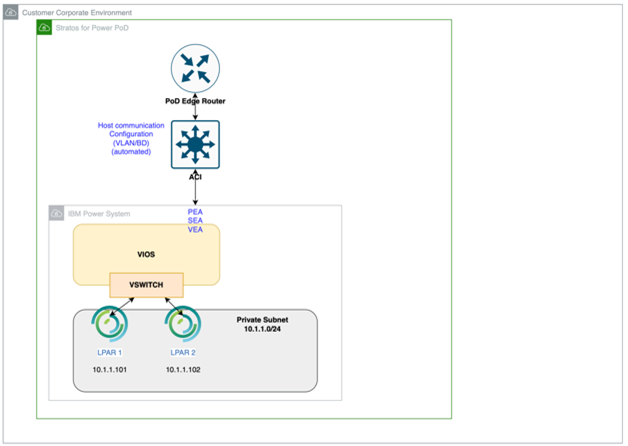
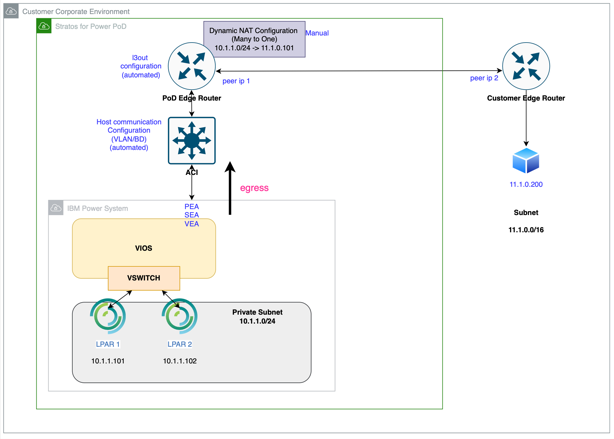
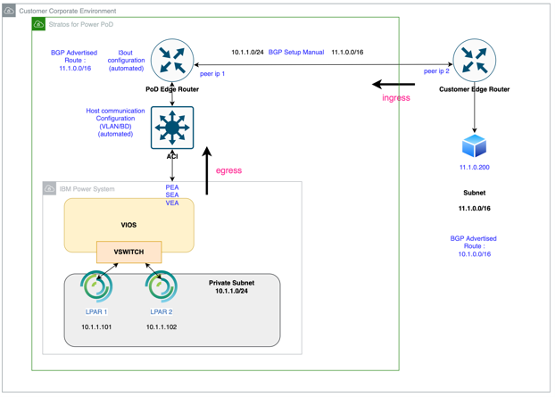
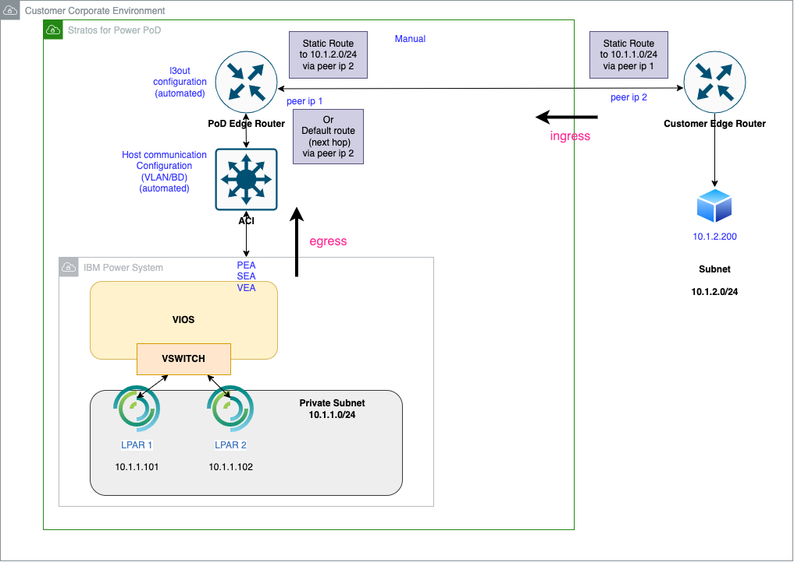
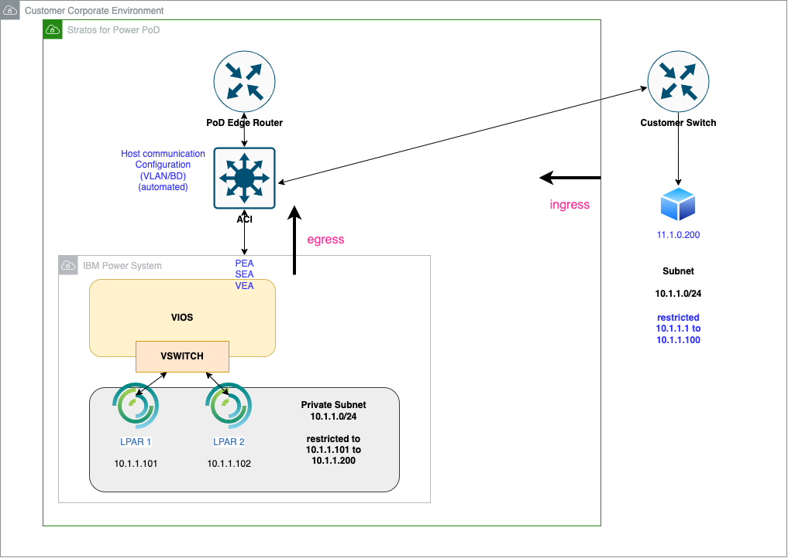
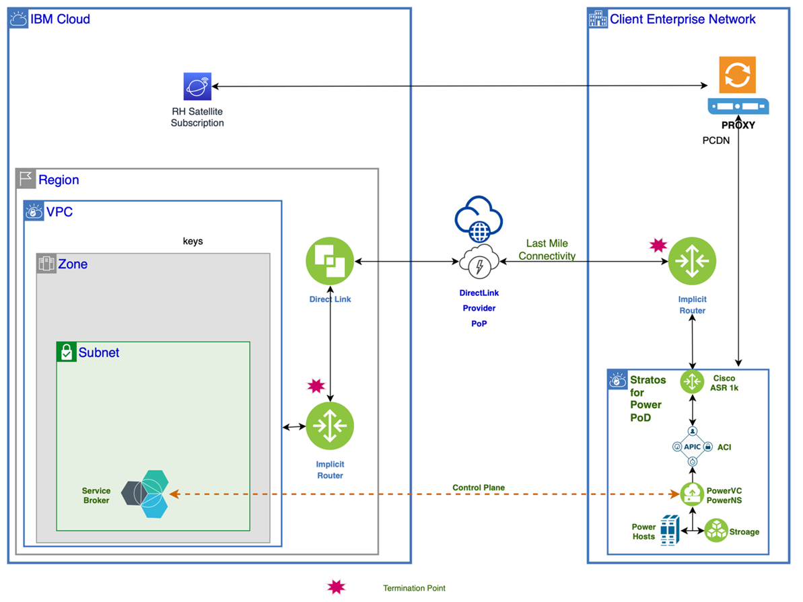

---

copyright:
  years: 2023

lastupdated: "2023-04-28"

keywords: network, network use cases, {{site.data.keyword.powerSys_notm}}, private cloud, terminology, architecture, how-to, outbound-only, bidirectional, BGP, DHCP, full linux

subcollection: power-iaas

---

{{site.data.keyword.attribute-definition-list}}

# Network use cases
{: #network_use_cases}

[On-Premises]{: tag-red}

Review the common network use cases within the network architecture of {{site.data.keyword.powerSysFull}}.
{: shortdesc}

## Use case 1: Private network within a pod
{: #connect_lpars_within_pod}

With this use case, you can establish a private network within a pod that allows communication between the applications located in the pod. You can establish a private network within the pod by using the IP address allocation method, Classless Inter-Domain Routing (CIDR).

You can deploy virtual machines in a pod that has a default configuration by using one of the following patterns:
* **Affinity**: In this pattern, virtual machines are deployed on the same physical host. Therefore, the virtual machines can communicate with each other on the same host through the attached Ethernet switch.
* **Anti-affinity**: In this pattern, virtual machines are deployed on different physical hosts. A custom configuration is required on the externally connected Ethernet switch to enable communication between virtual machines that are deployed on different physical hosts.

### Example
{: #pri-example}

You have a database server and a web server that need to communicate exclusively with each other. You can connect both servers to the same private network to enable communication between them.

Figure 1 describes the private network within a pod type of network setup.
{: caption="Figure 1. Private network within a pod" caption-side="bottom"}

## Use case 2: Outbound-only
{: #outbound-ext-conn-dnat}

With this use case, you can establish a private network that allows communication between applications within the pod and with external destination points. However, the applications within the pod are not accessible from the destination points on the external network. You can establish an outbound-only network connectivity through dynamic Network Address Translation (NAT) gateway configuration, resembling a network established by using routers.

### Example
{: #out-example}

A virtual machine within a pod downloads and deploys software from the internet.

You can specify the outbound-only network type when you define network requirements before pod installation. For more information, see [Network requirement](/docs-draft/power-iaas?topic=power-iaas-pre_installation_checklist#network-req). After pod installation, you can configure the outbound-only network type by using Support Center ticketing system. For more information, see [Getting support](https://cloud.ibm.com/docs/get-support?topic=get-support-using-avatar&interface=ui){: external} section.

Figure 2 describes the outbound-only type of network setup.
{: caption="Figure 2. Outbound-only network type" caption-side="bottom"}

## Use case 3: Bidirectional external connectivity through BGP
{: #bi-dir-ext-conn-bgp}

With this use case, you can establish a network that allows communication between the applications within the pod and with the destination points on the external network. By setting up the Layer 3 Firewall rules, you can allow both inbound and outbound connections. Configure the Border Gateway Protocol (BGP) manually between the pod router and the corporate network. By using the BGP configuration, establish a connection between the private network and the corporate network. To configure BGP manually, contact the Support Center. For more information, see [Getting support](https://cloud.ibm.com/docs/get-support?topic=get-support-using-avatar&interface=ui){: external} section.

### Example
{: #BGP-example}

 You have a database server that is running inside the pod. You need to access the database server from another application that resides outside the pod but within your corporate network. Layer 3 inbound access, you can route the traffic and apply your corporate firewall or routing rules to access the database server. The corporate network can access the pod subnets by using a BGP connection.

Figure 3 describes the bidirectional external connectivity through BGP type of network setup.
{: caption="Figure 3. Bidirectional external connectivity through BGP" caption-side="bottom"}

## Use case 4: Bidirectional external connectivity through static routes
{: #bi-dir-ext-conn-static-routes}

With this use case, you can establish a network that allows communication between applications within the pod and with destination points on the external network. Layer 3 firewall rules, you can allow both inbound and outbound connections. Establish a static route between edge routers that are within the pod and to the next hop router that is within the corporate network. The static route establishes a connection between the pod subnet and the corporate network. To establish the static route connectivity manually, contact the Support Center. For more information, see [Getting support](https://cloud.ibm.com/docs/get-support?topic=get-support-using-avatar&interface=ui){: external} section.

### Example
{: #static-example}

You have a database server that is running inside the pod. You need to access the database server from another application that resides outside the pod but within your corporate network. Layer 3 inbound access, you can route the traffic and apply your corporate firewall or routing rules to access the database server. Your corporate network can access the pod subnets through a static route connection.

Figure 4 describes the bidirectional external connectivity through static routes type of network setup.
{: caption="Figure 4. Bidirectional external connectivity through static routes" caption-side="bottom"}

## Use case 5: Bidirectional external connectivity - ACI Layer 2
{: #bi-dir-ext-conn-ACI-L2out}

With this use case, you can create a network that allows communication between applications within the pod and with destination points on the external network. Integrate a Layer 2 firewall with one of your existing corporate networks to allow the outbound connections. In this type of network, bidirectional external connectivity, bypass the router and connect to the Cisco Application Centric Infrastructure (Cisco ACI). You can establish this type of connectivity when you want the same IP address space on both internal and external networks. All other external networks involve two distinct subnets.

Figure 5 describes the bidirectional external connectivity by using ACI Layer 2 firewall type of network setup.
{: caption="Figure 5. Bidirectional external connectivity through ACI L2Out" caption-side="bottom"}

## Use case 6: Network connectivity for full Linux subscription
{: #net-conn-full-linux-sub}

With this use case, you can establish a network between a virtual machine in the pod and the Red Hat Satellite server on IBM Cloud. The virtual machine has the stock image of Red Hat Enterprise Linux (RHEL) with full Linux subscription.

Connect the virtual machine in the pod to a proxy network in the corporate network environment. Connect the proxy network to the Red Hat Satellite server on IBM Cloud by using either Direct Link or VPN connection. The virtual machine in the pod can access the Linux&reg; satellite server to retrieve software fixes and other artifacts.

The network connectivity for full Linux subscription can be established by providing the network requirements before installing the pod. For more information, see [Network requirement](/docs-draft/power-iaas?topic=power-iaas-pre_installation_checklist#network-req). Once the pod is installed, you can configure the network connectivity for full Linux subscription by using the Support Center ticketing system. For more information about full Linux subscription, see [Full Linux subscription for Power Virtual Server private cloud](/docs-draft/power-iaas?topic=power-iaas-full-linux-sub). For more information about contacting the Support Center, see [Getting support](https://cloud.ibm.com/docs/get-support?topic=get-support-using-avatar&interface=ui){: external} section.

Figure 6 describes the network connectivity between a virtual machine and a Red Hat Satellite server on IBM Cloud setup.

{: caption="Figure 6. Network connectivity for full Linux subscription" caption-side="bottom"}

## Use case 7: DHCP network inside the pod
{: #dhcp-network}

With this use case, you can use the Dynamic Host Configuration Protocol (DHCP) protocol within the pod to dynamically assign an IP address to a virtual machine.

The presence of the DHCP network within the pod is mandatory when you are using the OpenShift Container Platform on the IBM {{site.data.keyword.powerSys_notm}} Private Cloud environment.
{: note}

IBM {{site.data.keyword.powerSys_notm}} Private Cloud pods can be configured to include a private and hardware-based DHCP network. The edge router within the pod is configured with the DHCP pool and gateway. You can deploy virtual machines in the DHCP network. The virtual machines are assigned IP addresses from the DHCP server.

You can attach only one DHCP network interface card (NIC) to a virtual machine. If you attach more than one DHCP NIC to a virtual machine, only one NIC acquires the IP address from the DHCP server that is assigned to the virtual machine.

When creating a DHCP network, note that the first five IP addresses are reserved. You must configure a network that has more than five IP addresses. For example, if the subnet mask is 255.255.255.248, the total number of IP addresses is eight. You cannot create a network with a subnet mask beyond 255.255.255.248 as it will have less than or equal to five IP addresses.
{: important}
