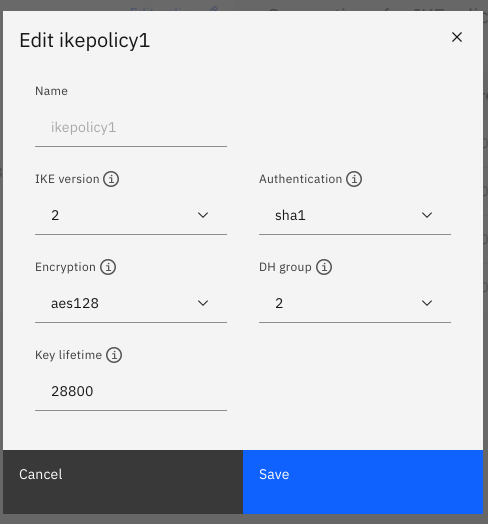
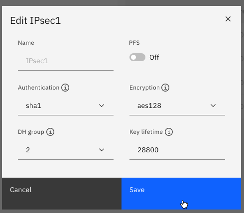
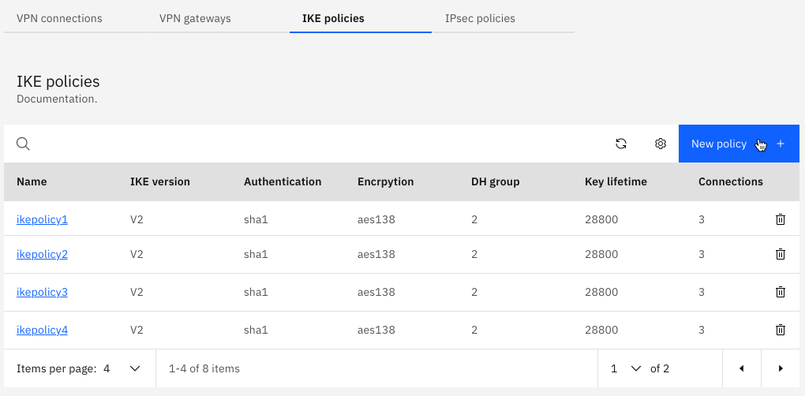
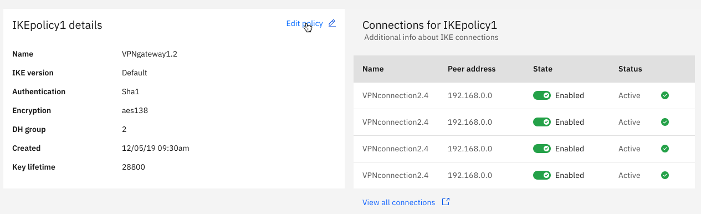
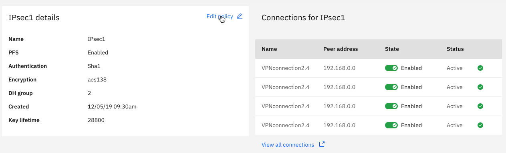
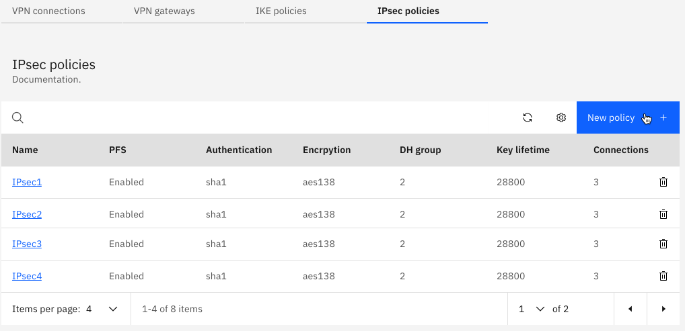
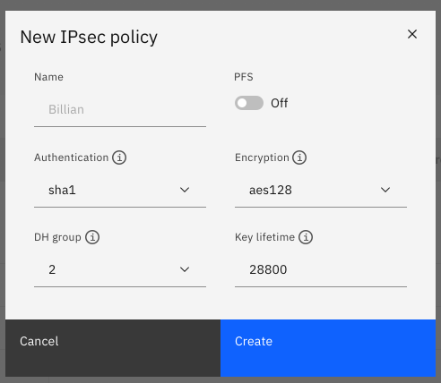
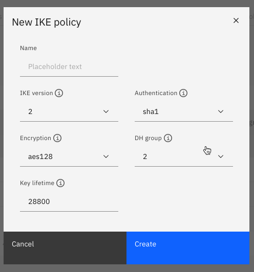
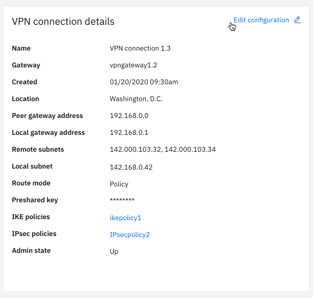
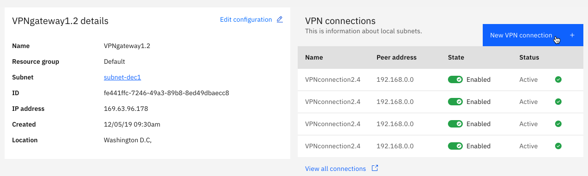

---

copyright:
  years: 2019, 2020

lastupdated: "2020-04-14"

keywords: network vpnaas, ipsec, internet key exchange, juniper, cisco, strongswan

subcollection: power-iaas

---

{:new_window: target="_blank"}
{:shortdesc: .shortdesc}
{:screen: .screen}
{:codeblock: .codeblock}
{:pre: .pre}
{:tip: .tip}
{:note: .note}
{:preview: .preview}
{:important: .important}
{:deprecated: .deprecated}
{:external: target="_blank" .external}

# Understanding virtual private networks (VPNs)
{: #understanding-vpn}

With the {{site.data.keyword.powerSysShort}} service's virtual private network (VPN), you can connect an on-premises VPN gateway to an {{site.data.keyword.cloud}} VPN (that was created within a {{site.data.keyword.powerSys_notm}} VPN gateway.
{: shortdesc}

The {{site.data.keyword.powerSys_notm}} infrastructure consists of subnets and virtual server instances (VSIs). The {{site.data.keyword.powerSys_notm}} VPN gateway establishes an IPsec site-to-site link to an on-premises VPN gateway.

The IPsec and the Internet Key Exchange (IKE) protocols are proven open standards for secure communication.
{: note}

There are many popular on-premises VPN solutions that are available for site-to-site gateways. You can get IPsec VPN solutions from companies like Cisco and Juniper or choose an open source IPsec-based VPN solution like strongSwan.

In short, you can use a VPN to:

- Connect your on-premises systems to services and workloads that are running in the {{site.data.keyword.cloud_notm}}.
- Ensure private and low-cost connectivity to {{site.data.keyword.cloud_notm}} services.
- Connect your cloud-based systems to services and workloads that are running on-premises.

## VPN-as-a-service (VPNaaS)
{: #understanding-vpn}

To request and configure your VPN, complete the following steps:

The {{site.data.keyword.powerSys_notm}} VPNaaS offering is in **beta**. You must open a support ticket to activate this offering. The official VPNaaS release will include user interface (UI) and command-line interface (CLI) support.
{: preview}

1. You can use VPNaaS with your existing VSIs and private networks. If you haven't created at least one VSI or private network, see [Creating a Power Systems Virtual Server](/docs/power-iaas?topic=power-iaas-creating-power-virtual-server) and [Configuring and adding a private network subnet](/docs/power-iaas?topic=power-iaas-configuring-subnet).

2. Open a support ticket against the {{site.data.keyword.powerSys_notm}} service to request a VPN connection. Follow the support ticket process that is described at [Getting help and support](/docs/power-iaas?topic=power-iaas-getting-help-and-support).

3. In the subject field of the support ticket, enter the following (replacing the location with your own):

    Power Systems Virtual Server VPNaaS Beta Setup - Location: FRA04
    {: screen}

4. In the support ticket description field, provide the following information for your network:

    1. **Gateway IP**
    2. **Connection name**
    3. **Subnets to be reached at your location (in CIDR notation)**
    4. **Subnets to be reached in the Power Systems Virtual Server environment (in CIDR notation)**

5. The {{site.data.keyword.powerSys_notm}} side of the VPN is configured after the {{site.data.keyword.powerSys_notm}} team gets the request. After the initial configuration, the {{site.data.keyword.powerSys_notm}} sends you the following network information to complete the configuration on your network:

    1. **Power VS Gateway IP**
    2. **Power VS IPsec Policy**
    3. **Shared secret key (provided to the authorized recipient)**

6. The {{site.data.keyword.powerSys_notm}} team add routes to your on-premises subnets, making your {{site.data.keyword.powerSys_notm}} subnets reachable by using the VPN.

7. The {{site.data.keyword.powerSys_notm}} team tests connectivity and provides the results in the original support ticket.

8. The support ticket is closed when you confirm that the VPN is working.

<!--
  {: caption="Figure x. Edit Ikepolicy" caption-side="bottom"}

  {: caption="Figure x. Edit IPsec" caption-side="bottom"}

  {: caption="Figure x. IKE policies" caption-side="bottom"}

  {: caption="Figure x. IKE policy details" caption-side="bottom"}

  {: caption="Figure x. IPsec details" caption-side="bottom"}

  {: caption="Figure x. IKEpolicy details" caption-side="bottom"}

  {: caption="Figure x. IPsec details" caption-side="bottom"}

  {: caption="Figure x. IPsec policies" caption-side="bottom"}

  {: caption="Figure x. New IPsec policy" caption-side="bottom"}

  {: caption="Figure x. VPN connection details" caption-side="bottom"}

  {: caption="Figure x. VPN gateway details" caption-side="bottom"}

  {: caption="Figure x. VPN gateway details" caption-side="bottom"}

  [Edit dead peer detection](./images/console-edit-dead-connection.png "Edit dead peer detection"){: caption="Figure x. Edit dead peer detection" caption-side="bottom"} -->
