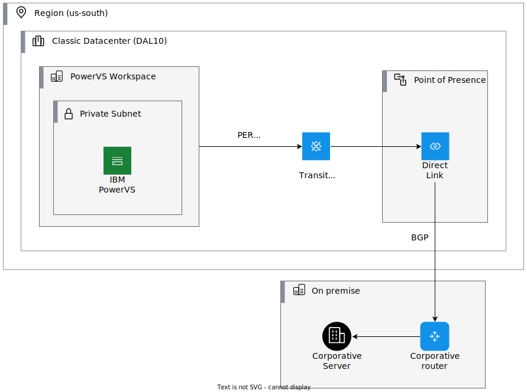
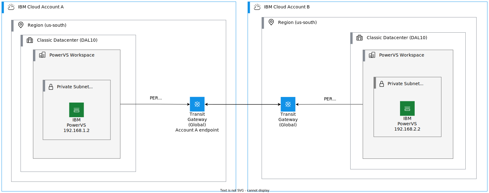
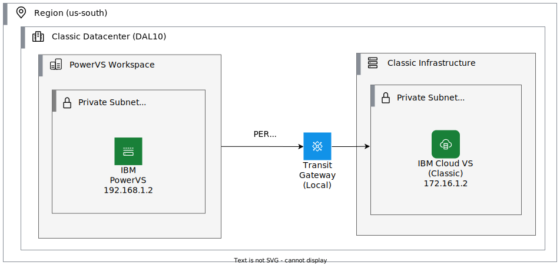
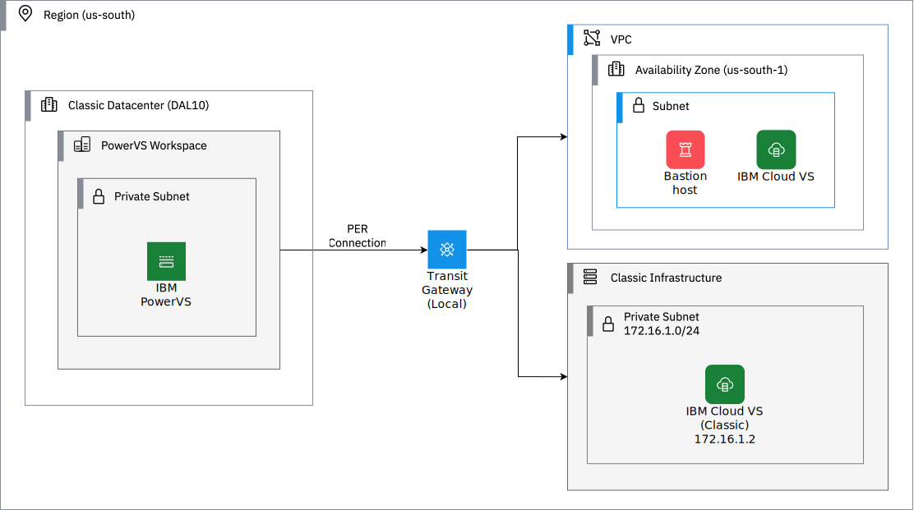
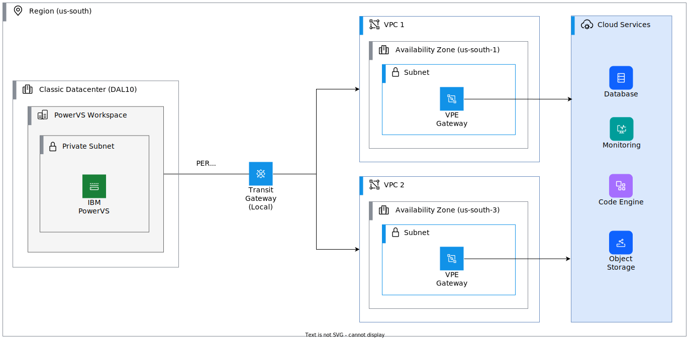
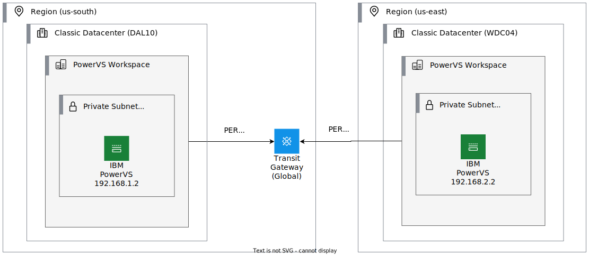

---

copyright:
  years: 2019, 2024

lastupdated: "2024-10-08"

keywords: networking diagrams, network architecture, private ssl, private ipsec, Direct Link connect, colocation, data center, cloud connect, megaport, PER use cases

subcollection: power-iaas

---

{{site.data.keyword.attribute-definition-list}}

# Network architecture diagrams
{: #network-architecture-diagrams}

---

IBM {{site.data.keyword.powerSys_notm}} located in IBM data centers: [Off-premises]{: tag-blue}

---

This topic describes typical network architectures that are used in the {{site.data.keyword.powerSysFull}} network architecture and is not an exhaustive list of {{site.data.keyword.powerSys_notm}} connection methods.
{: shortdesc}

## {{site.data.keyword.powerSys_notm}} networking environment
{: #networking-environment}

When you create a {{site.data.keyword.powerSys_notm}}, you can select a private or public network interface. For more information, see [Public and Private networks](/docs/power-iaas?topic=power-iaas-on-cloud-architecture#public-private-networks).

{{site.data.keyword.powerSys_notm}} network architectures consist of one or more of the following networks:

- **IBM Cloud infrastructure networks**: While the following infrastructure network environments offer different features and are managed separately, they can be connected to each other to provide layer-3 IPv4 traffic flow:
    - Classic:  Classic network resources include VLANs, subnets, and SSL Virtual Private Network (VPN) access. See [Network security architecture](https://www.ibm.com/cloud/architecture/architectures/network-security-arch/){: external} for a description of the classic network components. Bring Your Own IP (BYOIP) is not supported.
    - Virtual Private Cloud (VPC):  VPC network resources include subnets, floating IP addresses, security groups, and VPN gateways. For more information, see [About networking](/docs/vpc?topic=vpc-about-networking-for-vpc). See [Advanced networking for IBM Cloud VPC](https://www.ibm.com/cloud/architecture/content/course/advanced-networking-for-vpc/){: external} for a one-hour course on VPC networking. BYOIP is supported.
    - IBM Power:  Network resources include subnets. BYOIP is supported.
- **Overlay networks**: These networks exist in the IBM Cloud VMware Shared and VMware Dedicated offerings. While technically hosted in the IBM Cloud classic infrastructure environment, these networks are implemented in VMware NSX and are under your direct control, including the IP addressing schema. BYOIP is supported. Therefore, the IBM Cloud infrastructure networks cannot route the overlay networks; access is through tunnels.
- **External networks**:
    - Internet: Access the internet through resources that are hosted in any of the three IBM Cloud infrastructure environments.
    - Remote: Connect remote networks to your IBM Cloud networks. You can use the following services to connect to a remote network:
        - Internet VPN: Uses the public internet to connect remote networks and their IBM Cloud networks through a VPN. The VPN is terminated on gateway devices or a service within IBM Cloud.
        - {{site.data.keyword.dl_short}}: {{site.data.keyword.dl_short}} is a suite of offerings that enable the creation of direct and private connections between your remote, private cloud network and IBM Cloud, without traversing the public internet. For more information, see [Getting started with IBM Cloud {{site.data.keyword.dl_short}} (2.0)](/docs/dl?topic=dl-get-started-with-ibm-cloud-dl).

      You can connect {{site.data.keyword.dl_short}}s to either a local or remote {{site.data.keyword.tg_full_notm}}, which allows the private cloud network to access all networks that are connected to the {{site.data.keyword.tg_full_notm}}.
      {: note}

## Power Edge Routers
{: #about-per}

A Power Edge Router (PER) is a high-performance router that provides advanced routing capabilities for {{site.data.keyword.powerSysFull}} users. For more information, see [Getting started with the Power Edge Router](/docs/power-iaas?topic=power-iaas-per).

## Power Edge Router use cases
{: #per-use-cases}

Using a Power Edge Router (PER)-enabled workspace provides the following benefits:

* Improved performance with aggregated bandwidth of 400 Gbps.
* Direct access to the IBM Cloud services from the {{site.data.keyword.powerSys_notm}} workspace.
* Direct access to the {{site.data.keyword.powerSys_notm}} from a client-managed environment by using a Direct Link Connect or Direct Link Dedicated.

The following are some of the use cases of a PER-enabled {{site.data.keyword.powerSys_notm}} workspace:
1. [Connecting a client-managed data center](#per-on-orem)
2. [Connecting to classic infrastructure](#per-classic)
3. [Connecting to Virtual Private Cloud](#per-vpc)
4. [Connecting to IBM Cloud services](#per-cloud-services-se)
5. [Connecting multiple workspaces](#per-accross-dc)

The use cases are enabled with base capabilities and can be customized to meet any specific requirements.
{: important}

### Connecting a client-managed data center
{: #per-on-orem}

In this depiction, a client-managed data center uses a Direct Link connection to attach to the Transit Gateway.

1. You can attach a PER-enabled {{site.data.keyword.powerSys_notm}} workspace to a Transit Gateway. The Transit Gateway enables the connectivity to the client-managed data center through the incoming Direct Link connectivity by using Border Gateway Protocol (BGP) routing protocol. The Direct Link connectivity is interconnected through the Transit Gateway.

    {: caption="Figure 1. Connecting an on-premises workspace with a PER-enabled {{site.data.keyword.powerSys_notm}} by using the Transit Gateway." caption-side="bottom"}

2. You pay for the Direct Link connection that you use to connect your client-managed environment with the Transit Gateway. You can use up to 4 connections on a local Transit Gateway without any charges. For more information on Transit Gateway pricing, see: [Pricing for Power Edge Router](/docs/power-iaas?topic=power-iaas-pricing-virtual-server-on-cloud#per-pricing).

3. You can attach a PER-enabled {{site.data.keyword.powerSys_notm}} workspace that is located in different IBM Cloud Accounts through a Transit Gateway. The Transit Gateway enables the connectivity to the client-managed data center through the incoming Direct Link connectivity.

 

{: caption="Figure 2. Connecting two IBM Cloud Accounts with a PER and Global Transit Gateway." caption-side="bottom"}

### Connecting to classic infrastructure
{: #per-classic}

Establish a connection between PER-enabled {{site.data.keyword.powerSys_notm}} workspace and the classic infrastructure by local routing of Transit Gateway.

You do not pay extra charges for Transit Gateway. To establish the connection, the following conditions must be met:

* The workspace and the classic infrastructure must be in the same region.

*  The workspace must be connected to a Transit Gateway.

For more information on Transit Gateway pricing, see: [Pricing for Power Edge Router](/docs/power-iaas?topic=power-iaas-pricing-virtual-server-on-cloud#per-pricing).

 

{: caption="Figure 3. Connecting PER workspace with classic." caption-side="bottom"}

The following two scenarios for connecting the classic infrastructure to a PER-enabled workspace are differentiated based on the Generic Routing Encapsulation (GRE) tunnel requirement:

* **When is a GRE tunnel not required?**

    A GRE tunnel is not required to establish a connection from your PER-enabled workspace with classic infrastructure and to establish a connection when you do not have a custom IP address on your workspace.

    

{: caption="Figure 4. Connecting PER and Transit Gateway without a GRE tunnel." caption-side="bottom"}

* **When is a GRE tunnel required?**

A GRE tunnel is required to establish a connection from your PER-enabled {{site.data.keyword.powerSys_notm}} workspace to the classic infrastructure environment that is configured to use custom IP address ranges.

The GRE tunnel is used to wrap the custom IP address with another header so that it is routable through the IBM Cloud network underlay. For example, consider a Backend Customer Router (BCR) within the network underlay. The BCR allows only the IP address range 10.0.0.0/8 to pass through, while it drops the traffic that is originating from IBM {{site.data.keyword.powerSys_notm}} VLAN subnets that use the IP range 172.16.0.0/12 or other IP ranges.

The GRE tunnel must be attached to a Transit Gateway for the routing between the IBM Power VS workspace and classic infrastructure.

For detailed steps, see [Configuring Generic Routing Encapsulation (GRE) tunnel](/docs-draft/power-iaas?topic=power-iaas-cloud-connections#configure-gre-tunnel).

{: caption="Figure 5. Connecting PER and GRE through the Transit Gateway." caption-side="bottom"}

### Connecting to Virtual Private Cloud
{: #per-vpc}

Establish a connection between a PER-enabled {{site.data.keyword.powerSys_notm}} workspace and a Virtual Private Cloud (VPC) by using the Transit Gateway. To create a multi-connection network, connect the classic infrastructure with the Transit Gateway. Thus, a three-way connection is established between the PER-enabled workspace, VPC, and the classic infrastructure is established.

The pricing for this connection depends on the usage of a local or global Transit Gateway. For more information, see: [Pricing for Power Edge Router](/docs/power-iaas?topic=power-iaas-pricing-virtual-server-on-cloud#per-pricing).

 

{: caption="Figure 6. Connecting PER-enabled workspace with VPC and classic infrastructure." caption-side="bottom"}

### Connecting to IBM Cloud (Classic) services through Secure Endpoint (SE)
{: #per-cloud-services-se}

By default, a PER-enabled {{site.data.keyword.powerSys_notm}} workspace can connect to the IBM Cloud Service Endpoints (CSE).

You can also connect a PER-enabled workspace seamlessly with the Secure Endpoints (SE) in the classic infrastructure environment. To establish the connection through a Transit Gateway, complete the following steps:

1. Connect a PER-enabled {{site.data.keyword.powerSys_notm}} workspace to the classic infrastructure environment by using a Transit Gateway.
2. Connect {{site.data.keyword.powerSys_notm}} to the Secure Endpoint (SE) of the IBM Cloud (Classic) services.

    On a PER-enabled workspace that uses a custom IP address, the network is routed through a Network Address Translator (NAT) device. The NAT device converts the custom IP address into an IBM Cloud-supported IP address.

For information about Transit Gateway pricing, see [Pricing for Power Edge Router](/docs/power-iaas?topic=power-iaas-pricing-virtual-server-on-cloud#per-pricing).

 

 services via Secure Endpoint (SE)"){: caption="Figure 7. Connecting PER workspace to IBM Cloud (Classic) services via Secure Endpoint (SE)." caption-side="bottom"}

### Connecting to IBM Cloud services using VPE with PER
{: #per-cloud-services-VPE}

You can connect a private network with IBM Cloud Services APIs by using one of the following options:

* **Public endpoints**: You can connect to resources in all regions in your account through IBM Cloud public network.
* **Virtual Private Endpoints (VPE)**: You can connect by using a private IP address that is accessible only from your VPC.
* **Service endpoints (SE)**: You can establish the connection by completing the following steps:
    1. Enable virtual routing and forwarding (VRF) option on your network routers.
    2. Enable service endpoints for your account.
    3. Establish the connection by using a private IP address that is accessible only through the IBM Cloud private network.

However, you must establish secure connectivity to Cloud Object Storage (COS) for backup and restoration, encryption services, key management, and monitoring or database-as-a-service solutions.

To use VPE or SE options, you do not need a public network and you can apply a network access control list (ACL) to control network access. In addition, you can also use DNS services.

{: caption="Figure 8. Connecting IBM Cloud services by using VPE with PER." caption-side="bottom"}

### Connecting multiple workspaces across a data center
{: #per-accross-dc}

Use a local Transit Gateway to connect multiple {{site.data.keyword.powerSys_notm}} workspaces that are across different zones but in the same region. A PER-enabled workspace must be attached with the Transit Gateway that can exchange routes between two workspaces.

Use a global Transit Gateway to connect the workspaces that are present in different regions.

For more information about Transit Gateway charges for local and global routing, see [Pricing for Power Edge Router](/docs/power-iaas?topic=power-iaas-pricing-virtual-server-on-cloud#per-pricing).

{: caption="Figure 9. Connecting workspaces in different regions." caption-side="bottom"}
