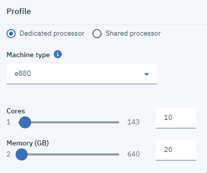

---

copyright:
  years: 2019

lastupdated: "2019-08-1"

---

{:shortdesc: .shortdesc}
{:new_window: target="_blank"}
{:codeblock: .codeblock}
{:pre: .pre}
{:screen: .screen}
{:tip: .tip}
{:note: .note}
{:table: .aria-labeledby="caption"}

# Power Systems Virtual Server の作成
{: #creating-power-virtual-server}

{{site.data.keyword.powerSysFull}} 作成して構成するには、以下の手順を実行します。

1. IBM Cloud アカウント資格情報を使用して、[IBM Cloud カタログ ](https://cloud.ibm.com/catalog){: new_window} にログインします。
2. カタログの検索ボックスに **Power Systems Virtual Server**と入力し、{{site.data.keyword.powerSys_notm}} タイルをクリックします。

    

3. サービスに名前を付け、{{site.data.keyword.powerSys_notm}} インスタンスをデプロイする場所を選択します。

    

4. Web ページの下部にある**「作成」**ボタンをクリックします。

    

5. **「作成」**ボタンをクリックすると、**「リソース・リスト」**パネルにリダイレクトされます。
6. **「リソース・リスト」**で**「サービス」**の下のサービスを選択し、**「管理」**パネルに移動します。

    

7. ここから**「新規プロビジョン」**ボタンをクリックします。

    

8. 新規インスタンスを正常に作成するには、すべての必須フィールドに入力します。

     {{site.data.keyword.powerSys_notm}} を作成するためのフィールドに入力すると、**「発注要約」**セクションで価格が動的に更新されます。これにより、ビジネス・ニーズを満たすコスト効率の高い {{site.data.keyword.powerSys_notm}} を簡単に作成できます。
     {: tip}

    1. **「仮想サーバー」**セクションの下のすべてのフィールドに入力します。複数のインスタンスを選択すると、追加のオプションが表示されます。

      

    1. **専用プロセッサー**と**共有プロセッサー**のどちらを希望するかを選択します。希望する**マシン・タイプ**、コアの数、およびメモリーの量も忘れずにクリックしてください。

      

    1. 最後に、組織の指示に従って、**「ブート・ボリューム」**、**「接続済みボリューム (Attached volumes)」**、および**「ネットワーク・インターフェース」**の各フィールドに入力します。

      

9. **「ご利用条件」**に同意し、**「作成」**ボタンをクリックして、新規 {{site.data.keyword.powerSys_notm}} をプロビジョンします。

以下の表には、**「仮想サーバー・インスタンス」**フィールドについての情報が示されています。

<table>
<caption>表 1. Power 仮想サーバー・インスタンスの新規フィールド</caption>
<tr>
<th>フィールド</th>
<th>説明</th>
</tr>
<tr>
<td>インスタンスの数</td>
<td>{{site.data.keyword.powerSys_notm}} 用に作成するインスタンスの数を指定します。複数のインスタンスを指定する場合は、以下の命名規則およびコロケーション規則を選択できます。
  <dl>
    <dt><strong>設定なし (No preference)</strong></dt>
  <dd>ホスティングの設定がない場合は、このオプションを選択します。</dd>
    <dt><strong>別のサーバー (Different Server)</strong></dt>
  <dd>各インスタンスを別々のサーバーでホストするには、このオプションを選択します。すべての {{site.data.keyword.powerSys_notm}} インスタンスに影響する可能性があるシングル・サーバー障害の発生が懸念される場合、このオプションを使用できます。</dd>
  <dt><strong>数値接頭部 (Numerical Prefix)</strong></dt>
  <dd>仮想サーバーの名前の前に番号を追加するには、このオプションを選択します。例えば、最初の {{site.data.keyword.powerSys_notm}} 名が <kbd>Austin</kbd> の場合、次の仮想インスタンスの名前は <kbd>1Austin</kbd> です。</dd>
  <dt><strong>数値接尾部 (Numerical Postfix)</strong></dt>
  <dd>仮想サーバーの名前の後に番号を追加するには、このオプションを選択します。例えば、最初の {{site.data.keyword.powerSys_notm}} 名が <kbd>Rochester</kbd> の場合、次の仮想インスタンスの名前は <kbd>Rochester1</kbd> です。
</dd>
  </dl>
  

  <strong>注:</strong> 仮想サーバーの複数インスタンスを作成する場合は、追加するデータ・ボリュームごとに、<strong>「共有可能 (Shareable)」</strong>フィールドから<strong>「オン (On)」</strong>を選択する必要があります。データ・ボリュームを共有可能にしない場合は、仮想サーバーの作成後にデータ・ボリュームを追加できます。
  

   </td>
</tr>
<tr>
<td>仮想マシンのピン留め (Pin Virtual Machine)</td>
<td>{{site.data.keyword.powerSys_notm}} をホスト・システムにロックするには、<strong>「オン (On)」</strong>を選択します。<strong>「オン (On)」</strong>を選択する場合、仮想サーバーを別のホストに移動できません。例えば、<strong>「オン (On)」</strong>を選択すると、ホストの保守中に障害が発生します。</td>
</tr>
<tr>
<td>マシン・タイプ (Machine Type)</td>
<td>マシン・タイプを指定します。選択するマシン・タイプにより、使用可能なコア数とメモリーが決まります。ハードウェア仕様について詳しくは、<a href="https://www.ibm.com/downloads/cas/KQ4BOJ3N" target="_blank">S922</a> および <a href="https://www.ibm.com/downloads/cas/EE476WAP" target="_blank">E880</a> を参照してください。</td>
</tr>
<tr>
<td>コア</td>
<td>{{site.data.keyword.powerSys_notm}} のコアの数を選択します。<strong>「共有プロセッサー」</strong>を選択した場合は、0.25 の増分でコア数を指定できます。例えば、有効なコア値は 0.5、1.25、および 2.75 です。仮想 CPU は、0.25 ライセンスごとに割り振られます。

パフォーマンスの問題が懸念される場合、<strong>専用プロセッサー</strong>を選択できます。プロセスは仮想サーバー専用になり、共有されないからです。詳しくは、<a href="https://www.ibm.com/developerworks/community/wikis/home?lang=en#!/wiki/Power%20Systems/page/How%20does%20Shared%20Processor%20Performance%20Compare%20to%20Dedicated%20Processors" target="_blank">
共有プロセッサーと専用プロセッサーのパフォーマンスの比較</a>を参照してください。
</td>
</tr>
<tr>
<td>メモリー</td>
<td>{{site.data.keyword.powerSys_notm}} のメモリーの量を選択します。選択できるメモリーの量は、選択したコアの数によって異なります。選択するコアごとに、最大 64 GB まで割り振ることができます。例えば、4 つのコアを選択した場合、最大 256 GB のメモリーを選択できます。</td>
</tr>
<tr>
<td>ブート・ボリュームの作成 (Create Boot Volume)</td>
<td>提供されている AIX または IBM i オペレーティング・システムのストック・イメージのバージョンを選択するか、以前にオンプレミスでデプロイしたカスタム AIX または IBM i オペレーティング・システムのイメージを選択します。オペレーティング・システムのライセンス情報については、IBM の <a href="https://www-03.ibm.com/software/sla/sladb.nsf" target="_blank">ライセンス情報の資料</a>を参照してください。

独自のカスタム・イメージを持ち込む場合は、<strong>「マシン・タイプ (Machine Type)」</strong>フィールドで選択した Power Systems ハードウェア用の、サポートされるテクノロジー・レベルの AIX または IBM i オペレーティング・システム・イメージを使用する必要があります。詳しくは、<a href="/docs/infrastructure/power-iaas?topic=power-iaas-configuring-custom-image#configuring-custom-image">カスタム・イメージの構成</a>を参照してください。</td>
</tr>
<tr>
<td>接続済みデータ・ボリューム (Attached Data Volumes)</td>
<td>新規データ・ボリュームを作成することも、IBM Cloud アカウントで既に定義されている既存のデータ・ボリュームを接続することもできます。
<dl>
  <dt><strong>データ・ボリュームの作成 (Create Data Volume)</strong></dt>
  <dd><strong>「追加」</strong>をクリックして、{{site.data.keyword.powerSys_notm}} インスタンスのより多くのストレージに使用できる新規データ・ボリュームを作成します。{{site.data.keyword.powerSys_notm}} の複数のインスタンスから同じデータ・ボリュームにデータを書き込めるようにする場合は、<strong>「共有可能 (Shareable)」</strong>フィールドで<strong>「オン (On)」</strong>を選択する必要があります。</dd>
  <dt><strong>既存データ・ボリュームの接続 (Attach Existing Data Volume)</strong></dt>
  <dd>{{site.data.keyword.powerSys_notm}} インスタンスのストレージを増やす既存のデータ・ボリュームを選択します。以前に使用したデータ・ボリュームがリストに表示されない場合は、そのデータ・ボリュームが別の IBM Cloud アカウントで作成されたことが原因である可能性があります。</dd>
</dl>
</td>
</tr>
<tr>
<td>パブリック・ネットワーク (Public Networks)</td>
<td>IBM 提供のパブリック・ネットワークを使用するには、このオプションを選択します。このオプションの選択に関連して、コストが発生します。詳しくは、<a href="/docs/infrastructure/power-iaas?topic=power-iaas-about-power-virtual-server#apvs-public-and-private" target="_blank">パブリック・ネットワークとプライベート・ネットワーク</a>を参照してください。
</td>
</tr>
<tr>
<td>プライベート・ネットワーク</td>
<td><strong>「追加」</strong>をクリックして、仮想サーバーの新規プライベート・ネットワークを指定します。プライベート・ネットワークを既に追加している場合は、リストからそれを選択できます。詳しくは、<a href="/docs/infrastructure/power-iaas?topic=power-iaas-cpn-configuring#cpn-configuring" target="_blank">プライベート・ネットワークの構成</a>を参照してください。</td>
</tr></table>
