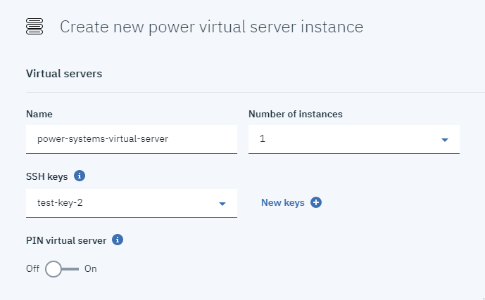

---

copyright:
  years: 2019

lastupdated: "2019-08-1"

---

{:shortdesc: .shortdesc}
{:new_window: target="_blank"}
{:codeblock: .codeblock}
{:pre: .pre}
{:screen: .screen}
{:tip: .tip}
{:note: .note}
{:table: .aria-labeledby="caption"}

# Power Systems Virtual Server 작성
{: #creating-power-virtual-server}

{{site.data.keyword.powerSysFull}}를 작성하고 구성하려면 다음 단계를 완료하십시오.

1. IBM Cloud 계정 인증 정보를 사용하여 [IBM Cloud 카탈로그 ](https://cloud.ibm.com/catalog){: new_window}에 로그인하십시오.
2. 카탈로그의 검색 상자에 **Power Systems Virtual Server**를 입력하고 {{site.data.keyword.powerSys_notm}} 타일을 클릭하십시오.

    

3. 서비스의 이름을 지정하고 {{site.data.keyword.powerSys_notm}} 인스턴스를 배치할 위치를 선택하십시오.

    

4. 웹 페이지의 맨 아래에서 **작성** 단추를 클릭하십시오.

    

5. **작성** 단추를 클릭하면 **리소스 목록** 패널로 경로 재지정됩니다.
6. **리소스 목록**의 **서비스** 아래에서 해당 서비스를 선택하여 **관리** 패널로 이동하십시오.

    

7. 여기서 **새로 프로비저닝** 단추를 클릭하십시오.

    

8. 모든 필수 필드를 완료하여 새 인스턴스를 작성하십시오.

     {{site.data.keyword.powerSys_notm}}를 작성하기 위한 필드를 완료하면 **주문 요약** 섹션에서 가격이 동적으로 업데이트됩니다. 이를 통해 비즈니스 요구사항을 충족하는 비용 효율적인 {{site.data.keyword.powerSys_notm}}를 쉽게 작성할 수 있습니다.
     {: tip}

    1. **가상 서버** 섹션 아래의 모든 필드를 채우십시오. 둘 이상의 인스턴스를 선택하면 추가 옵션이 표시됩니다.

      

    1. **전용 프로세서** 또는 **공유 프로세서**를 원하는지를 선택하십시오. 원하는 **머신 유형**, 코어 수 및 메모리 크기도 클릭해야 합니다.

      

    1. 마지막으로 조직에서 지시한 대로 **부트 볼륨**, **연결된 볼륨** 및 **네트워크 인스턴스** 필드를 완료하십시오.

      

9. **이용 약관**에 동의하고 **작성** 단추를 클릭하여 새 {{site.data.keyword.powerSys_notm}}를 프로비저닝하십시오.

다음 표에서는 **가상 서버 인스턴스** 필드에 대한 정보를 제공합니다.

<table>
<caption>표 1. 새 Power 가상 서버 인스턴스 필드</caption>
<tr>
<th>필드 </th>
<th>설명</th>
</tr>
<tr>
<td>인스턴스 수</td>
<td>{{site.data.keyword.powerSys_notm}}에 대해 작성할 인스턴스의 수를 지정하십시오. 둘 이상의 인스턴스를 지정하는 경우 다음과 같은 이름 지정 규칙 및 코로케이션 규칙을 선택할 수 있습니다.
  <dl>
    <dt><strong>환경 설정 없음</strong></dt>
  <dd>호스팅 환경 설정이 없는 경우 이 옵션을 선택하십시오.</dd>
    <dt><strong>다른 서버</strong></dt>
  <dd>각 인스턴스가 서로 다른 서버에서 호스팅되도록 하려면 이 옵션을 선택하십시오. 모든 {{site.data.keyword.powerSys_notm}} 인스턴스에 영향을 미칠 수 있는 단일 서버 가동 중단 발생에 대해 우려하는 경우 이 옵션을 사용할 수 있습니다.</dd>
  <dt><strong>숫자 접두부</strong></dt>
  <dd>가상 서버의 이름 앞에 숫자를 추가하려면 이 옵션을 선택하십시오. 예를 들어, 첫 번째 {{site.data.keyword.powerSys_notm}} 이름이 <kbd>Austin</kbd>인 경우 가상 인스턴스의 다음 이름은 <kbd>1Austin</kbd>입니다.</dd>
  <dt><strong>숫자 접미부</strong></dt>
  <dd>가상 서버의 이름 다음에 숫자를 추가하려면 이 옵션을 선택하십시오. 예를 들어, 첫 번째 {{site.data.keyword.powerSys_notm}} 이름이 <kbd>Rochester</kbd>인 경우 가상 인스턴스의 다음 이름은 <kbd>Rochester1</kbd>입니다.</dd>
  </dl>
  

  <strong>참고:</strong> 여러 가상 서버 인스턴스를 작성하는 경우 추가하는 각 데이터 볼륨의 <strong>공유 가능</strong> 필드에서 <strong>설정</strong>을 선택해야 합니다. 데이터 볼륨이 공유 가능하지 않도록 하려면 가상 서버를 작성한 후 데이터 볼륨을 추가할 수 있습니다.
  

   </td>
</tr>
<tr>
<td>가상 머신 고정</td>
<td>{{site.data.keyword.powerSys_notm}}를 호스트 시스템에 고정하려면 <strong>설정</strong>을 선택하십시오. <strong>설정</strong>을 선택하면 가상 서버를 다른 호스트로 이동할 수 없습니다. 예를 들어, <strong>설정</strong>을 선택하면 호스트 유지보수 중에 가동 중단이 발생할 수 있습니다.</td>
</tr>
<tr>
<td>머신 유형</td>
<td>머신 유형을 선택하십시오. 선택하는 머신 유형에 따라 사용 가능한 코어 수 및 메모리가 결정됩니다. 하드웨어 스펙에 대한 자세한 정보는 <a href="https://www.ibm.com/downloads/cas/KQ4BOJ3N" target="_blank">S922</a> 및 <a href="https://www.ibm.com/downloads/cas/EE476WAP" target="_blank">E880</a>을 참조하십시오.</td>
</tr>
<tr>
<td>코어</td>
<td>{{site.data.keyword.powerSys_notm}}에 대한 코어 수를 선택하십시오. <strong>공유 프로세서</strong>를 선택한 경우 코어 수를 0.25씩 증분하여 지정할 수 있습니다. 예를 들어, 올바른 코어 값은 0.5, 1.25 및 2.75입니다. 모든 0.25 인타이틀먼트마다 가상 CPU가 할당됩니다.

성능 문제가 우려되는 경우에는 프로세스가 가상 서버 전용이며 공유되지 않으므로 <strong>전용 프로세서</strong>를 선택할 수 있습니다. 자세한 정보는 <a href="https://www.ibm.com/developerworks/community/wikis/home?lang=en#!/wiki/Power%20Systems/page/How%20does%20Shared%20Processor%20Performance%20Compare%20to%20Dedicated%20Processors" target="_blank">How does Shared Processor Performance Compare to Dedicated Processors</a>를 참조하십시오.</td>
</tr>
<tr>
<td>메모리</td>
<td>{{site.data.keyword.powerSys_notm}}에 대한 메모리의 크기를 선택하십시오. 선택할 수 있는 메모리의 크기는 선택한 코어 수에 따라 다릅니다. 선택하는 각 코어마다 최대 64GB를 할당할 수 있습니다. 예를 들어, 4개의 코어를 선택한 경우 최대 256GB의 메모리를 선택할 수 있습니다. </td>
</tr>
<tr>
<td>부트 볼륨 작성</td>
<td>제공되는 AIX 또는 IBM i 운영 체제 스톡 이미지의 버전을 선택하거나 이전에 온프레미스에 배치한 사용자 정의 AIX 또는 IBM i 운영 체제 이미지를 선택하십시오. 운영 체제 라이센싱 정보는 IBM의 <a href="https://www-03.ibm.com/software/sla/sladb.nsf" target="_blank">라이센스 정보 문서</a>를 참조하십시오.

<strong>머신 유형</strong> 필드에서 선택한 Power Systems 하드웨어에 대한 AIX 또는 IBM i 운영 체제 이미지의 지원되는 기술 레벨을 사용해야 합니다. 자세한 정보는 <a href="/docs/infrastructure/power-iaas?topic=power-iaas-configuring-custom-image#configuring-custom-image">사용자 정의 이미지 구성</a>을 참조하십시오.</td>
</tr>
<tr>
<td>연결된 데이터 볼륨</td>
<td>새 데이터 볼륨을 작성하거나 이미 IBM Cloud 계정에 정의된 기존 데이터 볼륨을 연결할 수 있습니다.
<dl>
  <dt><strong>데이터 볼륨 작성</strong></dt>
  <dd>{{site.data.keyword.powerSys_notm}} 인스턴스에 대한 추가 스토리지로 사용될 수 있는 새 데이터 볼륨을 작성하려면 <strong>추가</strong>를 클릭하십시오. 여러 {{site.data.keyword.powerSys_notm}} 인스턴스가 동일한 데이터 볼륨에 데이터를 쓰도록 허용하려면 <strong>공유 가능</strong> 필드에서 <strong>설정</strong>을 선택해야 합니다.</dd>
  <dt><strong>기존 데이터 볼륨 연결</strong></dt>
  <dd>기존 데이터 볼륨을 {{site.data.keyword.powerSys_notm}} 인스턴스에 대한 추가 스토리지로 선택하십시오. 이전에 사용한 데이터 볼륨이 목록에 표시되지 않는 경우 데이터 볼륨이 다른 IBM Cloud 계정으로 작성되었기 때문일 수 있습니다.</dd>
</dl>
</td>
</tr>
<tr>
<td>공용 네트워크</td>
<td>IBM 제공 공용 네트워크를 사용하려면 이 옵션을 선택하십시오. 이 옵션 선택과 연관된 비용이 있습니다. 자세한 정보는 <a href="/docs/infrastructure/power-iaas?topic=power-iaas-about-power-virtual-server#apvs-public-and-private" target="_blank">공용 및 사설 네트워크</a>를 참조하십시오.
</td>
</tr>
<tr>
<td>사설 네트워크</td>
<td>가상 서버의 새 사설 네트워크를 식별하려면 <strong>추가</strong>를 클릭하십시오. 사설 네트워크를 이미 추가한 경우 목록에서 선택할 수 있습니다. 자세한 정보는 <a href="/docs/infrastructure/power-iaas?topic=power-iaas-cpn-configuring#cpn-configuring" target="_blank">사설 네트워크 구성</a>을 참조하십시오.</td>
</tr></table>
