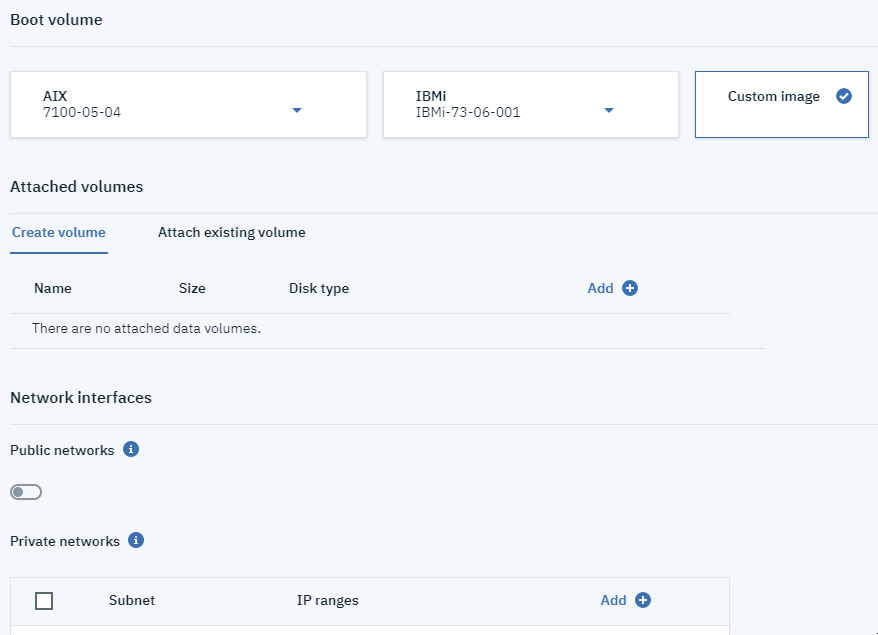

---

copyright:
  years: 2019

lastupdated: "2019-08-1"

---

{:shortdesc: .shortdesc}
{:new_window: target="_blank"}
{:codeblock: .codeblock}
{:pre: .pre}
{:screen: .screen}
{:tip: .tip}
{:note: .note}
{:table: .aria-labeledby="caption"}

# Criando um servidor virtual Power Systems
{: #creating-power-virtual-server}

Para criar e configurar um {{site.data.keyword.powerSysFull}}, conclua as etapas a seguir:

1. Efetue login no [catálogo do IBM Cloud ](https://cloud.ibm.com/catalog){: new_window} com as credenciais de sua conta do IBM Cloud.
2. Na caixa de procura do catálogo, digite **Servidor virtual Power Systems** e clique no quadro do {{site.data.keyword.powerSys_notm}}.

    

3. Nomeie seu serviço e escolha onde deseja implementar sua instância do {{site.data.keyword.powerSys_notm}}.

    

4. Clique no botão **Criar** na parte inferior da página da web.

    

5. Depois de clicar no botão **Criar**, você será redirecionado ao painel **Lista de recursos**.
6. Na **Lista de recursos**, selecione seu serviço em **Serviços** para acessar o painel **Gerenciar**.

    

7. Aqui, clique no botão **provisionar novo**.

    

8. Preencha todos os campos necessários para criar uma nova instância com sucesso:

     O preço é atualizado dinamicamente na seção **Resumo do pedido** à medida que você preenche os campos para criar um {{site.data.keyword.powerSys_notm}}. Isso permite criar facilmente um {{site.data.keyword.powerSys_notm}} com custo reduzido que satisfaça suas necessidades de negócios.
     {: tip}

    1. Preencha todos os campos da seção **Servidores virtuais**. Ao selecionar mais de uma instância, opções adicionais serão apresentadas.

      

    1. Selecione um **Processador dedicado** ou um **Processador compartilhado**. Lembre-se de clicar no **Tipo de máquina** desejado, no número de núcleos e na quantidade de memória.

      

    1. Finalmente, preencha os campos **Volume de inicialização**, **Volumes conectados** e **Interfaces de rede**, conforme instruído por sua organização.

      

9. Aceite os **Termos de uso** e clique no botão **Criar** para provisionar um novo {{site.data.keyword.powerSys_notm}}.

A tabela a seguir fornece informações sobre os campos **Instância de servidor virtual**:

<table>
<caption>Tabela 1. Novos campos Instância de servidor virtual Power</caption>
<tr>
<th>Campo</th>
<th>Descrição</th>
</tr>
<tr>
<td>Número de instâncias</td>
<td>Especifique o número de instâncias que deseja criar para o {{site.data.keyword.powerSys_notm}}. Ao especificar mais de uma instância, será possível selecionar as convenções de nomenclatura e regras de colocação a seguir:
  <dl>
    <dt><strong>Nenhuma preferência</strong></dt>
  <dd>Selecione esta opção se não tiver uma preferência de hospedagem.</dd>
    <dt><strong>Servidor diferente</strong></dt>
  <dd>Selecione esta opção para ter cada instância hospedada em um servidor diferente. É possível usar essa opção se você estiver preocupado com uma indisponibilidade de servidor único que afete todas as instâncias do {{site.data.keyword.powerSys_notm}}. </dd>
  <dt><strong>Prefixo numérico</strong></dt>
  <dd>Selecione esta opção para incluir números antes do nome do servidor virtual. Por exemplo, se o primeiro nome do {{site.data.keyword.powerSys_notm}} for <kbd>Austin</kbd>, o próximo nome para a instância virtual será <kbd>1Austin</kbd></dd>
  <dt><strong>Sufixo numérico</strong></dt>
  <dd>Selecione esta opção para incluir números após o nome do servidor virtual. Por exemplo, se o primeiro nome do {{site.data.keyword.powerSys_notm}} for <kbd>Rochester</kbd>, o próximo nome para a instância virtual será <kbd>Rochester1</kbd>.</dd>
  </dl>
  

  <strong>Nota:</strong> ao criar diversas instâncias de servidor virtual, deve-se selecionar <strong>Ligado</strong> no campo <strong>Compartilhável</strong> para cada volume de dados incluído. Se não desejar que o volume de dados seja compartilhável, inclua-o depois de criar o servidor virtual.
  

   </td>
</tr>
<tr>
<td>Fixar a máquina virtual</td>
<td>Selecione <strong>Ligado</strong> para bloquear o {{site.data.keyword.powerSys_notm}} em um sistema host. Ao selecionar <strong>Ligado</strong>, o servidor virtual não poderá ser movido para um host diferente. Por exemplo, selecionar <strong>Ligado</strong> causaria uma indisponibilidade durante a manutenção do host.</td>
</tr>
<tr>
<td>Tipo de máquina</td>
<td>Especifique o tipo de máquina. O tipo de máquina selecionado determina o número de núcleos e memória disponível. Para obter mais informações sobre as especificações de hardware, consulte <a href="https://www.ibm.com/downloads/cas/KQ4BOJ3N" target="_blank">S922</a> e <a href="https://www.ibm.com/downloads/cas/EE476WAP" target="_blank">E880</a>.</td>
</tr>
<tr>
<td>Núcleos</td>
<td>Selecione o número de núcleos para o {{site.data.keyword.powerSys_notm}}. Se você selecionou <strong>Processadores compartilhados</strong>, será possível especificar o número de núcleos em incrementos de 0,25. Por exemplo, os valores de núcleo válidos são 0,5, 1,25 e 2,75. Uma CPU virtual é alocada para cada autorização de 0,25.

Selecione <strong>Processador dedicado</strong> se estiver preocupado com problemas de desempenho, porque o processo é dedicado ao seu servidor virtual e não é compartilhado. Para obter mais informações, consulte <a href="https://www.ibm.com/developerworks/community/wikis/home?lang=en#!/wiki/Power%20Systems/page/How%20does%20Shared%20Processor%20Performance%20Compare%20to%20Dedicated%20Processors" target="_blank">Como o desempenho do processador compartilhado é comparado ao dos processadores dedicados</a>.</td>
</tr>
<tr>
<td>Memória</td>
<td>Selecione a quantidade de memória para o {{site.data.keyword.powerSys_notm}}. A quantidade de memória que pode ser selecionada depende do número de núcleos selecionados. Para cada núcleo selecionado, é possível alocar até 64 GB. Por exemplo, se você selecionou quatro núcleos, será possível selecionar até 256 GB de memória. </td>
</tr>
<tr>
<td>Criar o volume de inicialização</td>
<td>Selecione uma versão da imagem de estoque do sistema operacional AIX ou IBM i fornecida a você ou selecione uma imagem customizada do sistema operacional AIX ou IBM i implementada anteriormente no local. Para obter informações sobre o licenciamento de sistema operacional, consulte os <a href="https://www-03.ibm.com/software/sla/sladb.nsf" target="_blank">Documentos de informações sobre a licença</a> da IBM.

Se desejar trazer sua própria imagem customizada, um nível de tecnologia suportado da imagem do sistema operacional AIX ou IBM i deverá ser usado para o hardware do Power Systems selecionado no campo <strong>Tipo de máquina</strong>. Para obter mais informações, consulte <a href="/docs/infrastructure/power-iaas?topic=power-iaas-configuring-custom-image#configuring-custom-image">Configurando uma imagem customizada</a>.</td>
</tr>
<tr>
<td>Volumes de dados conectados</td>
<td>É possível criar um novo volume de dados ou conectar um existente que já esteja definido em sua conta do IBM Cloud.
<dl>
  <dt><strong>Criar volume de dados</strong></dt>
  <dd>Clique em <strong>Incluir</strong> para criar um novo volume de dados que possa ser usado para fornecer mais armazenamento à sua instância do {{site.data.keyword.powerSys_notm}}. Para permitir que diversas instâncias do {{site.data.keyword.powerSys_notm}} gravem dados no mesmo volume de dados, selecione <strong>Ligado</strong> no campo <strong>Compartilhável</strong>. </dd>
  <dt><strong>Conectar volume de dados existente</strong></dt>
  <dd>Selecione um volume de dados existente para fornecer mais armazenamento à sua instância do {{site.data.keyword.powerSys_notm}}. Se a lista não exibir um volume de dados usado anteriormente, uma conta do IBM Cloud diferente poderá ter sido usada para criá-lo.</dd>
</dl>
</td>
</tr>
<tr>
<td>Redes públicas</td>
<td>Selecione esta opção para usar uma rede pública fornecida pela IBM. Há um custo associado à seleção dessa opção. Para obter mais informações, consulte <a href="/docs/infrastructure/power-iaas?topic=power-iaas-about-power-virtual-server#apvs-public-and-private" target="_blank">Redes públicas e privadas</a>.
</td>
</tr>
<tr>
<td>Redes privadas</td>
<td>Clique em <strong>Incluir</strong> para identificar uma nova rede privada para o servidor virtual. Se você já incluiu uma rede privada, será possível selecioná-la na lista. Para obter mais informações, consulte <a href="/docs/infrastructure/power-iaas?topic=power-iaas-cpn-configuring#cpn-configuring" target="_blank">Configurar uma rede privada</a>.</td>
</tr></table>
