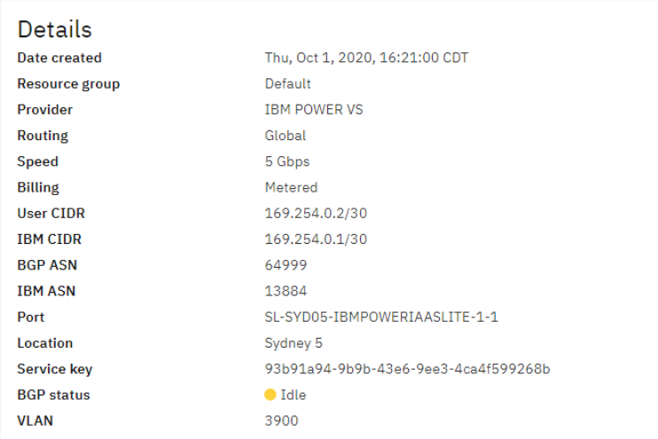
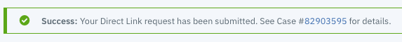
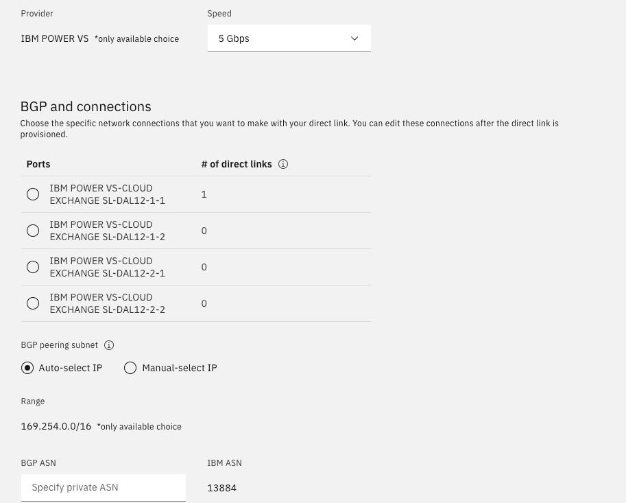

---

copyright:
  years: 2019, 2020

lastupdated: "2021-06-26"

keywords: ordering direct link, dirct link location, bgp asn, iam service id, delete direct link, high availability

subcollection: power-iaas

---

{:shortdesc: .shortdesc}
{:screen: .screen}
{:codeblock: .codeblock}
{:pre: .pre}
{:tip: .tip}
{:note: .note}
{:important: .important}
{:deprecated: .deprecated}
{:external: target="_blank" .external}
{:help: data-hd-content-type='help'}
{:support: data-reuse='support'}

# Direct Link Connect for Power Systems Virtual Servers
{: #ordering-direct-link-connect}

Direct Link Connect is a separate service from the Power Systems Virtual Server. You must use [Direct Link](/docs/direct-link?topic=direct-link-get-started-with-ibm-cloud-direct-link) to configure your private network with IBM&reg; Power Systems&trade; Virtual Server. The Direct Link Connect 2.0 service creates a seamless connection that allows access to {{site.data.keyword.cloud}} resources from your {{site.data.keyword.powerSys_notm}} instance.
{: shortdesc}

The Direct Link Connect (2.0) provides the following advantages:

- Support for connections to multiple IBM Cloud accounts from a single direct link.
- Support for multiple VPCs (without classic access) from a single direct link within the same account.
- Automated Direct Link 2.0 Configuration in IBM Cloud Classic and VPC.

The Power Systems Virtual Server offering includes a highly available up to 10 Gbps connection to IBM Cloud services at no cost for each customer per data center. If desired, you can select the global routing option for these links at no cost. Over the next few months, the {{site.data.keyword.powerSys_notm}} service plans to continue to evolve its network connectivity capabilities through further automation and integration.

10 Gbps connection is available only on the Direct Link Connect 2.0.
{: important}

Direct Link Connect 2.0 is available in all current locations except Toronto 1, Montreal 1, São Paulo 1, and Washington 06. For these locations, you must use [IBM Cloud Direct Link on Classic](/docs/direct-link?topic=direct-link-about-ibm-cloud-direct-link){: external}. Moreover, if you are using Direct Link Connect on Classic in any current location, you can continue to use it with Power Systems Virtual Server. If you want to use Direct Link Connect 2.0, you must order a new Direct Link Connect 2.0 connection.
{: note}

For more information on Direct Link Connect, see [Pricing for IBM Cloud Direct Link](/docs/dl?topic=dl-pricing-for-ibm-cloud-dl) and [IBM Cloud Direct Link Connect on Classic](/docs/dl?topic=dl-how-to-order-ibm-cloud-dl-connect).

## Ordering Direct Link Connect 2.0
{: #order-direct-link-connect-2.0}

To order the Direct Link Connect 2.0 service that creates a connection to the Power Systems Virtual Server instance, complete the following steps:

Order a second Direct Link Connect connection for backup purposes.
{: tip}

1. Verify that your IBM Cloud account has the correct authorizations to order the Direct Link 2.0 Connect service.

2. Review the following basic Direct Link Connect networking concepts:

    - [Direct Link Connect concepts](/docs/dl?topic=dl-dl-about)
    - [Direct link prerequisites](/docs/dl?topic=dl-ibm-cloud-dl-prerequisites)

3. Log in to your [IBM Cloud](https://cloud.ibm.com/login){: external} account.

4. Click  icon on the upper left, then click **Interconnectivity**.

5. Click **Order Direct Link** and select the **Direct Link Connect** option.

6. Enter the [configuration parameters](/docs/power-iaas?topic=power-iaas-ordering-direct-link-connect#direct-link) for your IBM Cloud Direct Link Connect order. As you complete the fields for creating the Direct Link Connect service, the price is automatically updated to reflect your selections.

    The {{site.data.keyword.powerSys_notm}} service offers lower latency direct connectivity to customers. You must select **IBM POWER VIRTUAL SERVER** as the **Network Provider** instead of **MEGAPORT**.
    {: note}

7. Read the *Master Service Agreement* and select the checkbox. You must read and understand the Master Service Agreement as it contains important technical information.

8. Click **Create**. It can take up to several minutes to provision your Direct Link connection request.

9. After your Direct Link connection request is provisioned, go to **Interconnectivity** > **Direct Link**. The **Direct Link** page lists all the existing Direct Link connections.

10. Click the newly provisioned Direct Link connection to identify the following details:

    {: caption="Figure 1. Direct Link Connect 2.0 details" caption-side="bottom"}

11. Create a [new support case](/docs/power-iaas?topic=power-iaas-getting-help-and-support) against the {{site.data.keyword.powerSys_notm}} team. In the new case's description field, enter the following details.

    ```text
    Customer name:
    Customer account ID:
    Data center details:
    Direct Link Connect subnet:
    IBM Cloud IP address:
    Power Systems Virtual Server network IP address:
    Direct Link Connect VLAN:
    IBM Cloud ASN:
    Power Systems Virtual Server network ASN:
    Power Systems Virtual Server Private Network (subnet) Name (1):
    Power Systems Virtual Server Private Network (subnet) Name (2):
    Power Systems Virtual Server Private Network (subnet) Name (3):
    Direct Link Connect 2.0 Virtual Connections:
    Classic Network Virtual Connection: Yes/No
    VPC Virtual Connection 1: VPC name and ID
    VPC Virtual Connection 2: VPC name and ID
    VPC Virtual Connection 3: VPC name and ID
    Screen shot of Direct Link 2.0 Connect
    ```

    The **{{site.data.keyword.powerSys_notm}} network** autonomous system number (ASN) is the same as your Border Gateway Protocol (BGP) ASN. The IBM Cloud network team generates the **IBM Cloud ASN** and adds it to the IBM Cloud support ticket. The IBM Cloud network team also generates the IP addresses. Your private network name is your Power Systems Virtual Server private network subnet name.
    {: note}

12. The {{site.data.keyword.powerSys_notm}} support case is closed when the Direct Link Connect connection is configured to communicate with your Power Systems Virtual Server instance.

### Configuration parameters for ordering Direct Link Connect
{: #configuration-parameters}

#### Configuration
{: #config-dl}

**Direct Link Name** - Enter a name for your Direct Link Connect instance.

**Resource group** - Select the default group.

**Billing** - Select the Unmetered option.

**Location** - Select the same location as the {{site.data.keyword.powerSys_notm}} instance. The following table identifies the {{site.data.keyword.powerSys_notm}} instance location and the corresponding Direct Link Connection option:


| Power Systems Virtual Server location | Direct Link Connect location | Network provider |
| ------------------------------------- | ---------------------------- | ---------------- |
| Dallas 13, TX, US | Dallas 13 | IBM Power Virtual Server |
| Dallas 12, TX, US | Dallas 12 | IBM Power Virtual Server |
| Washington 04, D.C., US | Washington DC 4 | IBM Power Virtual Server |
| Washington 05, D.C., US | Washington DC 5 | IBM Power Virtual Server |
| Frankfurt 04, Germany | Frankfurt 4 | IBM Power Virtual Server |
| Frankfurt 05, Germany | Frankfurt 5 | IBM Power Virtual Server |
| London 04, United Kingdom | London 4 | IBM Power Virtual Server |
| London 06, United Kingdom | London 6 | IBM Power Virtual Server |
| Sydney 04, United Kingdom | Sydney 4 | IBM Power Virtual Server |
| Sydney 05, United Kingdom | Sydney 5 | IBM Power Virtual Server |
| Tokyo 04, Japan | Tokyo 4 | IBM Power Virtual Server |
| Osaka 21, Japan | Osaka 21 | IBM Power Virtual Server |
{: caption="Table 1. Direct Link Connection location options" caption-side="bottom"}


Direct Link 2.0 is available in all current locations except Toronto 1, Montreal 01, São Paulo 1, and Washington 06.</br>
Each location requires its own Direct Link Connect. For example, if you order a Direct Link for Frankfurt 04, you can not establish connection to the VMs in Frankfurt 05.
{: note}


**Routing Option** - Select **Local Routing (Free)** to access all the data centers that are connected at the location that you specified in the **Location** field. Select **Global Routing** to access all the IBM Cloud data centers in the world.

**Network Provider** - You must select **IBM POWER VIRTUAL SERVER** from the list.

**Speed** - Select the link speed to meet your workload requirements. The recommended selection for the **Speed** field is 1 Gbps.

#### BGP and connections
{: #bgp-connection}

- **Ports** - If you have multiple Direct Link connections, you must choose different ports for each connection. Otherwise, you can choose a port that has the least number of connections.
- **BGP peering subnet** - Select **Auto-select IP** for Power Systems Virtual Server to auto-select an IP address from range *169.254.0.0/16*, or manually enter addresses in a specific range to avoid conflict with an existing connection.
- **BGP ASN** - You must enter 64999 as BGP ASN number for Direct Link Connect location unless a different ASN number is required as indicated in the table 3. For example, BGP ASN number for WDC04 location is 64995. For Direct Link Connect 2.0 10Gbps ports that are not GRE capable, you must use the BGP ASN number 64997.

#### Add connection
{: #add-connection-classicvp}

Select [Classic or VPC](/docs/cloud-infrastructure?topic=cloud-infrastructure-compare-infrastructure) depending on the type of network reach you want and depending on how you want Direct Link to connect to the IBM Cloud resources. You can create multiple network connections for a Direct Link Connect instance.

Although adding a connection is optional when you are ordering Direct Link Connect, you must add at least one connection later to successfully connect the {{site.data.keyword.powerSys_notm}} instance to the IBM Cloud network. 

Power Systems Virtual Servers Direct Link 2.0 service provides connectivity to IBM Cloud Classic network in addition to VPC network. You can access all of the Classic network locations irrespective of Direct Link 2.0 gateway in local or global routing attribute. You must use the global routing attribute to reach VPC network outside the local region.

## Ordering Direct Link Connect on Classic
{: #steps-to-order-direct-link-connect}

To order the Direct Link Connect on Classic service that creates a connection to the {{site.data.keyword.powerSys_notm}} instance, complete the following steps:

Order a second Direct Link Connect connection for backup purposes.
{: tip}

1. Verify that your {{site.data.keyword.cloud_notm}} account has the correct authorizations to order the Direct Link Connect service.

2. Review the following basic Direct Link Connect networking concepts:

   - [Direct Link Connect on Classic concepts](/docs/direct-link?topic=direct-link-about-ibm-cloud-direct-link)
   - [Direct Link Connect on Classic details](/docs/direct-link?topic=direct-link-about-ibm-cloud-direct-link#direct-link-connect-solution)
   - [Direct Link Connect on Classic limitations](/docs/direct-link?topic=direct-link-known-limitations#ibm-cloud-direct-link-exchange-and-direct-link-connect-limitations)
   - [Strict limitations on IP assignments](/docs/direct-link?topic=direct-link-configure-ibm-cloud-direct-link#strict-limitations-on-ip-assignments)

3. Log in to the [IBM Cloud catalog](https://cloud.ibm.com/catalog){: external} with your IBM Cloud account credentials.

4. Search for **Direct Link Connect on Classic**.

5. Click **Order Direct Link Connect on Classic** to see the order form.

6. Enter the [configuration parameters](#direct-link-connect-configuration-parameters) for your IBM Cloud Direct Link Connect on Classic order. As you complete the fields for creating the Direct Link Connect service, the price is automatically updated to reflect your selections.

   The {{site.data.keyword.powerSysShort}} service offers lower latency direct connectivity to customers. You must select **IBM POWER VIRTUAL SERVER** as the **Network Provider** instead of **MEGAPORT** to take advantage of this offer.
   {: note}

7. Read the *Master Service Agreement* and select the checkbox. You must read and understand the _Master Service Agreement_ as it contains important technical information.

8. Click **Create**. The following message is displayed when your request is submitted successfully:

   {: caption="Figure 1. Direct Link Connect success message and ticket number" caption-side="bottom"}

9. Click the **Case number** link for the Direct Link Connect service. The information in the case number is used to identify the Direct Link Connect information for connecting your {{site.data.keyword.powerSys_notm}} instance.

   It can take up to three business days to complete the initial setup for the Direct Link connection request.
   {: note}

10. To create a connection to the {{site.data.keyword.powerSys_notm}} instance by using the Direct Link Connect service, create a [new support case](/docs/power-iaas?topic=power-iaas-getting-help-and-support) against the {{site.data.keyword.powerSys_notm}} team. In the new case's description field, add the **Direct Link Connect case number**.

11. When the Direct Link Connect connection is established, the Direct Link Connect case is closed. The following network information is an example of what is displayed:

    ```text
    Link Speed:                  1000 Mbps
    Location:                    Washington 4
    Network Provider:            IBM Power Virtual Server
    Direct Link Connect subnet:  10.254.0.24/30
    IBM Cloud IP Address:        10.254.0.25/30
    Customer IP Address:         10.254.0.26/30
    IBM Cloud ASN:               13884
    Customer BGP ASN:            64995
    Network Identifier:          1748523-1
    Date Created:                2019-06-12T14:56:45-06:00
    ```

12. Use the information from the Direct Link Connect case number to update the **{{site.data.keyword.powerSys_notm}} support case**:

    The **Power Systems Virtual Server network ASN** is the same as your **BGP ASN**. The IBM Cloud network team generates the **IBM Cloud ASN** and adds it to the IBM Cloud support ticket. The IBM Cloud network team also generates the IP addresses. Your private network name is your [Power Systems Virtual Server private network subnet](/docs/power-iaas?topic=power-iaas-configuring-subnet) name.
    {: note}

    ```text
    Customer name:
    Customer account ID:
    Direct Link Connect subnet:
    IBM Cloud IP address:
    Power Systems Virtual Server network IP address:
    IBM Cloud ASN:
    Power Systems Virtual Server network ASN:
    Power Systems Virtual Server Private Network (subnet) Name (1):
    Power Systems Virtual Server Private Network (subnet) Name (2):
    Power Systems Virtual Server Private Network (subnet) Name (3):
    ```

13. The {{site.data.keyword.powerSys_notm}} support case is closed when the Direct Link Connect connection is configured to communicate with your {{site.data.keyword.powerSys_notm}} instance.

### Direct Link Connect configuration parameters
{: #direct-link-connect-config-par}

**Direct Link Instance name** - Enter a name for your Direct Link Connect instance.

**Location** - Select the same location as the {{site.data.keyword.powerSys_notm}}instance. Each location requires its own Direct Link Connect. For example, if you order a Direct Link for Frankfurt 04, you can not establish connection to the VMs in Frankfurt 05.

The following table identifies the {{site.data.keyword.powerSys_notm}} instance location and the corresponding Direct Link Connection option:


| Power Systems Virtual Server location | Direct Link Connect location | Network provider |
| ------------------------------------- | ---------------------------- | ---------------- |
| Dallas, TX, US | Dallas 12 \n Dallas 13 | IBM Power Virtual Server |
| Washington, D.C., US | Washington 4 | IBM Power Virtual Server |
| Frankfurt, Germany, EU | Frankfurt 4 \n Frankfurt 5 | IBM Power Virtual Server |
| London, United Kingdom | London 4 \n London 6 | IBM Power Virtual Server |
| Toronto, Canada | Toronto 1 | IBM Power Virtual Server |
| Montreal, Canada | Montreal 1 | IBM Power Virtual Server |
| Sydney, Australia | Sydney 4 \n Sydney 5 | IBM Power Virtual Server |
| São Paulo, Brazil | São Paulo 1 | IBM Power Virtual Server |
{: caption="Table 2. Direct Link Connect on Classic location" caption-side="bottom"}


**Network Provider** - You must select **IBM POWER VIRTUAL SERVER** from the list.

**Link Speed** - Select the link speed to meet your workload requirements. The recommended selection for the **Link Speed** field is 1000 Mbps.

**Routing option** - Select **Local Routing (Free)** to access all of the data centers that are connected at the location that you specified in the **Location** field. Select **Global Routing** to access all of the IBM Cloud data centers in the world.

**BGP ASN** - You must enter the BGP ASN number for the specific Direct Link Connect location.

Do not try to change the BGP ASN number to **64995**. You must contact the IBM Power support team to handle your request to change the BGP ASN number.
{: important}


| Direct Link Connect location | BGP ASN number |
| ---------------------------- | -------------- |
| Dallas 12 \n Dallas 13 | 64999 |
| Washington 4 | 64995 |
| Frankfurt 4 \n Frankfurt 5 | 64999 |
| London 6 | 64999 |
| Toronto 1 | 64999 |
| Montreal 1 | 64999 |
{: caption="Table 3. BGP ASN number for specific locations" caption-side="bottom"}


**Select VRF** - Select the virtual routing and forwarding option for the connection. If your account does not have a VRF identified, this field is not displayed. You can still create the Direct Link Connect service without selecting a VRF.

## Deleting your Direct Link Connect on Classic connection
{: #deleting-direct-link}

You can remove your Direct Link Connect on Classic connection by [opening a support ticket](/docs/power-iaas?topic=power-iaas-getting-help-and-support) against the Power Systems Virtual Server support team to remove the appropriate resources.
You can remove the Direct Link Connect (2.0) connection from your account, but you must open a [support ticket](/docs/power-iaas?topic=power-iaas-getting-help-and-support) to remove the configuration from the Power Systems Virtual Server network infrastructure.

## Setting up high availability over Direct Link Connect
{: #ha-availability}

Your Direct Link connections are location-specific. IBM Cloud Direct Link is not a redundant service by default.  You must order a separate Direct Link Connect instance for redundancy.

To set up a highly available connectivity on the IBM Cloud network by using Direct Link Connect, complete the following steps:

1. Order two instances of Direct Link Connect (2.0) or Direct Link Connect on Classic. For each instance of Direct Link Connect, you can order an additional instance for redundancy. For instructions, see [Ordering Direct Link Connect 2.0](/docs/power-iaas?topic=power-iaas-ordering-direct-link-connect#help) or [Ordering Direct Link Connect on Classic](/docs/power-iaas?topic=power-iaas-ordering-direct-link-connect#ordering-direct-link-connect-on-classic).

2. In the **BGP and connections** configuration panel, select a port from a separate port group for the redundant Direct Link Connect instance than the existing instance. Both Direct Link Connect instances must be on separate ports to connect to different Power Systems Virtual Server routers, thus, ensuring redundancy.

    The following example shows the Direct Link Connect ports for the DAL12 data center. The ports ending with 1-1 and 1-2 belong to a port group, and the ports ending with 2-1 and 2-2 belong to another port group. For a Direct Link Connect instance, if you have selected a port from the first port group, you must select a port from the other port group for the redundant Direct Link Connect instance. That is, if you had selected **-1-1** for the first Direct Link Connect instance, you must select **-2-1** or **-2-2** for the second Direct Link Connect instance that you want to use to set up redundancy.

    {: caption="Figure 1. BGP and connections" caption-side="bottom"}

    For Direct Link Connect on Classic, you can select the port only when you order a second Direct Link Connect instance for redundancy.
    {: note}

    Border Gateway Protocol (BGP) sessions are configured for the Direct Link Connect service in such a way that when a fault is detected on a Direct Link Connect instance, the BGP routes traffic to an alternate Direct Link Connect instance. For 10 Gbps connections use the new ports that are not GRE capable. Ports that are GRE capable can only use upto 5 Gbps speed. Refer to the following table to identify the ports and port groups that you must select for the redundant Direct Link Connect instance:

    | Data Center | Network provider | Port group 1 | Port group 2 for redundancy |
    | ----------- | ---------------- | ------------ | --------------------------- |
    | LON04 | IBM Power VS | SL-LON04-IBMPOWERIAASLITE-1-1 \n SL-LON04-IBMPOWERIAASLITE-1-2 | SL-LON04-IBMPOWERIAASLITE-2-1 \n SL-LON04-IBMPOWERIAASLITE-2-2 |
    | LON06 | IBM Power VS | SL-LON06-IBMPOWERIAASLITE-1-1 \n SL-LON06-IBMPOWERIAASLITE-1-2 | SL-LON06-IBMPOWERIAASLITE-2-1 \n SL-LON06-IBMPOWERIAASLITE-2-2 |
    | FRA05 | IBM Power VS | SL-FRA05-IBMPOWERIAASLITE-1-1 \n SL-FRA05-IBMPOWERIAASLITE-1-2 | SL-FRA05-IBMPOWERIAASLITE-2-1 \n SL-FRA05-IBMPOWERIAASLITE-2-2 |
    | FRA04 | IBM Power VS | SL-FRA04-IBMPOWERIAASLITE-1-1 \n SL-FRA04-IBMPOWERIAASLITE-1-2 \n PowerVS-FRA04-10G-NOGRE-1-1[^footnote1] | SL-FRA04-IBMPOWERIAASLITE-2-1 \n SL-FRA04-IBMPOWERIAASLITE-2-2 \n PowerVS-FRA04-10G-NOGRE-1-2[^footnote2] |
    | WDC04 | IBM Power VS | SL-WDC04-IBMPOWERIAASLITE-1-1 \n PowerVS-WDC04-10G-NOGRE-1-1[^footnote3] | SL-DAL12-IBMPOWERIAASLITE-2-1 \n SL-DAL12-IBMPOWERIAASLITE-2-2 \n PowerVS-DAL12-10G-NOGRE-1-2[^footnote4] |
    | DAL12 | IBM Power VS | SL-DAL12-IBMPOWERIAASLITE-1-1 \n SL-DAL12-IBMPOWERIAASLITE-1-2 \n PowerVS-DAL12-10G-NOGRE-1-1[^footnote5] | SL-DAL12-IBMPOWERIAASLITE-2-1 \n SL-DAL12-IBMPOWERIAASLITE-2-2 \n PowerVS-DAL12-10G-NOGRE-1-2[^footnote6] |
    | DAL13 | IBM Power VS | SL-DAL13-IBMPOWERIAASLITE-1-1 \n SL-DAL13-IBMPOWERIAASLITE-1-2 \n PowerVS-DAL13-10G-NOGRE-1-1[^footnote7] | SL-DAL13-IBMPOWERIAASLITE-2-1 \n SL-DAL13-IBMPOWERIAASLITE-2-2 \n PowerVS-DAL13-10G-NOGRE-1-2[^footnote8] |
    | SYD04 | IBM Power VS | SL-SYD04-IBMPOWERIAASLITE-1-1 \n SL-SYD04-IBMPOWERIAASLITE-1-2 \n PowerVS-SYD04-10G-NOGRE-1-1[^footnote9] | SL-SYD04-IBMPOWERIAASLITE-2-1 \n SL-SYD04-IBMPOWERIAASLITE-2-2 \n PowerVS-SYD04-10G-NOGRE-1-2[^footnote10] |
    | TOK04 | IBM Power VS | SL-TOK04-IBMPOWERIAASLITE-1-1 \n SL-TOK04-IBMPOWERIAASLITE-1-2 \n PowerVS-TOK04-10G-NOGRE-1-1[^footnote11] | SL-TOK04-IBMPOWERIAASLITE-2-1 \n SL-TOK04-IBMPOWERIAASLITE-2-2 \n PowerVS-TOK04-10G-NOGRE-1-2[^footnote12] |
    | OSA21 | IBM Power VS | SL-OSA21-IBMPOWERIAASLITE-1-1 \n SL-OSA21-IBMPOWERIAASLITE-1-2 | SL-OSA21-IBMPOWERIAASLITE-2-1 \n SL-OSA21-IBMPOWERIAASLITE-2-2 |
    {: caption="Table 4. Port and Port groups for redundant Direct Link instances" caption-side="bottom"}

    [^footnote1]: The ports denoted with ^x indicates that they are not GRE capable but support 10 Gbps speed.
    [^footnote2]: The ports denoted with ^x indicates that they are not GRE capable but support 10 Gbps speed.
    [^footnote3]: The ports denoted with ^x indicates that they are not GRE capable but support 10 Gbps speed.
    [^footnote4]: The ports denoted with ^x indicates that they are not GRE capable but support 10 Gbps speed.
    [^footnote5]: The ports denoted with ^x indicates that they are not GRE capable but support 10 Gbps speed.
    [^footnote6]: The ports denoted with ^x indicates that they are not GRE capable but support 10 Gbps speed.
    [^footnote7]: The ports denoted with ^x indicates that they are not GRE capable but support 10 Gbps speed.
    [^footnote8]: The ports denoted with ^x indicates that they are not GRE capable but support 10 Gbps speed.
    [^footnote9]: The ports denoted with ^x indicates that they are not GRE capable but support 10 Gbps speed.
    [^footnote10]: The ports denoted with ^x indicates that they are not GRE capable but support 10 Gbps speed.
    [^footnote11]: The ports denoted with ^x indicates that they are not GRE capable but support 10 Gbps speed.
    [^footnote12]: The ports denoted with ^x indicates that they are not GRE capable but support 10 Gbps speed.


3. Select the remaining options and create the Direct Link Connect instance as described in [Ordering Direct Link Connect 2.0](/docs/power-iaas?topic=power-iaas-ordering-direct-link-connect#help) or [Ordering Direct Link Connect on Classic](/docs/power-iaas?topic=power-iaas-ordering-direct-link-connect#ordering-direct-link-connect-on-classic) (Step 8 onwards).

## Routing considerations for VPC
{: #routing-considerations}

If the traffic is sent from Power Systems Virtual Server to your on-premise public IP address and if the virtual server instance has public floating IP, you might need a special configuration in VPC. If you do not do that special configuration, the traffic goes through the virtual machine's public interface instead of private interface.

For proper VPC configuration, the on-premise IP address must meet the following requirements:

- The IP address range for private network must be with in the following blocks that are reserved by Internet Assigned Numbers Authority (IANA):
    - Class A — 10.0.0.0 — 10.255.255.255 (16,777,216 total hosts)
    - Class B — 172.16.0.0 — 172.31.255.255 (1,048,576 total hosts)
    - Class C — 192.168.0.0 — 192.168.255.255 (65,536 total hosts)
- VM instances within the VPC must not have floating IP.
- You must create a route to the on-premise public subnet in the VPC default routing table by using the *Delegate-VPC* action. For more information, see [Routing considerations for IANA-registered IP assignments](/docs/vpc?topic=vpc-interconnectivity#routing-considerations-iana).

