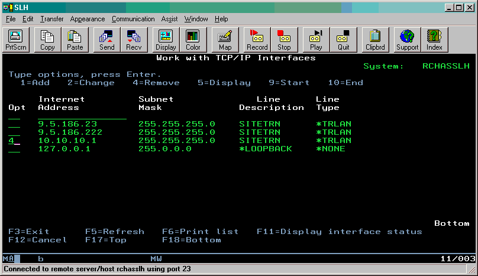
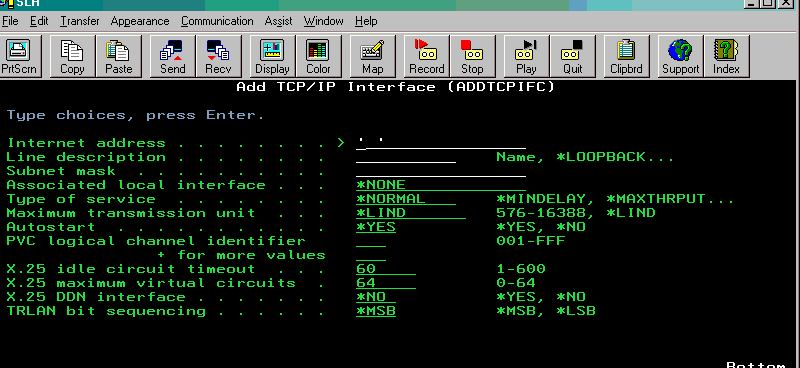

---

copyright:
  years: 2019, 2020

lastupdated: "2020-03-03"

keywords: network interface, tcp/ip address, ibm i vm, external ip address, dns, lind, cfgtcp command

subcollection: power-iaas

---

{:shortdesc: .shortdesc}
{:screen: .screen}
{:codeblock: .codeblock}
{:pre: .pre}
{:tip: .tip}
{:note: .note}
{:preview: .preview}
{:important: .important}
{:deprecated: .deprecated}
{:external: target="_blank" .external}

# How to add or remove a network interface from an IBM i virtual machine (VM)
{: #managing-network-interface-ibmi}

Since IBM PowerVC Version 1.2.2, IBM PowerVC can dynamically add a network interface controller (NIC) to a VM or remove a NIC from a VM. IBM PowerVC does not set the IP address for new network interfaces that are created after the machine deployment. Any removal of a NIC results in freeing the IP address that was set on it. You must remove and readd the IBM i VM network interface if you choose to disconnect the {{site.data.keyword.powerSys_notm}} IBM i VM from a public network.
{: shortdesc}

When you toggle a public network off and then on, the {{site.data.keyword.powerSys_notm}} user interface regenerates new internal and external IP addresses. You need to check the {{site.data.keyword.powerSys_notm}} user interface for the new internal IP address to complete this procedure.
{: note}

## Removing a network interface from an IBM i VM
{: #remove-nic-ibmi}

Learn how to change the TCP/IP address of your IBM i VM. You can change your system's TCP/IP address while the TCP/IP is active. However, you must deactivate the TCP/IP interface. For a complete set of instructions, see [Changing the TCP/IP Address of the IBM System i System](https://www.ibm.com/support/pages/changing-tcpip-address-ibm-system-i-system){: external}.

1. Before you change a TCP/IP address, determine whether it has any associated routes. Choose **Option 8** from the **NETSTAT \*IFC** screen.
    It's a good idea to select **Option 5** to display the details of the route. Remember to press **F6** to print the details for reference for when the route must be readded. This step should be done for all of the **non-\*DIRECT** routes that are listed on the screen.
    {: tip}

2. Run the `CFGTCP` command, and select **Option 2** to work with your TCP/IP routes. Select **Option 4** next to the routes you'd like to remove. All of that communication that is going over the route is terminated after you remove it.
3. To make the actual changes, you must deactivate and remove the interface before you add it. Select **Option 10** next to the interface you'd like to deactivate on the **NETSTAT \*IFC** screen.
4. To remove the interface after deactivation, run the `CFGTCP` command and select **Option 1** from that menu. Select **Option 4** next to the interface you'd like to remove.
    {: caption="Figure 1. Revmoing a network interface" caption-side="bottom"}
    
5. You must vary off the Line description (LIND) after you remove the interface.

## Adding a network interface to an IBM i VM
{: #add-nic-ibmi}

When you toggle a public network off and then on, the {{site.data.keyword.powerSys_notm}} user interface regenerates new internal and external IP addresses. You need to check the {{site.data.keyword.powerSys_notm}} user interface for the new internal IP address (that maps to the external IP address). Point the new interface at the new internal IP address.

1. After you remove the routes and interfaces, create the new configuration in the reverse order. To get to the **ADDTCPIFC** screen, run the `CFGTCP` command and select **Option 1**.
    Most configurations require you to update only the first three fields.
    {: note}

2. Add the new internal IP address you obtained from the {{site.data.keyword.powerSys_notm}} user interface (you can type over the quotation marks) to the **Internet address** field.
3. Add the new subnet mask to the **Subnet mask** field.
4. Complete the remaining fields by using your reference printout. The LIND must be the same as the LIND defined on the removed interface.
5. After you add the interface, activate it from the **NETSTAT \*IFC** screen by selecting **Option 9**.
6. To verify that the new interface is active, ping the address from the command line. If the ping responds, the interface is working correctly.
7. Finally, add the new routes that use this interface (if any). You can add new routes by selecting **Option 2** from the `CFGTCP` menu. Type **1** in the **Opt** column to add a new route, and press the **Enter** key.
    {: caption="Figure 2. Adding a network interface" caption-side="bottom"}
    
