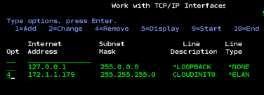
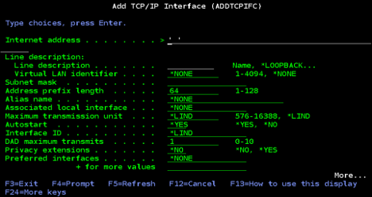
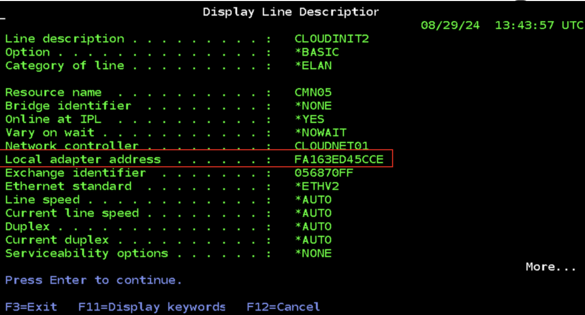

---

copyright:
  years: 2019, 2024

lastupdated: "2024-12-05"

keywords: network interface, tcp/ip address, ibm i vm, external ip address, dns, lind, cfgtcp command

subcollection: power-iaas

---

{{site.data.keyword.attribute-definition-list}}

# How to add or remove a network interface from an IBM i virtual machine (VM)
{: #managing-network-interface-ibmi}

---

{{site.data.keyword.off-prem-fname}} in [{{site.data.keyword.off-prem}}]{: tag-blue}

{{site.data.keyword.on-prem-fname}} in [{{site.data.keyword.on-prem}}]{: tag-red}

---

Since IBM PowerVC Version 1.2.2, IBM PowerVC can dynamically add a network interface controller (NIC) to a virtual machine (VM) or remove a NIC from a VM. IBM PowerVC does not set the IP address for new network interfaces that are created after the VM deployment. Any removal of a NIC results in freeing the IP address that was set on it. You must remove and readd the IBM i VM network interface if you choose to disconnect the {{site.data.keyword.powerSys_notm}} IBM i VM from a public network.
{: shortdesc}

When you toggle a public network off and on, the {{site.data.keyword.powerSysFull}} user interface regenerates new internal and external IP addresses. You need to check the {{site.data.keyword.powerSys_notm}} user interface for the new internal IP address to complete this procedure.
{: note}

## Removing a network interface from an IBM i VM
{: #remove-nic-ibmi}

You can change the TCP/IP address of your IBM i VM while the TCP/IP is active. However, you must deactivate the TCP/IP interface. For more information about the complete set of instructions, see [Changing the TCP/IP Address of the IBM i System](https://www.ibm.com/support/pages/node/641015){: external}.

1. Before you change a TCP/IP address, determine whether it has any associated routes. Select **Option 8** from the **NETSTAT \*IFC** screen to view the routes.

    For all the **non-\*DIRECT** routes that are listed on the screen, you can display the routes and print it for reference. Select **Option 5** to display the details of the route. Press **F6** to print the details for reference for when the route must be readded.
    {: tip}

2. Run the `CFGTCP` command and select **Option 2** to work with your TCP/IP routes. Select **Option 4** next to the routes that you need to remove. When you remove the routes, the communication that is happening over the route is terminated.

3. To make the changes, you must deactivate and remove the interface before you add it back. Select **Option 10** next to the interface that you need to deactivate on the **NETSTAT \*IFC** screen.

4. To remove the interface after deactivation, run the `CFGTCP` command and select **Option 1** from the menu. Select **Option 4** next to the interface that you need to remove.

{: caption="Removing a network interface" caption-side="bottom"}

1. You must vary off the Line description (LIND) after you remove the interface.

## Adding a network interface to an IBM i VM
{: #add-nic-ibmi}

When you toggle a public network off and on, the {{site.data.keyword.powerSys_notm}} user interface regenerates new internal and external IP addresses. You must check the {{site.data.keyword.powerSys_notm}} user interface for the new internal IP address that maps to the external IP address. Point the new interface at the new internal IP address.

1. After routes and interfaces are removed, create the new configuration in the reverse order. To open the **ADDTCPIFC** screen, run the `CFGTCP` command and select **Option 1**.

    In most of the configurations, you might need to update only the first three fields.
    {: note}

2. Add the new internal IP address that you obtained from the {{site.data.keyword.powerSys_notm}} user interface to the **Internet address** field. You can type the IP address over the quotation marks.

3. Add the new subnet mask to the **Subnet mask** field.

4. Complete the remaining fields by using your reference printout. The LIND value must be the same as the LIND value defined on the interface that was removed earlier.

5. Activate the new interface by selecting **Option 9** from the **NETSTAT \*IFC** screen.

6. To verify that the new interface is active, ping the IP address of the new interface from the command line. If the ping responds, the interface is working correctly.

7. Add the new routes that use the new interface, if any. You can add the new routes by selecting **Option 2** from the `CFGTCP` menu, type **1** in the **Opt** column, and press the **Enter** key.

{: caption="Removing a network interface" caption-side="bottom"}

Verify that the local adapter address of the line description matches the MAC address of the newly added adapter address from the {{site.data.keyword.powerSys_notm}} user interface.

For example,
Find the MAC address in the line description by using DSPLIND LIND(xxxxxxxxx) command. The line description is the name that matches the **Internet address** field value that was added earlier. Use the **NETSTAT \*IFC** screen to view the line descriptor.

{: caption="Finding the MAC address" caption-side="bottom"}
