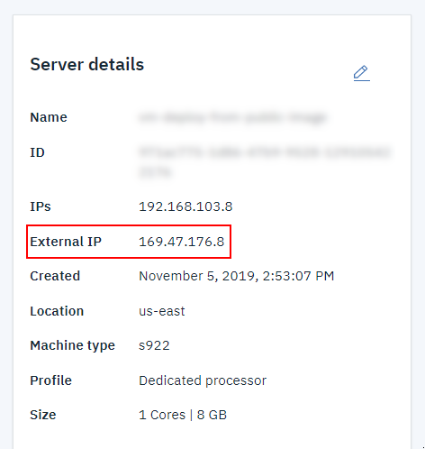

---

copyright:
  years: 2019

lastupdated: "2019-11-13"

keywords: network inteface, AIX cloud VM, ifconfig, detach, en0, 

subcollection: power-iaas

---

{:shortdesc: .shortdesc}
{:new_window: target="_blank"}
{:codeblock: .codeblock}
{:pre: .pre}
{:screen: .screen}
{:tip: .tip}
{:important: .important}
{:note: .note}
{:external: .external}

# How to add or remove a network interface from an AIX VM
{: #managing-network-interface}

You must remove and readd the AIX VM network interface if you choose to disconnect the {{site.data.keyword.powerSys_notm}} AIX VM from a public network.
{: shortdesc}

1. Use the `ifconfig` command to remove the network interface from the AIX VM. In the following example, *en0* is the public inteface.

    ```
    ifconfig en0 down detach
    ```
    {: screen}

2. Next, run the `rmdev` command to remove the device from the AIX system.

    ```
    rmdev -dl en0
    ```
    {: screen}

3. To readd the *en0* network interface and point it to the new external instance IP address, enter the following command:

    ```
    ifconfig en0 169.47.176.8
    ```
    {: screen}

    {: caption="Figure 1. Finding your external IP address" caption-side="bottom"}
