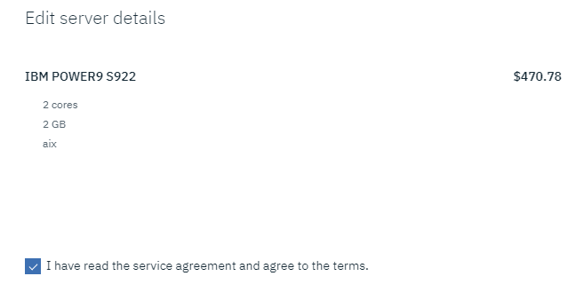
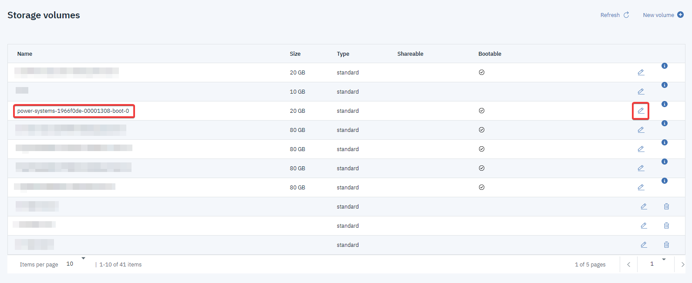
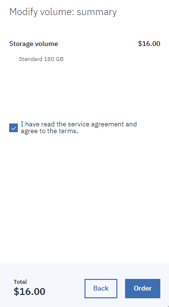

---

copyright:
  years: 2019

lastupdated: "2019-10-31"

keywords: storage volume, new storage size, modifying server, editing volume, volume modification, DLPAR, modifying instance, scaling VM

subcollection: power-iaas

---

{:new_window: target="_blank"}
{:shortdesc: .shortdesc}
{:screen: .screen}
{:codeblock: .codeblock}
{:pre: .pre}
{:tip: .tip}
{:note: .note}
{:important: .important}
{:deprecated: .deprecated}
{:external: target="_blank" .external}

# Modifying a Power Systems Virtual Server instance
{: #modifying-server}

Learn how to modify your {{site.data.keyword.powerSysShort}} to better meet your business needs.
{: shortdesc}

## Resizing an instance by using the IBM console
{: #resizing-vm}

To resize a {{site.data.keyword.powerSys_notm}} instance after its [initial creation](/docs/infrastructure/power-iaas?topic=power-iaas-creating-power-virtual-server), complete the following steps.

If the VM is inactive, you can change the processor type to **Dedicated** or **Shared** and adjust the amount of memory however you'd like. The minimum and maximum values for **Memory (GB)** and **Entitled capacity** are recalculated based on the type of processor. When you choose to resize an active VM, you cannot change the processor type. The minimum amount of **Memory (GB)** and **Entitled capacity** are half of what was allocated at provisioning time, while their maximum amount is double.
{: tip}

1. Go to the IBM console's **Virtual server instances** tab and click your instance.

2. Click the **Edit** icon in the **Server details** pane.

    {: caption="Figure 1. Finding your server details" caption-side="bottom"}

3. After you click the **Edit** icon, a menu appears. Use the toggles to change your instance's **Entitled capacity** and **Memory (GB)**. Click **Next.**

    {: caption="Figure 2. Modifying your server details" caption-side="bottom"}

4. Check the service agreement box and click **Order** to complete the instance modification process and accept the price.

    {: caption="Figure 3. Ordering your newly modified instance" caption-side="bottom"}

5. To verify your instance modification, view your **Server details**.

## Modifying attached volumes and network interfaces
{: #modifying-volume-network}

You can modify your attached volumes and remove or add a public network.

**Adding a volume**

1. To add a volume, click **Add new**.

2. Enter the **Name**, **Type**, and **Size** of the new volume. You can also select whether to make it **Shareable**.

3. Click **Next**, agree to the service agreement and click **Order**.

    If you'd like to change the boot status of a volume, click **Bootable** toggle.
    {: note}

**Managing existing volumes**

1. To attach or detach one or more volumes, click the **Manage existing volumes** link.

2. Select your wanted volumes and click **Finish**.

    {: caption="Figure 1. Modifying your attached volume" caption-side="bottom"}

**Adding or removing a public network**

You can remove or add a public network by clicking the **Public networks** toggle.

{: caption="Figure 1. Adding or removing a public network" caption-side="bottom"}

## Resizing a storage volume by using the IBM console
{: #resizing-volume}

To resize a {{site.data.keyword.powerSys_notm}} storage volume after its initial creation, complete the following steps:

Resizing is not immediately available after you deploy a virtual machine (VM).
{: note}

1. Go to the IBM console's **Storage volumes** tab and find your volume.

2. Click the **Edit** icon to the right of your storage volume.

    {: caption="Figure 1. Editing a storage volume" caption-side="bottom"}

3. After you click the **Edit** icon, a menu appears. Select your wanted storage volume size.

    You can increase only the size of the storage volume. You cannot decrease it.
    {: important}

    {: caption="Figure 2. Modifying your storage volume" caption-side="bottom"}

4. Read the service agreement and agree to the terms. Click **Order** to complete the volume modification process and accept the price.

    {: caption="Figure 3. Ordering your new storage volume" caption-side="bottom"}

5. To verify your new storage size, go back to the **Storage volumes** tab.
