---

copyright:
  years: 2019, 2020

lastupdated: "2020-03-12"

keywords: aix mksysb, aix helper vm, attaching new disk

subcollection: power-iaas

---

{:new_window: target="_blank"}
{:shortdesc: .shortdesc}
{:screen: .screen}
{:codeblock: .codeblock}
{:pre: .pre}
{:tip: .tip}
{:note: .note}
{:important: .important}
{:deprecated: .deprecated}
{:external: target="_blank" .external}
{:help: data-hd-content-type='help'}
{:support: data-reuse='support'}

# Restoring an AIX mksysb image onto an IBM Power Systems Virtual Server instance
{: #restoring-aix-mksysb-image}

Learn how to restore an AIX `mksysb` image onto an IBM Power Systems Virtual Server instance
{: shortdesc}

The IPv6 interface that is used for VM management might be affected when you restore an AIX `mksysb` image. Before proceeding onto the next section, review [Recommended Reliable Scalable Cluster Technology (RSCT) package levels for imported AIX images](/docs/power-iaas?topic=power-iaas-recommended-rsct-package).
{: important}

## Defining an AIX Helper VM
{: defining-aix-helper-vm}
{: help}
{: support}

You can use an existing AIX VM to copy an AIX mksysb archive. The `alt_disk_mksysb` command copies the mksysb archive onto a new volume. The `alt_disk_mksysb` command also gives you the option of rebooting from a specific disk image. The following screen capture shows a user-deployed AIX _helper VM_ named **power-systems-virtual-server1-2**:

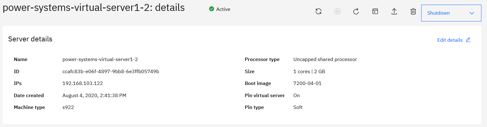{: caption="Figure 1. Defining an AIX helper VM" caption-side="bottom"}

Before you can copy an AIX `mksysb` archive, determine the amount of space the _helper VM_ needs to hold the _mksysb_ image. In the following example, the _mksysb_ image (`gdrh10v1.sysb`) is roughly 5.8 GB:

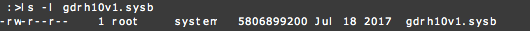{: caption="Figure 2. Determining the space needed" caption-side="bottom"}

Next, you must identify a _helper VM_ file system with enough space to hold the mksysb image. If such a file system does not exist, you can attach a data volume as a _staging area_. To display information about a volume group, use the `lsvg` command.

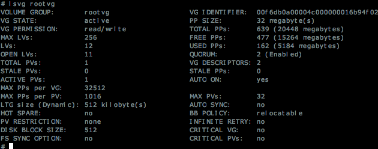{: caption="Figure 3. Using the lsvg command" caption-side="bottom"}

Running the `df -g` command displays information about the total space and available space on a file system. In this instance, the `rootvg` volume group has enough space for creating a new file system, expanding an existing one, and storing the _mksysb_ source image.

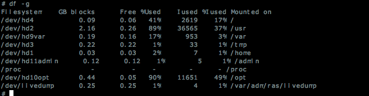{: caption="Figure 4. Displaying the storage information" caption-side="bottom"}

## Attaching a new (disk) volume
{: #attaching-new-volume}

If your disk is not at the correct size, complete the following steps:

  You must also complete these steps if you want to store the mksysb image in a data disk for shared access or long-term storage.
  {: note}

1. Create a file system to hold the _mksysb_ archive.

2. Click **Add new** under **Attached volumes**.

    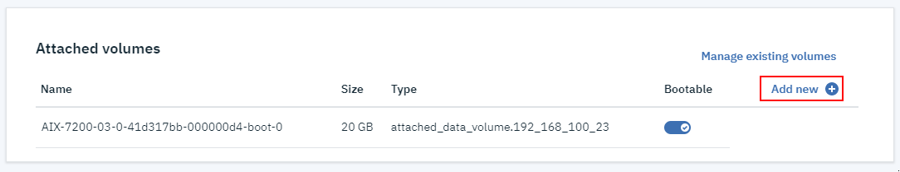{: caption="Figure 5. Adding a volume" caption-side="bottom"}

3. Give your data volume a **Name**. Select the **Type**, **Size**, and make it **Shareable**. In the following example, _mksysbfs_ is the volume name and it has 20 GB of space for multiple _mksysb_ archive files:

4. After successfully attaching the _mksysbfs_ volume to the _helper VM_, log in to the VM. The volume appears as a new hdisk. Run the `lspv` and `cfgmgr` commands on the _helper VM_ to configure and show the new disk. The new disk is labeled as _hdisk1_.

    {: caption="Figure 6. Using the lspv command" caption-side="bottom"}

    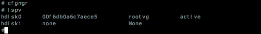{: caption="Figure 7. Using the cfgmgr command" caption-side="bottom"}

5. Create an _AIX Volume Group_ by running the `mkvg` command. On the _helper VM_, _mksysbvg_ is the volume group name.

    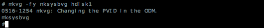{: caption="Figure 8. Running the mkvg command" caption-side="bottom"}

6. Run the `crfs` command to create a file system and the `mount` command to mount it. The following example shows a mounted file system (`/mksysb`) on the _helper VM_:

  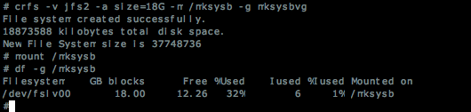{: caption="Figure 9. Creating a file system and mounting it" caption-side="bottom"}

After you complete these steps, you must decide on the best access option. IBM provides several different private access options. Each option allows VM instances with internal IP addresses to reach certain APIs and services.

Log on to the source VM where the source `mksysb` resides and copy the image to the _helper VM_ after you choose an option. In the following example, the customer is using Secure Copy Protocol (scp) from an on-premises system and copying it into the `/mksysb` file system of the _helper VM_:

If you did not decide on a private access option, or chose a different option for your internal IP access, your steps might vary.
{: note}

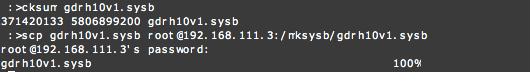{: caption="Figure 10. Running the cksurr command" caption-side="bottom"}

## Creating the alternate disk image volume
{: #creating-alternate-volume}

Log on to the helper VM and verify that the image under `/mksysb` has an identical `cksum` as the reported size from the on-premises system. After verifying the matching sizes, you can create a volume large enough to hold the restored root volume group.

To determine the necessary volume size of the alternate disk, examine the contents of the `bosinst.data` file within the mksysb archive. The `bosinst.data` file in the archive contains stanza information that indicates the minimum space that is required to restore the _mksysb_. An easy way to accomplish this is to usfe the `restore` command to extract the `./images/bosinst.data` file from the _mksysb_ archive.

Search the `bosinst.data` file and find the stanza that is named `target_disk_data`. This stanza indicates the minimum size in megabytes of the required volume in a `SIZE_MB = size` key value pair. The recorded size is used when creating the alternate disk image volume and attaching it to the _helper VM_.

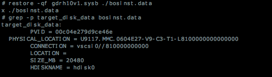{: caption="Figure 11. The restore -qf command" caption-side="bottom"}

To create and attach a new volume to **AIX-7200-03-03**, complete the following steps:

1. Click **Add new** under **Attached volumes**.

    {: caption="Figure 12. Displaying storage information" caption-side="bottom"}

2. Create a data volume and enter the recorded size in gigabytes (it must be large enough to hold the restored root volume group) by selecting the correct options. In the following example, the name **AIX-7200-03-03-altdisk** is the volume name:

    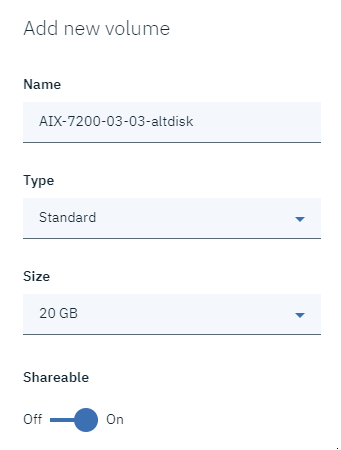{: caption="Figure 13. Displaying storage information" caption-side="bottom"}

3. After successfully attaching the **AIX-7200-03-03-altdisk** volume to the _helper VM_, log on to the VM. Use the `cfgmgr` and `lspv` commands on the _helper VM_ to show the new disk. The new disk is named `hdisk2`.

    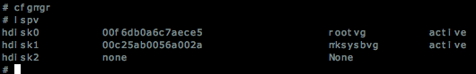{: caption="Figure 14. Displaying storage information" caption-side="bottom"}

## Restoring the alternate disk mksysb
{: #restoring-alternate-disk}

You can now create an AIX boot disk from the source _mksysb_ archive. To create an AIX boot disk from the source _mksysb_ archive, run the `alt_disk_mksysb` command with the following options:

<dl>
  <dt><strong>-m</strong></dt>
  <dd>Specify the mksysb archive that you transferred to the _helper VM_. In this example, the source mksysb archive is named `/mksysb/gdrh10v1.sysb`.</dd>
  <dt><strong>-d</strong></dt>
  <dd>Specify the logical disk (hdisk) that is empty of a volume group label. In the example, the target disk is named <em>hdisk2</em>.</dd>
  <dt><strong>-c</strong></dt>
  <dd> Use this option to set up a terminal device during VM deployment. Without a valid terminal, the VM does not boot if it needs to open the terminal for any reason.</dd>
</dl>

After you run the `alt_disk_mksysb` command, the terminal displays information similar to the following output:

  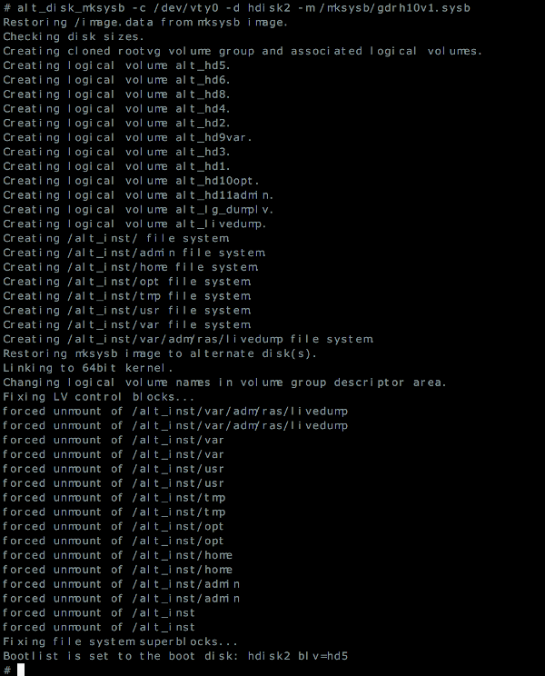{: caption="Figure 15. Running the alt_disk_mksysb command" caption-side="bottom"}

Now, the target volume contains a valid root volume group (`rootvg`) that is boot-ready. Additionally, the bootlist is set. Before rebooting, perform the following checks:

  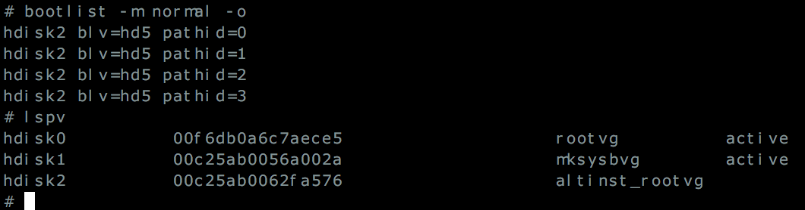{: caption="Figure 16. Performing a check by using the bootlist command" caption-side="bottom"}

When you are ready for the new environment to take effect, reboot the disk by using the `shutdown -Fr` command.
The device configuration can take several minutes. Upon its completion, the system's login prompt appears and the newly restored system is ready for login.

  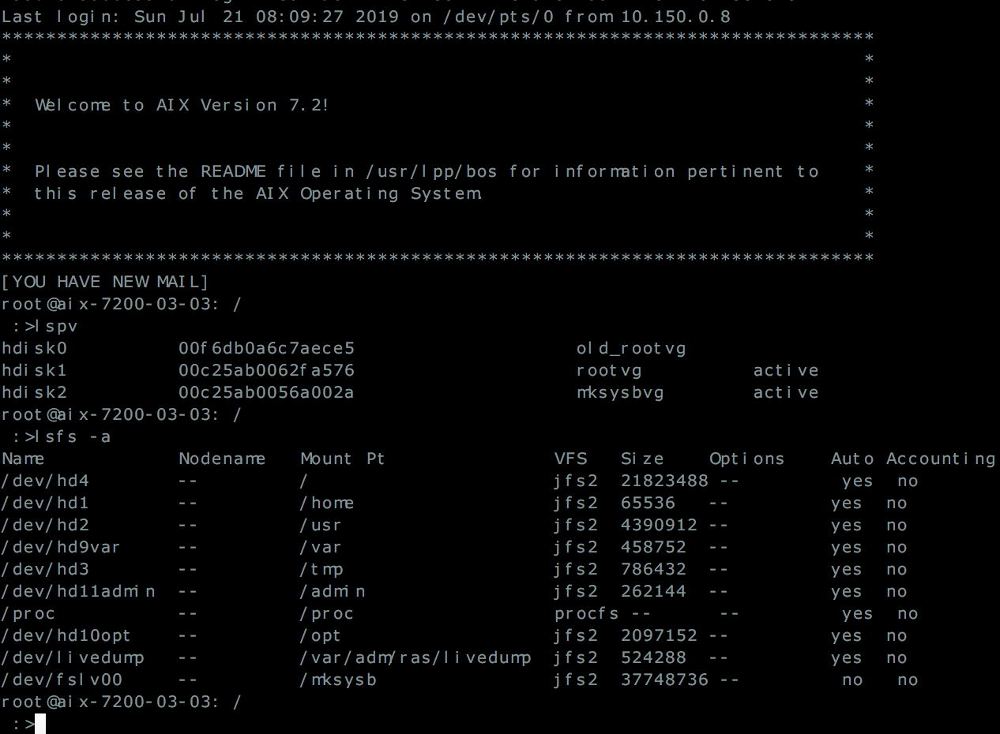{: caption="Figure 17. AIX login prompt" caption-side="bottom"}

You have successfully restored the AIX _mksysb_ archive and the environment is ready for your use.

## (Optional) Detaching the staging volume
{: #detaching-staging-volume}

In the previous section, we used a separate image volume for storing the source _mksysb_. To detach, keep, or delete a volume, review the following information.

After the completion of the `alt_disk_mksysb` command, you can detach the staging volume (`mksysbvg`) from the _helper VM_. Before you detach the staging volume, you must close all available file systems by unmounting them. If no action is required, then it is safe to remove the volume group definition from the _helper VM_.

1. Use the `varyoffvg` and `exportvg` commands to remove the _mksysbvg_ volume group.

    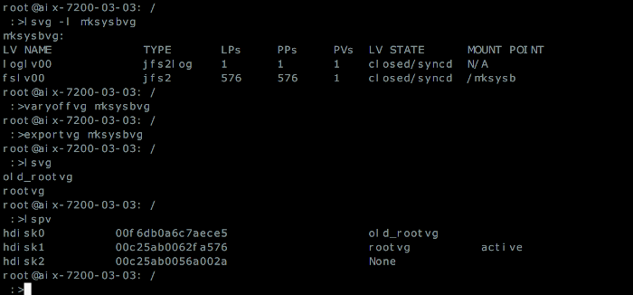{: caption="Figure 18. Displaying storage information" caption-side="bottom"}

2. Upon the successful removal of the volume group definition, remove the disk definition by using the `rmdev` command.

    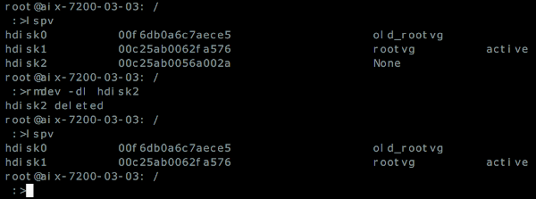{: caption="Figure 19. Removing the disk definition" caption-side="bottom"}

3. You can now detach the image volume (disk) containing the source mksysb from the _helper VM_. To detach the disk from **AIX-7200-03-03**, select **Manage existing volumes** and click a volume.

    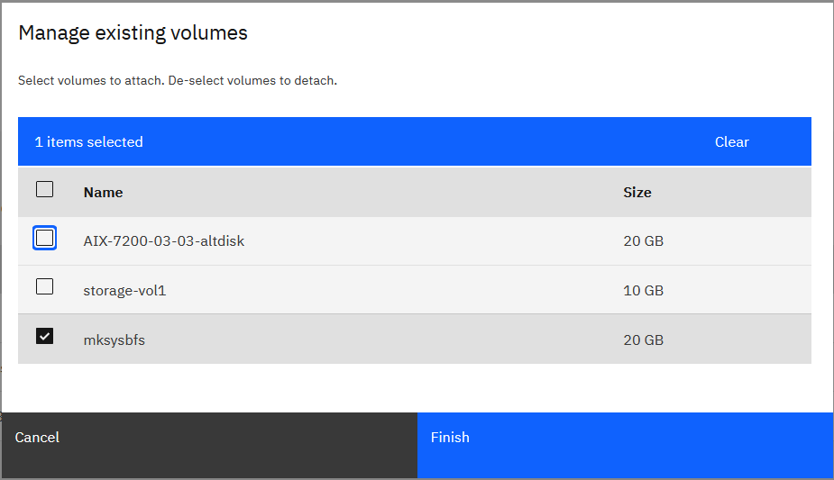{: caption="Figure 20. Detaching the volume" caption-side="bottom"}

4. After you successfully detach the disk from **AIX-7200-03-03**, you can attach the saved image volume to other VM instances.
