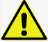
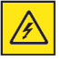
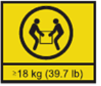
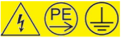
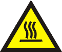
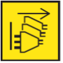
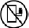

---

copyright:
  years: 2023, 2024

lastupdated: "2024-01-05"

keywords: power, power server, private cloud, safety notice

subcollection: power-iaas

---

{{site.data.keyword.attribute-definition-list}}

# Safety notices
{: #safety-notices}

[On-premises]{: tag-red}

These statements provide the caution and danger information that are used in this document.

## Important
{: #imp}

Each caution and danger statement in this documentation is labeled with a number. You can use this number to cross reference an English-language **CAUTION** or **DANGER** statement with translated versions of the caution or danger statement in the [Safety Notices Translation document (PN G229-9054)](https://public.dhe.ibm.com/systems/power/docs/hw/ENVSAF_SHR/G229-9054.pdf){: external}.

For example, if a caution statement is labeled **D005**, translations for that caution statement are in the Safety Notices translation document under **D005**. Be sure to read all caution and danger statements in this documentation before you perform the procedures. Read any additional safety information that comes with your system or optional device before you install the device.

**Danger:**  Overloading a branch circuit is potentially a fire hazard and a shock hazard under certain conditions.  To avoid these hazards, ensure your system electrical requirements do not exceed branch circuit protection requirements.  Refer to the information that is provided with your device or the power rating label for electrical specificati **(D002)**

**Danger:**  If the receptacle has a metal shell, do not touch the shell until you have completed the voltage and grounding checks.  Improper wiring or grounding could place dangerous voltage on the metal shell.  If any of the conditions are not as described, STOP.  Ensure the improper voltage or impedance conditions are corrected before proceeding.  **(D003)**

**Danger:**  Hazardous voltage, current or energy levels are present inside any component that has this label attached.  Do not open any cover or barrier that contains this label.  **(L001)**

**Danger:** When working on or around the system, observe the following precautions:

Electrical voltage and current from power, telephone, and communication cables are hazardous. To avoid a shock hazard:

* If IBM supplied the power cord or pwer cords, connect power to this unit only with the IBM provided power cord. Do not use the IBM provided power cord for any other product.
* Do not open or service any power supply assembly.
* Do not connect or disconnect any cables or perform installation, maintenance, or reconfiguration of this product during an electrical storm.
* The product might be equipped with multiple power cords. To remove all hazardous voltages, disconnect all power cords.
    - For AC power, disconnect all power cords from their AC power source.
    - For racks with a DC power distribution panel (PDP), disconnect the customer’s DC power source to the PDP.
* When connecting power to the product ensure all power cables are properly connected.
    - For racks with AC power, connect all power cords to a properly wired and grounded electrical outlet. Ensure that the outlet supplies proper voltage and phase rotation according to the system rating plate.
    - For racks with a DC power distribution panel (PDP), connect the customer’s DC power source to the PDP. Ensure that the proper polarity is used when attaching the DC power and DC power return wiring.
* Connect any equipment that will be attached to this product to properly wired outlets.
* When possible, use one hand only to connect or disconnect signal cables.
* Never turn on any equipment when there is evidence of fire, water, or structural damage.
    - Do not attempt to switch on power to the machine until all possible unsafe conditions are corrected.
    - Assume that an electrical safety hazard is present.
    - Perform all continuity, grounding, and power checks specified during the subsystem installation procedures to ensure that the machine meets safety requirements.
    - Do not continue with the inspection if any unsafe conditions are present.
* Before you open the device covers, unless instructed otherwise in the installation and configuration procedures: Disconnect the attached AC power cords, turn off the applicable circuit breakers located in the rack power distribution panel (PDP), and disconnect any telecommunications systems, networks, and modems.

**Danger:** Connect and disconnect cables as described in the following procedures when installing, moving, or opening covers on this product or attached devices.

To Disconnect:
1. Turn off everything (unless instructed otherwise).
2. For AC power, remove the power cords from the outlets.
3. For racks with a DC power distribution panel (PDP), turn off the circuit breakers located in the PDP and remove the power from the Customer's DC power source.
4. Remove the signal cables from the connectors.
5. Remove all cables from the devices.

To connect:
1. Turn off everything (unless instructed otherwise).
2. Attach all cables to the devices.
3. Attach the signal cables to the connectors.
4. For AC power, attach the power cords to the outlets.
5. For racks with a DC power distribution panel (PDP), restore the power from the Customer's DC power source   and turn on the circuit breakers located in the PDP.
6. Turn on the devices.

Sharp edges, corners and joints may be present in and around the system. Use care when handling equipment to avoid cuts, scrapes and pinching. **(D005)**

**CAUTION:** The weight of this part or unit is between 18 and 32 kg (39.7 and 70.5 lb). It takes two persons to safely lift this part or unit. **(C009)**

**CAUTION:** Data processing environments can contain equipment transmitting on system links with laser modules that operate at greater than Class 1 power levels. For this reason, never look into the end of an optical fiber cable or open receptacle. Although shining light into one end and looking into the other end of a disconnected optical fiber to verify the continuity of optic fibers may not injure the eye, this procedure is potentially dangerous. Therefore, verifying the continuity of optical fibers by shining light into one end and looking at the other end is not recommended. To verify continuity of a fiber optic cable, use an optical light source and power meter. **(C027)**

**Danger:**  High Leakage Current.  Earth connection essential before connecting supply. **(LT020)**

**CAUTION:**  A hot surface nearby. **(L007)**

**DANGER:**  Multiple power cords.  The product might be equipped with multiple AC power cords or multiple DC power cables.  To remove all hazardous voltages, disconnect all power cords and power cables. **(L003)**

**(R001 part 1 of 2):**

**DANGER:** Observe the following precautions when working on or around your IT rack system:
* Heavy equipment–personal injury or equipment damage might result if mishandled.
* Always lower the leveling pads on the rack cabinet.
* Always install stabilizer brackets on the rack cabinet unless the earthquake option is to be installed.
* To avoid hazardous conditions due to uneven mechanical loading, always install the heaviest devices in the bottom of the rack cabinet. Always install servers and optional devices starting from the bottom of the rack cabinet.

* Rack-mounted devices are not to be used as shelves or work spaces. Do not place objects on top of rack-mounted devices. In addition, do not lean on rack mounted devices and do not use them to stabilize your body position (for example, when working from a ladder).
* Each rack cabinet might have more than one power cord.
    - For AC powered racks, be sure to disconnect all power cords in the rack cabinet when directed to disconnect power during servicing.
    - For racks with a DC power distribution panel (PDP), turn off the circuit breaker that controls the power to the system unit(s), or disconnect the customer’s DC power source, when directed to disconnect power during servicing.
* Connect all devices installed in a rack cabinet to power devices installed in the same rack cabinet. Do not plug a power cord from a device installed in one rack cabinet into a power device installed in a different rack cabinet.
* An electrical outlet that is not correctly wired could place hazardous voltage on the metal parts of the system or the devices that attach to the system. It is the responsibility of the customer to ensure that the outlet is correctly wired and grounded to prevent an electrical shock.

**(R001 part 2 of 2):**

**CAUTION:**

* Do not install a unit in a rack where the internal rack ambient temperatures will exceed the manufacturer's recommended ambient temperature for all your rack-mounted devices.
* Do not install a unit in a rack where the air flow is compromised. Ensure that air flow is not blocked or reduced on any side, front, or back of a unit used for air flow through the unit.
* Consideration should be given to the connection of the equipment to the supply circuit so that overloading of the circuits does not compromise the supply wiring or overcurrent protection. To provide the correct power connection to a rack, refer to the rating labels located on the equipment in the rack to determine the total power requirement of the supply circuit.
* (For sliding drawers.) Do not pull out or install any drawer or feature if the rack stabilizer brackets are not attached to the rack or if the rack is not bolted to the floor. Do not pull out more than one drawer at a time. The rack might become unstable if you pull out more than one drawer at a time.
* (For fixed drawers.) This drawer is a fixed drawer and must not be moved for servicing unless specified by the manufacturer. Attempting to move the drawer partially or completely out of the rack might cause the rack to become unstable or cause the drawer to fall out of the rack.

**CAUTION:** Removing components from the upper positions in the rack cabinet improves rack stability during relocation. Follow these general guidelines whenever you relocate a populated rack cabinet within a room or building.

* Reduce the weight of the rack cabinet by removing equipment starting at the top of the rack cabinet. When possible, restore the rack cabinet to the configuration of the rack cabinet as you received it. If this configuration is not known, you must observe the following precautions:
    - Remove all devices in the 32U position (compliance ID RACK-001) or 22U (compliance ID RR001) and above.
    - Ensure that the heaviest devices are installed in the bottom of the rack cabinet.
    - Ensure that there are little-to-no empty U-levels between devices installed in the rack cabinet below the 32U (compliance ID RACK-001) or 22U (compliance ID RR001) level, unless the received configuration specifically allowed it.
* If the rack cabinet you are relocating is part of a suite of rack cabinets, detach the rack cabinet from the suite.
* If the rack cabinet you are relocating was supplied with removable outriggers they must be reinstalled before the cabinet is relocated.
* Inspect the route that you plan to take to eliminate potential hazards.
* Verify that the route that you choose can support the weight of the loaded rack cabinet. Refer to the documentation that comes with your rack cabinet for the weight of a loaded rack cabinet.
* Verify that all door openings are at least 760 x 230 mm (30 x 80 in.).
* Ensure that all devices, shelves, drawers, doors, and cables are secure.
* Ensure that the four leveling pads are raised to their highest position.
* Ensure that there is no stabilizer bracket installed on the rack cabinet during movement.
* Do not use a ramp inclined at more than 10 degrees.
* When the rack cabinet is in the new location, complete the following steps:
    - Lower the four leveling pads.
    - Install stabilizer brackets on the rack cabinet or in an earthquake environment bolt the rack to the floor.
    - If you removed any devices from the rack cabinet, repopulate the rack cabinet from the lowest position to the highest position.
* If a long-distance relocation is required, restore the rack cabinet to the configuration of the rack cabinet as you received it. Pack the rack cabinet in the original packaging material, or equivalent. Also lower the leveling pads to raise the casters off of the pallet and bolt the rack cabinet to the pallet. **(R002)**
