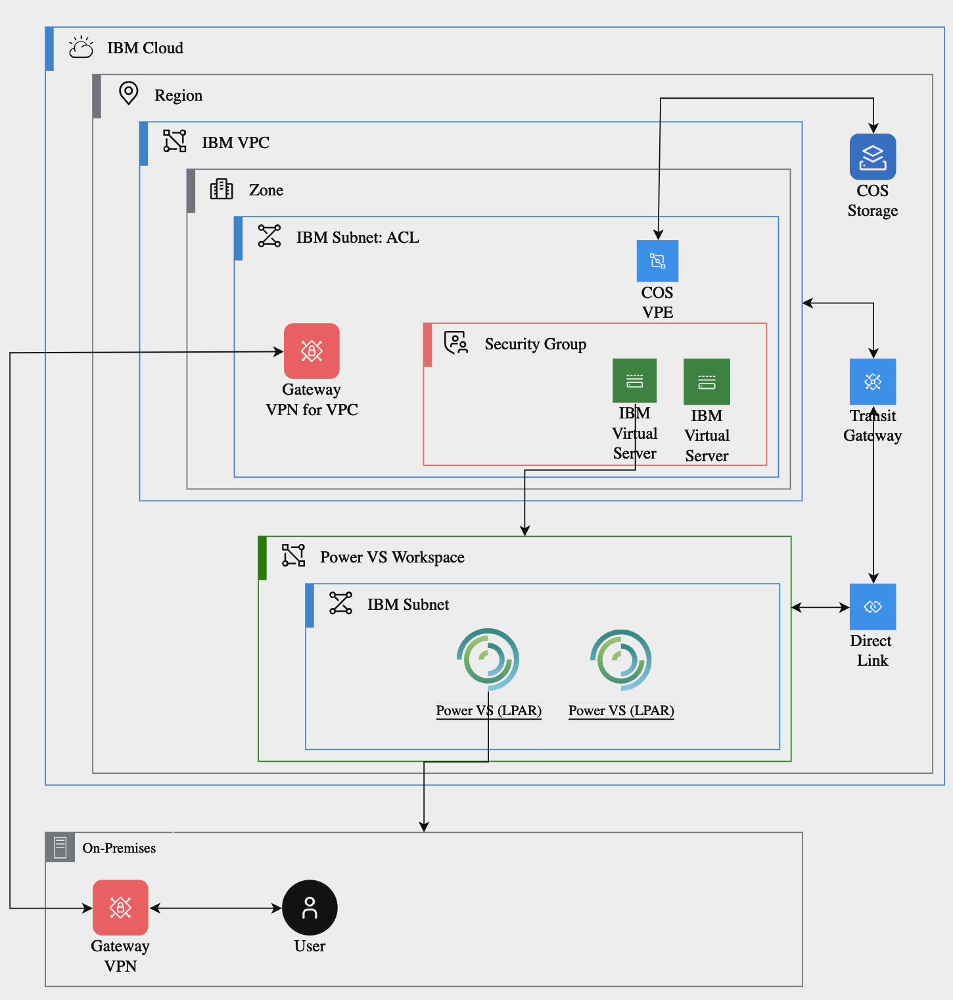

---

copyright:
  years: 2020, 2023

lastupdated: "2023-11-29"

keywords: VPC VPN, VPNaaS,

subcollection: power-iaas

---

{:shortdesc: .shortdesc}
{:screen: .screen}
{:codeblock: .codeblock}
{:pre: .pre}
{:tip: .tip}
{:note: .note}
{:important: .important}
{:deprecated: .deprecated}
{:external: target="_blank" .external}

# Creating a VPC VPN
{: #vpn-connectivity}

The Virtual Private Cloud (VPC) VPN service enables you to use a dedicated VPN. The VPC VPN is considered more robust than the {{site.data.keyword.powerSysFull}} VPN service. It is recommended that you migrate from {{site.data.keyword.powerSys_notm}} VPN to VPC VPN. 

Here is the summarized steps for creating a VPC VPN:
1.	Create a VPC
2.	Create a Site-to-Site VPN gateway in VPC
3.	Attach the VPN connection to the {{site.data.keyword.powerSys_notm}} workspace
  -	In PER workspace through TGW
  -	In non-PER workspace through Cloud connection + TGW

The cloud connection set up is not needed for the PER enabled workspace. When you complete the VPC VPN set up, you can:
-	Ensure a private and low-cost connectivity to IBM Cloud services.
-	Access your virtual server instances through the private IP address using Secure Shell (SSH) and other on-premises applications running on your host.

## Architecture diagram
{: arc-diag-vpcvpn}

{: caption="Figure 1. Connecting IBM VPC to IBM {{site.data.keyword.powerSys_notm}}s" caption-side="bottom"}

## Step 1
{: vpc-vpn-1}

**Create a VPC resource.** 
Complete the steps documented in [Using the IBM Cloud console to create VPC resources](/docs/vpc?topic=vpc-creating-a-vpc-using-the-ibm-cloud-console).

## Step 2
{: vpc-vpn-2}

**Create a Site-to-Site VPN gateway in VPC**
Complete the steps documented in [Getting started with VPN gateways](/docs/vpc?topic=vpc-using-vpn#vpn-getting-started).

## Step 3
{: vpc-vpn-3}

Attach the VPN connection to the {{site.data.keyword.powerSys_notm}} workspace.
  a.	For a PER enabled workspace, see: [Attaching Transit Gateway to a PER workspace](/docs/power-iaas?topic=power-iaas-per#attaching-transit-gateway-to-a-per-workspace).
  b.	For a non-per enabled workspace, see: [Creating IBM Cloud connections](/docs/power-iaas?topic=power-iaas-cloud-connections).

## Considerations
{: vpcvpn-cons}

1.	Subnets created in {{site.data.keyword.powerSys_notm}} needs to be added to Local CIDR list of IBM Cloud VPC and Peer CIDR list of On-prem VPC
2.	In routing table of IBM Cloud VPC, enable VPN Gateway and traffic source for Direct Link and Transit Gateway (in Edit Traffic panel)
3.	Cloud Connection with transit enabled and transit disabled must be on different {{site.data.keyword.powerSys_notm}} workspaces in same region.  

## Additional information
{: vpcvpn-add-info}

- [Connecting IBM VPC to IBM {{site.data.keyword.powerSys_notm}}s and IBM Cloud Object Storage](https://www.ibm.com/blog/connecting-ibm-vpc-to-ibm-power-virtual-servers-and-ibm-cloud-object-storage/){: external}.