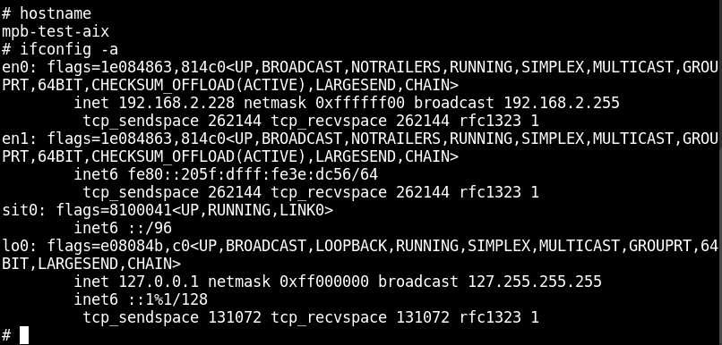
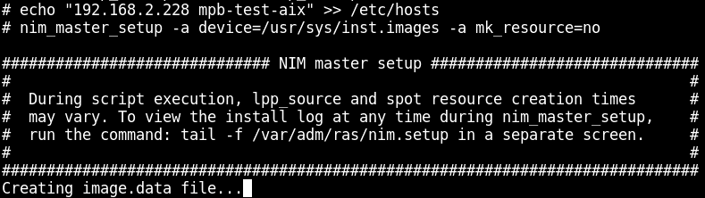
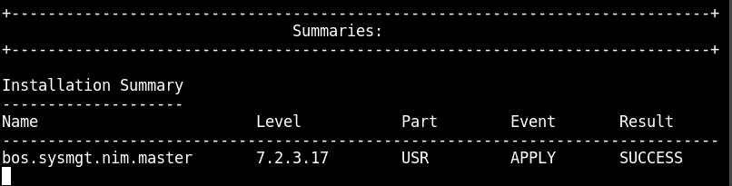

---

copyright:
  years: 2019, 2020

lastupdated: "2020-04-03"

keywords: troubleshooting, hung virtual machine, support, help, system management services, SMS, object data manager, improving performance, suboptimal, lsattr

subcollection: power-iaas

---

{:tsSymptoms: .tsSymptoms}
{:tsCauses: .tsCauses}
{:tsResolve: .tsResolve}
{:troubleshoot: data-hd-content-type='troubleshoot'}
{:screen: .screen}
{:codeblock: .codeblock}
{:pre: .pre}
{:tip: .tip}
{:note: .note}
{:important: .important}
{:deprecated: .deprecated}
{:external: target="_blank" .external}

# Troubleshooting AIX-related issues
{: #troubleshoot-iaas-aix}

Learn how to troubleshoot {{site.data.keyword.powerSysShort}} AIX-related issues.
{: shortdesc}

## What can I do if my AIX virtual machine (VM) does not initially boot?
{: #troubleshoot-hung-aix}
{: troubleshoot}

{: tsSymptoms}
The AIX boot disk that you are using to provision an AIX VM is not successfully booting. As a result, the console displays a blank screen without standard debugging options.

{: tsCauses}
The AIX boot disk might be corrupted.

{: tsResolve}
If the AIX VM does not boot, you must provision an additional AIX VM and use it as a Network Installation Management (NIM) server. Without a NIM server, you cannot debug the boot issue and must reimage your disk.

1. Determine the hostname and IP address of the system by using the following two commands, `hostname` and `ifconfig -a`.

    {: caption="Figure 1. Determining your hostname and IP address" caption-side="bottom"}

2. Using the information from the previous step, add an entry for your hostname and IP address into `/etc/hosts`. For example, `echo "192.168.0.15 aix-7100-05-04" >> /etc/hosts`.

3. Run the following command, `nim_master_setup -a device=/usr/sys/inst.images -a mk_resource=no`.

    {: caption="Figure 2. Creating a NIM master" caption-side="bottom"}

4. Once completed, the NIM master file set has been installed and the basic resource objects created. The administrator is now able to add more NIM clients and define resources.

    {: caption="Figure 3. NIM master installation summary" caption-side="bottom"}

For more information, see [Setting up NIM to boot into maintenance mode](https://www.ibm.com/support/pages/setting-nim-boot-maintenance-mode){: new_window}{: external}. If you are unfamiliar with this process, create a [new support case](/docs/power-iaas?topic=power-iaas-getting-help-and-support).

## My AIX VM Tier 1 (NVMe-based flash storage) disk is running at a suboptimal level. What can I do to improve its performance?
{: #troubleshoot-slow-aix}
{: troubleshoot}

{: tsSymptoms}
Your AIX VM with a Tier 1 (NVMe-based flash storage) disk is running below NVMe specifications.

    chdev -l hdiskX -a algorithm=shortest_queue -a reserve_policy=no_reserve -a queue_depth=64
    {: codeblock}

{: tsCauses}
The AIX Tier 1 (NVMe-based flash storage) disk's default settings are hindering optimal performance.

{: tsResolve}
To improve disk performance, increase its **queue_depth** to *64* or *128* and change the algorithm to **shortest_queue** with a **no_reserve policy**. These modifications can improve performance by up to 50%.

To look at your AIX disk's current settings, enter the following commands:

- `lsattr -El hdiskX -a algorithm`
- `lsattr -El hdiskX -a reserve_policy`
- `lsattr -El hdiskX -a queue_depth`

In the output of these `lsattr` commands, you'll see either **True** or **True+** at the very end. **True** indicates that the attribute is user-changeable. **True+** indicates that the attribute is user-changeable, and can be modified while the disk is open by using the *-U* flag.
{: tip}

You can set your disk's **queue_depth** to *64* and change the algorithm to **shortest_queue** with a **no_reserve policy** by using the following command:

        chdev -l hdiskX -a algorithm=shortest_queue -a reserve_policy=no_reserve -a queue_depth=64
        {: codeblock}

If the AIX disk is open, an error message appears that states that the disk is busy. To prevent this error from occuring, add a *-U* flag to the `chdev` command and the values are updated without disruption (assuming the Object Data Manager (ODM) for the disk has that feature enabled).

```
chdev -l hdiskX -a algorithm=shortest_queue -a reserve_policy=no_reserve -a queue_depth=64
```
{: codeblock}
