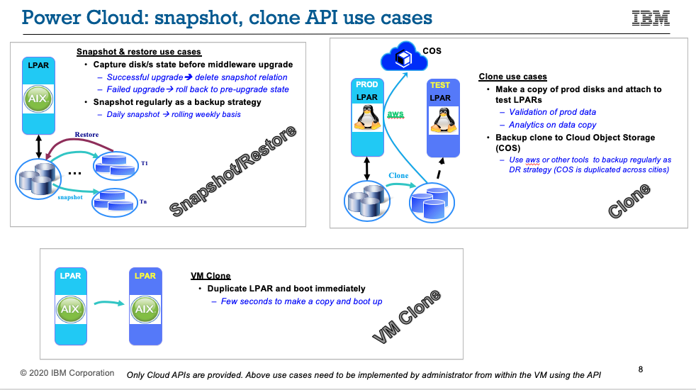

---

copyright:
  years: 2019, 2020

lastupdated: "2020-05-11"

keywords: volume snapshot, clone, restore

subcollection: power-iaas

---

{:new_window: target="_blank"}
{:shortdesc: .shortdesc}
{:screen: .screen}
{:codeblock: .codeblock}
{:pre: .pre}
{:tip: .tip}
{:note: .note}
{:important: .important}
{:deprecated: .deprecated}
{:external: target="_blank" .external}
{:help: data-hd-content-type='help'}
{:support: data-reuse='support'}

# Snapshotting, cloning, and restoring a volume
{: #volume-snapshot-clone}

Learn more about snapshotting, cloning, and restoring a {{site.data.keyword.powerSysShort}} volume.

{: caption="Figure 1. Snapshot and clone API use cases" caption-side="bottom"}

## Taking a snapshot
{: #volume-snapshot}

**Prerequisites**

Before you take a snapshot, ensure that all of the data is flushed to the disk. If you take a snapshot on a running virtual machine (VM) and did not flush the file system, you might lose some content.

**Use cases**

- Taking a snapshot of a VM targeting only the boot volume
- Taking a snapshot of a VM targeting only data volumes
- Taking a snapshot of a VM targeting all volumes (both boot and data)
- Taking multiple snapshots of a single VM (the snapshots must be taken one at a time)
- Taking multiple snapshots of different VMs at the same time

**Restrictions and considerations**

- Parallel VM snapshot operations for the same shared volume fail. You must perform these VM snapshot operations serially.
- You cannot restore a VM if you are taking a snapshot and there are clone (full-copy) *FlashCopy* operations that are running in the background. The FlashCopy operations must first complete.
- You cannot restore a VM if the background *FlashCopy* operation fails for whatever reason.

## Restoring a virtual machine (VM)
{: #volume-restore}

**Prerequisites**

While performing a VM restore operation, you must ensure that you've quiesced all of your applications and there are no active IO operations on the volume. If you perform the restore operation on a running VM with mounted disks, the operation might corrupt the file system, putting the VM in maintenance mode.

**Use cases**

- Restoring all of the volumes that are part of a VM snapshot
- Running multiple VM restore operations (considering there are no shared volumes)
- Retrying a VM restore operation if it originally failed
- Rolling back a VM to its original volume state

**Restrictions and considerations**

- The {{site.data.keyword.powerSys_notm}} service takes a backup snapshot of all of the volumes that are intended to be restored before it performs the restore operation. The backup snapshot operation ensures that you can roll back the VM back to its original state if a failure happens during the restore operation.
- If the VM restore operation fails, the VM enters an **Error** state. You can either retry the restore operation or rollback the VM to its original volume state.
- If you choose to restore a shared volume on one VM, you cannot perform the snapshot, restore, clone, or capture operations on the other VMs that are using the shared volume (while the restore operation is running).

## Cloning a volume
{: #cloning-volume}

**Prerequisites**

You **must** assign a storage template to all of the volumes you select as clone volumes.

**Use cases**

- Cloning multiple volumes in an available state
- Cloning multiple volumes that are attached to the VM

**Restrictions and considerations**

- When clone is performed on an in-use volume, the {{site.data.keyword.powerSys_notm}} service creates the consistent group snapshot and re-creates the cloned volume copy by using the group snapshot.
- When `target-storage-template` is assigned, the clone volume is retyped to the `target-storage-template`. Retype is performed only if the template is retype capable.
- When multiple source volumes are passed during `clone-volume` along with `target-volume-type-id`, all the volumes use the same `target-volume-type-id`.
- When you use `target-volume-type-id`, it must use the same storage backend host controller as the source volume.
